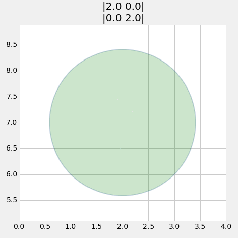

# Preface

<pre data-code-language="python"
     data-executable="true"
     data-type="programlisting">
#format the book
import book_format
book_format.load_style()
</pre>

Introductory textbook for Kalman filters and Bayesian filters. All code is written in Python, and the book itself is written in IPython Notebook so that you can run and modify the code in the book in place, seeing the results inside the book. What better way to learn?

## Reading Online

You may access this book via nbviewer at any time by using this address:
[*Read Online Now*](http://nbviewer.ipython.org/github/rlabbe/Kalman-and-Bayesian-Filters-in-Python/blob/master/table_of_contents.ipynb)

The quickest way to get starting with reading the book is to read it online using the link above. The book is written as a collection of IPython Notebooks, an interactive, browser based system that allows you to combine text, Python, and math into your browser. The website http://nbviewer.org provides an IPython Notebook server that renders notebooks stored at github (or elsewhere). The rendering is done in real time when you load the book. If you read my book today, and then I make a change tomorrow, when you go back tomorrow you will see that change. Perhaps more importantly, the book uses animations to demonstrate how the algorithms perform over time. The PDF version of the book, discussed in the next paragraph, cannot show the animations.

The preface available from the link above has all the information in this README and more, so feel free to follow the link now.

I periodically generate a PDF of the book from the Notebooks. I do not do this for every check in, so the PDF will usually lag the content in github and on nbviewer.org. However, I do generate it whenever I make a substantial change. Of course, you will not be able to run and modify the code in the notebooks, nor will you be able to see the animations.

## PDF Version

I periodically generate a PDF of the book from the Notebooks. I do not do this for every check in, so the PDF will usually lag the content in github and on nbviewer.org. However, I do generate it whenever I make a substantial change. Of course, you will not be able to run and modify the code in the notebooks, nor will you be able to see the animations.

[*PDF Version of the book*](https://github.com/rlabbe/Kalman-and-Bayesian-Filters-in-Python/blob/master/Kalman_and_Bayesian_Filters_in_Python.pdf)

##Downloading the book

However, this book is intended to be interactive and I recommend using it in that form. If you install IPython on your computer and then clone this book you will be able to run all of the code in the book yourself. You can perform experiments, see how filters react to different data, see how different filters react to the same data, and so on. I find this sort of immediate feedback both vital and invigorating. You do not have to wonder "what happens if". Try it and see!

The github pages for this project are at

    https://github.com/rlabbe/Kalman-and-Bayesian-Filters-in-Python

You can clone it to your hard drive with the command

`git clone https://github.com/rlabbe/Kalman-and-Bayesian-Filters-in-Python.git`

This will create a directory named `Kalman-and-Bayesian-Filters-in-Python`. Navigate to the directory, and run IPython notebook with the command

    ipython notebook

This will open a browser window showing the contents of the base directory. The book is organized into chapters. To read Chapter 2, click on the link for chapter 2. This will cause the browser to open that subdirectory. In each subdirectory there will be one or more IPython Notebooks (all notebooks have a .ipynb file extension). The chapter contents are in the notebook with the same name as the chapter name. There are sometimes supporting notebooks for doing things like generating animations that are displayed in the chapter. These are not intended to be read by the end user, but of course if you are curious as to how an animation is made go ahead and take a look.

This is admittedly a somewhat cumbersome interface to a book; I am following in the footsteps of several other projects that are somewhat re-purposing IPython Notebook to generate entire books. I feel the slight annoyances have a huge payoff - instead of having to download a separate code base and run it in an IDE while you try to read a book, all of the code and text is in one place. If you want to alter the code, you may do so and immediately see the effects of your change. If you find a bug, you can make a fix, and push it back to my repository so that everyone in the world benefits. And, of course, you will never encounter a problem I face all the time with traditional books - the book and the code are out of sync with each other, and you are left scratching your head as to which source to trust.

## Version 0.0

Not ready for public consumption. In development.

> author's note: The chapter on g-h filters is fairly complete as far as planned content goes. The content for the discrete Bayesian chapter, chapter 2, is also fairly complete. After that I have questions in my mind as to the best way to present the statistics needed to understand the filters. I try to avoid the 'dump a semester of math into 4 pages' approach of most textbooks, but then again perhaps I put things off a bit too long. In any case, the subsequent chapters are due a strong editing cycle where I decide how to best develop these concepts. Otherwise I am pretty happy with the content for the one dimensional and multidimensional Kalman filter chapters. I know the code works, I am using it in real world projects at work, but there are areas where the content about the covariance matrices is pretty bad. The implementation is fine, the description is poor. Sorry. It will be corrected.

> Beyond that the chapters are much more in a state of flux. Reader beware. My writing methodology is to just vomit out whatever is in my head, just to get material, and then go back and think through presentation, test code, refine, and so on. Whatever is checked in in these later chapters may be wrong and not ready for your use.

> Finally, nothing has been spell checked or proof read yet. I with IPython Notebook had spell check, but it doesn't seem to.

##Motivation

This is a book for programmers that have a need or interest in Kalman filtering. The motivation for this book came out of my desire for a gentle introduction to Kalman filtering. I'm a software engineer that spent almost two decades in the avionics field, and so I have always been 'bumping elbows' with the Kalman filter, but never implemented one myself. They always has a fearsome reputation for difficulty, and I did not have the requisite education. Everyone I met that did implement them had multiple graduate courses on the topic and extensive industrial experience with them. As I moved into solving tracking problems with computer vision the need to implement them myself became urgent. There are classic textbooks in the field, such as Grewal and Andrew's excellent *Kalman Filtering*. But sitting down and trying to read many of these books is a dismal and trying experience if you do not have the background. Typically the first few chapters fly through several years of undergraduate math, blithely referring you to textbooks on, for example, Itō calculus, and presenting an entire semester's worth of statistics in a few brief paragraphs. These books are good textbooks for an upper undergraduate course, and an invaluable reference to researchers and professionals, but the going is truly difficult for the more casual reader. Symbology is introduced without explanation, different texts use different words and variables names for the same concept, and the books are almost devoid of examples or worked problems. I often found myself able to parse the words and comprehend the mathematics of a definition, but had no idea as to what real world phenomena these words and math were attempting to describe. "But what does that *mean?*" was my repeated thought.

However, as I began to finally understand the Kalman filter I realized the underlying concepts are quite straightforward. A few simple probability rules, some intuition about how we integrate disparate knowledge to explain events in our everyday life and the core concepts of the Kalman filter are accessible. Kalman filters have a reputation for difficulty, but shorn of much of the formal terminology the beauty of the subject and of their math became clear to me, and I fell in love with the topic.

As I began to understand the math and theory more difficulties itself. A book or paper's author makes some statement of fact and presents a graph as proof.  Unfortunately, why the statement is true is not clear to me, nor is the method by which you might make that plot obvious. Or maybe I wonder "is this true if R=0?"  Or the author provides pseudocode - at such a high level that the implementation is not obvious. Some books offer Matlab code, but I do not have a license to that expensive package. Finally, many books end each chapter with many useful exercises. Exercises which you need to understand if you want to implement Kalman filters for yourself, but exercises with no answers. If you are using the book in a classroom, perhaps this is okay, but it is terrible for the independent reader. I loathe that an author withholds information from me, presumably to avoid 'cheating' by the student in the classroom.

None of this necessary, from my point of view. Certainly if you are designing a Kalman filter for a aircraft or missile you must thoroughly master of all of the mathematics and topics in a typical Kalman filter textbook. I just want to track an image on a screen, or write some code for my Arduino project. I want to know how the plots in the book are made, and chose different parameters than the author chose. I want to run simulations. I want to inject more noise in the signal and see how a filter performs. There are thousands of opportunities for using Kalman filters in everyday code, and yet this fairly straightforward topic is the provenance of rocket scientists and academics.

I wrote this book to address all of those needs. This is not the book for you if you program avionics for Boeing or design radars for Raytheon. Go get a degree at Georgia Tech, UW, or the like, because you'll need it. This book is for the hobbyist, the curious, and the working engineer that needs to filter or smooth data.

This book is interactive. While you can read it online as static content, I urge you to use it as intended. It is written using IPython Notebook, which allows me to combine text, python, and python output in one place. Every plot, every piece of data in this book is generated from Python that is available to you right inside the notebook. Want to double the value of a parameter? Click on the Python cell, change the parameter's value, and click 'Run'. A new plot or printed output will appear in the book.

This book has exercises, but it also has the answers. I trust you. If you just need an answer, go ahead and read the answer. If you want to internalize this knowledge, try to implement the exercise before you read the answer.

This book has supporting libraries for computing statistics, plotting various things related to filters, and for the various filters that we cover. This does require a strong caveat; most of the code is written for didactic purposes. It is rare that I chose the most efficient solution (which often obscures the intent of the code), and in the first parts of the book I did not concern myself with numerical stability. This is important to understand - Kalman filters in aircraft are carefully designed and implemented to be numerically stable; the naive implementation is not stable in many cases. If you are serious about Kalman filters this book will not be the last book you need. My intention is to introduce you to the concepts and mathematics, and to get you to the point where the textbooks are approachable.

Finally, this book is free. The cost for the books required to learn Kalman filtering is somewhat prohibitive even for a Silicon Valley engineer like myself; I cannot believe the are within the reach of someone in a depressed economy, or a financially struggling student. I have gained so much from free software like Python, and free books like those from Allen B. Downey [here](http://www.greenteapress.com/) [1]. It's time to repay that. So, the book is free, it is hosted on free servers, and it uses only free and open software such as IPython and mathjax to create the book.

##Installation and Software Requirements

** author's note**. *The book is still being written, and so I am not focusing on issues like supporting multiple versions of Python. I am staying more or less on the bleeding edge of Python 3 for the time being. If you follow my suggestion of installing Anaconda all of the versioning problems will be taken care of for you, and you will not alter or affect any existing installation of Python on your machine. I am aware that telling somebody to install a specific packaging system is not a long term solution, but I can either focus on endless regression testing for every minor code change, or work on delivering the book, and then doing one sweep through it to maximize compatibility. I opt for the latter. In the meantime I welcome bug reports if the book does not work on your platform.*

If you want to run the notebook on your computer, which is what I recommend, then you will have to have IPython 2.4 or later installed. I do not cover how to do that in this book; requirements change based on what other python installations you may have, whether you use a third party package like Anaconda Python, what operating system you are using, and so on.

The notebook format was changed as of IPython 3.0. If you are running 2.4 you will still be able to open and run the notebooks, but they will be downconverted for you. If you make changes DO NOT push 2.4 version notebooks to me! I strongly recommend updating to 3.0 as soon as possible, as this format change will just become more frustrating with time.

You will need Python 2.7 or later installed. Almost all of my work is done in Python 3.4, but I periodically test on 2.7. I do not promise any specific check in will work in 2.7 however. I do use Python's "from __future__ import ..." statement to help with compatibility. For example, all prints need to use parenthesis. If you try to add, say, "print 3.14" into the book your script will fail; you must write "print (3.4)" as in Python 3.X.

You will need a recent version of NumPy, SciPy, SymPy, and Matplotlib installed. I don't really know what the minimal version might be. I have NumPy 1.71, SciPy 0.13.0, and Matplotlib 1.4.0 installed on my machines.

Personally, I use the Anaconda Python distribution in all of my work, [available here](https://store.continuum.io/cshop/anaconda/) [3]. I am not selecting them out of favoritism, I am merely documenting my environment. Should you have trouble running any of the code, perhaps knowing this will help you.

Finally, you will need to install FilterPy, described in the next section.

Installation of all of these packages is described in the Installation appendix, which you can read online [here](http://nbviewer.ipython.org/github/rlabbe/Kalman-and-Bayesian-Filters-in-Python/blob/master/Appendix_A_Installation/Appendix_Installation.ipynb).

##Provided Libraries

I am writing an open source Bayesian filtering Python library called **FilterPy**. It is available on github at (https://github.com/rlabbe/filterpy). To ensure that you have the latest release you will want to grab a copy from github, and follow your Python installation's instructions for adding it to the Python search path.

I have also made the project available on PyPi, the Python Package Index. I will be honest, I am not updating this as fast as I am changing the code in the library. That will change as the library and this book mature. To install from PyPi, at the command line issue the command

    pip install filterpy

If you do not have pip, you may follow the instructions here:

https://pip.pypa.io/en/latest/installing.html.

Code that is specific to the book is stored with the book in the subdirectory **code**. This code is in a state of flux; I do not wish to document it here yet. I do mention in the book when I use code from this directory, so it should not be a mystery.

In the *code* subdirectory there are python files with a name like *xxx*_internal.py. I use these to store functions that are useful for a specific chapter. This allows me to hide away Python code that is not particularly interesting to read - I may be generating a plot or chart, and I want you to focus on the contents of the chart, not the mechanics of how I generate that chart with Python. If you are curious as to the mechanics of that, just go and browse the source.

Some chapters introduce functions that are useful for the rest of the book. Those functions are initially defined within the Notebook itself, but the code is also stored in a Python file that is imported if needed in later chapters. I do document when I do this where the function is first defined, but this is still a work in progress. I try to avoid this because then I always face the issue of code in the directory becoming out of sync with the code in the book. However, IPython Notebook does not give us a way to refer to code cells in other notebooks, so this is the only mechanism I know of to share functionality across notebooks.

There is an undocumented directory called **exp**. This is where I write and test code prior to putting it in the book. There is some interesting stuff in there, and feel free to look at it. As the book evolves I plan to create examples and projects, and a lot of this material will end up there. Small experiments will eventually just be deleted. If you are just interested in reading the book you can safely ignore this directory.

The directory **styles** contains a css file containing the style guide for the book. The default look and feel of IPython Notebook is rather plain. Work is being done on this. I have followed the examples set by books such as [Probabilistic Programming and Bayesian Methods for Hackers](http://nbviewer.ipython.org/github/CamDavidsonPilon/Probabilistic-Programming-and-Bayesian-Methods-for-Hackers/blob/master/Chapter1_Introduction/Chapter1_Introduction.ipynb). I have also been very influenced by Professor Lorena Barba's fantastic work, [available here](https://github.com/barbagroup/CFDPython). I owe all of my look and feel to the work of these projects.

##Thoughts on Python and Coding Math

I am first and foremost a programmer. Most Kalman filtering and other engineering texts are written by mathematicians or engineers. As a result, the software is usually not production quality. I will take Paul Zarchan's book *Fundamentals of Kalman Filtering* as an example. This is a fantastic book and it belongs in your library. But the code is Fortran listing without any subroutines beyond calls to functions like `MATMUL`. This means that Kalman filters are re-implemented over and over again throughout the book. The same listing mixes simulation code with filtering code, so until you become aware of the author's naming style it can be difficult to ascertain what code is the filter and what code is the simulation. Some chapters implement the same filter in subtly different ways, and uses bold text to highlight the few lines that changed. If he needs to use Runge Kutta, that is just embedded in the code, without comments.

There's a better way. If I want to perform an SVD I call `svd`, I do not embed an SVD implementation in my code. This buys me several things. First, I don't have to re-implement SVD multiple times. I don't have to debug SVD several times, and if I do find a bug, I can fix it once and be assured that it now works across all my different projects. Finally, it is readable. It is rare that I care about the implementation of SVD in my projects.

Now, this is a textbook on Kalman filtering, and you could reasonably point out that we *do* care about the implementation of Kalman filters. To an extent that is true, but as you will find out the code that performs the filtering amounts to 7 or so lines of code. The code to implement the math is fairly trivial. Most of the work that Kalman filters requires is the design of the matrices that get fed into the math engine. So that is how I have structured the code.

For example, there is a class named `KalmanFilter` which implements the linear algebra for performing kalman filtering. To use it you will construct an object of that class, initialize various parameters, then enter a while loop where you call `KalmanFilter.predict()` and `KalmanFilter.update()` to incorporate your measurements. Thus most of your programs will be only 20-50 lines, most of that boilerplate - setting up the matrices, and then plotting and/or using the results. The possible downside of that is that the equations that perform the filtering are hidden behind functions, which we could argue is a loss in a pedagogical text. I argue the converse. I want you to learn how to use Kalman filters in the real world, for real projects, and you shouldn't be cutting and pasting established algorithms all over the place. If you want to use ode45 (Runga Kutta) you call that function, you don't re-implement it from scratch. We will do the same here.

However, it is undeniable that you will be a bit less versed with the equations of the Kalman filter as a result. I strongly recommend looking at the source for FilterPy, and maybe even implementing your own filter from scratch to be sure you understand the concepts.

I use a fair number of classes in FilterPy. I do not use inheritance or virtual functions or any of that sort of OO design. I use classes as a way to organize the data that the filters require. For example, the `KalmanFilter` class mentioned above stores matrices called `x`, `P`, `R`, `Q`, and more. I've seen procedural libraries for Kalman filters, and they require the programmer to maintain all of those matrices. This perhaps isn't so bad for a toy program, but start programming, say, a bank of Kalman filters and you will not enjoy having to manage all of those matrices and other associated data.

A word on variable names. I am an advocate for descriptive variable names. `R` is not, normally, descriptive. `R` is the measurement noise covariance matrix, so I could reasonably call it `measurement_noise_covariance`, and I've seen libraries do that. I've chosen not to do that. Why? In the end, Kalman filtering is math. To write a Kalman filter you are going to have to start by sitting down with a piece of paper and doing some math. You will be writing normal algebraic equations. Also, every Kalman filter text and source on the web uses the same linear algebra equations. You cannot read about the Kalman filter without seeing

\\(\dot{\mathbf{x}} = \mathbf{Fx} + \mathbf{Gu}\\)

in every source (a few sources use A and B instead of F and G). One of my goals in this book is to bring you to the point where you can read the original literature on Kalman filtering. I take an optimistic tone in this book - that Kalman filtering is easy to learn - and in many ways it is. However, for nontrivial problems the difficulty is not the implementation of the equations, but learning how to set up the equations so they solve your problem. In other words, every Kalman filter will implement \\(\dot{\mathbf{x}} = \mathbf{Fx} + \mathbf{Gu}\\); the difficult part is figuring out what to put in the matrices \\(\mathbf{F}\\) and \\(\mathbf{G}\\) to make your filter work for your problem. Vast amounts of work have been done to figure out how to apply Kalman filters in various domains, and it would be tragic to not be able to read the literature and avail yourself of this research.

So, like it or not you will need to learn that \\(\mathbf{F}\\) is the *state transition matrix* and that \\(\mathbf{R}\\) is the *measurement noise covariance*. Once you know that the code will become readable, and until you know that all publications and web articles on Kalman filters will be inaccessible to you.

Finally I feel that mathematical programming is somewhat different than regular programming; what is readable in one domain is not readable in another. `q = x + m` is opaque in a normal context. On the other hand, `x = .5*a*t**2 + v_0 * t + x_0` is to me the most readable way to write the Newtonian distance equation:

\\( x = \frac{1}{2}at^2 + v_0 t + x_0\\)

We could write it as

    distance = .5 * constant_acceleration * time_delta**2 +
                initial_velocity * time_delta + initial_distance

but I feel that obscures readability. This is surely debatable for this one equation; but most mathematical programs, and certainly Kalman filters, use systems of equations. I can most easily follow the code, and ensure that it does not have bugs, when it reads as close to the math as possible. Consider this equation taken from the Kalman filter:

\\( K = PH^T[HPH^T + R]^{-1}\\)

My Python code for this would be

    K = dot3(P, H.T, inv(dot3(H,P,H.T) + R))

It's already a bit hard to read because of the `dot` function calls (required because Python does not yet support an operator for matrix multiplication). But compare this to

    kalman_gain = dot3(apriori_state_covariance, measurement_function_transpose,
                       inverse (dot3(measurement_function, apriori_state_covariance,
                       measurement_function_transpose) +
                       measurement_noise_covariance))

I grant you this version has more context, but I cannot reasonable glance at this and see what math it is implementing. In particular, the linear algebra \\(HPH^T\\) is doing something very specific - multiplying P by H and its transpose is changing the *basis* of P. It is nearly impossible to see that the Kalman gain is just a ratio of one number divided by a second number which has been converted to a different basis. If you are not solid in linear algebra perhaps that statement does not convey a lot of information to you yet, but I assure you that \\(K = PH^T[HPH^T + R]^{-1}\\) is saying something very succinctly. There are two key pieces of information here - we are taking a ratio, and we are converting the *basis* of a matrix. I can see that in my first Python line, I cannot see that in the second line.

I will not *win* this argument, and some people will not agree with my naming choices. I will finish by stating, very truthfully, that I made two mistakes the first time I typed that second version and it took me awhile to find it. In any case, I aim for using the mathematical symbol names whenever possible, coupled with readable class and function names. So, it is `KalmanFilter.P`, not `KF.P` and not `KalmanFilter.apriori_state_covariance`.

##License

 Kalman Filters and Random Signals in Python by <a xmlns:cc="http://creativecommons.org/ns#" href="https://github.com/rlabbe/Kalman-Filters-and-Random-Signals-in-Python" property="cc:attributionName" rel="cc:attributionURL">Roger Labbe</a> is licensed under a <a rel="license" href="http://creativecommons.org/licenses/by-nc-sa/4.0/">Creative Commons Attribution-NonCommercial-ShareAlike 4.0 International License</a>. 

Based on a work at <a xmlns:dct="http://purl.org/dc/terms/" href="https://github.com/rlabbe/Kalman-and-Bayesian-Filters-in-Python" rel="dct:source">https://github.com/rlabbe/Kalman-and-Bayesian-Filters-in-Python</a>.

## Contact

rlabbejr@gmail.com

##Resources

* [1] http://www.greenteapress.com/
* [2] http://ipython.org/ipython-doc/rel-1.0.0/interactive/nbconvert.html
* [3] https://store.continuum.io/cshop/anaconda/

# The g-h Filter

<pre data-code-language="python"
     data-executable="true"
     data-type="programlisting">
#format the book
%matplotlib inline
from __future__ import division, print_function
import matplotlib.pyplot as plt
import book_format
book_format.load_style()
</pre>

## Building Intuition via Thought Experiments

Imagine that we live in a world without scales - the devices you stand on to weigh yourself. One day at work a coworker comes running up to you and announces her invention of a 'scale' to you. After she explains, you eagerly stand on it and announce the results: "172 lbs". You are ecstatic - for the first time in your life you know what you weigh. More importantly, dollar signs dance in your eyes as you imagine selling this device to weight loss clinics across the world! This is fantastic!

Another coworker hears the commotion and comes over to find out what has you so excited. You explain the invention and once again step onto the scale, and proudly proclaim the result: "161 lbs." And then you hesitate, confused.

"It read 172 lbs just a few seconds ago" you complain to your coworker.

"I never said it was accurate," she replies.

Sensors are inaccurate. This is the motivation behind a huge body of work in filtering, and solving this problem is the topic of this book. I could just provide the solutions that have been developed over the last half century, but these solutions developed by asking very basic, fundamental questions into the nature of what we know and how we know it. Before we attempt the math, let's follow that journey of discovery, and see if it does not inform our intuition about filtering.

** Try Another Scale**

Is there any way we can improve upon this result? The obvious, first thing to try is get a better sensor. Unfortunately, your co-worker informs you that she has built 10 scales, and they all operate with about the same accuracy. You have her bring out another scale, and you weigh yourself on one, and then on the other. The first scale (A) reads "160 lbs", and the second (B) reads "170 lbs". What can we conclude about your weight?

Well, what are our choices?

* We could choose to only believe A, and assign 160lbs to our weight estimate.
* we could choose to only believe B, and assign 170lbs to our weight.
* We could choose a number less than either A or B
* We could choose a number greater than either A or B
* We could choose a number between A and B

The first two choices are plausible, but we have no reason to favor one scale over the other. Why would we choose to believe A instead of B? We have no reason for such a belief. The third and fourth choices are irrational. The scales are admittedly not very accurate, but there is no reason at all to choose a number outside of the range of what they both measured. The final choice is the only reasonable one. If both scales are inaccurate, and as likely to give a result above my actual weight as below it, more often than not probably the answer is somewhere between A and B.

In mathematics this concept is formalized as *expected value*, and we will cover it in depth later. For now ask yourself what would be the 'usual' thing to happen if we made one million separate readings. Some of the times both scales will read too low, sometimes both will read too high, and the rest of the time they will straddle the actual weight. If they straddle the actual weight then certainly we should choose a number between A and B. If they don't straddle then we don't know if they are both too high or low, but by choosing a number between A and B we at least mitigate the effect of the worst measurement. For example, suppose our actual weight is 180 lbs. 160 lbs is a big error. But if we choose a weight between 160 lbs and 170 lbs our estimate will be better than 160 lbs. The same argument holds if both scales returned a value greater than the actual weight.

We will deal with this more formally later, but for now I hope it is clear that our best estimate is just the average of A and B. \\(\frac{160+170}{2} = 165\\).

We can look at this graphically. I have plotted the measurements of A and B with an assumed error of \\(\pm\\) 8 lbs. The overlap falls between 160 and 170 so the only weight that makes sense must lie within 160 and 170 pounds.

<pre data-code-language="python"
     data-executable="true"
     data-type="programlisting">
plt.errorbar([160], [1], xerr=8, fmt='o',label='A', capthick=2, capsize=10)
plt.errorbar([170], [1.05], xerr=8, fmt='o', label='B', capthick=2, capsize=10)
plt.ylim(0, 2)
plt.xlim(145, 185)
plt.legend()
plt.gca().axes.yaxis.set_ticks([])
plt.show()
</pre>

So 165 lbs looks like a reasonable estimate, but there is more information here that we might be able to take advantage of. The only weights that are possible lie in the intersection between the error bars of A and B. For example, a weight of 161 lbs is impossible because scale B could not give a reading of 170 lbs with a maximum error of 8 pounds. Likewise a weight of 171 lbs is impossible because scale A could not give a reading of 160 lbs with a maximum error of 8 lbs. In this example the only possible weights lie in the range of 162 to 168 lbs.

That doesn't yet allow us to find a better weight estimate, but let's play 'what if' some more. What if we are now told that A is three times more accurate than B? Consider the 5 options we listed above. It still makes no sense to choose a number outside the range of A and B, so we will not consider those. It perhaps seems more compelling to choose A as our estimate - after all, we know it is more accurate, why not just use it instead of B? Can B possibly improve our knowledge over A alone?

The answer, perhaps counter intuitively, is yes, it can. First, let's look at the same measurements of A=160 and B=170, but with the error of A \\(\pm\\) 3 lbs and the error of B is 3 times as much, \\(\pm\\) 9 lbs.

<pre data-code-language="python"
     data-executable="true"
     data-type="programlisting">
plt.errorbar([160], [1], xerr=3, fmt='o',label='A', capthick=2, capsize=10)
plt.errorbar([170], [1.05], xerr=3*3, fmt='o', label='B', capthick=2, capsize=10)
plt.ylim(0, 2)
plt.xlim(145, 185)
plt.legend()
plt.gca().axes.yaxis.set_ticks([])
plt.show()
</pre>

The overlap of the error bars of A and B are the only possible true weight. This overlap is smaller than the error in A alone. More importantly, in this case we can see that the overlap doesn't include 160 lbs or 165 lbs. If we only used the measurement from A because it is more accurate than B we would give an estimate of 160 lbs. If we just averaged A and B together we would get 165 lbs. Neither of those weights are possible given our knowledge of the accuracy of the scales. By including the measurement of B we would give an estimate somewhere between 161 lbs and 163 lbs, the limits of the intersections of the two error bars.

Let's take this to the extreme limits.  Assume we know scale A is accurate to 1 lb. In other words, if we truly weigh 170 lbs, it could report 169, 170, or 171 lbs. We also know that scale B is accurate to 9 lbs. We do a weighing on each scale, and get A=160, and B=170. What should we estimate our weight to be? Let's look at that graphically.

<pre data-code-language="python"
     data-executable="true"
     data-type="programlisting">
plt.errorbar([160], [1], xerr=1, fmt='o',label='A', capthick=2, capsize=10)
plt.errorbar([170], [1.05], xerr=9, fmt='o', label='B', capthick=2, capsize=10)
plt.ylim(0,2)
plt.legend()
plt.gca().axes.yaxis.set_ticks([])
plt.show()
</pre>

Here we can see that the only possible weight is 161 lbs. This is an important result. With two relatively inaccurate sensors we are able to deduce an extremely accurate result.

> So two sensors, even if one is less accurate than the other, is better than one.

However, we have strayed from our problem. No customer is going to want to buy multiple scales, and besides, we initially started with an assumption that all scales were equally (in)accurate. This insight will play a large role later, so don't forget it.

So, what if I have one scale, but I weigh myself many times? We concluded that if we had two scales of equal accuracy we should average the results of their measurements. What if I weigh myself 10,000 times with one scale? We have already stated that the scale is equally likely to return a number too large as it is to return one that is too small. It is not that hard to prove that the average of a large number of weights will be very close to the actual weight, but let's just write a simulation for now.

<pre data-code-language="python"
     data-executable="true"
     data-type="programlisting">
N = 10000
import random
weight_sum = 0
for i in range(N):
    # choose a random number between 160 and 170, assuming true
    # weight of 165
    measurement = random.uniform(160, 170)
    weight_sum += measurement

average = weight_sum / N
print('Average of measurements is {:.4f}'.format(average))
</pre>

The exact number printed depends on your random number generator, but it should be very close to 165.

This code makes one assumption that probably isn't true - that the scale is just as likely to read 160 as 165 for a true weight of 165 lbs. This is almost never true. Real sensors are more likely to get readings nearer the true value, and are less and less likely to get readings the further away from the true value it gets. We will cover this in detail in the Gaussian chapter. For now, I will use without further explanation the `random.gauss()` function, which will produce more values nearer 165 lbs, and fewer further away. Take it on faith for now that this will produce noisy measurements very similar to how a real scale would.

<pre data-code-language="python"
     data-executable="true"
     data-type="programlisting">
N = 10000
weight_sum = 0
for i in range(N):
    # choose a random number centered around 165 lbs, with a 5 lb error.
    measurement = random.gauss(165, 5.)
    weight_sum += measurement

average = weight_sum / N
print('Average of measurements is {:.4f}'.format(average))
</pre>

The answer again is very close to 165.

Okay, great, we have an answer to our sensor problem! But it is not a very practical answer. No one has the patience to weigh themselves ten thousand, or even a dozen times.

So, let's play 'what if' again. What if you measured your weight once a day, and got the readings 170, 161, and then 169. Did you gain weight, lose weight, or is this all just noisy measurements?

We really can't say. The first measurement was 170, and the last was 169, implying a 1 lb loss. But if the scale is only accurate to 10 lbs, that is explainable by noise. I could have actually gained weight; maybe my weight on day one was 165 lbs, and on day three it was 172. It is possible to get those weight readings with that weight gain. My scale tells me I am losing weight, and I am actually gaining weight! Let's look at that in a chart. I've plotted the weighings along with the error bars, and then some possible weight gain/losses that could be explained by those measurements in dotted green lines.

<pre data-code-language="python"
     data-executable="true"
     data-type="programlisting">
plt.errorbar([1,2,3], [170, 161, 169],
             xerr=0, yerr=10, fmt='o', capthick=2, capsize=10)

plt.plot([1,3], [180, 160], c='g', ls='--')
plt.plot([1,3], [170, 170], c='g', ls='--')
plt.plot([1,3], [160, 175], c='g', ls='--')
plt.plot([1,2,3], [180, 152, 179], c='g', ls='--')
plt.xlim(0,4); plt.ylim(150, 185)
plt.xlabel('day')
plt.ylabel('lbs')
plt.show()
</pre>

As we can see there is an extreme range of weight changes that could be explained by these three measurements. Shall we give up? No. Recall that we are talking about measuring a humans' weight. There is no way for a human to weigh 180 lbs on day 1, and 160 lbs on day 3. or to lose 30 lbs in one day only to gain it back the next (we will assume no amputations or other trauma has happened to the person). The behavior of the physical system we are measuring should influence how we interpret the measurements.

Suppose I take a different scale, and I get the following measurements: 169, 170, 169, 171, 170, 171, 169, 170, 169, 170. What does your intuition tell you? It is possible, for example, that you gained 1 lb each day, and the noisy measurements just happens to look like you stayed the same weight. Equally, you could have lost 1 lb a day and gotten the same readings. But is that likely? How likely is it to flip a coin and get 10 heads in a row? Not very likely. We can't prove it based solely on these readings, but it seems pretty likely that my weight held steady. In the chart below I've plotted the measurements with error bars, and a likely true weight in dashed green. This dashed line is not meant to be the 'correct' answer to this problem, just one that is reasonable and could be explained by the measurement.

<pre data-code-language="python"
     data-executable="true"
     data-type="programlisting">
plt.errorbar(range(1,11), [169, 170, 169,171, 170, 171, 169, 170, 169, 170],
             xerr=0, yerr=6, fmt='o', capthick=2, capsize=10)
plt.plot([1,10], [169, 170.5], c='g', ls='--')
plt.xlim(0,11); plt.ylim(150, 185)

plt.xlabel('day')
plt.ylabel('lbs')
plt.show()
</pre>

Another what if: what if the readings were 158.0, 164.2, 160.3, 159.9, 162.1, 164.6, 169.6, 167.4, 166.4, 171.0? Let's look at a chart of that and then answer some questions.

<pre data-code-language="python"
     data-executable="true"
     data-type="programlisting">
weights = [158.0, 164.2, 160.3, 159.9, 162.1, 164.6,
           169.6, 167.4, 166.4, 171.0, 171.2, 172.6]
plt.errorbar(range(1,13), weights,
             xerr=0, yerr=6, fmt='o', capthick=2, capsize=10)

plt.xlim(0,13); plt.ylim(145, 185)
plt.xlabel('day')
plt.ylabel('weight (lbs)')
plt.show()
</pre>

Does it 'seem' likely that I lost weight and this is just really noisy data? Not really. Does it seem likely that I held the same weight? Again, no. This data trends upwards over time; not evenly, but definitely upwards. We can't be sure, but that surely looks like a weight gain, and a significant weight gain at that. Let's test this assumption with some more plots. It is often easier to 'eyeball' data in a chart versus a table.

So let's look at two hypotheses. First, let's assume our weight did not change. To get that number we agreed that we should just average all the measurements. Let's look at that.

<pre data-code-language="python"
     data-executable="true"
     data-type="programlisting">
import numpy as np
ave = np.sum(weights) / len(weights)
plt.errorbar(range(1,13), weights, label='weights',
             yerr=6, fmt='o', capthick=2, capsize=10)
plt.plot([1,12], [ave,ave], c='r', label='hypothesis')
plt.xlim(0,13); plt.ylim(145, 185)
plt.xlabel('day')
plt.ylabel('weight (lbs)')
plt.legend(loc='best')
plt.show()
</pre>

That doesn't look very convincing. In fact, we can see that there is no horizontal line that we could draw that is inside all of the error bars.

Now, let's assume we we gained weight. How much? I don't know, but numpy does! We just want to draw a line through the measurements that looks 'about' right. numpy has functions that will do this according to a rule called "least squares fit". Let's not worry about the details of that computation, or why we are writing our own filter if numpy provides one, and just plot the results.

<pre data-code-language="python"
     data-executable="true"
     data-type="programlisting">
xs = range(1, len(weights)+1)
line = np.poly1d(np.polyfit(xs, weights, 1))
plt.errorbar(range(1,13), weights, label='weights',
             yerr=5, fmt='o', capthick=2, capsize=10)
plt.plot (xs, line(xs), c='r', label='hypothesis')
plt.xlim(0,13); plt.ylim(145, 185)
plt.xlabel('day')
plt.ylabel('weight (lbs)')
plt.legend(loc='best')
plt.show()
</pre>

This looks much better, at least to my eyes. Notice now the hypothesis lies very close to each measurement, whereas in the previous plot the hypothesis was often quite far from the measurement. It seems far more likely to be true that I gained weight than I didn't gain any weight. Did I actually gain 13 lbs? Who can say? That seems impossible to answer.

"But is it impossible?" pipes up a coworker.

Let's try something crazy. Let's just assume that I know I am gaining about one lb a day. It doesn't matter how I know that right now, just assume I know it is approximately correct. Maybe I am eating a 6000 calorie a day diet, which would result in such a weight gain. Or maybe there is another way to estimate the weight gain. Let's just see if we can make use of such information if it was available without worrying about the source of that information just yet.

The first measurement was 158. We have no way of knowing any different, so let's just accept that as our estimate. If our weight today is 158, what will it be tomorrow? Well, we think we are gaining weight at 1 lb/day, so our prediction is 159, like so:

<pre data-code-language="python"
     data-executable="true"
     data-type="programlisting">
# a lot of the plotting code is not particularly useful to read,
# so for each chapter I have placed the uninteresting code in a
# file named xxx_internal. I import this  file and call whatever
# function I need.

import gh_internal
gh_internal.plot_estimate_chart_1()
</pre>

Okay, but what good is this? Sure, we could just assume the 1 lb/day is accurate, and just predict our weight for 10 days, but then why use a scale at all if we don't incorporate its readings? So let's look at the next measurement. We step on the scale again and it displays 164.2 lbs.

<pre data-code-language="python"
     data-executable="true"
     data-type="programlisting">
gh_internal.plot_estimate_chart_2()
</pre>

Here the measurement is in blue, the previous estimate (output of the filter) is black, and the estimate is red. So we have a problem. Our prediction doesn't match our measurement. But, that is what we expected, right?. If the prediction was always exactly the same as the measurement, it would not be capable of adding any information to the filter.

> The key insight to this entire book is in the next paragraph. Read it carefully!

So what do we do? If we only take data from the measurement then the prediction will not affect the result. If we only take data from the prediction then the measurement will be ignored. If this is to work we need to take some kind of *blend of the prediction and measurement* (I've italicized the key point).

Blending two values - this sounds a lot like the two scale problem earlier. Using the same reasoning as before we can see that the only thing that makes sense is to choose a number between the prediction and the measurement. For example, an estimate of 165 makes no sense, nor does 157. Our estimates should like between 159 (the prediction) and 164.2 (the measurement).

Should it be half way? Maybe, but in general it seems like we might know that our prediction is more or less accurate compared to the measurements. Probably the accuracy of our prediction differs from the accuracy of the scale. Recall what we did when A was much more accurate than B - we scaled the answer to be closer to A than B. Let's look at that in a chart.

<pre data-code-language="python"
     data-executable="true"
     data-type="programlisting">
gh_internal.plot_estimate_chart_3()
</pre>

Now let's try a randomly chosen number to scale our estimate: \\(\frac{4}{10}\\). Our estimate will be four tenths the measurement and the rest will be from the prediction. In other words, we are expressing a belief here, a belief that the prediction is somewhat more likely to be correct than the measurement. We compute that as

\\( new estimate = prediction + \frac{4}{10}(measurement - prediction)
\\)

The difference between the measurement and prediction is called the *residual*, which is depicted by the black vertical line in the plot above. This will become an important value to use later on, as it is an exact computation of the difference between measurements and the filter's output. Smaller residuals imply better performance.

Let's just code that up and see the result when we test it against the series of weights from above.. We have to take into account one other factor. Weight gain has units of lbs/time, so to be general we will need to add a time step \\(t\\), which we will set to 1 (day).

<pre data-code-language="python"
     data-executable="true"
     data-type="programlisting">
import book_plots as bp

weights = [158.0, 164.2, 160.3, 159.9, 162.1, 164.6,
           169.6, 167.4, 166.4, 171.0, 171.2, 172.6]

time_step = 1 # day
scale_factor = 4/10

def predict_using_gain_guess(weight, gain_rate):
    # store the filtered results
    estimates = []

    # most filter literature uses 'z' for measurements
    for z in weights:
        # predict new position
        prediction = weight + gain_rate * time_step

        # update filter
        weight = prediction + scale_factor * (z - prediction)

        # save for plotting
        estimates.append(weight)

    # plot results
    n = len(weights)
    plt.xlim([1, n])

    bp.plot_filter(range(1, n+1), estimates)
    bp.plot_measurements(range(1, n+1), weights, label='Scale')
    bp.plot_track([1, n],[160, 160+n], label='Actual Weight')
    plt.legend(loc=2)
    plt.xlabel('day')
    plt.ylabel('weight (lbs)')
    plt.show()

predict_using_gain_guess (weight=160, gain_rate=1)
</pre>

That is pretty good! The dotted blue lines, showing our estimates, are not a straight line, but they are straighter than the measurements and somewhat close to the trend line we created. Also, it seems to get better over time.

This may strike you as quite silly; of course the data will look good if we assume the conclusion, that our weight gain is around 1 lb/day! Let's see what the filter does if our initial guess is bad. Let's see what happens if I predict that there is no weight gain.

<pre data-code-language="python"
     data-executable="true"
     data-type="programlisting">
predict_using_gain_guess (weight=160, gain_rate=0)
</pre>

That is not so impressive. Clearly a filter that requires us to correctly guess a rate of change is not very useful. Even if our initial guess was useful, the filter will fail as soon as that rate of change changes. If I stop overeating the filter will have extremely difficulty in adjusting to that change.

But, 'what if'? What if instead of just leaving the weight gain at the initial guess of 1 lb (or whatever), we compute it from the existing measurements and estimates. On day one our estimate for the weight is:

\\(
(160 + 1) + \frac{4}{10}(158-161) = 159.8
\\)

On the next day we measure 164.2, which implies a weight gain of 4.4 lbs (since 164.2 - 159.8 = 4.4), not 1. Can we use this information somehow? It seems plausible. After all, the weight measurement itself is based on a real world measurement of our weight, so there is useful information. Our estimate of our weight gain may not be perfect, but it is surely better than just guessing our gain is 1 lb. Data is better than a guess, even if it is noisy.

So, should we just set the new gain/day to 4.4 lbs?  Hmm, sounds like our same problem again. Yesterday we though the weight gain was 1 lb, today we think it is 4.4 lbs. We have two numbers, and want to combine them somehow. Let's use our same tool, and the only tool we have so far - pick a value part way between the two. This time I will use another arbitrarily chosen number, \\(\frac{1}{3}\\). The equation is identical as for the weight estimate except we have to incorporate time because this is a rate (gain/day):

\\(new gain = old gain + \frac{1}{3}\frac{measurement - predicted~weight}{1~ day}
\\)

<pre data-code-language="python"
     data-executable="true"
     data-type="programlisting">
weight = 160  # initial guess
gain_rate = 1.0 # initial guess

time_step = 1
weight_scale = 4/10
gain_scale = 1/3
estimates = []

for z in weights:
    # prediction step
    weight = weight + gain_rate*time_step
    gain_rate = gain_rate

    # update step
    residual = z - weight

    gain_rate = gain_rate + gain_scale   * (residual/time_step)
    weight    = weight    + weight_scale * residual

    estimates.append(weight)

# plot results
n = len(weights)
plt.xlim([1, n])

days = np.linspace(1, n, n)
bp.plot_filter(days, estimates)
bp.plot_measurements(days, weights, label='Scale')
bp.plot_track([1, n], [160, 160+n], label='Actual weight')
plt.legend(loc=2)
plt.xlabel('day')
plt.ylabel('weight (lbs)')
plt.show()
</pre>

I think this is starting to look really good. We used no methodology for choosing our scaling factors of \\(\frac{4}{10}\\) and \\(\frac{1}{3}\\) (actually, they are poor choices for this problem), and we 'luckily' choose 1 lb/day as our initial guess for the weight gain, but otherwise all of the reasoning followed from very reasonable assumptions.

One final point before we go on. In the prediction step I wrote the line

    gain_rate = gain_rate

This obviously has no effect, and can be removed. I wrote this to emphasize that in the prediction step you need to predict next value for **all** variables, both *weight* and *gain_rate*. In this case we are assuming that the the gain does not vary, but when we generalize this algorithm we will remove that assumption.

## The g-h Filter

This algorithm is known as the g-h filter. *g* and *h* refer to the two scaling factors that we used in our example. *g* is the scaling we used for the measurement (weight in our example), and *h* is the scaling for the change in measurement over time (lbs/day in our example).

This filter is the basis for a huge number of filters, including the Kalman filter. In other words, the Kalman filter is a form of the g-h filter, which I will prove later in the book. So is the Least Squares filter, which you may have heard of, and so is the Benedict-Bordner filter, which you probably have not. Each filter has a different way of assigning values to *g* and *h*, but otherwise the algorithms are identical. For example, the \\(\alpha\\)-\\(\beta\\) filter just assigns a constant to *g* and *h*, constrained to a certain range of values. Other filters such as the Kalman will vary *g* and *h* dynamically at each time step.

**Let me repeat the key points as they are so important**. If you do not understand these you will not understand the rest of the book. If you do understand them, then the rest of the book will unfold naturally for you as mathematically elaborations to various 'what if' questions we will ask about *g* and *h*.

* Multiple data points are more accurate than one data point, so throw nothing away no matter how inaccurate it is
* Always choose a number part way between two data points to create a more accurate estimate
* Predict the next measurement and rate of change based on the current estimate and how much we think it will change
* The new estimate is then chosen as part way between the prediction and next measurement

Let's look at a visual depiction of the algorithm.

<pre data-code-language="python"
     data-executable="true"
     data-type="programlisting">
gh_internal.create_predict_update_chart()
</pre>

Now let's explore a few different problem domains to better understand this. Consider the problem of trying to track a train on a track. The track constrains the position of the train to a very specific region. Furthermore, trains are large and slow. It takes them many minutes to slow down or speed up significantly. So, if I know that the train is at kilometer marker 23km at time t and moving at 60 kph, I can be extremely confident in predicting its position at time t + 1 second. And why is that important? Suppose we can only measure its position with an accuracy of 500 meters. So at t+1 sec the measurement could be anywhere from 22.5 km to 23 km. But the train is moving at 60 kph, which is 16.6 meters/second. So if the next measurement says the position is at 23.4 we know that must be wrong. Even if at time t the engineer slammed on the brakes the train will still be very close to 23.0166 km because a train cannot slow down very much at all in 1 second. If we were to design a filter for this problem (and we will a bit further in the chapter!) we would want to design a filter that gave a very high weighting to the prediction vs the measurement.

Now consider the problem of tracking a thrown ball. We know that a ballistic object moves in a parabola in a vacuum when in a gravitational field. But a ball thrown on the surface of the Earth is influenced by air drag, so it does not travel in a perfect parabola. Baseball pitchers take advantage of this fact when they throw curve balls. Let's say that we are tracking the ball inside a stadium using computer vision. The accuracy of the computer vision tracking might be modest, but predicting the ball's future positions by assuming that it is moving on a parabola is not extremely accurate either. In this case we'd probably design a filter that gave roughly equal weight to the measurement and the prediction.

Now consider trying to track a child's balloon in a hurricane. We have no legitimate model that would allow us to predict the balloon's behavior except over very brief time scales (we know the balloon cannot go 10 miles in 1 second, for example). In this case we would design a filter that emphasized the measurements over the predictions.

Most of this book is devoted to expressing the concerns in the last three paragraphs mathematically, which then allows us to find an optimal solution (in a least squares sense). In this chapter we will merely be assigning different values to *g* and *h* in a more intuitive, and thus less optimal way. But the fundamental idea is just to blend somewhat inaccurate measurements with somewhat inaccurate models of how the systems behaves to get a filtered estimate that is better than either information source by itself.

## Notation and Nomenclature

I'll begin to introduce the nomenclature and variable names used in the literature. Some of this was already used in the above charts. Measurement is typically denoted \\(z\\) and that is what we will use in this book (some literature uses \\(y\\)). Subscript \\(k\\) indicates the time step, so \\(z_k\\) is the data for this time step. A bold font denotes a vector or matrix. So far we have only considered having one sensor, and hence one sensor measurement, but in general we may have *n* sensors and *n* measurements. \\(\mathbf{x}\\) denotes our data, and is bold to denote that it is a vector. For example, for our scale example, it represents both the initial weight and initial weight gain rate, like so:

\\(\mathbf{x} = \begin{bmatrix}x \\ \dot{x}\end{bmatrix}\\)

So if the weight is 62 kg and the weight gain is 0.3 kg/day, the vector would be

\\(\mathbf{x} = \begin{bmatrix}62 \\ 0.3\end{bmatrix}\\)

Finally, a hat '\\(\hat{}\\)' indicates an *estimate*. So the output of the predict step time \\(k\\) at is the *estimate* of our state, which we denote as \\(\mathbf{\hat{x}_k}\\).

So, the algorithm is simple. The state is initialized with \\(\mathbf{x_0}\\). We then enter a loop, predicting the state for time \\(k\\) from the values from time \\(k-1\\). We then get the measurement \\(z_k\\) and choose some intermediate point between the measurements and prediction, creating the estimate \\(\mathbf{\hat{x}_k}\\).

## Exercise: Write Generic Algorithm

In the example above, I explicitly coded this to solve the weighing problem that we've been discussing throughout the chapter. For example, the variables are named "weight_scale", "gain", and so on. I did this to make the algorithm easy to follow - you can easily see that we correctly implemented each step. But, that is code written for exactly one problem, and the algorithm is the same for any problem. So let's rewrite the code to be generic - to work with any problem. Use this function signature:

    def g_h_filter(data, x0, dx, g, h):
        """
        Performs g-h filter on 1 state variable with a fixed g and h.

        'data' contains the data to be filtered.
        'x0' is the initial value for our state variable
        'dx' is the initial change rate for our state variable
        'g' is the g-h's g scale factor
        'h' is the g-h's h scale factor
        'dt' is the length of the time step
        """

Test it by passing in the same weight data as before, plot the results, and visually determine that it works.

### Solution and Discussion

<pre data-code-language="python"
     data-executable="true"
     data-type="programlisting">
def g_h_filter(data, x0, dx, g, h, dt=1., pred=None):
    """
    Performs g-h filter on 1 state variable with a fixed g and h.

    'data' contains the data to be filtered.
    'x0' is the initial value for our state variable
    'dx' is the initial change rate for our state variable
    'g' is the g-h's g scale factor
    'h' is the g-h's h scale factor
    'dt' is the length of the time step
    'pred' is an optional list. If provided, each prediction will
    be stored in it
    """

    x = x0
    results = []
    for z in data:
        #prediction step
        x_est = x + (dx*dt)
        dx = dx

        if pred is not None:
            pred.append(x_est)

        # update step
        residual = z - x_est
        dx = dx    + h * (residual) / dt
        x  = x_est + g * residual

        results.append(x)

    return np.asarray(results)

def plot_g_h_results(measurements, filtered_data,
                     title='', z_label='Scale', ):
    bp.plot_measurements(measurements, label=z_label)
    bp.plot_filter(filtered_data)
    plt.legend(loc=4)
    plt.title(title)
    plt.gca().set_xlim(left=0,right=len(measurements))
    plt.show()

plt.xlim([0,10])
bp.plot_track([0,11],[160,172],label='Actual weight')
data = g_h_filter(data=weights, x0=160, dx=1, g=6./10, h=2./3, dt=1.)
plot_g_h_results(weights, data)
print(len(weights))
</pre>

## Choice of g and h

The g-h filter is not one filter - it is a classification for a family of filters. Eli Brookner in *Tracking and Kalman Filtering Made Easy* lists 11, and I am sure there are more. Not only that, but each type of filter has numerous subtypes. Each filter is differentiated by how *g* and *h* are chosen. So there is no 'one fits all' advice that I can give here. Some filters set *g* and *h* as constants, others vary them dynamically. The Kalman filter varies them dynamically at each step. Some filters allow *g* and *h* to take any value within a range, others constrain one to be dependent on the other by some function \\(f(\dot{}), \mbox{where }g = f(h)\\).

The topic of this book is not the entire family of g-h filters; more importantly, we are interested in the *Bayesian* aspect of these filters, which I have not addressed yet. Therefore I will not cover selection of *g* and *h* in depth. Eli Brookner's book *Tracking and Kalman Filtering Made Easy* is an excellent resource for that topic, if it interests you. If this strikes you as an odd position for me to take, recognize that the typical formulation of the Kalman filter does not use *g* and *h* at all; the Kalman filter is a g-h filter because it mathematically reduces to this algorithm. When we design the Kalman filter we will be making a number of carefully considered choices to optimize it's performance, and those choices indirectly affect *g* and *h*. Don't worry if this is not too clear right now, it will be much clearer later after we develop the Kalman filter theory.

However, it is worth seeing how varying *g* and *h* affects the results, so we will work through some examples. This will give us strong insight into the fundamental strengths and limitations of this type of filter, and help us understand the behavior of the rather more sophisticated Kalman filter.

## Exercise: create measurement function

Now let's write a function that generates noisy data for us. Recall from chapter 0 (**author's note**: I have not yet written chapter 0!) that we model a noisy signal as the signal plus white noise generated by `numpy.random.randn()`.  We want a function that we call with the starting value, the amount of change per step, the number of steps, and the amount of noise we want to add. It should return a list of the data. Test it by creating 30 points, filtering it with `g_h_filter()`, and plot the results with `plot_g_h_results()`.

<pre data-code-language="python"
     data-executable="true"
     data-type="programlisting">
# your code here
</pre>

### Solution

<pre data-code-language="python"
     data-executable="true"
     data-type="programlisting">
import numpy.random as random
def gen_data(x0, dx, count, noise_factor):
    return [x0 + dx*i + random.randn()*noise_factor for i in range (count)]

measurements = gen_data(0, 1, 30, 1)
data = g_h_filter(data=measurements, x0=0, dx=1, dt=1, g=.2, h=0.02)
plot_g_h_results(measurements, data)
</pre>

## Exercise: Bad Initial Conditions

Now write code that uses `gen_data` and `g_h_filter` to filter 100 data points that starts at 5, has a derivative of 2, a noise scaling factor of 10, and uses g=0.2 and h=0.02. Set you initial guess for x to be 100.

<pre data-code-language="python"
     data-executable="true"
     data-type="programlisting">
# your code here
</pre>

### Solution and Discussion

<pre data-code-language="python"
     data-executable="true"
     data-type="programlisting">
zs = gen_data (x0=5, dx=2, count=100, noise_factor=10)
data = g_h_filter(data=zs, x0=100., dx=2., dt=1.,g=0.2, h=0.01)
plot_g_h_results(measurements=zs, filtered_data=data)
</pre>

The filter starts out with estimates that are far from the measured data due to the bad initial guess of 100. You can see that it 'rings' before settling in on the measured data. 'Ringing' means that the signal overshoots and undershoots the data in a sinusoidal type pattern. This is a very common phenomena in filters, and a lot of work in filter design is devoted to minimizing ringing. That is a topic that we are not yet prepared to address, but I wanted to show you the phenomenon.

## Exercise: Extreme Noise

Rerun the same test, but this time use a noise factor of 100. Remove the initial condition ringing by changing the initial condition from 100 down to 5.

<pre data-code-language="python"
     data-executable="true"
     data-type="programlisting">
# your code here
</pre>

### Solution and Discussion

<pre data-code-language="python"
     data-executable="true"
     data-type="programlisting">
zs = gen_data (x0=5, dx=2, count=100, noise_factor=100)
data = g_h_filter(data=zs, x0=5., dx=2., g=0.2, h=0.02)
plot_g_h_results(measurements=zs, filtered_data=data)
</pre>

This doesn't look so wonderful to me. We can see that perhaps the filtered signal varies less than the noisy signal, but it is far from the straight line. If we were to plot just the filtered result no one would guess that the signal with no noise starts at 5 and increments by 2 at each time step. And while in locations the filter does seem to reduce the noise, in other places it seems to overshoot and undershoot.

At this point we don't know enough to really judge this. We added **a lot** of noise; maybe this is as good as filtering can get. However, the existence of the multitude of chapters beyond this one should suggest that we can do much better than this suggests.

## Exercise: The Effect of Acceleration

Write a new data generation function that adds in a constant acceleration factor to each data point. In other words, increment dx as you compute each data point so that the velocity (dx) is ever increasing. Set the noise to 0, \\(g=0.2\\) and \\(h=0.02\\) and plot the results. Explain what you see.

<pre data-code-language="python"
     data-executable="true"
     data-type="programlisting">
# your code here
</pre>

### Solution and Discussion

<pre data-code-language="python"
     data-executable="true"
     data-type="programlisting">
def gen_data(x0, dx, count, noise_factor, accel=0):
    zs = []
    for i in range(count):
        zs.append(x0 + dx*i + random.randn()*noise_factor)
        dx += accel
    return zs

predictions = []
zs = gen_data(x0=10, dx=0, count=20, noise_factor=0, accel = 2)
data = g_h_filter(data=zs, x0=10, dx=0, g=0.2, h=0.02, pred=predictions)
plt.xlim([0,20])
plot_g_h_results(measurements=zs, filtered_data=data)
</pre>

Each prediction lags behind the signal. If you think about what is happening this makes sense. Our model assumes that velocity is constant. The g-h filter computes the first derivative of \\(x\\) (we use \\(\dot{x}\\) to denote the derivative) but not the second derivative \\(\ddot{x}\\). So we are assuming that \\(\ddot{x}=0\\). At each prediction step we predict the new value of x as \\(x + \dot{x}*t\\). But because of the acceleration the prediction must necessarily fall behind the actual value. We then try to compute a new value for \\(\dot{x}\\), but because of the \\(h\\) factor we only partially adjust \\(\dot{x}\\) to the new velocity. On the next iteration we will again fall short.

Note that there is no adjustment to \\(g\\) or \\(h\\) that we can make to correct this problem. This is called the *lag error* or *systemic error* of the system. It is a fundamental property of g-h filters. Perhaps your mind is already suggesting solutions or workarounds to this problem. As you might expect, a lot of research has been devoted to this problem, and we will be presenting various solutions to this problem in this book.
> The 'take home' point is that the filter is only as good as the mathematical model used to express the system.

## Exercise: Varying g

Now let's look at the effect of varying g. Before you perform this exercise, recall that g is the scale factor for choosing between the measurement and prediction. What do you think of a large value of g will be? A small value?

Now, let the `noise_factor=50` and `dx=5`. Plot the results of \\(g = 0.1\mbox{, } 0.5,\mbox{ and } 0.9\\).

<pre data-code-language="python"
     data-executable="true"
     data-type="programlisting">
# your code here
</pre>

### Solution and Discussion

<pre data-code-language="python"
     data-executable="true"
     data-type="programlisting">
zs = gen_data(x0=5, dx=5, count=100, noise_factor=50)

data = g_h_filter(data=zs, x0=0., dx=5., dt=1.,g=0.1, h=0.01)
plot_g_h_results (zs, data, 'g = 0.1')

data = g_h_filter(data=zs, x0=0., dx=5., dt=1.,g=0.5, h=0.01)
plot_g_h_results (zs, data, 'g = 0.5')

data = g_h_filter(data=zs, x0=0., dx=5., dt=1.,g=0.9, h=0.01)
plot_g_h_results(zs, data, 'g = 0.9')
</pre>

It is clear that as \\(g\\) is larger we more closely follow the measurement instead of the prediction. When \\(g=0.9\\) we follow the signal almost exactly, and reject almost none of the noise. One might naively conclude that \\(g\\) should always be very small to maximize noise rejection. However, that means that we are mostly ignoring the measurements in favor of our prediction. What happens when the signal changes not due to noise, but an actual state change? Let's look. I will create data that has \\(\dot{x}=1\\) for 9 steps before changing to \\(\dot{x}=0\\).

<pre data-code-language="python"
     data-executable="true"
     data-type="programlisting">
zs = [5,6,7,8,9,10,11,12,13,14]

for i in range(100):
    zs.append(14)

data = g_h_filter(data=zs, x0=4., dx=1., dt=1.,g=0.1, h=0.01)
plot_g_h_results(zs, data, 'g = 0.1')

data = g_h_filter(data=zs, x0=4., dx=1., dt=1.,g=0.5, h=0.01)
plot_g_h_results(zs, data, 'g = 0.5')

data = g_h_filter(data=zs, x0=4., dx=1., dt=1.,g=0.9, h=0.01)
plot_g_h_results(zs, data, 'g = 0.9')
</pre>

Here we can see the effects of ignoring the signal. We not only filter out noise, but legitimate changes in the signal as well.

Maybe we need a 'Goldilocks' filter, where is not too large, not too small, but just right? Well, not exactly. As alluded to earlier, different filters choose g and h in different ways depending on the mathematical properties of the problem. For example, the Benedict-Bordner filter was invented to minimize the transient error in this example, where \\(\dot{x}\\) makes a step jump. We will not discuss this filter in this book, but here are two plots chosen with different allowable pairs of g and h. This filter design minimizes transient errors for step jumps in \\(\dot{x}\\) at the cost of not being optimal for other types of changes in \\(\dot{x}\\).

<pre data-code-language="python"
     data-executable="true"
     data-type="programlisting">
zs = [5,6,7,8,9,9,9,9,9,10,11,12,13,14,15,16,16,16,16,16,16,16,16,16,16,16]

data = g_h_filter(data=zs, x0=4., dx=1., dt=1.,g=.302, h=0.054)
plot_g_h_results(zs, data, 'g = 0.302, h = 0.054')

data = g_h_filter(data=zs, x0=4., dx=1., dt=1.,g=.546, h=0.205)
plot_g_h_results(zs, data, 'g = 0.546, h = 0.205')
</pre>

## Varying h

Now let's leave g unchanged and investigate the effect of modifying h. We know that h affects how much of we favor the measurement of \\(\dot{x}\\) vs our prediction. But what does this *mean*? If our signal is changing a lot (quickly relative to the time step of our filter), then a large \\(h\\) will cause us to react to those transient changes rapidly. A smaller \\(h\\) will cause us to react more slowly.

We will look at three examples. We have a noiseless measurement that slowly goes from 0 to 1 in 50 steps. Our first filter uses a nearly correct initial value for \\(\dot{x}\\) and a small \\(h\\). You can see from the output that the filter output is very close to the signal. The second filter uses the very incorrect guess of \\(\dot{x}=2\\). Here we see the filter 'ringing' until it settles down and finds the signal. The third filter uses the same conditions but it now sets \\(h=0.5\\). If you look at the amplitude of the ringing you can see that it is much smaller than in the second chart, but the frequency is greater. It also settles down a bit quicker than the second filter, though not by much.

<pre data-code-language="python"
     data-executable="true"
     data-type="programlisting">
zs = np.linspace(0,1,50)

data = g_h_filter(data=zs, x0=0, dx=0., dt=1.,g=.2, h=0.05)
plot_g_h_results(zs, data, 'dx=0, h = 0.05')

data = g_h_filter(data=zs, x0=0, dx=2., dt=1.,g=.2, h=0.05)
plt.ylim([-1,5])
plot_g_h_results(zs, data, 'dx=2, h = 0.05')

data = g_h_filter(data=zs, x0=0, dx=2., dt=1.,g=.2, h=0.5)
plt.ylim([-1,5])
plot_g_h_results(zs, data, 'dx=2, h = 0.5')
</pre>

## Tracking a Train

Now let's try a practical example. Earlier in the chapter we talked about tracking a train. Trains are heavy and slow, thus they cannot change speed quickly. They are on a track, so they cannot change direction except by slowing to a stop and then reversing course. Hence, we can conclude that if we already know the train's approximate position and velocity then we can predict its position in the near future with a great deal of accuracy. The train just cannot change its velocity much in a second or two.

So let's write a filter for a train. Its position is expressed as its position on the track in relation to some fixed point which we say is 0 km. I.e., a position of 1 means that the train is 1 km away from the fixed point. Velocity is expresses as meters per second. We perform measurement of position once per second, and the error is \\(\pm\\) 500 meters. How should we implement our filter?

First, let's just simulate the situation without a filter. We will assume that the train is currently at kilometer 23, and moving at 15 m/s. We can code this as

    pos = 23*1000
    vel = 15

Now we can compute the position of the train at some future time, *assuming* no change in velocity, with

    def compute_new_position(pos, vel, dt=1):
        return pos + (vel * dt)

We can simulate the measurement by adding in some random noise to the position. Here our error is 500m, so the code might look like:

    def measure_position(pos):
        return pos + random.randn()*500

Let's put that in a cell and plot the results of 100 seconds of simulation.

<pre data-code-language="python"
     data-executable="true"
     data-type="programlisting">
from numpy.random import randn

def compute_new_position(pos, vel, dt=1):
    """ dt is the time delta in seconds."""
    return pos + (vel * dt)

def measure_position(pos):
    return pos + randn()*500

def gen_train_data(pos, vel, count):
    zs = []
    for t in range(count):
        pos = compute_new_position(pos, vel)
        zs.append(measure_position(pos))
    return np.asarray(zs)

pos = 23*1000
vel = 15
zs = gen_train_data(pos, vel, 100)

plt.plot(zs/1000)# convert to km
plt.xlabel('time(sec)'); plt.ylabel('km')
plt.title('Train Position')
plt.show()
</pre>

We can see from the chart how poor the measurements are. No real train could ever move like that.

So what should we set *g* and *h* to if we want to filter this data? We have not developed the theory for this, but let's try to get a reasonable answer by the seat of our pants. We know that the measurements are very inaccurate, so we don't want to give them much weight at all. To do this we need to choose a very small *g*. We also know that trains can not accelerate or decelerate quickly, so we also want a very small *h*. For example:

<pre data-code-language="python"
     data-executable="true"
     data-type="programlisting">
zs = gen_train_data(23000, 15, 100)
data = g_h_filter(data=zs, x0=23000, dx=15., dt=1.,g=.01, h=0.0001)
plot_g_h_results(zs/1000, data/1000, 'g=0.01, h=0.0001', z_label='Measurements')
</pre>

That is pretty good for an initial guess. Lets make *g* larger to see the effect.

<pre data-code-language="python"
     data-executable="true"
     data-type="programlisting">
zs = gen_train_data(23000, 15, 100)
data = g_h_filter(data=zs, x0=23000, dx=15., dt=1.,g=.2, h=0.0001)
plot_g_h_results(zs/1000, data/1000, 'g=0.2, h=0.0001', z_label='Measurements')
</pre>

We made `g=0.2` and we can see that while the train's position is smoothed, the estimated position (and hence velocity) fluctuates a lot in a very tiny frame, far more than a real train can do. So empirically we know that we want `g<<0.2`.

Now let's see the effect of a poor choice for *h*.

<pre data-code-language="python"
     data-executable="true"
     data-type="programlisting">
zs = gen_train_data(23000, 15, 100)
data = g_h_filter(data=zs, x0=23000, dx=15., dt=1., g=0.01, h=0.1)
plot_g_h_results(zs/1000, data/1000, 'g=0.01, h=0.1', z_label='Measurements')
</pre>

Here the position changes smoothly thanks to the small *g*, but the large *h* makes the filter very reactive to the measurements. This happens because in the course of a few seconds the rapidly changing measurement implies a very large velocity change, and a large *h* tells the filter to react to those changes quickly. Trains cannot change velocity quickly, so the filter is not doing a good job of filtering the data - the filter is changing velocity faster than a train can.

Finally, let's add some acceleration to the train. I don't know how fast a train can actually accelerate, but let's say it is accelerating at 0.2 m/sec^2.

<pre data-code-language="python"
     data-executable="true"
     data-type="programlisting">
def gen_train_data_with_acc(pos, vel, count):
    zs = []
    for t in range(count):
        pos = compute_new_position(pos, vel)
        vel += 0.2
        zs.append(measure_position(pos))
    return np.asarray(zs)
</pre>

<pre data-code-language="python"
     data-executable="true"
     data-type="programlisting">
zs = gen_train_data_with_acc(23000, 15, 100)
data = g_h_filter(data=zs, x0=23000, dx=15., dt=1.,g=.01, h=0.0001)
plot_g_h_results(zs/1000, data/1000, 'g=0.01, h=0.0001', z_label='Measurements')
</pre>

Here we see that the filter is not quite tracking the train anymore due to the acceleration. We can fiddle with *h* to let it track better, at the expense of a less smooth filtered estimate.

<pre data-code-language="python"
     data-executable="true"
     data-type="programlisting">
zs = gen_train_data_with_acc(23000, 15, 100)
data = g_h_filter(data=zs, x0=23000, dx=15., dt=1.,g=.01, h=0.001)
plot_g_h_results(zs/1000, data/1000, 'g=0.01, h=0.001', z_label='Measurements')
</pre>

There are two lessons to be learned here. First, use the *h* term to respond to changes in velocity that you are not modeling. But, far more importantly, there is a trade off here between responding quickly and accurately to changes in behavior and producing ideal output for when the system is in a steady state that you have. If the train never changes velocity we would make *h* extremely small to avoid having the filtered estimate unduly affected by the noise in the measurement. But in an interesting problem there is almost always changes in state, and we want to react to them quickly. The more quickly we react to it, the more we are affected by the noise in the sensors.

I could go on, but my aim is not to develop g-h filter theory here so much as to build insight into how combining measurements and predictions lead to a filtered solution, so I will stop here. Do understand that there is extensive literature on choosing *g* and *h* for problems such as this, and that there are optimal ways of choosing them to achieve various goals. In the subsequent chapters we will learn how the Kalman filter solves this problem in the same basic manner, but with far more sophisticated mathematics.

## g-h Filters with FilterPy

## Final Thoughts

*author's note*: the following few paragraphs really belong in the not yet written least squares chapter.

Near the beginning of the chapter I used `numpy.polyfit()` to fit a straight line to the weight measurements. It fits a n-th degree polynomial to the data using a 'least squared fit'. How does this differ from the g-h filter?

Well, it depends. We will eventually learn that the Kalman filter is optimal from a least squared fit perspective under certain conditions. However, `polyfit()` fits a polynomial to the data, not an arbitrary curve, by minimizing the value of this formula:
\\(E = \sum_{j=0}^k |p(x_j) - y_j|^2\\)

I assumed that my weight gain was constant at 1 lb/day, and so when I tried to fit a polynomial of \\(n=1\\), which is a line, the result very closely matched the actual weight gain. But, of course, no one consistently only gains or loses weight. We fluctuate. Using 'polyfit()' for a longer series of data would yield poor results. In contrast, the g-h filter reacts to changes in the rate - the \\(h\\) term controls how quickly  the filter reacts to these changes. If we gain weight, hold steady for awhile, then lose weight, the filter will track that change automatically. 'polyfit()' would not be able to do that unless the gain and loss could be well represented by a polynomial.

Another advantage of this form of filter, even if the data fits a *n*-degree polynomial, is that it is *recursive*. That is, we can compute the estimate for this time period knowing nothing more than the estimate and rate from the last time period. In contrast, if you dig into the implementation for `polyfit()` you will see that it needs all of the data before it can produce an answer. Therefore algorithms like `polyfit()` are not well suited for real-time data filtering. In the 60's when the Kalman filter was developed computers were very slow and had extremely limited memory. They were utterly unable to store, for example, thousands of readings from an aircraft's inertial navigation system, nor could they process all of that data in the short period of time needed to provide accurate and up-to-date navigation information.

Up until the mid 20th century various forms of Least Squares Estimation was used for this type of filtering. For example, for NASA's Apollo program had a ground network for tracking the Command and Service Model (CSM) and the Lunar Module (LM). They took measurements over many minutes, batched the data together, and slowly computed an answer. In 1960 Stanley Schmidt at NASA Ames recognized the utility of Rudolf Kalman's seminal paper and invited him to Ames. Schmidt applied Kalman's work to the on board navigation systems on the CSM and LM, and called it the "Kalman filter".[1] Soon after, the world moved to this faster, recursive filter.

The Kalman filter only needs to store the last estimate and a few related parameters, and requires only a relatively small number of computations to generate the next estimate. Today we have so much memory and processing power that this advantage is somewhat less important, but at the time the Kalman filter was a major breakthrough not just because of the mathematical properties, but because it could (barely) run on the hardware of the day.

This subject is much deeper than this short discussion suggests. We will consider these topics many more times throughout the book.

## Summary

I encourage you to experiment with this filter to develop your understanding of how it reacts. It shouldn't take too many attempts to come to the realization that ad-hoc choices for \\(g\\) and \\(h\\) do not perform very well. A particular choice might perform well in one situation, but very poorly in another. Even when you understand the effect of \\(g\\) and \\(h\\) it can be difficult to choose proper values. In fact, it is extremely unlikely that you will choose values for \\(g\\) and \\(h\\) that is optimal for any given problem. Filters are *designed*, not selected *ad hoc*.

In some ways I do not want to end the chapter here, as there is a significant amount that we can say about selecting \\(g\\) and \\(h\\). But the g-h filter in this form is not the purpose of this book. Designing the Kalman filter requires you to specify a number of parameters - indirectly they do relate to choosing \\(g\\) and \\(h\\), but you will never refer to them directly when designing Kalman filters. Furthermore, \\(g\\) and \\(h\\) will vary at every time step in a very non-obvious manner.

There is another feature of these filters we have barely touched upon - Bayesian statistics. You will note that the term 'Bayesian' is in the title of this book; this is not a coincidence! For the time being we will leave \\(g\\) and \\(h\\) behind, largely unexplored, and develop a very powerful form of probabilistic reasoning about filtering. Yet suddenly this same g-h filter algorithm will appear, this time with a formal mathematical edifice that allows us to create filters from multiple sensors, to accurately estimate the amount of error in our solution, and to control robots.

## References

*  [1] NASA Kalman Filtering Presentation
 http://nescacademy.nasa.gov/review/downloadfile.php?file=FundamentalsofKalmanFiltering_Presentation.pdf&amp;id=199&amp;distr=Public

# Discrete Bayes Filter

<pre data-code-language="python"
     data-executable="true"
     data-type="programlisting">
#format the book
%matplotlib inline
from __future__ import division, print_function
import matplotlib.pyplot as plt
import book_format
book_format.load_style()
</pre>

The Kalman filter belongs to a family of filters called *Bayesian filters*. Most textbook treatments of the Kalman filter present the Bayesian formula, perhaps shows how it factors into the Kalman filter equations, but mostly keeps the discussion at a very abstract level.

That approach requires a fairly sophisticated understanding of several fields of mathematics, and it still leaves much of the work of understanding and forming an intuitive grasp of the situation in the hands of the reader.

I will use a different way to develop the topic, to which I owe the work of Dieter Fox and Sebastian Thrun a great debt. It depends on building an intuition on how Bayesian statistics work by tracking an object through a hallway - they use a robot, I use a dog (I like dogs). The first published example of this that I can find seems to be Fox 1999 [1], with a fuller example in Fox [2] 2003. Sebastian Thrun also uses this formulation in his excellent Coursera course Artificial Intelligence for Robotics [3] In fact, if you like watching videos, I highly recommend pausing reading this book in favor of first few lessons of that course, and then come back to this book for a deeper dive into the topic.

Let's now use a simple thought experiment, much like we did with the g-h filter, to see how we might reason about the use of probabilities for filtering and tracking.

## Tracking a Dog

Let us begin with a simple problem. We have a dog friendly workspace, and so people bring their dogs to work. However, occasionally the dogs wander out of your office and down the halls. We want to be able to track them. So during a hackathon somebody created a little sonar sensor to attach to the dog's collar. It emits a signal, listens for the echo, and based on how quickly an echo comes back we can tell whether the dog is in front of an open doorway or not. It also senses when the dog walks, and reports in which direction the dog has moved. It connects to our network via wifi and sends an update once a second.

I want to track my dog Simon, so I attach the device to his collar and then fire up Python, ready to try to write code to track him through the building. At first blush this may appear impossible. If I start listening to the sensor of Simon's collar I might read 'door', 'hall', 'hall', and so on. How can I use that information to determine where Simon is?

To keep the problem small, we will assume that there are only 10 positions in a single hallway to consider, which we will number 0 to 9, where 1 is to the right of 0, 2 is to the right of 1, and so on. For reasons that will be clear later, we will also assume that the hallway is circular or rectangular. If you move right from position 9, you will be at position 0.

When I begin listening to the sensor I have no reason to believe that Simon is at any particular position in the hallway. He is equally likely to be in any position. The probability that he is in each position is therefore 1/10.

Let us represent our belief of his position at any time in a numpy array.

<pre data-code-language="python"
     data-executable="true"
     data-type="programlisting">
import numpy as np

pos_belief = np.array([.1, .1, .1, .1, .1, .1, .1, .1, .1, .1])
</pre>

Now let's create a map of the hallway in another list. Suppose there are first two doors close together, and then another door quite a bit further down the hallway. We will use 1 to denote a door, and 0 to denote a wall:

<pre data-code-language="python"
     data-executable="true"
     data-type="programlisting">
hallway = np.array([1, 1, 0, 0, 0, 0, 0, 0, 1, 0])
</pre>

So I start listening to Simon's transmissions on the network, and the first data I get from the sensor is "door". From this I conclude that he is in front of a door, but which one? I have no idea. I have no reason to believe is in front of the first, second, or third door. But what I can do is assign a probability to each door. All doors are equally likely, so I assign a probability of 1/3 to each door.

<pre data-code-language="python"
     data-executable="true"
     data-type="programlisting">
from __future__ import print_function, division
import matplotlib.pyplot as plt
import book_plots as bp
import numpy as np

pos_belief = np.array([1./3, 1./3, 0, 0, 0, 0, 0, 0, 1./3, 0])
bp.bar_plot(pos_belief)
</pre>

We call this a <i>multimodal</i> distribution because we have multiple beliefs about the position of our dog. Of course we are not saying that we think he is simultaneously in three different locations, merely that so far we have narrowed down our knowledge in his position to these locations.

I hand coded the `pos_belief` array in the code above. How would we implement this in code? Well, hallway represents each door as a 1, and wall as 0, so we will multiply the hallway variable by the percentage, like so;

<pre data-code-language="python"
     data-executable="true"
     data-type="programlisting">
pos_belief = hallway * (1/3)
np.set_printoptions(precision=3)
print(pos_belief)
</pre>

## Extracting Information from Multiple Sensor Readings

Let's put Python aside and think about the problem a bit. Suppose we were to read the following from Simon's sensor:

  * door
  * move right
  * door

Can we deduce where Simon is at the end of that sequence? Of course! Given the hallway's layout there is only one place where you can be in front of a door, move once to the right, and be in front of another door, and that is at the left end. Therefore we can confidently state that Simon is in front of the second doorway. If this is not clear, suppose Simon had started at the second or third door. After moving to the right, his sensor would have returned 'wall'. Therefore the only possibility is that he is now in front of the second door. We denote this in Python with:

<pre data-code-language="python"
     data-executable="true"
     data-type="programlisting">
pos_belief = np.array([0., 1., 0., 0., 0., 0., 0., 0., 0., 0.])
print(pos_belief)
</pre>

Obviously I carefully constructed the hallway layout and sensor readings to give us an exact answer quickly. Real problems will not be so clear cut. But this should trigger your intuition - the first sensor reading only gave us very low probabilities (0.333) for Simon's location, but after a position update and another sensor reading we knew much more about where he is. You might suspect, correctly, that if you had a very long hallway with a large number of doors that after several sensor readings and positions updates we would either be able to know where Simon was, or have the possibilities narrowed down to a small number of possibilities. For example, suppose we had a long sequence of "door, right, door, right, wall, right, wall, right, door, right, door, right, wall, right, wall, right, wall, right, wall, right, door". Simon could only be located where we had a sequence of [1,1,0,0,1,1,0,0,0,0,1] in the hallway. There might be only one match for that, or at most a few. Either way we will be far more certain about his position then when we started.

We could work through the code to implement this solution, but instead let us consider a real world complication to the problem.

## Noisy Sensors

Unfortunately I have yet to come across a perfect sensor. Perhaps the sensor would not detect a door if Simon sat in front of it while scratching himself, or it might report there is a door if he is facing towards the wall, not down the hallway. So in practice when I get a report 'door' I cannot assign 1/3 as the probability for each door. I have to assign something less than 1/3 to each door, and then assign a small probability to each blank wall position. At this point it doesn't matter exactly what numbers we assign; let us say that the probably of 'door' being correct is 0.6, and the probability of being incorrect is 0.2, which is another way of saying it is about 3 times more likely to be right than wrong. How would we do this?

At first this may seem like an insurmountable problem. If the sensor is noisy it casts doubt on every piece of data. How can we conclude anything if we are always unsure?

The key, as with the problem above, is probabilities. We are already comfortable with assigning a probabilistic belief about the location of the dog; now we just have to incorporate the additional uncertainty caused by the sensor noise. Say we think there is a 50% chance that our dog is in front of a specific door and we get a reading of 'door'. Well, we think that is only likely to be true 0.6 of the time, so we multiply: \\(0.5 * 0.6= 0.3\\). Likewise, if we think the chances that our dog is in front of a wall is 0.1, and the reading is 'door', we would multiply the probability by the chances of a miss: \\(0.1 * 0.2 = 0.02\\).

However, we more or less chose 0.6 and 0.2 at random; if we multiply the `pos_belief` array by these values the end result will no longer represent a true probability distribution.

<pre data-code-language="python"
     data-executable="true"
     data-type="programlisting">
def update(pos_belief, measure, p_hit, p_miss):
    for i in range(len(hallway)):
        if hallway[i] == measure:
            pos_belief[i] *= p_hit
        else:
            pos_belief[i] *= p_miss

pos_belief = np.array([0.2]*10)
reading = 1 # 1 is 'door'
update(pos_belief, 1, .6, .2)

print(pos_belief)
print('sum =', sum(pos_belief))
bp.bar_plot(pos_belief)
</pre>

We can see that this is not a probability distribution because it does not sum to 1.0. But we can see that the code is doing mostly the right thing - the doors are assigned a number (0.12) that is 3 times higher than the walls (0.04). So we can write a bit of code to normalize the result so that the probabilities correctly sum to 1.0.

<pre data-code-language="python"
     data-executable="true"
     data-type="programlisting">
def update(pos_belief, measure, p_hit, p_miss):
    for i in range(len(hallway)):
        if hallway[i] == measure:
            pos_belief[i] *= p_hit
        else:
            pos_belief[i] *= p_miss

    pos_belief /= sum(pos_belief)

pos_belief = np.array([0.2]*10)
reading = 1 # 1 is 'door'
update(pos_belief, 1, .6, .2)

print('sum =', sum(pos_belief))
print('probability of door =', pos_belief[0])
print('probability of wall =', pos_belief[2])
bp.bar_plot(pos_belief)
</pre>

Normalization is done by dividing each element by the sum of all elements in the list. If this is not clear you should spend a few minutes proving it to yourself algebraically. We can see from the output that the sum is now 1.0, and that the probability of a door vs wall is still three times larger. The result also fits our intuition that the probability of a door must be less than 0.333, and that the probability of a wall must be greater than 0.0. Finally, it should fit our intuition that we have not yet been given any information that would allow us to distinguish between any given door or wall position, so all door positions should have the same value, and the same should be true for wall positions.

## Incorporating Movement Data

Recall how quickly we were able to find an exact solution to our dog's position when we incorporated a series of measurements and movement updates. However, that occurred in a fictional world of perfect sensors. Might we be able to find an exact solution even in the presence of noisy sensors?

Unfortunately, the answer is no. Even if the sensor readings perfectly match an extremely complicated hallway map we could not say that we are 100% sure that the dog is in a specific position - there is, after all, the possibility that every sensor reading was wrong! Naturally, in a more typical situation most sensor readings will be correct, and we might be close to 100% sure of our answer, but never 100% sure. This may seem complicated, but lets just go ahead and program the math, which as we have seen is quite simple.

First let's deal with the simple case - assume the movement sensor is perfect, and it reports that the dog has moved one space to the right. How would we alter our `pos_belief` array?

I hope after a moment's thought it is clear that we should just shift all the values one space to the right. If we previously thought there was  a 50% chance of Simon being at position 3, then after the move to the right we should believe that there is a 50% chance he is at position 4. So let's implement that. Recall that the hallway is circular, so we will use modulo arithmetic to perform the shift correctly

<pre data-code-language="python"
     data-executable="true"
     data-type="programlisting">
import numpy
def perfect_predict(pos_belief, move):
    """ move the position by 'move' spaces, where positive is to the right,
    and negative is to the left
    """
    n = len(pos_belief)
    result = np.zeros(n)
    for i in range(n):
        result[i] = pos_belief[(i-move) % n]
    pos_belief[:] = result

pos_belief = np.array([.4, .1, .2, .3])
print('belief before predict =', pos_belief)
bp.bar_plot(pos_belief, title='Before prediction')

perfect_predict(pos_belief, 1)
print('belief after predict =', pos_belief)
bp.bar_plot(pos_belief, title='After prediction')
</pre>

We can see that we correctly shifted all values one position to the right, wrapping from the end of the array back to the beginning.

## Adding Noise to the Prediction

We want to solve real world problems, and we have already stated that all sensors have noise. Therefore the code above must be wrong. What if the sensor reported that our dog moved one space, but he actually moved two spaces, or zero? Once again this may initially sound like an insurmountable problem, but let's just model it in math. Since this is just an example, we will create a pretty simple noise model for the sensor - later in the book we will handle far more sophisticated errors.

We will say that when the sensor sends a movement update, it is 80% likely to be right, and it is 10% likely to overshoot one position to the right, and 10% likely to undershoot to the left. That is, if we say the movement was 4 (meaning 4 spaces to the right), the dog is 80% likely to have moved 4 spaces to the right, 10% to have moved 3 spaces, and 10% to have moved 5 spaces.

This is slightly harder than the math we have done so far, but it is still tractable. Each result in the array now needs to incorporate probabilities for 3 different situations. For example, consider position 9 for the case where the reported movement is 2. It should be clear that after the move we need to incorporate the probability that was at position 7 (9-2). However, there is a small chance that our dog actually moved from either 1 or 3 spaces away due to the sensor noise, so we also need to use positions 6 and 8. How much? Well, we have the probabilities, so we can just multiply and add. It would be 80% of position 7 plus 10% of position 6 and 10% of position 8! Let's try coding that:

<pre data-code-language="python"
     data-executable="true"
     data-type="programlisting">
def predict(pos_belief, move, p_correct, p_under, p_over):
    n = len(pos_belief)
    result = np.zeros(n)
    for i in range(n):
                result[i] = (
            pos_belief[(i-move) % n]   * p_correct +
            pos_belief[(i-move-1) % n] * p_over +
            pos_belief[(i-move+1) % n] * p_under)
    pos_belief[:] = result

pos_belief = np.array([0, 0, 0, 1, 0, 0, 0, 0], dtype=float)
predict(pos_belief, 2, .8, .1, .1)
print(pos_belief)
bp.bar_plot(pos_belief)
</pre>

The simple test case that we ran appears to work correctly. We initially believed that the dog was in position 3 with 100% certainty; after the movement update we now give an 80% probability to the dog being in position 5, and a 10% chance to undershooting to position 4, and a 10% chance of overshooting to position 6. Let us look at a case where we have multiple beliefs:

<pre data-code-language="python"
     data-executable="true"
     data-type="programlisting">
pos_belief = np.array([0, 0, .4, .6, 0, 0, 0, 0])
predict(pos_belief, 2, .8, .1, .1)
print(pos_belief)
bp.bar_plot(pos_belief)
</pre>

Here the results are more complicated, but you should still be able to work it out in your head. The 0.04 is due to the possibility that the 0.4 belief undershot by 1. The 0.38 is due to the following: the 80% chance that we moved 2 positions \\((.4 * .8)\\) and the 10% chance that we undershot \\((.6*.1)\\). Overshooting plays no role here because if we overshot both .4 and .6 would be past this position. **I strongly suggest working some examples until all of this is very clear, as so much of what follows depends on understanding this step.**

If you look at the probabilities after performing the update you probably feel dismay. In the example above we started with probabilities of .4 and .6 in two fields; after performing the update the probabilities are not only lowered, but they are strewn out across the map.

<pre data-code-language="python"
     data-executable="true"
     data-type="programlisting">
bp.bar_plot(pos_belief)
</pre>

This is not a coincidence, or the result of a carefully chosen example - it is always true of the update step. This is inevitable; if our sensor is noisy we will lose a bit of information on every update. Suppose we were to perform the update an infinite number of times - what would the result be? If we lose information on every step, we must eventually end up with no information at all, and our probabilities will be equally distributed across the `pos_belief` array. Let's try this with say 500 iterations.

<pre data-code-language="python"
     data-executable="true"
     data-type="programlisting">
pos_belief = np.array([1.0, 0, 0, 0, 0, 0, 0, 0, 0, 0])
for i in range (500):
    predict(pos_belief, 1, .8, .1, .1)
print(pos_belief)
bp.bar_plot(pos_belief)
</pre>

After 500 iterations we have lost all information, even though we were 100% sure that we started in position 1. Feel free to play with the numbers to see the effect of differing number of updates. For example, after 100 updates we have a small amount of information left.

And, if you are viewing this on the web or in IPython Notebook, here is an animation of that output.

## Integrating Measurements and Movement Updates

The problem of losing information during an update may make it seem as if our system would quickly devolve into no knowledge. However, recall that our process is not an endless series of updates, but of *measure->update->measure->update->measure->update...* The output of the measure step is fed into the update. The update step, with a degraded certainty, is then fed into the measure step.

Let's think about this intuitively. After the first measure->update round we have degraded the knowledge we gained by the measurement by a small amount. But now we take another measurement. When we try to incorporate that new measurement into our belief, do we become more certain, less certain, or equally certain. Consider a simple case - you are sitting in your office. A co-worker asks another co-worker where you are, and they report "in his office". You keep sitting there while they ask and answer "has he moved"? "No" "Where is he" "In his office". Eventually you get up and move, and lets say the person didn't see you move. At that time the questions will go "Has he moved" "no" (but you have!) "Where is he" "In the kitchen". Wow! At that moment the statement that you haven't moved conflicts strongly with the next measurement that you are in the kitchen. If we were modeling these with probabilities the probability that you are in your office would lower, and the probability that you are in the kitchen would go up a little bit. But now imagine the subsequent conversation: "has he moved" "no" "where is he" "in the kitchen". Pretty quickly the belief that you are in your office would fade away, and the belief that you are in the kitchen would increase to near certainty. The belief that you are in the office will never go to zero, nor will the belief that you are in the kitchen ever go to 1.0 because of the chances of error, but in practice your co-workers would be correct to be quite confident in their system.

That is what intuition tells us. What does the math tell us?

Well, we have already programmed the measure step, and we have programmed the update step. All we need to do is feed the result of one into the other, and we will have programmed our dog tracker!!! Let's see how it performs. We will input data as if the dog started at position 0 and moved right at each update. However, as in a real world application, we will start with no knowledge and assign equal probability to all positions.

<pre data-code-language="python"
     data-executable="true"
     data-type="programlisting">
pos_belief = np.array([.1]*10)
update(pos_belief, 1, .6, .2)
print(pos_belief)
</pre>

<pre data-code-language="python"
     data-executable="true"
     data-type="programlisting">
predict(pos_belief, 1, .8, .1, .1)
print(pos_belief)
bp.bar_plot(pos_belief)
</pre>

So after the first update we have assigned a high probability to each door position, and a low probability to each wall position. The update step shifted these probabilities to the right, smearing them about a bit. Now let's look at what happens at the next sense.

<pre data-code-language="python"
     data-executable="true"
     data-type="programlisting">
update(pos_belief, 1, .6, .2)
print(pos_belief)
bp.bar_plot(pos_belief)
</pre>

Notice the tall bar at position 1. This corresponds with the (correct) case of starting at position 0, sensing a door, shifting 1 to the right, and sensing another door. No other positions make this set of observations as likely. Now lets add an update and then sense the wall.

<pre data-code-language="python"
     data-executable="true"
     data-type="programlisting">
predict(pos_belief, 1, .8, .1, .1)
update(pos_belief, 0, .6, .2)
bp.bar_plot(pos_belief)
</pre>

This is exciting! We have a very prominent bar at position 2 with a value of around 35%. It is over twice the value of any other bar in the plot, and is about 4% larger than our last plot, where the tallest bar was around 31%. Let's see one more sense->update cycle.

<pre data-code-language="python"
     data-executable="true"
     data-type="programlisting">
predict(pos_belief, 1, .8, .1, .1)
update(pos_belief, 0, .6, .2)
bp.bar_plot(pos_belief)
</pre>

Here things have degraded a bit due to the long string of wall positions in the map. We cannot be as sure where we are when there is an undifferentiated line of wall positions, so naturally our probabilities spread out a bit.

Finally, for those viewing this in a Notebook or on the web, here is an animation of that algorithm.

## The Effect of Bad Sensor Data

You may be suspicious of the results above because I always passed correct sensor data into the functions. However, we are claiming that this code implements a *filter* - it should filter out bad sensor measurements. Does it do that?

To make this easy to program and visualize I will change the layout of the hallway to mostly alternating doors and hallways:

<pre data-code-language="python"
     data-executable="true"
     data-type="programlisting">
hallway = [1, 0, 1, 0, 0, 1, 0, 1, 0, 0]
pos_belief = np.array([.1]*10)
measurements = [1, 0, 1, 0, 0]

for m in measurements:
    update(pos_belief, m, .6, .2)
    predict(pos_belief, 1, .8, .1, .1)
bp.bar_plot(pos_belief)
print(pos_belief)
</pre>

At this point we have correctly identified the likely cases, we either started at position 0 or 5, because we saw the following sequence of doors and walls 1,0,1,0,0. But now lets inject a bad measurement, and see what happens:

<pre data-code-language="python"
     data-executable="true"
     data-type="programlisting">
update(pos_belief, m, .6, .2)
predict(pos_belief, 1, .8, .1, .1)
bp.bar_plot(pos_belief)
</pre>

That one bad measurement appears to have significantly eroded our knowledge. However, note that our highest probabilities are still at 0 and 5, which is correct. Now let's continue with a series of correct measurements

<pre data-code-language="python"
     data-executable="true"
     data-type="programlisting">
measurements = [0, 1, 0, 1, 0, 0]

for i,m in enumerate(measurements):
    update(pos_belief, m, .6, .2)
    predict(pos_belief, 1, .8, .1, .1)
    plt.subplot(3, 2, i+1)
    bp.bar_plot(pos_belief, title='step{}'.format(i+1))
</pre>

As you can see we quickly filtered out the bad sensor reading and converged on the most likely positions for our dog.

## Drawbacks and Limitations

Do not be mislead by the simplicity of the examples I chose. This is a robust and complete implementation of a histogram filter, and you may use the code in real world solutions. If you need a multimodal, discrete filter, this filter works.

With that said, while this filter is used in industry, it is not used often because it has several limitations. Getting around those limitations is the motivation behind the chapters in the rest of this book.

The first problem is scaling. Our dog tracking problem used only one variable, \\(pos\\), to denote the dog's position. Most interesting problems will want to track several things in a large space. Realistically, at a minimum we would want to track our dogs \\((x,y)\\) coordinate, and probably his velocity \\((\dot{x},\dot{y})\\) as well. We have not covered the multidimensional case, but instead of a histogram we use a multidimensional grid to store the probabilities at each discrete location. Each *sense()* and *update()* step requires updating all values in the grid, so a simple four variable problem would require \\(O(n^4)\\) running time *per time step*. Realistic filters have 10 or more variables to track, leading to exorbitant computation requirements.

The second problem is that the histogram is discrete, but we live in a continuous world. The histogram requires that you model the output of your filter as a set of discrete points. In our dog in the hallway example, we used 10 positions, which is obviously far too few positions for anything but a toy problem. For example, for a 100 meter hallway you would need 10,000 positions to model the hallway to 1cm accuracy. So each sense and update operation would entail performing calculations for 10,000 different probabilities. It gets exponentially worse as we add dimensions. If our dog was roaming in a \\(100x100 m^2\\) courtyard, we would need 100,000,000 bins (\\(10,000^2\\)) to get 1cm accuracy.

A third problem is that the histogram is multimodal. This is not always a problem - an entire class of filters, the particle filters, are multimodal and are often used because of this property. But imagine if the GPS in your car reported to you that it is 40% sure that you are on D street, but 30% sure you are on Willow Avenue. I doubt that you would find that useful. Also, GPSs report their error - they might report that you are at \\((109.878W, 38.326N)\\) with an error of \\(9m\\). There is no clear mathematical way to extract error information from a histogram. Heuristics suggest themselves to be sure, but there is no exact determination. You may or may not care about that while driving, but you surely do care if you are trying to send a rocket to Mars or track and hit an oncoming missile.

This difficulty is related to the fact that the filter often does not represent what is physically occurring in the world. Consider this distribution for our dog:

<pre data-code-language="python"
     data-executable="true"
     data-type="programlisting">
pos_belief = [0.2245871, 0.06288015, 0.06109133, 0.0581008, 0.09334062,
              0.2245871, 0.06288015, 0.06109133, 0.0581008, 0.09334062]
bp.bar_plot(pos_belief)
</pre>

 The largest probabilities are in position 0 and position 5. This does not fit our physical intuition at all. A dog cannot be in two places at once (my dog Simon certainly tries - his food bowl and my lap often have equal allure to him). We would have to use heuristics to decide how to interpret this distribution, and there is usually no satisfactory answer. This is not always a weakness - a considerable amount of literature has been written on *Multi-Hypothesis Tracking (MHT)*. We cannot always distill our knowledge to one conclusion, and MHT uses various techniques to maintain multiple story lines at once, using backtracking schemes to go *back in time* to correct hypothesis once more information is known. This will be the subject of later chapters. In other cases we truly have a multimodal situation - we may be optically tracking pedestrians on the street and need to represent all of their positions.

In practice it is the exponential increase in computation time that leads to the discrete Bayes filter being the least frequently used of all filters in this book. Many problems are best formulated as discrete or multimodal, but we have other filter choices with better performance. With that said, if I had a small problem that this technique could handle I would choose to use it; it is trivial to implement, debug, and understand, all virtues in my book.

## Generalizing to Multiple Dimensions

## Summary

The code is very small, but the result is huge! We will go into the math more later, but we have implemented a form of a Bayesian filter. It is commonly called a Histogram filter. The Kalman filter is also a Bayesian filter, and uses this same logic to produce its results. The math is a bit more complicated, but not by much. For now, we will just explain that Bayesian statistics compute the likelihood of the present based on the past. If we know there are two doors in a row, and the sensor reported two doors in a row, it is likely that we are positioned near those doors. Bayesian statistics just formalize that example, and Bayesian filters formalize filtering data based on that math by implementing the sense->update->sense->update process.

We have learned how to start with no information and derive information from noisy sensors. Even though our sensors are very noisy (most sensors are more than 80% accurate, for example) we quickly converge on the most likely position for our dog. We have learned how the update step always degrades our knowledge, but the addition of another measurement, even when it might have noise in it, improves our knowledge, allowing us to converge on the most likely result.

If you followed the math carefully you will realize that all of this math is exact. The bar charts that we are displaying are not an *estimate* or *guess* - they are mathematically exact results that exactly represent our knowledge. The knowledge is probabilistic, to be sure, but it is exact, and correct.

However, we are a long way from tracking an airplane or a car. This code only handles the 1 dimensional case, whereas cars and planes operate in 2 or 3 dimensions. Also, our position vector is *multimodal*. It expresses multiple beliefs at once. Imagine if your GPS told you "it's 20% likely that you are here, but 10% likely that you are on this other road, and 5% likely that you are at one of 14 other locations". That would not be very useful information. Also, the data is discrete. We split an area into 10 (or whatever) different locations, whereas in most real world applications we want to work with continuous data. We want to be able to represent moving 1 km, 1 meter, 1 mm, or any arbitrary amount, such as 2.347 cm.

Finally, the bar charts may strike you as being a bit less certain than we would want. A 25% certainty may not give you a lot of confidence in the answer. Of course, what is important here is the ratio of this probability to the other probabilities in your vector. If the next largest bar is 23% then we are not very knowledgeable about our position, whereas if the next largest is 3% we are in fact quite certain. But this is not clear or intuitive. However, there is an extremely important insight that Kalman filters implement that will significantly improve our accuracy from the same data.

**If you can understand this chapter you will be able to understand and implement Kalman filters.** I cannot stress this enough. If anything is murky, go back and reread this chapter and play with the code. The rest of this book will build on the algorithms that we use here. If you don't intuitively understand why this histogram filter works, and can't at least work through the math, you will have little success with the rest of the material. However, if you grasp the fundamental insight - multiplying probabilities when we measure, and shifting probabilities when we update, leading to a converging solution - then you understand everything important you need to grasp the Kalman filter.

## References

 * [1] D. Fox, W. Burgard, and S. Thrun. "Monte carlo localization: Efficient position estimation for mobile robots." In *Journal of Artifical Intelligence Research*, 1999.

 http://www.cs.cmu.edu/afs/cs/project/jair/pub/volume11/fox99a-html/jair-localize.html

 * [2] Dieter Fox, et. al. "Bayesian Filters for Location Estimation". In *IEEE Pervasive Computing*, September 2003.

 http://swarmlab.unimaas.nl/wp-content/uploads/2012/07/fox2003bayesian.pdf

 * [3] Sebastian Thrun. "Artificial Intelligence for Robotics".

 https://www.udacity.com/course/cs373

# Least Squares Filters

<pre data-code-language="python"
     data-executable="true"
     data-type="programlisting">
#format the book
%matplotlib inline
from __future__ import division, print_function
import matplotlib.pyplot as plt
import book_format
book_format.load_style()
</pre>

## Introduction

# Gaussian Probabilities

<pre data-code-language="python"
     data-executable="true"
     data-type="programlisting">
#format the book
%matplotlib inline
from __future__ import division, print_function
import matplotlib.pyplot as plt
import book_format
book_format.load_style()
</pre>

## Introduction

The last chapter ended by discussing some of the drawbacks of the Discrete Bayesian filter. For many tracking and filtering problems our desire is to have a filter that is *unimodal* and *continuous*. That is, we want to model our system using floating point math (continuous) and to have only one belief represented (unimodal). For example, we want to say an aircraft is at (12.34381, -95.54321,2389.5) where that is latitude, longitude, and altitude. We do not want our filter to tell us "it might be at (1,65,78) or at (34,656,98)" That doesn't match our physical intuition of how the world works, and as we discussed, it is prohibitively expensive to compute.

>So we desire a unimodal, continuous way to represent probabilities that models how the real world works, and that is very computationally efficient to calculate. As you might guess from the chapter name, Gaussian distributions provide all of these features.

Before we go into the math, lets just look at a graph of the Gaussian distribution to get a sense of what we are talking about.

<pre data-code-language="python"
     data-executable="true"
     data-type="programlisting">
from stats import plot_gaussian

plot_gaussian(mean=100, variance=15**2, xlabel='IQ')
</pre>

Probably this is immediately recognizable to you as a 'bell curve'. This curve is ubiquitous because under real world conditions most observations are distributed in such a manner. In fact, this is the bell curve for IQ (Intelligence Quotient). You've probably seen this before, and understand it. It tells us that the average IQ is 100, and that the number of people that have IQs higher or lower than that drops off as they get further away from 100. It's hard to see the exact number, but we can see that very few people have an IQ over 150 or under 50, but a lot have an IQ of 90 or 110.

This curve is not unique to IQ distributions - a vast amount of natural phenomena exhibits this sort of distribution, including the sensors that we use in filtering problems. As we will see, it also has all the attributes that we are looking for - it represents a unimodal belief or value as a probability, it is continuous, and it is computationally efficient. We will soon discover that it also other desirable qualities that we do not yet recognize we need.

## Nomenclature

A bit of nomenclature before we continue - this chart depicts the *probability density* of of a *random variable* having any value between (\\(-\infty..\infty)\\). What does that mean? Imagine we take an infinite number of infinitely precise measurements of the speed of automobiles on a section of highway. We could then plot the results by showing the relative number of cars going at any given speed. If the average was 120 kph, it might look like this:

<pre data-code-language="python"
     data-executable="true"
     data-type="programlisting">
plot_gaussian(mean=120, variance=17**2, xlabel='speed(kph)')
</pre>

The y-axis depicts the *probability density* - the relative amount of cars that are going the speed at the corresponding x-axis.

> *Random variable* will be precisely defined later. For now just think of it as a variable that can 'freely' and 'randomly' vary. A dog's position in a hallway, air temperature, and a drone's height above the ground are all random variables. The position of the North Pole is not, nor is a sin wave (a sin wave is anything but 'free').

You may object that human IQs or automobile speeds cannot be less than zero, let alone \\(-\infty\\). This is true, but this is a common limitation of mathematical modeling. "The map is not the territory" is a common expression, and it is true for Bayesian filtering and statistics. The Gaussian distribution above very closely models the distribution of IQ test results, but being a model it is necessarily imperfect. The difference between model and reality will come up again and again in these filters.

You will see these distributions called *Gaussian distributions*, *normal distributions*, and *bell curves*. Bell curve is ambiguous because there are other distributions which also look bell shaped but are not Gaussian distributions, so we will not use it further in this book. But *Gaussian* and *normal* both mean the same thing, and are used interchangeably. I will use both throughout this book as different sources will use either term, and so I want you to be used to seeing both. Finally, as in this paragraph, it is typical to shorten the name and just talk about a *Gaussian* or *normal* - these are both typical shortcut names for the *Gaussian distribution*.

## Gaussian Distributions

So let us explore how Gaussians work. A Gaussian is a *continuous probability distribution* that is completely described with two parameters, the mean (\\(\mu\\)) and the variance (\\(\sigma^2\\)). It is defined as:
\\(
f(x, \mu, \sigma) = \frac{1}{\sigma\sqrt{2\pi}} e^{-\frac{1}{2}{(x-\mu)^2}/\sigma^2 }
\\)

 Don't be dissuaded by the equation if you haven't seen it before; you will not need to memorize or manipulate it. The computation of this function is stored in `stats.py` with the function `gaussian(x, mean, var)`.

> **Optional:** Let's remind ourselves how to look at a function stored in a file by using the *%load* magic. If you type *%load -s gaussian stats.py* into a code cell and then press CTRL-Enter, the notebook will create a new input cell and load the function into it.

    %load -s gaussian stats.py

    def gaussian(x, mean, var):
        """returns normal distribution for x given a
        gaussian with the specified mean and variance.
        """
        return math.exp((-0.5*(x-mean)**2)/var) / \
                         math.sqrt(_two_pi*var)

We will plot a Gaussian with a mean of 22 \\((\mu=22)\\), with a variance of 4 \\((\sigma^2=4)\\), and then discuss what this means.

<pre data-code-language="python"
     data-executable="true"
     data-type="programlisting">
from stats import gaussian, norm_cdf
plot_gaussian(22, 4, mean_line=True, xlabel='$^{\circ}C$')
</pre>

So what does this curve *mean*? Assume for a moment that we have a thermometer, which reads 22\\(\,^{\circ}C\\). No thermometer is perfectly accurate, and so we normally expect that thermometer will read \\(\pm\\) that temperature by some amount each time we read it. Furthermore, a theorem called  **Central Limit Theorem** states that if we make many measurements that the measurements will be normally distributed. So, when we look at this chart we can *sort of* think of it as representing the probability of the thermometer reading a particular value given the actual temperature of 22\\(^{\circ}C\\). However, that is not quite accurate mathematically.

Recall that we said that the distribution is *continuous*. Think of an infinitely long straight line - what is the probability that a point you pick randomly is at, say, 2.0. Clearly 0%, as there is an infinite number of choices to choose from. The same is true for normal distributions; in the graph above the probability of being *exactly* 22\\(^{\circ}C\\) is 0% because there are an infinite number of values the reading can take.

So what then is this curve? It is something we call the *probability density function.* Later we will delve into this in greater detail; for now just understand that the area under the curve at any region gives you the probability of those values. So, for example, if you compute the area under the curve between 20 and 22 the result will be the probability of the temperature reading being between those two temperatures.

So how do you compute the probability, or area under the curve? Well, you integrate the equation for the Gaussian

\\( \int^{x_1}_{x_0}  \frac{1}{\sigma\sqrt{2\pi}} e^{-\frac{1}{2}{(x-\mu)^2}/\sigma^2 } dx\\)

I wrote `stats.norm_cdf` which computes the integral for you. So, for example, we can compute

<pre data-code-language="python"
     data-executable="true"
     data-type="programlisting">
print('Probability of value in range 21.5 to 22.5 is {:.2f}%'.format(
      norm_cdf((21.5, 22.5), 22,4)*100))
print('Probability of value in range 23.5 to 24.5 is {:.2f}%'.format(
      norm_cdf((23.5, 24.5), 22,4)*100))
</pre>

So the mean (\\(\mu\\)) is what it sounds like - the average of all possible probabilities. Because of the symmetric shape of the curve it is also the tallest part of the curve. The thermometer reads \\(22^{\circ}C\\), so that is what we used for the mean.

> *Important*: I will repeat what I wrote at the top of this section: "A Gaussian...is completely described with two parameters"

The standard notation for a normal distribution for a random variable \\(X\\) is \\(X \sim\ \mathcal{N}(\mu,\sigma^2)\\). This means I can express the temperature reading of our thermometer as

\\(temp = \mathcal{N}(22,4)\\)

This is an **extremely important** result. Gaussians allow me to capture an infinite number of possible values with only two numbers! With the values \\(\mu=22\\) and \\(\sigma^2=4\\) I can compute the distribution of measurements for over any range.

## The Variance

Since this is a probability density distribution it is required that the area under the curve always equals one. This should be intuitively clear - the area under the curve represents all possible occurrences, which must sum to one. We can prove this ourselves with a bit of code. (If you are mathematically inclined, integrate the Gaussian equation from \\(-\infty\\) to \\(\infty\\))

<pre data-code-language="python"
     data-executable="true"
     data-type="programlisting">
print(norm_cdf((-1e8, 1e8), mu=0, var=4))
</pre>

This leads to an important insight. If the variance is small the curve will be narrow. this is because the variance is a measure of *how much* the samples vary from the mean. To keep the area equal to 1, the curve must also be tall. On the other hand if the variance is large the curve will be wide, and thus it will also have to be short to make the area equal to 1.

Let's look at that graphically:

<pre data-code-language="python"
     data-executable="true"
     data-type="programlisting">
import numpy as np
import matplotlib.pyplot as plt

xs = np.arange(15, 30, 0.05)
plt.plot(xs, [gaussian(x, 23, .2) for x in xs], label='var=0.2')
plt.plot(xs, [gaussian(x, 23, 1) for x in xs], label='var=1')
plt.plot(xs, [gaussian(x, 23, 5) for x in xs], label='var=5')
plt.legend()
plt.show()
</pre>

So what is this telling us? The blue gaussian is very narrow. It is saying that we believe \\(x=23\\), and that we are very sure about that. In contrast, the red gaussian also believes that \\(x=23\\), but we are much less sure about that. Our believe that \\(x=23\\) is lower, and so our belief about the likely possible values for \\(x\\) is spread out - we think it is quite likely that \\(x=20\\) or \\(x=26\\), for example. The blue gaussian has almost completely eliminated \\(22\\) or \\(24\\) as possible value - their probability is almost \\(0\%\\), whereas the red curve considers them nearly as likely as \\(23\\).

If we think back to the thermometer, we can consider these three curves as representing the readings from three different thermometers. The blue curve represents a very accurate thermometer, and the red one represents a fairly inaccurate one. Green of course represents one in between the two others. Note the very powerful property the Gaussian distribution affords us - we can entirely represent both the reading and the error of a thermometer with only two numbers - the mean and the variance.

The standard notation for a normal distribution for a random variable \\(X\\) is just \\(X \sim\ \mathcal{N}(\mu,\sigma^2)\\) where \\(\mu\\) is the mean and \\(\sigma^2\\) is the variance. It may seem odd to use \\(\sigma\\) squared - why not just \\(\sigma\\)? We will not go into great detail about the math at this point, but in statistics \\(\sigma\\) is the *standard deviation* of a normal distribution. *Variance* is defined as the square of the standard deviation, hence \\(\sigma^2\\).

It is worth spending a few words on standard deviation now. The standard deviation is a measure of how much variation from the mean exists. For Gaussian distributions, 68% of all the data falls within one standard deviation(\\(1\sigma\\)) of the mean, 95% falls within two standard deviations (\\(2\sigma\\)), and 99.7% within three (\\(3\sigma\\)). This is often called the 68-95-99.7 rule. So if you were told that the average test score in a class was 71 with a standard deviation of 9.4, you could conclude that 95% of the students received a score between 52.2 and 89.8 if the distribution is normal (that is calculated with \\(71 \pm (2 * 9.4)\\)).

The following graph depicts the relationship between the standard deviation and the normal distribution.

<pre data-code-language="python"
     data-executable="true"
     data-type="programlisting">
from gaussian_internal import display_stddev_plot
display_stddev_plot()
plt.show()
</pre>

> An equivalent formation for a Gaussian is \\(\mathcal{N}(\mu,1/\tau)\\) where \\(\mu\\) is the *mean* and \\(tau\\) the *precision*. Here \\(1/\tau = \sigma^2\\); it is the reciprocal of the variance. While we do not use this formulation in this book, it underscores that the variance is a measure of how precise our data is. A small variance yields large precision - our measurement is very precise. Conversely, a large variance yields low precision - our belief is spread out across a large area. You should become comfortable with thinking about Gaussians in these equivalent forms. Gaussians reflect our *belief* about a measurement, they express the *precision* of the measurement, and they express how much *variance* there is in the measurements. These are all different ways of stating the same fact.

## Interactive Gaussians

For those that are reading this in IPython Notebook, here is an interactive version of the Gaussian plots. Use the sliders to modify \\(\mu\\) and \\(\sigma^2\\). Adjusting \\(\mu\\) will move the graph to the left and right because you are adjusting the mean, and adjusting \\(\sigma^2\\) will make the bell curve thicker and thinner.

<pre data-code-language="python"
     data-executable="true"
     data-type="programlisting">
import math
from IPython.html.widgets import interact, interactive, fixed
import IPython.html.widgets as widgets

def plt_g(mu,variance):
    xs = np.arange(2, 8, 0.1)
    ys = [gaussian (x, mu, variance) for x in xs]
    plt.plot(xs, ys)
    plt.ylim((0, 1))
    plt.show()

interact (plt_g, mu=(0, 10),
          variance=widgets.FloatSliderWidget(value=0.6, min=0.2, max=4.5))
</pre>

Finally, if you are reading this in an IPython Notebook, here is an animation of a Gaussian. First, the mean is being shifted to the right. Then the mean is centered at \\(\mu=5\\) and the variance is modified.

## Computational Properties of the Gaussian

Recall how our discrete Bayesian filter worked. We had a vector implemented as a numpy array representing our belief at a certain moment in time. When we performed another measurement using the `update()` function we had to multiply probabilities together, and when we performed the motion step using the `predict()` function we had to shift and add probabilities. I've promised you that the Kalman filter uses essentially the same process, and that  it uses Gaussians instead of histograms, so you might reasonable expect that we will be multiplying, adding, and shifting Gaussians in the Kalman filter.

A typical textbook would directly launch into a multi-page proof of the behavior of Gaussians under these operations, but I don't see the value in that right now. I think the math will be much more intuitive and clear if we just start developing a Kalman filter using Gaussians. I will provide the equations for multiplying and shifting Gaussians at the appropriate time. You will then be able to develop a physical intuition for what these operations do, rather than be forced to digest a lot of fairly abstract math.

The key point, which I will only assert for now, is that all the operations are very simple, and that they preserve the properties of the Gaussian. This is somewhat remarkable, in that the Gaussian is a nonlinear function, and typically if you multiply a nonlinear equation with itself you end up with a different equation. For example, the shape of `sin(x)sin(x)` is very different from `sin(x)`. But the result of multiplying two Gaussians is yet another Gaussian. This is a fundamental property, and a key reason why Kalman filters are possible.

## Computing Probabilities with scipy.stats

In this chapter I have used by custom written code for computing Gaussians, plotting, and so on. I chose to do that to give you a chance to look at the code and see how these functions are implemented.  However, Python comes with "batteries included" as the saying goes, and it comes with a wide range of statistics functions in the module `scipy.stats`. I find the performance of some of the functions rather slow (the scipy.stats documentation contains a warning to this effect), but this is offset by the fact that this is standard code available to everyone, and it is well tested. So let's walk through how to use scipy.stats to compute various things.

The scipy.stats module contains a number of objects which you can use to compute attributes of various probability distributions. The full documentation for this module is here: http://http://docs.scipy.org/doc/scipy/reference/stats.html. However, we will focus on the  norm variable, which implements the normal distribution. Let's look at some code that uses `scipy.stats.norm` to compute a Gaussian, and compare its value to the value returned by the `gaussian()` function.

<pre data-code-language="python"
     data-executable="true"
     data-type="programlisting">
from scipy.stats import norm
print(norm(2, 3).pdf(1.5))
print(gaussian(x=1.5, mean=2, var=3*3))
</pre>

The call `norm(2,3)` creates what scipy calls a 'frozen' distribution - it creates and returns an object with a mean of 2 and a standard deviation of 3. You can then use this object multiple times to get the probability density of various values, like so:

<pre data-code-language="python"
     data-executable="true"
     data-type="programlisting">
n23 = norm(2,3)
print('probability density of 1.5 is %.4f' % n23.pdf(1.5))
print('probability density of 2.5 is also %.4f' % n23.pdf(2.5))
print('whereas probability density of 2 is %.4f' % n23.pdf(2))
</pre>

If we look at the documentation for `scipy.stats.norm` <a href="http://docs.scipy.org/doc/scipy/reference/generated/scipy.stats.norm.html#scipy.stats.normfor">here</a>[1] we see that there are many other functions that norm provides.

For example, we can generate \\(n\\) samples from the distribution with the `rvs()` function.

<pre data-code-language="python"
     data-executable="true"
     data-type="programlisting">
print(n23.rvs(size=15))
</pre>

We can get the *cumulative distribution function (CDF)*, which is the probability that a randomly drawn value from the distribution is less than or equal to \\(x\\).

<pre data-code-language="python"
     data-executable="true"
     data-type="programlisting">
# probability that a random value is less than the mean 2
print(n23.cdf(2))
</pre>

We can get various properties of the distribution:

<pre data-code-language="python"
     data-executable="true"
     data-type="programlisting">
print('variance is', n23.var())
print('standard deviation is', n23.std())
print('mean is', n23.mean())
</pre>

There are many other functions available, and if you are interested I urge you to peruse the documentation. I find the documentation to be excessively terse, but with a bit of googling you can find out what a function does and some examples of how to use it. Most of this functionality is not of immediate interest to the book, so I will leave the topic in your hands to explore. The <a href="http://docs.scipy.org/doc/scipy/reference/tutorial/stats.html">SciPy tutorial</a> [2] is quite approachable, and I suggest starting there.

## Fat Tails

Earlier I spoke very briefly about the *central limit theorem*, which states that under certain conditions the arithmetic sum of **any** independent random variables will be normally distributed, regardless of how the random variables are distributed. This is extremely important for (at least) two reasons. First, nature is full of distributions which are not normal, but when we apply the central limit theorem over large populations we end up with normal distributions. Second, Gaussians are mathematically *tractable*. We will see this more as we develop the Kalman filter theory, but there are very nice closed form solutions for operations on Gaussians that allow us to use them analytically.

However, a key part of the proof is "under certain conditions". These conditions often do not hold for the physical world. The resulting distributions are called *fat tailed*. Let's consider a trivial example. We think of things like test scores as being normally distributed. If you have ever had a professor 'grade on a curve' you have been subject to this assumption. But of course test scores cannot follow a normal distribution. This is because the distribution assigns a nonzero probability distribution for *any* value, no matter how far from the mean. So, for example, say your mean is 90 and the standard deviation is 13. The normal distribution assumes that there is a large chance of somebody getting a 90, and a small chance of somebody getting a 40. However, it also assumes that there is a tiny chance of somebody getting a -10, or of 150. It assumes that there is a infinitesimal chance of getting a score of -1e300, or 4e50. In other words, the *tails* of the distribution are infinite.

But for a test we know this is not true. You cannot get less than 0, or more than 100. Let's plot this using a normal distribution.

<pre data-code-language="python"
     data-executable="true"
     data-type="programlisting">
xs = np.arange(10,100, 0.05)
plt.plot(xs, [gaussian(x, 90, 13) for x in xs], label='var=0.2')
plt.xlim((60,120))
plt.show()
</pre>

So the problem with this chart is that the area under the drawn curve cannot equal 1, so it is not a probability distribution. What actually happens is that a few more students get scores nearer the upper end of the range (for example), and that tail becomes 'fat'. Also, the test is probably not able to perfectly distinguish incredibly minute differences in skill in the students, so the distribution to the left of the mean is also probably a bit bunched up in places. The resulting distribution is called a *fat tail distribution*.

We are not going to be applying Kalman filters to grades of student papers, but we are using physical sensors to measure the world. The errors in sensor's measurements are rarely truly Gaussian. And, of course, the signal itself will have time dependent correlations. For example, consider a sensor mounted on a helicopter. The rotating blades cause vibrations in the air frame, which will cause small deviations in the flight path. This deviation will be related to the frequency of the vibration, hence the values at t and t+1 are not *independent*. The vibration will also effect sensors such as the INS. No physical object can react instantly to changes, so the INS will somewhat lag the vibrations in a perhaps quite complex way, and so the noise introduced by the vibration will be anything but independent.

It is far too early to be talking about the difficulties that this presents to the Kalman filter designer. It is worth keeping in the back of your mind the fact that the Kalman filter math is based on a somewhat idealized model of the world.  For now I will present a bit of code that I will be using later in the book to form fat tail distributions to simulate various processes and sensors. This distribution is called the student's t distribution.

Let's say I want to model a sensor that has some noise in the output. For simplicity, let's say the signal is a constant 10, and the standard deviation of the noise is 2. We can use the function `numpy.random.randn()` to get a random number with a mean of 0 and a standard deviation of 1. So I could simulate this sensor with

<pre data-code-language="python"
     data-executable="true"
     data-type="programlisting">
from numpy.random import randn

def sense():
    return 10 + randn()*2
</pre>

Let's plot that signal and see what it looks like.

<pre data-code-language="python"
     data-executable="true"
     data-type="programlisting">
zs = [sense() for i in range(5000)]
plt.plot(zs, lw=1)
plt.show()
</pre>

That looks like I would expect. The signal is centered around 10. A standard deviation of 2 means that 68% of the measurements will be within \\(\pm\\) 2 of 10, and 99% will be within \\(\pm\\) 6 of 10, and that looks like what is happening.

Now let's look at a fat tailed distribution. There are many choices, I will use the Student's T distribution. I will not go into the math, but just give you the source code for it and then plot a distribution using it.

<pre data-code-language="python"
     data-executable="true"
     data-type="programlisting">
import random
import math

def rand_student_t(df, mu=0, std=1):
    """return random number distributed by student's t distribution with
    `df` degrees of freedom with the specified mean and standard deviation.
    """
    x = random.gauss(0, std)
    y = 2.0*random.gammavariate(0.5*df, 2.0)
    return x / (math.sqrt(y/df)) + mu
</pre>

<pre data-code-language="python"
     data-executable="true"
     data-type="programlisting">
def sense_t():
    return 10 + rand_student_t(7)*2

zs = [sense_t() for i in range(5000)]
plt.plot(zs, lw=1)
plt.show()
</pre>

We can see from the plot that while the output is similar to the normal distribution there are outliers that go far more than 3 standard deviations from the mean. This is what causes the 'fat tail'.

It is unlikely that the Student's T distribution is an accurate model of how your sensor (say, a GPS or Doppler) performs, and this is not a book on how to model physical systems. However, it does produce reasonable data to test your filter's performance when presented with real world noise. We will be using distributions like these throughout the rest of the book in our simulations and tests.

This is not an idle concern. The Kalman filter equations assume the noise is normally distributed, and perform sub-optimally if this is not true. Designers for mission critical filters, such as the filters on spacecraft, need to master a lot of theory and emperical knowledge about the performance of the sensors on their spacecraft.

The code for rand_student_t is included in `filterpy.common`. You may use it with

    from filterpy.common import rand_student_t

## Summary and Key Points

The following points **must** be understood by you before we continue:

* Normal distributions occur throughout nature
* They express a continuous probability distribution
* They are completely described by two parameters: the mean (\\(\mu\\)) and variance (\\(\sigma^2\\))
* \\(\mu\\) is the average of all possible values
* The variance \\(\sigma^2\\) represents how much our measurements vary from the mean
* The standard deviation (\\(\sigma\\)) is the square root of the variance (\\(\sigma^2\\))

## References

[1] http://docs.scipy.org/doc/scipy/reference/generated/scipy.stats.norm.html#scipy.stats.normfor

[2] http://docs.scipy.org/doc/scipy/reference/tutorial/stats.html

<pre data-code-language="python"
     data-executable="true"
     data-type="programlisting">

</pre>

# One Dimensional Kalman Filters

<pre data-code-language="python"
     data-executable="true"
     data-type="programlisting">
#format the book
%matplotlib inline
import book_format
from book_format import *
book_format.load_style()
</pre>

<pre data-code-language="python"
     data-executable="true"
     data-type="programlisting">
import IPython
IPython.html.nbextensions.check_nbextension('gist.js')
</pre>

## One Dimensional Kalman Filters

Now that we understand the histogram filter and Gaussians we are prepared to implement a 1D Kalman filter. We will do this exactly as we did the histogram filter - rather than going into the theory we will just develop the code step by step.

## Tracking A Dog

As in the histogram chapter we will be tracking a dog in a long hallway at work. However, in our latest hackathon someone created an RFID tracker that provides a reasonable accurate position for our dog. Suppose the hallway is 100m long. The sensor returns the distance of the dog from the left end of the hallway. So, 23.4 would mean the dog is 23.4 meters from the left end of the hallway.

Naturally, the sensor is not perfect. A reading of 23.4 could correspond to a real position of 23.7, or 23.0. However, it is very unlikely to correspond to a real position of say 47.6. Testing during the hackathon confirmed this result - the sensor is reasonably accurate, and while it had errors, the errors are small. Furthermore, the errors seemed to be evenly distributed on both sides of the measurement; a true position of 23m would be equally likely to be measured as 22.9 as 23.1.

Implementing and/or robustly modeling an RFID system is beyond the scope of this book, so we will write a very simple model. We will start with a simulation of the dog moving from left to right at a constant speed with some random noise added. We will talk about this in great detail later, but we need to model two kinds of noise. The *process noise* is the noise in the physical process. Something moving at a notionally 'constant' velocity will never maintain a perfectly constant velocity. Undulations on the ground, wind, and a host of other factors mean that there will always be slight variations in the velocity. The second noise we want to model is the noise in the measurement as no measurement is perfect.

<pre data-code-language="python"
     data-executable="true"
     data-type="programlisting">
from __future__ import print_function, division
import matplotlib.pyplot as plt
import numpy.random as random
import math

class DogSensor(object):

    def __init__(self, x0=0, velocity=1,
                 measurement_variance=0.0, process_variance=0.0):
        """ x0 - initial position
            velocity - (+=right, -=left)
            measurement_variance - variance in measurement
            process_variance - variance in process (m/s)^2
        """
        self.x = x0
        self.velocity = velocity
        self.noise = math.sqrt(measurement_variance)
        self.pnoise = math.sqrt(process_variance)
        self.constant_vel = velocity

    def sense_position(self):
        pnoise = abs(random.rand() * self.pnoise)
        if self.velocity > self.constant_vel:
            pnoise = -pnoise
        self.velocity += pnoise
        self.x = self.x + self.velocity
        return self.x + random.randn() * self.noise
</pre>

The constructor `_init()__` initializes the DogSensor class with an initial position `x0`, velocity `vel`, and the variance in the measurement and noise. The `sense_position()` function has the dog move by the set velocity and returns its new position, with noise added. If you look at the code for `sense_position()` you will see a call to `numpy.random.randn()`. This returns a number sampled from a normal distribution with a mean of 0.0. and a standard deviation of 1.0. *Variance* is defined as the standard deviation squared, so in `__init()__` we take the square root of the variances to get the standard deviation. Therefore the expression `self.x + random.randn() * self.noise` computes a simulated measurement with the variance that we desire.

Let's look at some example output for that.

<pre data-code-language="python"
     data-executable="true"
     data-type="programlisting">
for i in range(20):
    print('{: 5.4f}'.format(random.randn()), end='\t')
    if (i+1) % 5 == 0:
        print ('')
</pre>

You should see a sequence of numbers near 0, some negative and some positive. Most are probably between -1 and 1, but a few might lie somewhat outside that range. This is what we expect from a normal distribution - values are clustered around the mean, and there are fewer values the further you get from the mean.

Okay, so lets look at the output of the `DogSensor` class. We will start by setting the variance to 0 to check that the class does what we think it does. Zero variance means there is no noise in the signal, so the results should be a straight line.

<pre data-code-language="python"
     data-executable="true"
     data-type="programlisting">
import matplotlib.pyplot as plt
import matplotlib.pylab as pylab
import book_plots as bp

dog = DogSensor(measurement_variance=0.0)
xs = []
for i in range(10):
    x = dog.sense_position()
    xs.append(x)
    print("%.4f" % x, end=' '),
bp.plot_track(xs, label='dog position')
plt.legend(loc='best')
plt.show()
</pre>

The constructor initialized the dog at position 0 with a velocity of 1 (move 1.0 to the right). So we would expect to see an output of 1..10, and indeed that is what we see. If you thought the correct answer should have been 0..9 recall that `sense()` returns the dog's position *after* updating his position, so the first position is 0.0 + 1, or 1.0.

Now let's inject some noise in the signal.

<pre data-code-language="python"
     data-executable="true"
     data-type="programlisting">
def test_sensor(measurement_var, process_var=0.0):
    dog = DogSensor(measurement_variance=measurement_var,
                    process_variance=process_var)

    xs = []
    for i in range(100):
        x = dog.sense_position()
        xs.append(x)

    bp.plot_track([0, 99], [1, 100])
    bp.plot_measurements(xs, label='Sensor')
    plt.xlabel('time')
    plt.ylabel('pos')
    plt.ylim([0,100])
    plt.title('variance = {}, process variance = {}'.format(
               measurement_var, process_var))
    plt.legend(loc='best')
    plt.show()

test_sensor(measurement_var=4.0)
</pre>

> **Note**: numpy uses a random number generator to generate the normal distribution samples. The numbers I see as I write this are unlikely to be the ones that you see. If you run the cell above multiple times, you should get a slightly different result each time. I could use `numpy.random.seed(some_value)` to force the results to be the same each time. This would simplify my explanations in some cases, but would ruin the interactive nature of this chapter. To get a real feel for how normal distributions and Kalman filters work you will probably want to run cells several times, observing what changes, and what stays roughly the same.

So the output of the sensor should be a wavering blue line drawn over a dotted red line. The dotted red line shows the actual position of the dog, and the blue line is the noise signal produced by the simulated RFID sensor. Please note that the red dotted line was manually plotted - we do not yet have a filter that recovers that information!

If you are running this in an interactive IPython Notebook, I strongly urge you to run the script several times in a row. You can do this by putting the cursor in the cell containing the Python code and pressing CTRL+Enter. Each time it runs you should see a different jagged blue line wavering over the top of the dotted red line.

I also urge you to adjust the noise setting to see the result of various values. However, since you may be reading this in a read only notebook, I will show several examples. The first plot shows the noise set to 100.0, and the second shows noise set to 0.5.

<pre data-code-language="python"
     data-executable="true"
     data-type="programlisting">
test_sensor(measurement_var=100.0)
</pre>

<pre data-code-language="python"
     data-executable="true"
     data-type="programlisting">
test_sensor(measurement_var=0.5)
</pre>

Now lets see the effect of the process noise. My simulation is not meant to exactly model any given physical process. On each call to `sense_position()` I modify the current velocity by randomly generated process noise. However, I strive to keep the velocity close to the initial value, as I am assuming that there is a control mechanism in place trying to maintain the same speed. In this case, the control mechanism would be the dog's brain! For an automobile it could be a cruise control or the human driver.

So let's first look at the plot with some process noise but no measurement noise to obscure the results.

<pre data-code-language="python"
     data-executable="true"
     data-type="programlisting">
import numpy as np
np.random.seed(1234)
test_sensor(measurement_var=0, process_var=0.5)
</pre>

We can see that the position wanders slightly from the ideal track. You may have thought that the track would have wandered back and forth the ideal path like the measurement noise did, but recall that we are modifying velocity on each, not the position. So once the track has deviated, it will stay there until the random changes in velocity happen to result in the track going back to the original track.

Finally, let's look at the combination of measurement noise and process noise.

<pre data-code-language="python"
     data-executable="true"
     data-type="programlisting">
test_sensor(measurement_var=1, process_var=0.5)
</pre>

## Math with Gaussians

Let's say we believe that our dog is at 23m, and the variance is 5, or \\(pos_{dog}=\mathcal{N}(23,5)\\)). We can represent that in a plot:

<pre data-code-language="python"
     data-executable="true"
     data-type="programlisting">
import stats
stats.plot_gaussian(mean=23, variance=5)
</pre>

This corresponds to a fairly inexact belief. While we believe that the dog is at 23, note that roughly 21 to 25 are quite likely as well. Let's assume for the moment our dog is standing still, and we query the sensor again. This time it returns 23.2 as the position. Can we use this additional information to improve our estimate of the dog's position?

Intuition suggests 'yes'. Consider: if we read the sensor 100 times and each time it returned a value between 21 and 25, all centered around 23, we should be very confident that the dog is somewhere very near 23. Of course, a different physical interpretation is possible. Perhaps our dog was randomly wandering back and forth in a way that exactly emulated a normal distribution. But that seems extremely unlikely - I certainly have never seen a dog do that. So the only reasonable assumption is that the dog was mostly standing still at 23.0.

Let's look at 100 sensor readings in a plot:

<pre data-code-language="python"
     data-executable="true"
     data-type="programlisting">
dog = DogSensor(x0=23, velocity=0,
                measurement_variance=5, process_variance=0.0)
xs = range(100)
ys = []
for i in xs:
    ys.append(dog.sense_position())

bp.plot_track(xs,ys, label='Dog position')
plt.legend(loc='best')
plt.show()
</pre>

Eyeballing this confirms our intuition - no dog moves like this. However, noisy sensor data certainly looks like this. So let's proceed and try to solve this mathematically. But how?

Recall the histogram code for adding a measurement to a preexisting belief:

    def update(pos, measure, p_hit, p_miss):
        q = array(pos, dtype=float)
        for i in range(len(hallway)):
            if hallway[i] == measure:
                q[i] = pos[i] * p_hit
            else:
                q[i] = pos[i] * p_miss
         normalize(q)
         return q

Note that the algorithm is essentially computing:

    new_belief = old_belief * measurement * sensor_error

The measurement term might not be obvious, but recall that measurement in this case was always 1 or 0, and so it was left out for convenience.

If we are implementing this with Gaussians, we might expect it to be implemented as:

    new_gaussian = measurement * old_gaussian

where measurement is a Gaussian returned from the sensor. But does that make sense? Can we multiply gaussians? If we multiply a Gaussian with a Gaussian is the result another Gaussian, or something else?

It is not particularly difficult to perform the algebra to derive the equation for multiplying two Gaussians, but I will just present the result:
\\(
N(\mu_1, \sigma_1^2)*N(\mu_2, \sigma_2^2) = N(\frac{\sigma_1^2 \mu_2 + \sigma_2^2 \mu_1}{\sigma_1^2 + \sigma_2^2},\frac{1}{\frac{1}{\sigma_1^2} + \frac{1}{\sigma_2^2}}) \\)

In other words the result is a Gaussian with

\\(\begin{aligned}
\mu &=\frac{\sigma_1^2 \mu_2 + \sigma_2^2 \mu_1} {\sigma_1^2 + \sigma_2^2}, \\
\sigma^2 &= \frac{1}{\frac{1}{\sigma_1^2} + \frac{1}{\sigma_2^2}}
\end{aligned}\\)

Without doing a deep analysis we can immediately infer some things. First and most importantly the result of multiplying two Gaussians is another Gaussian. The expression for the mean is not particularly illuminating, except that it is a combination of the means and variances of the input. But the variance of the result is merely some combination of the variances of the variances of the input. We conclude from this that the variances are completely unaffected by the values of the mean!

Let's immediately look at some plots of this. First, let's look at the result of multiplying \\(N(23,5)\\) to itself. This corresponds to getting 23.0 as the sensor value twice in a row. But before you look at the result, what do you think the result will look like? What should the new mean be? Will the variance by wider, narrower, or the same?

<pre data-code-language="python"
     data-executable="true"
     data-type="programlisting">
from __future__ import division
import numpy as np

def multiply(mu1, var1, mu2, var2):
    if var1 == 0.0:
        var1=1.e-80

    if var2 == 0:
        var2 = 1e-80

    mean = (var1*mu2 + var2*mu1) / (var1+var2)
    variance = 1 / (1/var1 + 1/var2)
    return (mean, variance)

xs = np.arange(16, 30, 0.1)

mean1, var1 = 23, 5
mean, var = multiply(mean1, var1, mean1, var1)

ys = [stats.gaussian(x, mean1, var1) for x in xs]
plt.plot (xs, ys, label='original')

ys = [stats.gaussian(x, mean, var) for x in xs]
plt.plot (xs, ys, label='multiply')

plt.legend(loc='best')
plt.show()
</pre>

The result is either amazing or what you would expect, depending on your state of mind. I must admit I vacillate freely between the two! Note that the result of the multiplication is taller and narrow than the original Gaussian but the mean is the same. Does this match your intuition of what the result should have been?

If we think of the Gaussians as two measurements, this makes sense. If I measure twice and get the same value, I should be more confident in my answer than if I just measured once. If I measure twice and get 23 meters each time, I should conclude that the length is close to 23 meters. So the mean should be 23. I am more confident with two measurements than with one, so the variance of the result should be smaller.

"Measure twice, cut once" is a useful saying and practice due to this fact!  The Gaussian is just a mathematical model of this physical fact, so we should expect the math to follow our physical process.

Now let's multiply two Gaussians (or equivalently, two measurements) that are partially separated. In other words, their means will be different, but their variances will be the same. What do you think the result will be? Think about it, and then look at the graph.

<pre data-code-language="python"
     data-executable="true"
     data-type="programlisting">
xs = np.arange(16, 30, 0.1)

mean1, var1 = 23, 5
mean2, var2 = 25, 5
mean, var = multiply(mean1, var1, mean2, var2)

ys = [stats.gaussian(x, mean1, var1) for x in xs]
plt.plot(xs, ys, label='measure 1')

ys = [stats.gaussian(x, mean2, var2) for x in xs]
plt.plot(xs, ys, label='measure 2')

ys = [stats.gaussian(x, mean, var) for x in xs]
plt.plot(xs, ys, label='multiply')
plt.legend()
plt.show()
</pre>

Another beautiful result! If I handed you a measuring tape and asked you to measure the distance from table to a wall, and you got 23m, and then a friend make the same measurement and got 25m, your best guess must be 24m.

That is fairly counter-intuitive, so let's consider it further. Perhaps a more reasonable assumption would be that either you or your coworker just made a mistake, and the true distance is either 23 or 25, but certainly not 24. Surely that is possible. However, suppose the two measurements you reported as 24.01 and 23.99. In that case you would agree that in this case the best guess for the correct value is 24?  Which interpretation we choose depends on the properties of the sensors we are using. Humans make galling mistakes, physical sensors do not.

This topic is fairly deep, and I will explore it once we have completed our Kalman filter. For now I will merely say that the Kalman filter requires the interpretation that measurements are accurate, with Gaussian noise, and that a large error caused by misreading a measuring tape is not Gaussian noise.

For now I ask that you trust me. The math is correct, so we have no choice but to accept it and use it. We will see how the Kalman filter deals with movements vs error very soon. In the meantime, accept that 24 is the correct answer to this problem.

One final test of your intuition. What if the two measurements are widely separated?

<pre data-code-language="python"
     data-executable="true"
     data-type="programlisting">
xs = np.arange(0, 60, 0.1)

mean1, var1 = 10, 5
mean2, var2 = 50, 5
mean, var = multiply(mean1, var1, mean2, var2)

ys = [stats.gaussian(x, mean1, var1) for x in xs]
plt.plot (xs, ys, label='measure 1')

ys = [stats.gaussian(x, mean2, var2) for x in xs]
plt.plot (xs, ys, label='measure 2')

ys = [stats.gaussian(x, mean, var) for x in xs]
plt.plot(xs, ys, label='multiply')
plt.legend()
plt.show()
</pre>

This result bothered me quite a bit when I first learned it. If my first measurement was 10, and the next one was 50, why would I choose 30 as a result? And why would I be *more* confident? Doesn't it make sense that either one of the measurements is wrong, or that I am measuring a moving object? Shouldn't the result be nearer 50? And, shouldn't the variance be larger, not smaller?

Well, no. Recall the g-h filter chapter. In that chapter we agreed that if I weighed myself on two scales, and the first read 160lbs while the second read 170lbs, and both were equally accurate, the best estimate was 165lbs. Furthermore I should be a bit more confident about 165lbs vs 160lbs or 170lbs because I know have two readings, both near this estimate, increasing my confidence that neither is wildly wrong.

Let's look at the math again to convince ourselves that the physical interpretation of the Gaussian equations makes sense.

\\(
\mu=\frac{\sigma_1^2 \mu_2 + \sigma_2^2 \mu_1} {\sigma_1^2 + \sigma_2^2}
\\)

If both scales have the same accuracy, then \\(\sigma_1^2 = \sigma_2^2\\), and the resulting equation is

\\(\mu=\frac{\mu_1 + \mu_2}{2}\\)

which is just the average of the two weighings. If we look at the extreme cases, assume the first scale is very much more accurate than than the second one. At the limit, we can set
\\(\sigma_1^2=0\\), yielding

\\(
\begin{aligned}
\mu&=\frac{0*\mu_2 + \sigma_2^2 \mu_1} { \sigma_2^2}, \\
\text{or just}\\
\mu&=\mu_1
\end{aligned}
\\)

Finally, if we set \\(\sigma_1^2 = 9\sigma_2^2\\), then the resulting equation is

\\(
\begin{aligned}
\mu&=\frac{9 \sigma_2^2 \mu_2 + \sigma_2^2 \mu_1} {9 \sigma_2^2 + \sigma_2^2} \\
\text{or just}\\
\mu&= \frac{1}{10} \mu_1 + \frac{9}{10} \mu_2
\end{aligned}
\\)

This again fits our physical intuition of favoring the second, accurate scale over the first, inaccurate scale.

## Implementing the Update Step

Recall the histogram filter uses a numpy array to encode our belief about the position of our dog at any time. That array stored our belief of our dog's position in the hallway using 10 discrete positions. This was very crude, because with a 100m hallway that corresponded to positions 10m apart. It would have been trivial to expand the number of positions to say 1,000, and that is what we would do if using it for a real problem. But the problem remains that the distribution is discrete and multimodal - it can express strong belief that the dog is in two positions at the same time.

Therefore, we will use a single Gaussian to reflect our current belief of the dog's position. In other words, we will use \\(dog_{pos} = \mathcal{N}(\mu,\sigma^2)\\). Gaussians extend to infinity on both sides of the mean, so the single Gaussian will cover the entire hallway. They are unimodal, and seem to reflect the behavior of real-world sensors - most errors are small and clustered around the mean. Here is the entire implementation of the update function for a Kalman filter:

<pre data-code-language="python"
     data-executable="true"
     data-type="programlisting">
def update(mean, variance, measurement, measurement_variance):
    return multiply(mean, variance, measurement, measurement_variance)
</pre>

Kalman filters are supposed to be hard! But this is very short and straightforward. All we are doing is multiplying the Gaussian that reflects our belief of where the dog was with the new measurement. Perhaps this would be clearer if we used more specific names:

    def update_dog(dog_pos, dog_variance, measurement, measurement_variance):
        return multiply(dog_pos, dog_sigma, measurement, measurement_variance)

That is less abstract, which perhaps helps with comprehension, but it is poor coding practice. We are writing a Kalman filter that works for any problem, not just tracking dogs in a hallway, so we don't use variable names with 'dog' in them. Still, the `update_dog()` function should make what we are doing very clear.

Let's look at an example. We will suppose that our current belief for the dog's position is \\(N(2,5)\\). Don't worry about where that number came from. It may appear that we have a chicken and egg problem, in that how do we know the position before we sense it, but we will resolve that shortly. We will create a `DogSensor` object initialized to be at position 0.0, and with no velocity, and modest noise. This corresponds to the dog standing still at the far left side of the hallway. Note that we mistakenly believe the dog is at position 2.0, not 0.0.

<pre data-code-language="python"
     data-executable="true"
     data-type="programlisting">
dog = DogSensor(velocity=0., measurement_variance=5, process_variance=0.0)

pos,s = 2, 5
for i in range(20):
    pos,s = update(pos, s, dog.sense_position(), 5)
    print('time:', i,
          '\tposition =', "%.3f" % pos,
          '\tvariance =', "%.3f" % s)
</pre>

Because of the random numbers I do not know the exact values that you see, but the position should have converged very quickly to almost 0 despite the initial error of believing that the position was 2.0. Furthermore, the variance should have quickly converged from the initial value of 5.0 to 0.238.

By now the fact that we converged to a position of 0.0 should not be terribly surprising. All we are doing is computing `new_pos = old_pos * measurement` and the measurement is a normal distribution around 0, so we should get very close to 0 after 20 iterations. But the truly amazing part of this code is how the variance became 0.238 despite every measurement having a variance of 5.0.

If we think about the physical interpretation of this is should be clear that this is what should happen. If you sent 20 people into the hall with a tape measure to physically measure the position of the dog you would be very confident in the result after 20 measurements - more confident than after 1 or 2 measurements. So it makes sense that as we make more measurements the variance gets smaller.

Mathematically it makes sense as well. Recall the computation for the variance after the multiplication: \\(\sigma^2 = 1/(\frac{1}{{\sigma}_1^2} + \frac{1}{{\sigma}_2^2})\\). We take the reciprocals of the sigma from the measurement and prior belief, add them, and take the reciprocal of the result. Think about that for a moment, and you will see that this will always result in smaller numbers as we proceed.

## Implementing Predictions

That is a beautiful result, but it is not yet a filter. We assumed that the dog was sitting still, an extremely dubious assumption. Certainly it is a useless one - who would need to write a filter to track non-moving objects? The histogram used a loop of sense and update functions, and we must do the same to accommodate movement.

How how do we perform the predict function with Gaussians? Recall the histogram method:

    def predict(pos, move, p_correct, p_under, p_over):
        n = len(pos)
        result = array(pos, dtype=float)
        for i in range(n):
                result[i] =  \
                pos[(i-move) % n]   * p_correct + \
                pos[(i-move-1) % n] * p_over + \
                pos[(i-move+1) % n] * p_under
        return result

In a nutshell, we shift the probability vector by the amount we believe the animal moved, and adjust the probability. How do we do that with Gaussians?

It turns out that we just add Gaussians. Think of the case without Gaussians. I think my dog is at 7.3m, and he moves 2.6m to right, where is he now? Obviously, \\(7.3+2.6=9.9\\). He is at 9.9m. Abstractly, the algorithm is `new_pos = old_pos + dist_moved`. It does not matter if we use floating point numbers or gaussians for these values, the algorithm must be the same.

How is addition for Gaussians performed? It turns out to be very simple:
\\( N({\mu}_1, {{\sigma}_1}^2)+N({\mu}_2, {{\sigma}_2}^2) = N({\mu}_1 + {\mu}_2, {{\sigma}_1}^2 + {{\sigma}_2}^2)\\)

All we do is add the means and the variance separately! Does that make sense? Think of the physical representation of this abstract equation.
\\({\mu}_1\\) is the old position, and \\({\mu}_2\\) is the distance moved. Surely it makes sense that our new position is \\({\mu}_1 + {\mu}_2\\). What about the variance? It is perhaps harder to form an intuition about this. However, recall that with the `update()` function for the histogram filter we always lost information - our confidence after the update was lower than our confidence before the update. Perhaps this makes sense - we don't really know where the dog is moving, so perhaps the confidence should get smaller (variance gets larger). I assure you that the equation for Gaussian addition is correct, and derived by basic algebra. Therefore it is reasonable to expect that if we are using Gaussians to model physical events, the results must correctly describe those events.

I recognize the amount of hand waving in that argument. Now is a good time to either work through the algebra to convince yourself of the mathematical correctness of the algorithm, or to work through some examples and see that it behaves reasonably. This book will do the latter.

So, here is our implementation of the predict function:

<pre data-code-language="python"
     data-executable="true"
     data-type="programlisting">
def predict(pos, variance, movement, movement_variance):
   return (pos + movement, variance + movement_variance)
</pre>

What is left? Just calling these functions. The histogram did nothing more than loop over the `update()` and `predict()` functions, so let's do the same.

<pre data-code-language="python"
     data-executable="true"
     data-type="programlisting">
# assume dog is always moving 1m to the right
movement = 1
movement_variance = 2
sensor_variance = 10
pos = (0, 500)   # gaussian N(0,500)

dog = DogSensor(pos[0], velocity=movement,
                measurement_variance=sensor_variance,
                process_variance=sensor_variance)

zs = []
ps = []

for i in range(10):
    pos = predict(pos[0], pos[1], movement, movement_variance)
    print('PREDICT: {: 10.4f} {: 10.4f}'.format(pos[0], pos[1]),end='\t')

    Z = dog.sense_position()
    zs.append(Z)

    pos = update(pos[0], pos[1], Z, sensor_variance)
    ps.append(pos[0])

    print('UPDATE: {: 10.4f} {: 10.4f}'.format(pos[0], pos[1]))

bp.plot_filter(ps)
bp.plot_measurements(zs)
plt.legend(loc='best')
plt.show()
</pre>

There is a fair bit of arbitrary constants code above, but don't worry about it. What does require explanation are the first few lines:

    movement = 1
    movement_variance = 2

For the moment we are assuming that we have some other sensor that detects how the dog is moving. For example, there could be an inertial sensor clipped onto the dog's collar, and it reports how far the dog moved each time it is triggered. The details don't matter. The upshot is that we have a sensor, it has noise, and so we represent it with a Gaussian. Later we will learn what to do if we do not have a sensor for the `predict()` step.

For now let's walk through the code and output bit by bit.

    movement = 1
    movement_variance = 2
    sensor_variance = 10
    pos = (0, 500)   # gaussian N(0,500)

The first lines just set up the initial conditions for our filter. We are assuming that the dog moves steadily to the right 1m at a time. We have a relatively low error of 2 for the movement sensor, and a higher error of 10 for the RFID position sensor. Finally, we set our belief of the dog's initial position as \\(N(0,500)\\). Why those numbers. Well, 0 is as good as any number if we don't know where the dog is. But we set the variance to 500 to denote that we have no confidence in this value at all. 100m is almost as likely as 0 with this value for the variance.

Next we initialize the RFID simulator with

    dog = DogSensor(pos[0], velocity=movement,
                    measurement_variance=sensor_variance,
                    process_variance=sensor_variance)

It may seem very 'convenient' to set the simulator to the same position as our guess, and it is. Do not fret. In the next example we will see the effect of a wildly inaccurate guess for the dog's initial position.

The next code allocates an array to store the output of the measurements and filtered positions.

    zs = []
    ps = []

This is the first time that I am introducing standard nomenclature used by the Kalman filtering literature. It is traditional to call our measurement \\(Z\\), and so I follow that convention here. As an aside, I find the nomenclature used by the literature very obscure. However, if you wish to read the literature you will have to become used to it, so I will not use a much more readable variable name such as \\(m\\) or \\(measure\\).

Now we just enter our `update() ... predict()` loop.

    for i in range(10):
        pos = predict(pos[0], pos[1], movement, sensor_variance)
        print 'PREDICT:', "%.4f" %pos[0], ", %.4f" %pos[1]

Wait, why `predict()` before `update()`? It turns out the order does not matter once, but the first call to `,DogSensor.sense()` assumes that the dog has already moved, so we start with the update step. In practice you will order these calls based on the details of your sensor, and you will very typically do the `sense()` first.

So we call the update function with the Gaussian representing our current belief about our position, the another Gaussian representing our belief as to where the dog is moving, and then print the output. Your output will differ, but when writing this I get this as output:

    PREDICT: 1.000 502.000

What is this saying? After the prediction, we believe that we are at 1.0, and the variance is now 502.0. Recall we started at 500.0. The variance got worse, which is always what happens during the prediction step.

    Z = dog.sense_position()
    zs.append(Z)

Here we sense the dog's position, and store it in our array so we can plot the results later.

Finally we call the update function of our filter, save the result in our *ps* array, and print the updated position belief:

    pos = update(pos[0], pos[1], Z, movement_variance)
    ps.append(pos[0])
    print 'UPDATE:', "%.4f" %pos[0], ", %.4f" %pos[1]

Your result will be different, but I get

    UPDATE: 1.6279 , 9.8047

as the result. What is happening? Well, at this point the dog is really at 1.0, however the predicted position is 1.6279. What is happening is the RFID sensor has a fair amount of noise, and so we compute the position as 1.6279. That is pretty far off from 1, but this is just are first time through the loop. Intuition tells us that the results will get better as we make more measurements, so let's hope that this is true for our filter as well. Now look at the variance: 9.8047. It has dropped tremendously from 502.0. Why? Well, the RFID has a reasonably small variance of 2.0, so we trust it far more than our previous belief. At this point there is no way to know for sure that the RFID is outputting reliable data, so the variance is not 2.0, but is has gotten much better.

Now the software just loops, calling `predict()` and `update()` in turn. Because of the random sampling I do not know exactly what numbers you are seeing, but the final position is probably between 9 and 11, and the final variance is probably around 3.5. After several runs I did see the final position nearer 7, which would have been the result of several measurements with relatively large errors.

Now look at the plot. The noisy measurements are plotted in with a dotted red line, and the filter results are in the solid blue line. Both are quite noisy, but notice how much noisier the measurements (red line) are. This is your first Kalman filter shown to work!

In this example I only plotted 10 data points so the output from the print statements would not overwhelm us. Now let's look at the filter's performance with more data. This time we will plot both the output of the filter and the variance.

<pre data-code-language="python"
     data-executable="true"
     data-type="programlisting">
%precision 2
# assume dog is always moving 1m to the right
movement = 1
movement_variance = 2
sensor_variance = 4.5
pos = (0, 100)   # gaussian N(0,100)

dog = DogSensor(pos[0], velocity=movement,
                measurement_variance=sensor_variance,
                process_variance=0.5)

zs, ps, vs = [], [], []
for i in range(50):
    pos = predict(pos[0], pos[1], movement, movement_variance)
    Z = dog.sense_position()
    zs.append(Z)
    vs.append(pos[1])

    pos = update(pos[0], pos[1], Z, sensor_variance)
    ps.append(pos[0])

bp.plot_measurements(zs)
bp.plot_filter(ps)
plt.legend(loc=2)
plt.show()

plt.plot(vs)
plt.title('Variance')
plt.show()

for i in range(0,len(vs), 5):
   print('{:.4f} {:.4f} {:.4f} {:.4f} {:.4f}'.format(*[v for v in vs[i:i+5]]))
</pre>

Here we can see that the variance converges very quickly to roughly 4.1623 in 10 steps. We interpret this as meaning that we become very confident in our position estimate very quickly. The first few measurements are unsure due to our uncertainty in our guess at the initial position, but the filter is able to quickly determine an accurate estimate.

> Before I go on, I want to emphasize that this code fully implements a 1D Kalman filter. If you have tried to read the literature, you are perhaps surprised, because this looks nothing like the complex, endless pages of math in those books. To be fair, the math gets a bit more complicated in multiple dimensions, but not by much. So long as we worry about *using* the equations rather than *deriving* them we can create Kalman filters without a lot of effort. Moreover, I hope you'll agree that you have a decent intuitive grasp of what is happening. We represent our beliefs with Gaussians, and our beliefs get better over time because more measurement means more data to work with. "Measure twice, cut once!"

### Animating the Tracking

If you are reading this in IPython Notebook you will be able to see an animation of the filter tracking the dog directly below this sentence.

The top plot shows the output of the filter in green, and the measurements with a dashed red line. The bottom plot shows the Gaussian at each step.

When the track first starts you can see that the measurements varies quite a bit from the initial prediction. At this point the Gaussian probability is small (the curve is low and wide) so the filter does not trust its prediction. As a result, the filter adjusts its estimate a large amount. As the filter innovates you can see that as the Gaussian becomes taller, indicating greater certainty in the estimate, the filter's output becomes very close to a straight line. At `x=15` and greater you can see that there is a large amount of noise in the measurement, but the filter does not react much to it compared to how much it changed for the firs noisy measurement.

## Implementation in a Class

For many purposes the code above suffices. However, if you write enough of these filters the functions will become a bit annoying. For example, having to write

    pos = predict(pos[0], pos[1], movement, movement_variance)

is a bit cumbersome and error prone. Let's investigate how we might implement this in a form that makes our lives easier.

First, values for the movement error and the measurement errors are typically constant for a given problem, so we only want to specify them once. We can store them in instance variables in the class. Second, it is annoying to have to pass in the state (pos in the code snippet above) and then remember to assign the output of the function back to that state, so the state should also be an instance variable. Our first attempt might look like:

    class KalmanFilter1D:
        def __init__(self, initial_state, measurement_variance, movement_variance):
            self.state = initial_state
            self.measurement_variance = measurement_variance
            self.movement_variance = movement_variance

That works, but I am going to use different naming. The Kalman filter literature has settled on one letter notations for each of these concepts, and so you might as well start getting exposed to it now. At first it seems impossibly terse, but as you become familiar with the nomenclature you'll see that the math formulas in the textbooks will have an exact one-to-one correspondence with the code. Unfortunately there is not a lot of meaning behind the names chosen; you will just have to memorize them. If you do not make this effort you will never be able to read the Kalman filter literature.

So, we use `x` for the state (estimated value of the filter) and `P` for the variance of the state. `R` is the measurement error, and `Q` is the movement error. This gives us:

    class KalmanFilter1D:
        def __init__(self, x0, R, Q):
            self.x = x0
            self.R = R
            self.Q = Q

Now we can implement the `update()` and `predict()` function. In the literature the measurement is usually named either `z` or `y`; I find `y` is too easy to confuse with the y axis of a plot, so I like `z`. I like to think I can hear a `z` in *measurement*, which helps me remember what `z` stands for. So for the update method we might write:

    def update(z):
        self.x = (self.P * z + self.x * self.R) / (self.P + self.R)
        self.P = 1 / (1/self.P + 1/self.R)

Finally, the movement is usually called `u`, and so we will use that. So for the predict function we might write:

    def predict(self, u):
        self.x += u
        self.P += self.Q

That give us the following code. Production code would require significant comments. However, in the next chapter we will develop Kalman filter code that works for any dimension, including 1, so this class will never be more than a stepping stone for us, since we can, and will use the class developed in the next chapter in the rest of the book.

<pre data-code-language="python"
     data-executable="true"
     data-type="programlisting">
class KalmanFilter1D:
    def __init__(self, x0, P, R, Q):
        self.x = x0
        self.P = P
        self.R = R
        self.Q = Q

    def update(self, z):
        self.x = (self.P * z + self.x * self.R) / (self.P + self.R)
        self.P = 1. / (1./self.P + 1./self.R)

    def predict(self, u=0.0):
        self.x += u
        self.P += self.Q
</pre>

## Relationship to the g-h Filter

In the first chapter I stated that the Kalman filter is a form of g-h filter. However, we have been reasoning about the probability of Gaussians, and not used any of the reasoning or equations of the first chapter. A trivial amount of algebra will reveal the relationship, so let's do that now. It's not particularly illuminating algebra, so feel free to skip to the bottom to see the final equation that relates *g* and *h* to the variances.

The equation for our estimate is:

\\(
\mu_{x'}=\frac{\sigma_1^2 \mu_2 + \sigma_2^2 \mu_1} {\sigma_1^2 + \sigma_2^2}
\\)

which I will make more friendly for our eyes as:

\\(
\mu_{x'}=\frac{ya + xb} {a+b}
\\)

We can easily put this into the g-h form with the following algebra

\\(
\begin{aligned}
\mu_{x'}&=(x-x) + \frac{ya + xb} {a+b} \\
\mu_{x'}&=x-\frac{a+b}{a+b}x  + \frac{ya + xb} {a+b} \\
\mu_{x'}&=x +\frac{-x(a+b) + xb+ya}{a+b} \\
\mu_{x'}&=x+ \frac{-xa+ya}{a+b}  \\
\mu_{x'}&=x+ \frac{a}{a+b}(y-x)\\
\end{aligned}
\\)

We are almost done, but recall that the variance of estimate is given by

\\({\sigma_{x'}^2} = \frac{1}{ \frac{1}{\sigma_1^2} +  \frac{1}{\sigma_2^2}}\\
= \frac{1}{ \frac{1}{a} +  \frac{1}{b}}
\\)

We can incorporate that term into our equation above by observing that
\\(
\begin{aligned}
\frac{a}{a+b} &= \frac{a/a}{(a+b)/a} = \frac{1}{(a+b)/a}\\
 &= \frac{1}{1 + \frac{b}{a}} = \frac{1}{\frac{b}{b} + \frac{b}{a}}\\
 &= \frac{1}{b}\frac{1}{\frac{1}{b} + \frac{1}{a}} \\
 &= \frac{\sigma^2_{x'}}{b}
 \end{aligned}
\\)

We can tie all of this together with

\\(
\begin{aligned}
\mu_{x'}&=x+ \frac{a}{a+b}(y-x)\\
&= x + \frac{\sigma^2_{x'}}{b}(y-x) \\
&= x + g_n(y-x)\\
\blacksquare
\end{aligned}
\\)

where

\\(g_n = \frac{\sigma^2_{x'}}{\sigma^2_{y}}\\)

The end result is multiplying the residual of the two measurements by a constant and adding to our previous value, which is the *g* equation for the g-h filter. *g* is the variance of the new estimate divided by the variance of the measurement. Of course in this case g is not truly a constant, as it varies with each time step as the variance changes, but it is truly the same formula. We can also derive the formula for *h* in the same way but I don't find this a particularly interesting derivation. The end result is

\\(h_n = \frac{COV (x,\dot{x})}{\sigma^2_{y}}\\)

The takeaway point is that *g* and *h* are specified fully by the variance and covariances of the measurement and predictions at time *n*. In other words, we are just picking a point between the measurement and prediction by a scale factor determined by the quality of each of those two inputs. That is all the Kalman filter is.

### Exercise: Modify Variance Values

Modify the values of `movement_variance` and `sensor_variance` and note the effect on the filter and on the variance. Which has a larger effect on the value that variance converges to. For example, which results in a smaller variance:

    movement_variance = 40
    sensor_variance = 2

or:

    movement_variance = 2
    sensor_variance = 40

## Introduction to Designing a Filter

So far we have developed our filter based on the dog sensors introduced in the Discrete Bayesian filter chapter. We are used to this problem by now, and may feel ill-equipped to implement a Kalman filter for a different problem. To be honest, there is still quite a bit of information missing from this presentation. The next chapter will fill in the gaps. Still, lets get a feel for it by designing and implementing a Kalman filter for a thermometer. The sensor for the thermometer outputs a voltage that corresponds to the temperature that is being measured. We have read the manufacturer's specifications for the sensor, and it tells us that the sensor exhibits white noise with a standard deviation of 2.13.

We do not have a real sensor to read, so we will simulate the sensor with the following function.

<pre data-code-language="python"
     data-executable="true"
     data-type="programlisting">
def volt(voltage, temp_variance):
    return random.randn()*temp_variance + voltage
</pre>

We generate white noise with a given variance using the equation `random.randn() * variance`. The specification gives us the standard deviation of the noise, not the variance, but recall that variance is just the square of the standard deviation. Hence we raise 2.13 to the second power.

> **Sidebar**: spec sheets are just what they sound like - specifications. Any individual sensor will exhibit different performance based on normal manufacturing variations. Numbers given are often maximums - the spec is a guarantee that the performance will be at least that good. So, our sensor might have standard deviation of 1.8. If you buy an expensive piece of equipment it often comes with a sheet of paper displaying the test results of your specific item; this is usually very trustworthy. On the other hand, if this is a cheap sensor it is likely it received little to no testing prior to being sold. Manufacturers typically test a small subset of their output to verify that everything falls within the desired performance range. If you have a critical application you will need to read the specification sheet carefully to figure out exactly what they mean by their ranges. Do they guarantee their number is a maximum, or is it, say, the \\(3\sigma\\) error rate? Is every item tested? Is the variance normal, or some other distribution. Finally, manufacturing is not perfect. Your part might be defective and not match the performance on the sheet.

> For example, I just randomly looked up a data sheet for an airflow sensor. There is a field *Repeatability*, with the value \\(\pm 0.50\%\\). Is this a Gaussian? Is there a bias? For example, perhaps the repeatability is nearly 0.0% at low temperatures, and always nearly  +0.50 at high temperatures. Data sheets for electrical components often contain a section of "Typical Performance Characteristics". These are used to capture information that cannot be easily conveyed in a table. For example, I am looking at a chart showing output voltage vs current for a LM555 timer. There are three curves showing the performance at different temperatures. The response is ideally linear, but all three lines are curved. This clarifies that errors in voltage outputs are probably not Gaussian - in this chip's case higher temperatures leads to lower voltage output, and the voltage output is quite nonlinear if the input current is very high.

> As you might guess, modeling the performance of your sensors is one of the harder parts of creating a Kalman filter that performs well.

Now we need to write the Kalman filter processing loop. As with our previous problem, we need to perform a cycle of predicting and updating. The sensing step probably seems clear - call `volt()` to get the measurement, pass the result into `update()` function, but what about the predict step? We do not have a sensor to detect 'movement' in the voltage, and for any small duration we expect the voltage to remain constant. How shall we handle this?

As always, we will trust in the math. We have no known movement, so we will set that to zero. However, that means that we are predicting that the temperature will never change over time. If that is true, then over time we should become extremely confident in our results. Once the filter has enough measurements it will become very confident that it can predict the subsequent temperatures, and this will lead it to ignoring measurements that result due to an actual temperature change. This is called a *smug* filter, and is something you want to avoid. So we will add a bit of error to our prediction step to tell the filter not to discount changes in voltage over time. In the code below I set `movement_variance = .2`. This is just the expected variance in the change of voltage over each time step. I chose this value merely to be able to show how the variance changes through the update and predict steps. For an real sensor you would set this value for the actual amount of change you expect. For example, this would be an extremely small number if it is a thermometer for ambient air temperature in a house, and a high number if this is a thermocouple in a chemical reaction chamber. We will say more about selecting the actual value in the next chapter.

Let's see what happens.

<pre data-code-language="python"
     data-executable="true"
     data-type="programlisting">
variance = 2.13**2
movement_variance = .2
actual_voltage = 16.3

N=50
zs = [volt(actual_voltage, variance) for i in range(N)]
ps = []
estimates = []

kf = KalmanFilter1D(x0=25,            # initial state
                    P = 1000,         # initial variance
                                      # large says 'who knows?'
                    R=variance,       # sensor noise
                    Q=movement_variance) # movement noise

for i in range(N):
    kf.predict(movement)
    kf.update(zs[i])

    # save for latter plotting
    estimates.append(kf.x)
    ps.append(kf.P)

# plot the filter output and the variance
bp.plot_measurements(zs)
bp.plot_filter(estimates)
plt.legend(loc='best')
plt.xlim((0,N));plt.ylim((0,30))
plt.show()
plt.plot(ps)
plt.title('Variance')
plt.show()
print('Variance converges to {:.3f}'.format(ps[-1]))
</pre>

The first plot shows the individual sensor measurements marked with '+'s vs the filter output. Despite a lot of noise in the sensor we quickly discover the approximate voltage of the sensor. In the run I just completed at the time of authorship, the last voltage output from the filter is \\(16.213\\), which is quite close to the \\(16.4\\) used by the `volt()` function. On other runs I have gotten up to around \\(16.9\\) as an output and also as low as 15.5 or so.

The second plot shows how the variance converges over time. Compare this plot to the variance plot for the dog sensor. While this does converge to a very small value, it is much slower than the dog problem. The section **Explaining the Results - Multi-Sensor Fusion** explains why this happens.

### Animation

For those reading this in IPython Notebook, here is an animation showing the filter working. The top plot in the animation draws a green line for the predicted next voltage, then a red '+' for the actual measurement, draws a light red line to show the residual, and then draws a blue line to the filter's output. You can see that when the filter starts the corrections made are quite large, but after only a few updates the filter only adjusts its output by a small amount even when the measurement is far from it.

The lower plot shows the Gaussian belief as the filter innovates. When the filter starts the Gaussian curve is centered over 25, our initial guess for the voltage, and is very wide and short due to our initial uncertainty. But as the filter innovates, the Gaussian quickly moves to about 16.0 and becomes taller, reflecting the growing confidence that the filter has in it's estimate for the voltage. You will also note that the Gaussian's height bounces up and down a little bit. If you watch closely you will see that the Gaussian becomes a bit shorter and more spread out during the prediction step, and becomes taller and narrower as the filter incorporates another measurement (the innovation step).

Think of this animation in terms of the g-h filter. At each step the g-h filter makes a prediction, takes a measurement, computes the residual (the difference between the prediction and the measurement, and then selects a point on the residual line based on the scaling factor *g*. The Kalman filter is doing exactly the same thing, except that the scaling factor *g* varies with time. As the filter becomes more confident in its state the scaling factor favors the filter's prediction over the measurement.

> If this is not clear, I urge you to go back and review the g-h chapter. This is the crux of the algorithms in this book.

## Exercise(optional):

Write a function that runs the Kalman filter many times and record what value the voltage converges to each time. Plot this as a histogram. After 10,000 runs do the results look normally distributed? Does this match your intuition of what should happen?

> use plt.hist(data,bins=100) to plot the histogram.

<pre data-code-language="python"
     data-executable="true"
     data-type="programlisting">
#Your code here
</pre>

### Solution

<pre data-code-language="python"
     data-executable="true"
     data-type="programlisting">
variance = 2.13**2
actual_voltage = 16.3

def VKF():
    voltage=(14,1000)
    for i in range(N):
        Z = volt(actual_voltage, variance)
        voltage = update(voltage[0], voltage[1], Z, variance)
    return voltage[0]

vs = []
for i in range (10000):
    vs.append (VKF())
plt.hist(vs, bins=100, color='#e24a33')
plt.show()
</pre>

### Discussion

The results do in fact look like a normal distribution. Each voltage is Gaussian, and the **Central Limit Theorem** guarantees that a large number of Gaussians is normally distributed. We will discuss this more in a subsequent math chapter.

## Explaining the Results - Multi-Sensor Fusion

**author's note:** I am not overly keen about this explanation. It is true that multiple sensors improve results, but we get good results merely by having an accurate model of the process. I explain this much better in the next chapter. I'll leave this section here while I mull how best to explain this at this stage of learning. For now don't worry if this section is not entirely convincing; it does need work.

So how does the Kalman filter do so well? I have glossed over one aspect of the filter as it becomes confusing to address too many points at the same time. We will return to the dog tracking problem. We used two sensors to track the dog - the RFID sensor that detects position, and the inertial tracker that tracked movement. However, we have focused all of our attention on the position sensor. Let's change focus and see how the filter performs if the inertial tracker is also noisy. This will provide us with an vital insight into the performance of Kalman filters.

<pre data-code-language="python"
     data-executable="true"
     data-type="programlisting">
sensor_variance = 30
movement_sensor = 30
pos = (0,500)

dog = DogSensor(0, velocity=movement,
                measurement_variance=sensor_variance,
                process_variance=0.5)

zs = []
ps = []
vs = []

for i in range(100):
    Z = dog.sense_position()
    zs.append(Z)

    pos = update(pos[0], pos[1], Z, sensor_variance)
    ps.append(pos[0])
    vs.append(pos[1])

    pos = predict(pos[0], pos[1], movement+ random.randn(), movement_variance)

bp.plot_filter(ps)
bp.plot_measurements(zs)
plt.legend()
plt.show()
plt.plot(vs)
plt.title('Variance')
plt.show()
</pre>

This result is worse than the example where only the measurement sensor was noisy. Instead of being mostly straight, this time the filter's output is distinctly jagged. But, it still mostly tracks the dog. What is happening here?

This illustrates the effects of *multi-sensor fusion*. Suppose we get a position reading of -28.78 followed by 31.43.  From that information alone it is impossible to tell if the dog is standing still during very noisy measurements, or perhaps sprinting from -29 to 31 and being accurately measured. But we have a second source of information, his velocity. Even when the velocity is also noisy, it constrains what our beliefs might be. For example, suppose that with the 31.43 position reading we get a velocity reading of 59. That matches the difference between the two positions quite well, so this will lead us to believe the RFID sensor and the velocity sensor. Now suppose we got a velocity reading of 1.7. This doesn't match our RFID reading very well - it suggests that the dog is standing still or moving slowly.

When sensors measure different aspects of the system and they all agree we have strong evidence that the sensors are accurate. And when they do not agree it is a strong indication that one or more of them are inaccurate.

We will formalize this mathematically in the next chapter; for now trust this intuitive explanation. We use this sort of reasoning every day in our lives. If one person tells us something that seems far fetched we are inclined to doubt them. But if several people independently relay the same information we attach higher credence to the data. If one person disagrees with several other people, we tend to distrust the outlier. If we know the people that might alter our belief. If a friend is inclined to practical jokes and tall tales we may put very little trust in what they say. If one lawyer and three lay people opine on some fact of law, and the lawyer disagrees with the three you'll probably lend more credence to what the lawyer says because of her expertise. In the next chapter we will learn how to mathematical model this sort of reasoning.

## More examples

### Example: Extreme Amounts of Noise

So I didn't put a lot of noise in the signal, and I also 'correctly guessed' that the dog was at position 0. How does the filter perform in real world conditions? Let's explore and find out. I will start by injecting a lot of noise in the RFID sensor. I will inject an extreme amount of noise - noise that apparently swamps the actual measurement. What does your intuition tell about how the filter will perform if the noise is allowed to be anywhere from -300 or 300. In other words, an actual position of 1.0 might be reported as 287.9, or -189.6, or any other number in that range. Think about it before you scroll down.

<pre data-code-language="python"
     data-executable="true"
     data-type="programlisting">
sensor_variance = 30000
movement_variance = 2
pos = (0,500)

dog = DogSensor(pos[0], velocity=movement, measurement_variance=sensor_variance)

zs = []
ps = []

for i in range(1000):
    pos = predict(pos[0], pos[1], movement, movement_variance)

    Z = dog.sense_position()
    zs.append(Z)

    pos = update(pos[0], pos[1], Z, sensor_variance)
    ps.append(pos[0])

bp.plot_measurements(zs, lw=1)
bp.plot_filter(ps)
plt.legend(loc='best')
plt.show()
</pre>

In this example the noise is extreme yet the filter still outputs a nearly straight line! This is an astonishing result! What do you think might be the cause of this performance? If you are not sure, don't worry, we will discuss it latter.

### Example: Bad Initial Estimate

Now let's lets look at the results when we make a bad initial estimate of position. To avoid obscuring the results I'll reduce the sensor variance to 30, but set the initial position to 1000m. Can the filter recover from a 1000m initial error?

<pre data-code-language="python"
     data-executable="true"
     data-type="programlisting">
sensor_variance = 30
movement_variance = 2
pos = (1000,500)

dog = DogSensor(0, velocity=movement, measurement_variance=sensor_variance)

zs = []
ps = []

for i in range(100):
    pos = predict(pos[0], pos[1], movement, movement_variance)

    Z = dog.sense_position()
    zs.append(Z)

    pos = update(pos[0], pos[1], Z, sensor_variance)
    ps.append(pos[0])

bp.plot_filter(ps)
bp.plot_measurements(zs)
plt.legend(loc='best')
plt.gca().set_xlim(0,100)
plt.show()
</pre>

Again the answer is yes! Because we are relatively sure about our belief in the sensor (\\(\sigma=30\\)) even after the first step we have changed our belief in the first position from 1000 to somewhere around 60.0 or so. After another 5-10 measurements we have converged to the correct value! So this is how we get around the chicken and egg problem of initial guesses. In practice we would probably just assign the first measurement from the sensor as the initial value, but you can see it doesn't matter much if we wildly guess at the initial conditions - the Kalman filter still converges very quickly.

### Example: Large Noise and Bad Initial Estimate

What about the worst of both worlds, large noise and a bad initial estimate?

<pre data-code-language="python"
     data-executable="true"
     data-type="programlisting">
sensor_variance = 30000
movement_variance = 2
pos = (1000,500)

dog = DogSensor(0, velocity=movement, measurement_variance=sensor_variance)
zs = []
ps = []

for i in range(1000):
    pos = predict(pos[0], pos[1], movement, movement_variance)

    Z = dog.sense_position()
    zs.append(Z)

    pos = update(pos[0], pos[1], Z, sensor_variance)
    ps.append(pos[0])

bp.plot_measurements(zs, lw=1)
bp.plot_filter(ps)
plt.legend(loc='best')
plt.show()
</pre>

This time the filter does struggle. Notice that the previous example only computed 100 updates, whereas this example uses 1000. By my eye it takes the filter 400 or so iterations to become reasonable accurate, but maybe over 600 before the results are good. Kalman filters are good, but we cannot expect miracles. If we have extremely noisy data and extremely bad initial conditions, this is as good as it gets.

Finally, let's make the suggest change of making our initial position guess just be the first sensor measurement.

<pre data-code-language="python"
     data-executable="true"
     data-type="programlisting">
sensor_variance = 30000
movement_variance = 2
pos = None

dog = DogSensor(0, velocity=movement, measurement_variance=sensor_variance)

zs = []
ps = []

for i in range(1000):
    Z = dog.sense_position()
    zs.append(Z)
    if pos == None:
        pos = (Z, 500)

    pos = update(pos[0], pos[1], Z, sensor_variance)
    ps.append(pos[0])

    pos = predict(pos[0], pos[1], movement, movement_variance)

bp.plot_measurements(zs, lw=1)
bp.plot_filter(ps)
plt.legend(loc='best')
plt.show()
</pre>

This simple change significantly improves the results. On some runs it takes 200 iterations or so to settle to a good solution, but other runs it converges very rapidly. This all depends on whether the initial measurement \\(Z\\) had a small amount or large amount of noise.

200 iterations may seem like a lot, but the amount of noise we are injecting is truly huge. In the real world we use sensors like thermometers,  laser range finders, GPS satellites, computer vision, and so on. None have the enormous error as shown here. A reasonable value for the variance for a cheap thermometer might be 10, for example, and our code is using 30,000 for the variance.

## Exercise: Interactive Plots

Implement the Kalman filter using IPython Notebook's animation features to allow you to modify the various constants in real time using sliders. Refer to the section **Interactive Gaussians** in the Gaussian chapter to see how to do this. You will use the `interact()` function to call a calculation and plotting function. Each parameter passed into `interact()` automatically gets a slider created for it. I have built the boilerplate for this; just fill in the required code.

<pre data-code-language="python"
     data-executable="true"
     data-type="programlisting">
from IPython.html.widgets import interact, interactive, fixed
import IPython.html.widgets as widgets

def plot_kalman_filter(start_pos,
                       sensor_noise,
                       movement,
                       movement_noise,
                       noise_scale):
    # your code goes here
    pass

interact(plot_kalman_filter,
         start_pos=(-10,10),
         sensor_noise=widgets.IntSliderWidget(value=5, min=0, max=100),
         movement=widgets.FloatSliderWidget(value=1, min=-2., max=2.),
         movement_noise=widgets.FloatSliderWidget(value=5, min=0, max=100.),
         noise_scale=widgets.FloatSliderWidget(value=1, min=0, max=2.))
</pre>

### Solution

One possible solution follows. We have sliders for the start position, the amount of noise in the sensor, the amount we move in each time step, and how much movement error there is. Movement error is perhaps the least clear - it models how much the dog wanders off course at each time step, so we add that into the dog's position at each step. I set the random number generator seed so that each redraw uses the same random numbers, allowing us to compare the graphs as we move the sliders.

<pre data-code-language="python"
     data-executable="true"
     data-type="programlisting">
def plot_kalman_filter(start_pos,
                       sensor_noise,
                       movement,
                       movement_noise):
    n = 20
    zs = []
    ps = []

    dog = DogSensor(start_pos, velocity=movement, measurement_variance=sensor_noise)
    random.seed(303)
    pos = (0., 1000.) # mean and variance

    for _ in range(n):
        move_error = random.randn()*movement_noise
        dog.x += move_error

        z = dog.sense_position()
        zs.append(z)

        pos = update(pos[0], pos[1], z, sensor_noise)
        ps.append(pos[0])

        pos = predict(pos[0], pos[1], movement, movement_noise)

    plt.plot(zs, c='r', linestyle='dashed', label='measurement')
    plt.plot(ps, c='#004080', alpha=0.7, label='filter')
    plt.legend(loc='best')
    plt.show()

interact(plot_kalman_filter,
         start_pos=(-10, 10),
         sensor_noise=widgets.FloatSliderWidget(value=5, min=0., max=100),
         movement=widgets.FloatSliderWidget(value=1, min=-2., max=2.),
         movement_noise=widgets.FloatSliderWidget(value=.1, min=0, max=.5))
</pre>

## Exercise - Nonlinear Systems

Our equations are linear:
\\(\begin{aligned}new\_pos &= old\_pos+dist\_moved\\
new\_position &= old\_position*measurement\end{aligned}\\)

Do you suppose that this filter works well or poorly with nonlinear systems?

Implement a Kalman filter that uses the following equation to generate the measurement value for i in range(100):

    Z = math.sin(i/3.) * 2

Adjust the variance and initial positions to see the effect. What is, for example, the result of a very bad initial guess?

<pre data-code-language="python"
     data-executable="true"
     data-type="programlisting">
#enter your code here.
</pre>

### Solution

<pre data-code-language="python"
     data-executable="true"
     data-type="programlisting">
sensor_variance = 30
movement_variance = 2
pos = (100,500)

zs, ps = [], []

for i in range(100):
    pos = predict(pos[0], pos[1], movement, movement_variance)

    Z = math.sin(i/3.)*2
    zs.append(Z)

    pos = update(pos[0], pos[1], Z, sensor_variance)
    ps.append(pos[0])

plt.plot(zs, c='r', linestyle='dashed', label='input')
plt.plot(ps, c='#004080', label='filter')
plt.legend(loc='best')
plt.show()
</pre>

### Discussion

Here we set a bad initial guess of 100. We can see that the filter never 'acquires' the signal. Note now the peak of the filter output always lags the peak of the signal by a small amount, and how the filtered signal does not come very close to capturing the high and low peaks of the input signal.

If we recall the g-h filter chapter we can understand what is happening here. The structure of the g-h filter requires that the filter output chooses a value part way between the prediction and measurement. A varying signal like this one is always accelerating, whereas our process model assumes constant velocity, so the filter is mathematically guaranteed to always lag the input signal.

Maybe we just didn't adjust things 'quite right'. After all, the output looks like a sin wave, it is just offset some. Let's test this assumption.

## Exercise - Noisy Nonlinear Systems

Implement the same system, but add noise to the measurement.

<pre data-code-language="python"
     data-executable="true"
     data-type="programlisting">
#enter your code here
</pre>

### Solution

<pre data-code-language="python"
     data-executable="true"
     data-type="programlisting">
sensor_variance = 30
movement_variance = 2
pos = (100,500)

zs, ps = [], []

for i in range(100):
    pos = predict(pos[0], pos[1], movement, movement_variance)

    Z = math.sin(i/3.)*2 + random.randn()*1.2
    zs.append(Z)

    pos = update(pos[0], pos[1], Z, sensor_variance)
    ps.append(pos[0])

p1, = plt.plot(zs, c='r', linestyle='dashed', label='measurement')
p2, = plt.plot(ps, c='#004080', label='filter')
plt.legend(loc='best')
plt.show()
</pre>

### Discussion

This is terrible! The output is not at all like a sin wave, except in the grossest way. With linear systems we could add extreme amounts of noise to our signal and still extract a very accurate result, but here even modest noise creates a very bad result.

Very shortly after practitioners began implementing Kalman filters they recognized the poor performance of them for nonlinear systems and began devising ways of dealing with it. Much of the remainder of this book is devoted to this problem and its various solutions.

## Summary

This information in this chapter takes some time to assimilate. To truly understand this you will probably have to work through this chapter several times. I encourage you to change the various constants and observe the results. Convince yourself that Gaussians are a good representation of a unimodal belief of something like the position of a dog in a hallway. Then convince yourself that multiplying Gaussians truly does compute a new belief from your prior belief and the new measurement. Finally, convince yourself that if you are measuring movement, that adding the Gaussians correctly updates your belief. That is all the Kalman filter does. Even now I alternate between complacency and amazement at the results.

If you understand this, you will be able to understand multidimensional Kalman filters and the various extensions that have been make on them. If you do not fully understand this, I strongly suggest rereading this chapter. Try implementing the filter from scratch, just by looking at the equations and reading the text. Change the constants. Maybe try to implement a different tracking problem, like tracking stock prices. Experimentation will build your intuition and understanding of how these marvelous filters work.

# Multivariate Kalman Filters

<pre data-code-language="python"
     data-executable="true"
     data-type="programlisting">
#format the book
%matplotlib inline
from __future__ import division, print_function
import matplotlib.pyplot as plt
import book_format
book_format.load_style()
</pre>

## Introduction

## Multivariate Normal Distributions

What might a *multivariate normal distribution* look like? In this context, multivariate just means multiple variables. Our goal is to be able to represent a normal distribution across multiple dimensions. Consider the 2 dimensional case. Let's say we believe that \\(x = 2\\) and \\(y = 17\\) This might be the *x* and *y* coordinates for the position of our dog, or the temperature and wind speed at our weather station, it doesn't really matter. We can see that for \\(N\\) dimensions, we need \\(N\\) means, like so:

\\(
\mu = \begin{bmatrix}{\mu}_1\\{\mu}_2\\ \vdots \\{\mu}_n\end{bmatrix}
\\)

Therefore for this example we would have

\\(
\mu = \begin{bmatrix}2\\17\end{bmatrix}
\\)

The next step is representing our variances. At first blush we might think we would also need N variances for N dimensions. We might want to say the variance for x is 10 and the variance for y is 4, like so.

\\(\sigma^2 = \begin{bmatrix}10\\4\end{bmatrix}\\)

This is incorrect because it does not consider the more general case. For example, suppose we were tracking house prices vs total \\(m^2\\) of the floor plan. These numbers are *correlated*. It is not an exact correlation, but in general houses in the same neighborhood are more expensive if they have a larger floor plan. We want a way to express not only what we think the variance is in the price and the \\(m^2\\), but also the degree to which they are correlated. It turns out that we use the following matrix to denote *covariances* with multivariate normal distributions. You might guess, correctly, that *covariance* is short for *correlated variances*.

\\(
\Sigma = \begin{bmatrix}
  \sigma_1^2 & \sigma_{12} & \cdots & \sigma_{1n} \\
  \sigma_{21} &\sigma_2^2 & \cdots & \sigma_{2n} \\
  \vdots  & \vdots  & \ddots & \vdots  \\
  \sigma_{n1} & \sigma_{n2} & \cdots & \sigma_n^2
 \end{bmatrix}
\\)

If you haven't seen this before it is probably a bit confusing at the moment. Rather than explain the math right now, we will take our usual tactic of building our intuition first with various physical models. At this point, note that the diagonal contains the variance for each state variable, and that all off-diagonal elements (covariances) are represent how much the \\(i\\)th (row) and \\(j\\)th (column) state variable are linearly correlated to each other. In other words, it is a measure for how much they change together. No correlation will have a covariance of 0. So, for example, if the variance for x is 10, the variance for y is 4, and there is no linear correlation between x and y, then we would say

\\(\Sigma = \begin{bmatrix}10&0\\0&4\end{bmatrix}\\)

If there was a small amount of correlation between x and y we might have

\\(\Sigma = \begin{bmatrix}10&1.2\\1.2&4\end{bmatrix}\\)

where 1.2 is the covariance between x and y. Note that this is always symmetric - the covariance between x and y is always equal to the covariance between y and x. That is, \\(\sigma_{xy}=\sigma_{yx}\\) for any x and y.

Now, without explanation, here is the full equation for the multivariate normal distribution in \\(n\\) dimensions.

\\(\mathcal{N}(\mu,\,\Sigma) = (2\pi)^{-\frac{n}{2}}|\Sigma|^{-\frac{1}{2}}\, e^{ -\frac{1}{2}(\mathbf{x}-\mu)^\mathsf{T}\Sigma^{-1}(\mathbf{x}-\mu) }\\)

I urge you to not try to remember this function. We will program it in a Python function and then call it when we need to compute a specific value. However, if you look at it briefly you will note that it looks quite similar to the *univariate normal distribution*  except it uses matrices instead of scalar values, and the root of \\(\pi\\) is scaled by \\(n\\). Here is the *univariate* equation for reference:

\\(
f(x, \mu, \sigma) = \frac{1}{\sigma\sqrt{2\pi}} e^{{-\frac{1}{2}}{(x-\mu)^2}/\sigma^2 }
\\)

If you are reasonably well-versed in linear algebra this equation should look quite manageable; if not, don't worry! Let's just plot it and see what it looks like.

<pre data-code-language="python"
     data-executable="true"
     data-type="programlisting">
import mkf_internal
import numpy as np
mkf_internal.plot_3d_covariance((2, 17), np.array([[10., 0], [0, 4.]]))
</pre>

Here we have plotted a two dimensional multivariate Gaussian with a mean of \\(\mu=[\begin{smallmatrix}2\\17\end{smallmatrix}]\\) and a covariance of \\(\Sigma=[\begin{smallmatrix}10&0\\0&4\end{smallmatrix}]\\). The three dimensional shape shows the probability of for any value of (x,y) in the z-axis. I have projected just the variance for x and y onto the walls of the chart - you can see that they take on the normal Gaussian bell curve shape. You can also see that, as we might hope, that the curve for x is wider than the curve for y, which is explained by \\(\sigma_x^2=10\\) and \\(\sigma_y^2=4\\). Also, the highest point of the curve is centered over (2,17), the means for x and y. I hope this demystifies the equation for you. Any multivariate Gaussian will create this sort of shape. If we think of this as a the Gaussian for our dog's position in a two dimensional field, the z-value at each point of (x,y) is the probability density for the dog being at that position. So, he has the highest probability of being near (2,17), a modest probability of being near (5,14), and a very low probability of being near (10,10).

We will discuss the mathematical description of covariances in the Kalman Filter math chapter. For this chapter we just need to understand the following.

1. The diagonal of the matrix contains the variance for each variable.

2. Each off-diagonal element contains \\(\sigma_{ij}\\) - the covariance between *i* and *j*. This tells us how much linear correlation there is between the two variables. 0 means no correlation, and as the number gets higher the correlation gets greater.

3. \\(\sigma_{ij} = \sigma_{ji}\\)

4. The covariance between x and itself is just the variance of x: \\(\sigma_{xx} = \sigma_x^2\\).

5. This chart only shows a 2 dimensional Gaussian, but the equation works for any number of dimensions >= 1. It's kind of hard to show a chart for the higher dimensions.

I have programmed the multivariate Gaussian equation and saved it in the file `stats.py` with the function name `multivariate_gaussian`. I am not showing the code here because I have taken advantage of the linear algebra solving apparatus of NumPy to efficiently compute a solution - the code does not correspond to the equation in a one to one manner. If you wish to view the code, I urge you to either load it in an editor, or load it into this worksheet by putting `%load -s multivariate_gaussian stats.py` in the next cell and executing it with CTRL-enter.

However, please note that the Kalman filter equations incorporate this computation automatically; you will not be using this function very often in this book, so I would not spend a lot of time mastering this function unless it interests you.

>As of version 0.14 scipy.stats has implemented the multivariate normal equation with the function `multivariate_normal()`. It implements a 'frozen' form where you set the mean and covariance once, and then calculate the probability for any number of values for x over any arbitrary number of calls. This is much more efficient then recomputing everything in each call. So, if you have version 0.14 or later you may want to substitute my function for the built in version. Use `scipy.version.version` to get the version number. I deliberately named my function `multivariate_gaussian()` to ensure it is never confused with the built in version. I will say that for a single call, where the frozen variables do not matter, mine consistently runs faster as measured by the `timeit` function.

> The <a href="http://docs.scipy.org/doc/scipy/reference/tutorial/stats.html">tutorial</a>[1] for the `scipy.stats` module explains 'freezing' distributions and other very useful features. As of this date, it includes an example of using the multivariate_normal function, which does work a bit differently from my function.

<pre data-code-language="python"
     data-executable="true"
     data-type="programlisting">
from stats import gaussian, multivariate_gaussian
</pre>

Let's use it to compute a few values just to make sure we know how to call and use the function, and then move on to more interesting things.

First, let's find the probability density for our dog being at (2.5, 7.3) if we believe he is at (2, 7) with a variance of 8 for \\(x\\) and a variance of 4 for \\(y\\).

Start by setting \\(x\\) to (2.5, 7.3):

<pre data-code-language="python"
     data-executable="true"
     data-type="programlisting">
x = [2.5, 7.3]
</pre>

Next, we set the mean of our belief:

<pre data-code-language="python"
     data-executable="true"
     data-type="programlisting">
mu = [2.0, 7.0]
</pre>

Finally, we have to define our covariance matrix. In the problem statement we did not mention any correlation between \\(x\\) and \\(y\\), and we will assume there is none. This makes sense; a dog can choose to independently wander in either the \\(x\\) direction or \\(y\\) direction without affecting the other. If there is no correlation between the values you just fill in the diagonal of the covariance matrix with the variances. I will use the seemingly arbitrary name \\(\textbf{P}\\) for the covariance matrix. The Kalman filters use the name \\(\textbf{P}\\) for this matrix, so I will introduce the terminology now to avoid explaining why I change the name later.

<pre data-code-language="python"
     data-executable="true"
     data-type="programlisting">
P = [[8.,  0.],
     [0., 4.]]
</pre>

Now just call the function

<pre data-code-language="python"
     data-executable="true"
     data-type="programlisting">
print('{:.4}'.format(multivariate_gaussian(x, mu, P)))
</pre>

> Note that the function can accept lists, np.array, or np.matrix as arguments, or even scalars. Type `multivariate_gaussian?` in a cell and press CTRL-enter to get the help for this function.

These numbers are not easy to interpret. Let's plot this in 3D, with the \\(z\\) (up) coordinate being the probability distribution.

<pre data-code-language="python"
     data-executable="true"
     data-type="programlisting">
import mkf_internal
mkf_internal.plot_3d_covariance(mu, P)
</pre>

The result is clearly a 3D bell shaped curve. We can see that the Gaussian is centered around (2,7), and that the probability density quickly drops away in all directions. On the sides of the plot I have drawn the Gaussians for \\(x\\) in greens and for \\(y\\) in orange.

Let's look at this in a slightly different way. Instead of plotting a surface showing the probability distribution I will just generate 1,000 points with the distribution of \\([\begin{smallmatrix}8&0\\0&4\end{smallmatrix}]\\).

<pre data-code-language="python"
     data-executable="true"
     data-type="programlisting">
mkf_internal.plot_3d_sampled_covariance(mu, P)
</pre>

We can think of the sampled points as being possible locations for our dog given those particular mean and covariances. The contours on the side show the variance in the points for \\(x\\) and \\(y\\) only.

As beautiful as this is, it is perhaps a bit hard to get useful information. For example, it is not easy to tell if \\(x\\) and \\(y\\) both have the same variance or not. So for most of the rest of this book we will display multidimensional Gaussian using contour plots. I will use some helper functions in `stats.py` to plot them. If you are interested in linear algebra go ahead and look at the code used to produce these contours, otherwise feel free to ignore it.

<pre data-code-language="python"
     data-executable="true"
     data-type="programlisting">
import stats

P = np.array([[2, 0], [0, 2]])
plt.subplot(131)
stats.plot_covariance_ellipse((2, 7), cov=P, facecolor='g', alpha=0.2,
                              title='|2 0|\n|0 2|', axis_equal=False)
plt.ylim((4, 10))
plt.gca().set_aspect('equal', adjustable='box')

plt.subplot(132)
P = np.array([[2, 0], [0, 9]])
plt.ylim((4, 10))
plt.gca().set_aspect('equal', adjustable='box')
stats.plot_covariance_ellipse((2, 7), P,  facecolor='g', alpha=0.2,
                              axis_equal=False, title='|2 0|\n|0 9|')

plt.subplot(133)
P = np.array([[2, 1.2], [1.2, 2]])
plt.ylim((4, 10))
plt.gca().set_aspect('equal', adjustable='box')
stats.plot_covariance_ellipse((2, 7), P,  facecolor='g', alpha=0.2,
                              axis_equal=False,
                              title='|2 1.2|\n|1.2 2|')

plt.tight_layout()
plt.show()
</pre>

And for those of you viewing this online or in IPython Notebook on your computer, here is an animation.

From a mathematical perspective these display the values that the multivariate Gaussian takes for a specific standard deviation. This is like taking a horizontal slice out of the 3D plot. By default it displays one standard deviation, but you can use the `variance` parameter to control what is displayed. For example, `variance=3**2` would display the 3rd standard deviation, and `variance=[1,4,9]` would display the 1st, 2nd, and 3rd standard deviations as in the chart below. This takes 3 different horizontal slices of the multivariate Gaussian chart and displays them in 2D.

<pre data-code-language="python"
     data-executable="true"
     data-type="programlisting">
P = np.array([[2, 0], [0, 9]])

stats.plot_covariance_ellipse((2, 7), P,  facecolor='g', alpha=0.2,
                              variance=[1, 2**2, 3**2],
                              axis_equal=True, title='|2 0|\n|0 9|')
</pre>

Thinking about the physical interpretation of these plots clarifies their meaning. The first plot uses the mean and covariance matrices of
\\(
\begin{aligned}
\mathbf{\mu} &= \begin{bmatrix}2\\7\end{bmatrix} \\
\Sigma &= \begin{bmatrix}2&0\\0&2\end{bmatrix}
\end{aligned}
\\)

Let this be our current belief about the position of our dog in a field. In other words, we believe that he is positioned at (2,7) with a variance of \\(\sigma^2=2\\) for both x and y. The contour plot shows where we believe the dog is located with the '+' in the center of the ellipse. The ellipse shows the boundary for the \\(1\sigma\\) probability, where \\(1\sigma\\) is one *standard deviation*. In other words, for this Gaussian 68% of the data will fall within this ellipse. Recall from the Gaussians chapter the the 68-95-99.7 rule - 68% of all values will fall within 1 standard deviation (\\(1\sigma\\)), 95% within \\(2\sigma\\), and 99.7% within \\(3\sigma\\). The dog could be at (356443,58483), but the chances for values that far away from the mean are infinitesimally small.

An equivalent way of thinking about this is the circle/ellipse shows us the amount of error in our belief. A tiny circle would indicate that we have a very small error, and a very large circle indicates a lot of error in our belief. We will use this throughout the rest of the book to display and evaluate the accuracy of our filters at any point in time.

The second plot uses the mean and covariance matrices of

\\(
\begin{aligned}
\mu &=\begin{bmatrix}2\\7\end{bmatrix} \\
\Sigma &= \begin{bmatrix}2&0\\0&9\end{bmatrix}
\end{aligned}
\\)

This time we use a different variance for \\(x\\) (2) vs \\(y\\) (9). The result is an ellipse. When we look at it we can immediately tell that we have a lot more uncertainty in the \\(y\\) value vs the \\(x\\) value. Our belief that the value is (2,7) is the same in both cases, but errors are different. In this case the standard deviation in \\(x\\) is \\(\sigma_x = \sqrt{2}=1.414\\) and the standard deviation for \\(y\\) is \\(\sigma_y = \sqrt{9}=3\\). This sort of thing happens naturally as we track objects in the world - one sensor has a better view of the object, or is closer, than another sensor, and so we end up with different error rates in the different axis.

The third plot uses the mean and covariance matrices of:
\\(
\begin{aligned}
\mu &=\begin{bmatrix}2\\7\end{bmatrix} \\
\Sigma &= \begin{bmatrix}2&1.2\\1.2&2\end{bmatrix}
\end{aligned}
\\)

This is the first contour that has values in the off-diagonal elements of \\(cov\\), and this is the first contour plot with a slanted ellipse. This is not a coincidence. The two facts are telling use the same thing. A slanted ellipse tells us that the \\(x\\) and \\(y\\) values are somehow **correlated**. We denote that in the covariance matrix with values off the diagonal. What does this mean in physical terms? Think of trying to park your car in a parking spot. You can not pull up beside the spot and then move sideways into the space because most cars cannot go purely sideways. \\(x\\) and \\(y\\) are not independent. This is a consequence of the steering system in a car. When your tires are turned the car rotates around its rear axle while moving forward. Or think of a horse attached to a pivoting exercise bar in a corral. The horse can only walk in circles, he cannot vary \\(x\\) and \\(y\\) independently, which means he cannot walk straight forward to to the side. If \\(x\\) changes, \\(y\\) must also change in a defined way.

So when we see this ellipse we know that \\(x\\) and \\(y\\) are correlated, and that the correlation is "strong". The size of the ellipse shows how much error we have in each axis, and the slant shows how strongly correlated the values are.

Let's look at this in a graph and then reason about it. Let's assume that we have a covariance for the position of our dog, which we believe is at coordinate (5, 10) meters. If the standard deviation in x and y is each 2 meters, but they are strongly correlated, our covariance contour would look like this.

<pre data-code-language="python"
     data-executable="true"
     data-type="programlisting">
P = np.array([[4, 3.9], [3.9, 4]])
stats.plot_covariance_ellipse((5, 10), P, edgecolor='k',
                              variance=[1, 2**2, 3**2])
plt.xlabel('X')
plt.ylabel('Y')
plt.show()
</pre>

Now suppose I were to tell you that the actual position of the dog in the *x* dimension is 7.5, what can we infer about his position in *y*? The position is extremely likely to lie within the 3\\(\sigma\\) covariance, as in the chart below. We can *infer* the like position in *y* based on the covariance matrix because there is a correlation between *x* and *y*.

<pre data-code-language="python"
     data-executable="true"
     data-type="programlisting">
P = np.array([[4, 3.9], [3.9, 4]])
stats.plot_covariance_ellipse((5, 10), P, edgecolor='k',
                              variance=[1, 2**2, 3**2])
plt.xlabel('X')
plt.ylabel('Y')
plt.gca().autoscale(tight=True)
plt.axvline(7.5, ls='--', lw=1)
plt.axhline(12.5, ls='--', lw=1)
plt.scatter(7.5, 12.5, s=2000, alpha=0.5)
plt.plot()
plt.show()
</pre>

A word about **correlation** and **independence**. If variables are **independent** they can vary separately. If you walk in an open field, you can move in the \\(x\\) direction (east-west), the \\(y\\) direction(north-south), or any combination thereof. Independent variables are always also **uncorrelated**. Except in special cases, the reverse does not hold true. Variables can be uncorrelated, but dependent. For example, consider the pair\\((x,y)\\) where \\(y=x^2\\). Correlation is a linear measurement, so \\(x\\) and \\(y\\) are uncorrelated. However, they are obviously dependent on each other.

## Multiplying Multidimensional Gaussians

In the previous chapter we incorporated an uncertain measurement with an uncertain estimate by multiplying their Gaussians together. The result was another Gaussian with a smaller variance. If two piece of uncertain information corroborate each other we should be more certain in our conclusion. The graphs look like this:

<pre data-code-language="python"
     data-executable="true"
     data-type="programlisting">
import stats
xs = np.arange(-5, 10, 0.1)

mean1, var1 = 0, 5
mean2, var2 = 5, 1
mean, var = stats.mul(mean1, var1, mean2, var2)

ys = [stats.gaussian(x, mean1, var1) for x in xs]
plt.plot(xs, ys, label='M1')

ys = [stats.gaussian(x, mean2, var2) for x in xs]
plt.plot(xs, ys, label='M2')

ys = [stats.gaussian(x, mean, var) for x in xs]
plt.plot(xs, ys, label='M1 x M2')
plt.legend()
plt.show()
</pre>

The combination of measurement 1 and 2 yields more certainty, so the new Gaussian is taller and narrower - the variance became smaller. The same thing happens in multiple dimensions with multivariate Gaussians.

Here are the equations for multiplying multivariate Gaussians. You will not need to remember these equations, as they are backed into the Kalman filter equations that will be presented shortly. This computation is also available in FilterPy using the `multivariate_multiply()` method, which you can import from `filterpy.common`.

\\(\begin{aligned}
\mu &= \Sigma_2(\Sigma_1 + \Sigma_2)^{-1}\mu_1 + \Sigma_1(\Sigma_1 + \Sigma_2)^{-1}\mu_2 \\
\Sigma &= \Sigma_1(\Sigma_1+\Sigma_2)^{-1}\Sigma_2
\end{aligned}\\)

To give you some intuition about this, recall the equations for multiplying univariate Gaussians:

\\(\begin{aligned}
\mu &=\frac{\sigma_1^2 \mu_2 + \sigma_2^2 \mu_1} {\sigma_1^2 + \sigma_2^2}, \\
\sigma^2 &= \frac{1}{\frac{1}{\sigma_1^2} + \frac{1}{\sigma_2^2}}
\end{aligned}\\)

This looks similar to the equations for the multivariate equations. This will be more obvious if you recognize that matrix inversion, denoted by the -1 power, is *like* division since \\(AA^{-1} =I\\). I will rewrite the inversions as divisions - this is not a mathematically correct thing to do as the order of operations becomes ambiguous (matrix multiplication is not commutative), but it does help us see what is going on.

\\(\begin{aligned}\mu &\approx \frac{\Sigma_2\mu_1 + \Sigma_1\mu_2}{\Sigma_1 + \Sigma_2} \\
\Sigma &\approx \frac{\Sigma_1\Sigma_2}{(\Sigma_1+\Sigma_2)}
\end{aligned}\\)

In this form we can see that these equations are just the linear algebra form of the univariate equations.

Now Let's explore multivariate Gaussians in terms of a concrete example. Suppose that we are tracking an aircraft with a couple of radar systems. I will ignore altitude as this is easier to graph in two dimensions. Radars give us the range and bearing to a target. We start out being uncertain about the position of the aircraft, so the covariance, which is just our uncertainty about the position, might look like this.

<pre data-code-language="python"
     data-executable="true"
     data-type="programlisting">
P0 = np.array([[6, 0], [0, 6]])
stats.plot_covariance_ellipse((10, 10), P0, facecolor='y', alpha=0.6)
</pre>

Now suppose that there is a radar to the lower right of the aircraft. Further suppose that the radar is very accurate in the bearing measurement, but not very accurate at the range. That covariance, which is just the uncertainty in the reading might look like this (plotted in blue):

<pre data-code-language="python"
     data-executable="true"
     data-type="programlisting">
P1 = np.array([[2, 1.9], [1.9, 2]])
stats.plot_covariance_ellipse((10, 10), P0, facecolor='y', alpha=0.6)
stats.plot_covariance_ellipse((10, 10), P1, facecolor='b', alpha=0.6)
</pre>

To combine the information we multiply the two Gaussians together. Let's see the result of that. I will use FilterPy's `multivariate_multiply` method to perform the multiplication.

<pre data-code-language="python"
     data-executable="true"
     data-type="programlisting">
from stats import multivariate_multiply

P2 = multivariate_multiply((10,10), P0, (10,10), P1)[1]

stats.plot_covariance_ellipse((10, 10), P0, facecolor='y', alpha=0.2)
stats.plot_covariance_ellipse((10, 10), P1, facecolor='b', alpha=0.6)
stats.plot_covariance_ellipse((10, 10), P2, facecolor='y')
</pre>

Here I have plotted the original estimate it a very transparent yellow, the radar reading in blue, and the estimate generate by multiplying the two Gaussians together in yellow.

It retained the same shape and position as the radar measurement, but is smaller. We've seen this with the one dimensional Gaussians - multiplying two Gaussians makes the variance smaller because we are incorporating more information, hence we are less uncertain.  But the main point I want to make is that the covariance shape reflects the physical layout of the aircraft and the radar system.

Now lets say we get a measurement from a second radar bank, this one to the lower right, which I will plot in blue against the yellow covariance of our current belief.

<pre data-code-language="python"
     data-executable="true"
     data-type="programlisting">
P3 = np.array([[2, -1.9], [-1.9, 2.2]])
stats.plot_covariance_ellipse((10, 10), P2, facecolor='y', alpha=0.6)
stats.plot_covariance_ellipse((10, 10), P3, facecolor='b', alpha=0.6)
</pre>

Again, to incorporate this new information we will multiply the Gaussians together.

<pre data-code-language="python"
     data-executable="true"
     data-type="programlisting">
P4 = multivariate_multiply((10,10), P2, (10,10), P3)[1]

stats.plot_covariance_ellipse((10, 10), P2, facecolor='y', alpha=0.2)
stats.plot_covariance_ellipse((10, 10), P3, facecolor='b', alpha=0.6)
stats.plot_covariance_ellipse((10, 10), P4, facecolor='y')
</pre>

You can see how the multivariate Gaussian's shape reflects the geometry of the problem. The first radar system was at a 45 degree angle to the aircraft, and its error in the bearing measurement was much smaller than the error in the range. This resulted in a long and narrow covariance ellipse whose major axis was aligned with the angle to the radar system. The next radar system was also at a 45 degree angle, but to the right, so the two measurements were orthogonal to each other. This allowed us to *triangulate* on the aircraft, which resulted in a very accurate final estimate. We didn't explicitly write any code to perform triangulation; it was a natural outcome of multiplying the Gaussians of each measurement together.

To make sure you understand this, what would the Gaussian look like if we only had one radar station, and we receive several measurements from it over a short period of time? Clearly the Gaussian would remain elongated in the axis of the bearing angle. Without a second radar station no information would be provided to reduce the error on that axis, so it would remain quite large. As the aircraft moves the bearing will typically change by a small amount, so over time some of the error will be reduced, but it will never be reduced as much as a second radar station would provide.

To round this out lets quickly redo this example but with the first radar system in a different position. I will position it directly to the left of the aircraft. The only change I need to make is to the Gaussian for the measurement from the radar. I used

\\(\Sigma = \begin{bmatrix}2&1.9\\1.9&2\end{bmatrix}\\)

Why did this result in a 45 degree ellipse? Think about that before reading on. It was 45 degrees because the values in the diagonal were identical. So if x=10 then y=10, and so on. We can alter the angle by making the variance for x or y different, like so:

<pre data-code-language="python"
     data-executable="true"
     data-type="programlisting">
P1 = np.array([[2, 1.9], [1.9, 8]])
stats.plot_covariance_ellipse((10, 10), P1, facecolor='y', alpha=0.6)
</pre>

The radar is to the left of the aircraft, so I can use a covariance of
\\(\Sigma = \begin{bmatrix}2&1.9\\1.9&2\end{bmatrix}\\)
to model the measurement. In the next graph I plot the original estimate in a very light yellow, the radar measurement in blue, and the new estimate based on multiplying the two Gaussians together in yellow.

<pre data-code-language="python"
     data-executable="true"
     data-type="programlisting">
P1 = np.array([[2, 0], [0, .2]])

P2 = multivariate_multiply((10,10), P0, (10,10), P1)[1]

stats.plot_covariance_ellipse((10, 10), P0, facecolor='y', alpha=0.2)
stats.plot_covariance_ellipse((10, 10), P1, facecolor='b', alpha=0.6)
stats.plot_covariance_ellipse((10, 10), P2, facecolor='y')
</pre>

Now we can incorporate the measurement from the second radar system, which we will leave in the same position as before.

<pre data-code-language="python"
     data-executable="true"
     data-type="programlisting">
P3 = np.array([[2, -1.9], [-1.9, 2.2]])
P4 = multivariate_multiply((10,10), P2, (10,10), P3)[1]

stats.plot_covariance_ellipse((10, 10), P2, facecolor='y', alpha=0.2)
stats.plot_covariance_ellipse((10, 10), P3, facecolor='b', alpha=0.6)
stats.plot_covariance_ellipse((10, 10), P4, facecolor='y')
</pre>

In this result our final estimate is not as accurate as the previous example. Why is that? The two radar stations were no longer othogonal to the aircraft's position so the triangulation is not optimal. Imagine standing on the ground and trying to triangulate on an aircraft in the sky with a transit. If you took a measurement, moved the transit 5 meters and took a second measurement the tiny change in angle between the two measurements would result in a very poor measurement because a very small error in either measurement would give a wildly different result. Think of the measurements as two nearly parallel lines. Changing the angle between them slightly will move the intersection between the two by a large amount. If you were to take the measurements from positions 100km apart the lines might be nearly perpendicular to each other, in which case a small measurement error would result in a very small shift in the intersection point.

## Unobserved Variables

Let's say we are tracking an aircraft and we get the following data for the \\(x\\) and \\(y\\) coordinates at time \\(t\\)=1,2, and 3 seconds. What does your intuition tell you the value of \\(x\\) will be at time \\(t\\)=4 seconds?

<pre data-code-language="python"
     data-executable="true"
     data-type="programlisting">
import mkf_internal
mkf_internal.show_position_chart()
</pre>

It appears that the aircraft is flying in a straight line because we can draw a line between the three points, and we know that aircraft cannot turn on a dime. The most reasonable guess is that at \\(t\\)=4 the aircraft is at (4,4). I will depict that with a green arrow.

<pre data-code-language="python"
     data-executable="true"
     data-type="programlisting">
mkf_internal.show_position_prediction_chart()
</pre>

You made this inference because you *inferred* a constant velocity for the airplane. The *reasonable* assumption is that the aircraft is moving one unit each in *x* and *y* per time step.

Think back to the g-h filter chapter when we were trying to improve the weight predictions of a noisy scale. We incorporated *weight gain* into the equations because it allowed us to make a better prediction of the weight the next day. The g-h filter uses the *g* parameter to scale the amount of significance given to the current weight measurement, and the *h* parameter scaled the amount of significance given to the weight gain.

We are going to do the same thing with our Kalman filter. After all, the Kalman filter is a form of a g-h filter (I have not proven this yet, but I will later on). In this case we are tracking an airplane, so instead of weight and weight gain we need to track position and velocity. Weight gain is the *derivative* of weight, and of course velocity is the derivative of position. Its hard to plot and understand the 3D chart that would be needed to plot *x* and *y* against time, so let's just do the 1D case.

So at time 1 we might be fairly certain about the position (x=0) but have no idea about the velocity. We can plot that with a covariance matrix like this. The narrow width expresses our relative certainty about position, and the tall height expresses our lack of knowledge about velocity.

<pre data-code-language="python"
     data-executable="true"
     data-type="programlisting">
mkf_internal.show_x_error_chart(1)
</pre>

Now after one second we get a position update of x=5. This implies that our velocity is roughly 5 m/s.

<pre data-code-language="python"
     data-executable="true"
     data-type="programlisting">
mkf_internal.show_x_error_chart(2)
</pre>

But of course position and velocity are correlated. If the velocity is 5 m/s the position would be 5, but if the velocity was 10 m/s the position would be 10. So let's draw a velocity covariance matrix in red.

<pre data-code-language="python"
     data-executable="true"
     data-type="programlisting">
mkf_internal.show_x_error_chart(3)
</pre>

This superposition of the two covariances is where all the magic happens. The only reasonable estimate at time t=1 (where position=5) is roughly the *intersection* between the two covariance matrices! More exactly, we can use the math from the last section and *multiply* the two covariances together. If we multiply the position covariance with the velocity covariance using the equations above, we get the result shown in the next chart.

<pre data-code-language="python"
     data-executable="true"
     data-type="programlisting">
mkf_internal.show_x_error_chart(4)
</pre>

We can see that the new covariance lies at the intersection of the position covariance and the velocity covariance. It is slightly tilted, showing that there is some correlation between the position and velocity. Far more importantly, it is far smaller than either the position or velocity covariances that make it up. In the previous chapter our variance would get smaller each time we performed an `update()` because the previous estimate's Gaussian was multiplied by the new measurement's Gaussian. The same thing is happening here. However, the amount that the covariance got smaller by is a huge amount in this chapter. This is because we are using two different kinds of information which are nevertheless correlated. Knowing the velocity approximately and the position approximately allows us to very quickly hone in on the correct answer.

This is the **key point** in Kalman filters, so read carefully! Our sensor is only detecting the position of the aircraft (how doesn't matter). It does not have any kind of sensor that provides velocity to us. But based on the position estimates we can compute velocity. In Kalman filters we would call the velocity an *unobserved variable*. Unobserved means what it sounds like - there is no sensor that is measuring velocity directly. Since the velocity is based on the position, and the position has error, the velocity will have error as well. But as we can see the correlation between velocity and position means that we can very quickly eliminate most of that error.

What makes this possible? Imagine for a moment that we superimposed the velocity from a *different* airplane over the position graph. Clearly the two are not related, and there is no way that combining the two could possibly yield any additional information. In contrast, the velocity of the this airplane tells us something very important - the direction and speed of travel. So long as the aircraft does not alter its velocity the velocity allows us to predict where the next position is. After a relatively small amount of error in velocity the probability that it is a good match with the position is very small. Think about it - if you suddenly change direction your position is also going to change a lot. If the position measurement is not in the direction of the assumed velocity change it is very unlikely to be true. The two are correlated, so if the velocity changes so must the position, and in a predictable way.

We are going to see this again and again in the rest of the book, so don't worry if this feels a bit magical to you. But it is important to understand that we are taking advantage of the fact that velocity and position are correlated coupled with the ability to infer velocity by looking at the distance and time between two measurement, to produce very accurate estimates after only a few observations. Please reread this section if you have any doubts. If you grasp this point the rest is straightforward. If you do not you will quickly find it impossible to reason about what you will learn in the rest of this chapter.

In summary we have taken advantage of the geometry and correlations of the system to produce a very accurate estimate. The math does not care whether we are working with two positions, or a position and a correlated velocity. If we can express our uncertainties as a multidimensional Gaussian we can then multiply our uncertainty in position with our uncertainty in velocity and get a much more accurate result, in exactly the same way we can multiply the uncertainty in two position estimates to get a more accurate result.

## Kalman Filter Algorithm

Now that we have that under our belts we can show how a multidimensional Kalman filter works. In the example above, we compute velocity from the previous position measurements using something called the *measurement function*. Then we predict the next position by using the current estimate and something called the *state transition function*. In our example above,

\\(new\_position = old\_position + velocity*time\\)

Next, we take the measurement from the sensor, and compare it to the prediction we just made. In a world with perfect sensors and perfect airplanes the prediction will always match the measured value. In the real world they will always be at least slightly different. We call the difference between the two the *residual*. Finally, we use something called the *Kalman gain* to update our estimate to be somewhere between the measured position and the predicted position. I will not describe how the gain is set, but suppose we had perfect confidence in our measurement - no error is possible. Then, clearly, we would set the gain so that 100% of the position came from the measurement, and 0% from the prediction. At the other extreme, if he have no confidence at all in the sensor (maybe it reported a hardware fault), we would set the gain so that 100% of the position came from the prediction, and 0% from the measurement. In normal cases, we will take a ratio of the two: maybe 53% of the measurement, and 47% of the prediction. The gain is updated on every cycle based on the variance of the variables (in a way yet to be explained). It should be clear that if the variance of the measurement is low, and the variance of the prediction is high we will favor the measurement, and vice versa.

The chart shows a prior estimate of \\(x=2\\) and a velocity \\(\dot{x}=1\\).

> We use the familiar dot notation \\(\dot{x}\\) to denote the derivative of x with respect to time.

With the time step \\(\Delta t = 1\\) we predict \\(x= 2+(1 \times 1) = 3\\).

However, the new measurement is \\(z=2.3\\), giving a residual \\(r=0.7\\). Finally, the Kalman filter gain \\(K\\) gives us a new estimate of \\(x=2.8\\).

> We use the notation \\(z\\) to denote a measurement. I will address notation in more detail later. It is an unfortunate reality that nearly every text on Kalman filtering uses different notation and variables - there is almost no agreement across texts. Be sure to read the introductory material very carefully to avoid being led astray.

<pre data-code-language="python"
     data-executable="true"
     data-type="programlisting">
from mkf_internal import *
show_residual_chart()
</pre>

## The Equations

The brilliance of the Kalman filter is taking the insights of the chapter up to this point and finding an optimal mathematical solution. The Kalman filter finds what is called a *least squared fit* to the set of measurements to produce an optimal output. We will not trouble ourselves with the derivation of these equations. It runs to several pages, and offers a lot less insight than the words above, in my opinion. Furthermore, to create a Kalman filter for your application you will not be manipulating these equations, but only specifying a number of parameters that are used by them. It would be going too far to say that you will never need to understand these equations; but to start we can pass them by and I will present the code that implements them. So, first, let's see the equations.
> Kalman Filter Predict Step:

> \\(
\begin{aligned}
\hat{\textbf{x}}^-_{k+1} &= \mathbf{F}_{k}\hat{\textbf{x}}_{k} + \mathbf{B}_k\mathbf{u}_k\;\;\;&(1) \\
\textbf{P}^-_{k+1} &=  \mathbf{F}_k \textbf{P}_k\mathbf{F}_k^\mathsf{T} + \textbf{Q}_{k}\;\;\;&(2)
\end{aligned}
\\)

> Kalman Filter Update Step:

>\\(
\begin{aligned}
\textbf{y}_k &= \textbf{z}_k - \textbf{H}_k\hat{\textbf{}x}^-_k\;\;\;&(3) \\
\mathbf{S}_k &= \textbf{H}_k\textbf{P}^-_k\textbf{H}_k^\mathsf{T} + \textbf{R}_k \;\;\;&(4) \\
\textbf{K}_k &= \textbf{P}^-_k\textbf{H}_k^\mathsf{T}\mathbf{S}_k^{-1}\;\;\;&(5) \\
\hat{\textbf{x}}_k  &= \hat{\textbf{x}}^-_k +\textbf{K}_k\textbf{y} \;\;\;&(6)\\
\mathbf{P}_k &= (\mathbf{I}-\mathbf{K}_k\mathbf{H}_k)\mathbf{P}^-_k\;\;\;&(7)
\end{aligned}
\\)

Dash off, wipe the blood out of your eyes, and we'll discuss what this means.

These are nothing more than linear algebra equations that implement the algorithm we used in the last chapter, but using multidimensional Gaussians instead of univariate Gaussians, and optimized for a least squares fit.

Different texts use different notation and variable names for the Kalman filter. Later we will expose you to these different forms to prepare you for reading the original literature. In the equations above I have adopted the variable names used by the Wikipedia article[2] on Kalman filters. Each bold letter denotes a matrix or vector. The subscripts indicate which time step the data comes from; \\(k\\) is now, \\(k+1\\) is the next step. The caret (^) indicates that the value is an estimate. Finally, I particularly like how Brown [3] uses a raised \\(^-\\) to denote a prediction, and so I have adopted that approach. For a matrix \\(\mathbf{A}\\), \\(\mathbf{A}^\mathsf{T}\\) signifies its transpose, and \\(\mathbf{A}^{-1}\\) its inverse. So, taken together, \\(\hat{\mathbf{x}}^-_{k+1}\\) represents the prediction for the estimate of \\(\mathbf{x}\\) at time step \\(k+1\\), where \\(\mathbf{x}\\) is some vector in the form \\(\mathbf{x} = \begin{bmatrix}x_1&x_2&..&x_n\end{bmatrix}^\mathsf{T}.\\) The notation does not specify that \\(\mathbf{x}\\) is a column vector - we will learn the shapes and sizes of all of the variables later in the chapter.

### Kalman Equations Expressed as an Algorithm

However, I still find  the notation to be a bit dense, and unnecessarily complicated for writing code. The subscripts indicate the time step, but when we write code it is very clear what is being calculated at each time step. For most of this book I'm going to use the following simplified equations, which express an algorithm.

\\(
\begin{aligned}
\text{Predict Step}\\
\mathbf{x^-} &= \mathbf{F x} + \mathbf{B u}\;\;\;&(1) \\
\mathbf{P^-} &= \mathbf{FP{F}}^\mathsf{T} + \mathbf{Q}\;\;\;&(2) \\
\\
\text{Update Step}\\
\textbf{y} &= \mathbf{z} - \mathbf{H x^-} \;\;\;&(3)\\
\textbf{S} &= \mathbf{HP^-H}^\mathsf{T} + \mathbf{R} \;\;\;&(4)\\
\mathbf{K} &= \mathbf{P^-H}^\mathsf{T} \mathbf{S}^{-1}\;\;\;&(5) \\
\mathbf{x} &=\mathbf{x^-} +\mathbf{K\textbf{y}} \;\;\;&(6)\\
\mathbf{P} &= (\mathbf{I}-\mathbf{KH})\mathbf{P^-}\;\;\;&(7)
\end{aligned}
\\)

What do all of the variables mean? What is \\(\mathbf{P}\\), for example? Don't worry right now. Instead, I am just going to design a Kalman filter, and introduce the names as we go. Then we will just pass them into Python function that implement the equations above, and we will have our solution. Later sections will then delve into more detail about each step and equation. I think learning by example and practice is far easier than trying to memorize a dozen abstract facts at once.

## Implementation in Python

Before we go any further let's gain some familiarity with the equations by programming them in Python. I have written a production quality implementation of the Kalman filter equations in my `FilterPy` library, and we will be using that later in the chapter and the remainder of the book. We could just look at that code, but it contains a significant amount of code to ensure that the computations are numerically stable, that you do not pass in bad data, and so on. Let's just try to program this.

The filter equations are *linear algebra* equations, so we will use the Python library that implements linear algebra - NumPy. In the filter equations a **bold** variable denotes a matrix. Numpy provides two types to implement matrices: `numpy.array` and `numpy.matrix`. You might suspect that the latter is the one we want to use. As it turns out `numpy.matrix` does support linear algebra well, except for one problem - most of the rest of `numpy` uses `numpy.array`, not `numpy.matrix`. You can pass a `numpy.matrix` into a function, and get a `numpy.array` back as a result. Hence, the standard advice is that `numpy.matrix` is deprecated, and you should always use `numpy.array` even when `numpy.matrix` is more convenient. I ignored this advice in a early version of this code and ended up regretting that choice, and so now I use `numpy.array` only.

`numpy.array` implements a one or more dimensional array. You can construct it with any list like object. The following constructs a 1-D array from a list:

<pre data-code-language="python"
     data-executable="true"
     data-type="programlisting">
import numpy as np
x = np.array([1, 2, 3])
print(x)
print(type(x))
</pre>

You can create a 2D array with nested lists:

<pre data-code-language="python"
     data-executable="true"
     data-type="programlisting">
x = np.array([[1, 2 ,3],
              [4, 5, 6]])
print(x)
</pre>

You can create arrays of 3 or more dimensions, but we have no need for that here, and so I will not elaborate.

By default the arrays use the data type of the values in the list; if there are multiple types than it will choose the type that most accurately represents all the values. So, for example, if your list contains a mix of `int` and `float` the data type of the array would be of type `float`. You can override this with the `dtype` parameter.

<pre data-code-language="python"
     data-executable="true"
     data-type="programlisting">
x = np.array([1, 2, 3], dtype=float)
print(x)
</pre>

You can perform matrix addition with the `+` operator, but matrix multiplication requires the `dot` method or function. The `*` operator performs element-wise multiplication, which is **not** what you want for linear algebra.

<pre data-code-language="python"
     data-executable="true"
     data-type="programlisting">
x = np.array([[1, 2],
              [3, 4]], dtype=float)
print('addition:\n', x+x)
print('\nelement-wise multiplication\n', x*x)
print('\nmultiplication\n', np.dot(x,x))
print('\ndot is also a member\n', x.dot(x))
</pre>

You can get the transpose with `.T`, and the inverse with `numpy.linalg.inv`.

<pre data-code-language="python"
     data-executable="true"
     data-type="programlisting">
print('transpose\n', x.T)
print('\ninverse\n', np.linalg.inv(x))
</pre>

Finally, there are helper functions like `zeros` to create a matrix of all zeros, `ones` to get all ones, and `eye` to get the identity matrix.

<pre data-code-language="python"
     data-executable="true"
     data-type="programlisting">
print('zeros\n', np.zeros((3, 2)))
print('\neye\n', np.eye(3))
</pre>

There is a lot of useful functionality in NumPy, but let's move on to implementing the Kalman filter. Let's start with the prediction equations.

\\(
\begin{aligned}
\mathbf{x^-} &= \mathbf{F x} + \mathbf{B u}\;\;\;&(1) \\
\mathbf{P^-} &= \mathbf{FPF}^\mathsf{T} + \mathbf{Q}\;\;\;&(2) \\
\end{aligned}
\\)

Those are linear algebra equations using matrix multiplication and addition. Assuming each variable is already defined somewhere, we can implement these equations in Python and NumPy with:

    x = dot(F, x) + dot(B, u)
    P = dot(F, P).dot(F.T) + Q

That is all there is to it! Okay, we need to put these in a function or a class somehow, but that is the 'hard' code, which is actually pretty easy.

Now let's do the update step. Again, they consist of matrix multiplication and addition.

\\(
\begin{aligned}
\textbf{y} &= \mathbf{z} - \mathbf{H x} \;\;\;&(3)\\
\textbf{S} &= \mathbf{HP^-H}^\mathsf{T} + \mathbf{R} \;\;\;&(4)\\
\mathbf{K} &= \mathbf{P^-H}^\mathsf{T} \mathbf{S}^{-1}\;\;\;&(5) \\
\mathbf{x}&=\mathbf{x^-} +\mathbf{K\textbf{y}} \;\;\;&(6)\\
\mathbf{P}&= (\mathbf{I}-\mathbf{KH})\mathbf{P^-}\;\;\;&(7)
\end{aligned}
\\)

In Python we would write:

    y = z - dot(H, x)
    S = dot(H, P).dot(H.T) + R
    K = dot(P, H.T).dot(np.linalg.inv(S))
    x = x + dot(K,y)
    P = (I - dot(K, H)).dot(P)

And that is it, we have implemented a Kalman filter!

Well, you probably do not want to cut and paste that code into every project that uses a Kalman filter. So let's put this into a class. I don't intend to teach you how to program here, so I will instead point you to my `KalmanFilter` class from my FilterPy module, available on github [4]. However, I have written a simplified version of that class below for your inspection.

    import numpy as np
    import scipy.linalg as linalg
    import matplotlib.pyplot as plt
    import numpy.random as random
    from numpy import dot

    class KalmanFilter:

        def __init__(self, dim_x, dim_z, dim_u=0):
            """ Create a Kalman filter. You are responsible for setting
            the various state variables to reasonable values; the defaults
            below will not give you a functional filter.

            **Parameters**

            dim_x : int
                Number of state variables for the Kalman filter. For
                example, if you are tracking the position and velocity
                of an object in two dimensions, dim_x would be 4.

                This is used to set the default size of P, Q, and u

            dim_z : int
                Number of of measurement inputs. For example, if the sensor
                provides you with position in (x,y), dim_z would be 2.

            dim_u : int (optional)
                size of the control input, if it is being used.
                Default value of 0 indicates it is not used.
            """

            self.x = np.zeros((dim_x,1)) # state
            self.P = np.eye(dim_x)       # uncertainty covariance
            self.Q = np.eye(dim_x)       # process uncertainty
            self.u = np.zeros((dim_x,1)) # motion vector
            self.B = 0                   # control transition matrix
            self.F = 0                   # state transition matrix
            self.H = 0                   # Measurement function
            self.R = np.eye(dim_z)       # state uncertainty

            # identity matrix. Do not alter this.
            self._I = np.eye(dim_x)

        def update(self, Z, R=None):
            """
            Add a new measurement (Z) to the kalman filter. If Z is
            None, nothing is changed.

            **Parameters**

            Z : np.array
                measurement for this update.

            R : np.array, scalar, or None
                Optionally provide R to override the measurement noise
                for this one call, otherwise  self.R will be used.
            """

            if Z is None:
                return

            if R is None:
                R = self.R
            elif np.isscalar(R):
                R = np.eye(self.dim_z) * R

            # error (residual) between measurement and prediction
            y = Z - dot(H, x)

            # project system uncertainty into measurement space
            S = dot(H, P).dot(H.T) + R

            # map system uncertainty into kalman gain
            K = dot(P, H.T).dot(linalg.inv(S))

            # predict new x with residual scaled by the kalman gain
            self.x += dot(K, y)

            I_KH = self._I - dot(K, H)
            self.P = dot(I_KH).dot(P).dot(I_KH.T) + dot(K, R).dot(K.T)

        def predict(self, u=0):
            """ Predict next position.

            **Parameters**

            u : np.array
                Optional control vector. If non-zero, it is multiplied
                by B to create the control input into the system.
            """

            self.x = dot(self.F, self.x) + dot(self.B, u)
            self.P = self.F.dot(self.P).dot(self.F.T) + self.Q

We will see how to use this class in the rest of the chapter, so I will not belabor its use here. There are several additions to the version in `FilterPy` that make it more usable. For example, instead of using variables for the \\(R\\), \\(P\\), and so on, the `FilterPy` version uses properties. This allows you to write something like:

    dog_filter.R = 3

and the class will recognize that \\(R\\) is actually supposed to be a matrix and convert the \\(3\\) into an appropriate matrix (we don't yet know what an 'appropriate' matrix for \\(R=3\\) would be, but we will learn that soon).

You can import the class from `FilterPy` using the following import statement, and that is what we will do in the rest of this chapter and book:

<pre data-code-language="python"
     data-executable="true"
     data-type="programlisting">
from filterpy.kalman import KalmanFilter
</pre>

## Tracking a Dog

Let's go back to our tried and true problem of tracking our dog. This time we will include the fundamental insight of this chapter - that of using *unobserved variables* to improve our estimates. In simple terms, our algorithm is:

    1. predict the next value for x with "x + vel*time".
    2. adjust covariance for x for uncertainty caused by prediction
    3. get measurement for x
    4. compute residual as: "x - x_prediction"
    5. compute kalman gain based on noise levels
    6. compute new position as "residual * kalman gain"
    7. compute covariance for x to account for additional
       information the measurement provides

That is the entire Kalman filter algorithm. It is both what we described above in words, and it is what the rather obscure Kalman Filter equations do. The Kalman filter equations just express this algorithm by using linear algebra.

As I mentioned above, there is actually very little programming involved in creating a Kalman filter. We will just be defining several matrices and parameters that get passed into  the Kalman filter algorithm code.

Rather than try to explain each of the steps ahead of time, which can be a bit abstract and hard to follow, let's just do it for our by now well known dog tracking problem. Naturally this one example will not cover every use case of the Kalman filter, but we will learn by starting with a simple problem and then slowly start addressing more complicated situations.

### **Step 1:** Choose the State Variables and Set Initial Conditions

In the previous chapter we tracked a dog in one dimension by using a Gaussian. The mean \\((\mu)\\) represented the most likely position, and the variance (\\(\sigma^2\\)) represented the probability distribution of the position. In that problem the position is the *state* of the system, and we call \\(\mu\\) the *state variable*.

In this chapter we will be tracking both the position and velocity of the dog, so we have two state variables. It is important to understand that this is a design choice with implications and assumptions that we are not yet prepared to explore. For example, we could optionally also track acceleration, or even jerk. For now I will only state that the decision to track position and velocity contains an assumption that acceleration is zero, which of course often not true. If the object being tracked *is* accelerating, then the performance of the filter will be suboptimal, or even diverge. However, this is a good way to introduce the concept of Kalman filtering without getting bogged down into too many details, or having to deal with large matrices.

State variables can either be *observed variables* - directly measured by a sensor, or *unobserved variables* - inferred from the observed variables. For our dog tracking problem, our observed state variable is position, and the unobserved variable is velocity.

In the previous chapter we would denote the dog's position being 3.2 meters as:
\\(\mu = 3.2\\)

In this chapter we will use the multivariate Gaussian as described at the beginning of this chapter. For example, if we wanted to specify a position of 10.0 m and a velocity of 4.5 m/s, we would write:

\\(\mu = \begin{bmatrix}10.0\\4.5\end{bmatrix}\\)

The Kalman filter is implemented using linear algebra. We use an \\(n\times 1\\) matrix to store  \\(n\\) state variables. For the dog tracking problem, we use \\(x\\) to denote position, and the first derivative of \\(x\\), \\(\dot{x}\\), for velocity. The Kalman filter equations use \\(\mathbf{x}\\) for the state, so we define \\(\mathbf{x}\\) as:

\\(\mathbf{x} =\begin{bmatrix}x \\ \dot{x}\end{bmatrix}\\)

We use \\(\mathbf{x}\\) instead of \\(\mu\\), but recognize this is just the mean of the multivariate Gaussian.

The other half of the Gaussian is the covariance \\(\Sigma\\). The Kalman filter equations use the alternative symbol \\(\mathbf{P}\\), but it means the same thing. In the one dimensional Kalman filter we specified an initial value for \\(\sigma^2\\), and then the filter took care of updating its value as measurements were added to the filter. The same thing happens in the multidimensional Kalman filter.

In the last chapter we initialized the dog's position at 0.0 m, and set the \\(\sigma^2=500\\) to indicate that we were very unsure about this initial value. We need to do the same thing for the multidimensional Kalman filter. We will set the initial position to 0.0 m, the initial velocity to 0.0 m/s, and then set \\(\sigma^2\\) to a 500 for both the position and velocity to reflect our uncertainty.

Recall that the diagonals of the covariance matrix contains the variance of each variable. So to initialize the Kalman filter to the values in the previous paragraph we would write:

\\(
\begin{aligned}
\mathbf{x} &= \begin{bmatrix}0 \\ 0\end{bmatrix} \\
\mathbf{P} &= \begin{bmatrix}500 & 0 \\ 0&500\end{bmatrix} \\
\end{aligned}
\\)

I am often frustrated when books use the same value for multiple variables in an example as it can be unclear which value corresponds to which variable. To ensure that there is no confusion let's look at the example of setting the initial position to 1 m, the initial velocity to 2.3 m/s, the \\(\sigma^2\\) of the position to 500, and the \\(\sigma^2\\) of the velocity to 400. In that case we would write:

\\(
\begin{aligned}
\mathbf{x} &= \begin{bmatrix}1 \\ 2.3\end{bmatrix} \\
\mathbf{P} &= \begin{bmatrix}500 & 0 \\ 0&400\end{bmatrix} \\
\end{aligned}
\\)

We have chosen our state variables and set our initial conditions, so this step is complete.

### **Step 2:** Design the State Transition Function

The next step in designing a Kalman filter is telling it how to predict the next state from the current state. We do this by providing it with equations that describe the physical model of the system. For example, for our dog tracking problem we are tracking a moving object, so we just need to provide it with the Newtonian equations for motion. If we were tracking a thrown ball we would have to provide equations for how a ball moves in a gravitational field, and perhaps include the effects of things like air drag. If we were writing a Kalman filter for a rocket we would have to tell it how the rocket responds to its thrusters and main engine. A Kalman filter for a bowling ball would incorporate the effects of friction and ball rotation. You get the idea.

In the language of Kalman filters the physical model is sometimes called the *process model*. That is probably a better term than *physical model* because the Kalman filter can be used to track non-physical things like stock prices. We describe the process model with a set of equations we call the *State Transition Function.*

We know from elementary physics how to compute a future position given our current position and velocity. Let \\(x\\) be our current position, and \\(\Delta t\\) be the amount of time in the future. The velocity is then the derivative of \\(x\\) with respect to time, which we notate as \\(\dot{x}\\). We can then write

\\(x_t = \dot{x}_{t-1}\Delta t + x_{t-1}\\)

To avoid subscripts we will adopt notation that uses \\(x^-\\) to denote our predicted position, and write

\\(x^- = \dot{x}\Delta t + x\\)

Equation (1) of the Kalman filter \\(\mathbf{x^-} = \mathbf{Fx} + \mathbf{B u}\\) implements the *state transition function* that we are discussing. This requires us to formulate the motion equations with matrices, so let's learn how to do that now. For the moment we will ignore the \\(\mathbf{B u}\\) term, as for our problem it turns out that it is equal to zero. This will be explained in step 3. Thus, we must express our equations in the form
\\(\mathbf{x}^- = \mathbf{Fx}.\\)

A quick review on how to represent linear equations with matrices. Take the following two equations:
\\(2x+3y = 8\\3x-y=1\\)

We can put this in matrix form by writing:

\\(
\begin{bmatrix}2& 3 \\ 3& -1\end{bmatrix}\begin{bmatrix}x\\y\end{bmatrix}=\begin{bmatrix}8\\1\end{bmatrix}\\)
If you perform the matrix multiplication in this equation the result will be the two equations above.

So, given that \\(\mathbf{x} = \begin{bmatrix}x \\ \dot{x}\end{bmatrix}\\) we can write:

\\(
\begin{aligned}
\mathbf{x}^- &= \mathbf{Fx} \\
\begin{bmatrix}x \\ \dot{x}\end{bmatrix}^- &= \mathbf{F}\begin{bmatrix}x \\ \dot{x}\end{bmatrix}
\end{aligned}
\\)

Since \\(\mathbf{x}\\) is a \\(2{\times}1\\) matrix \\(\mathbf{F}\\) must be a \\(2{\times}2\\) matrix to yield another \\(2{\times}1\\) matrix as a result. The first row of the F is easy to derive:

\\(
\begin{aligned}
{\begin{bmatrix}x\\\dot{x}\end{bmatrix}}^- &=\begin{bmatrix}1&\Delta t \\ ?&?\end{bmatrix} \begin{bmatrix}x \\ \dot{x}\end{bmatrix}
\end{aligned}
\\)

When we multiply the first row of \\(\mathbf{F}\\) that out we get:

\\(
\begin{aligned}
x^- &= 1  x + \Delta t \dot{x} \mbox{, or} \\
x^- &= \dot{x}\Delta t + x
\end{aligned}
\\)

which is our equation for computing the new position based on velocity, time, and the previous position.

Now we have to account for the second row. I've left it somewhat unstated up to now, but we are assuming constant velocity for this problem. Naturally this assumption is not true; if our dog moves it must accelerate and decelerate. If you cast your mind back to the *g-h Filter* chapter we explored the effect of assuming constant velocity. So long as the acceleration is small compared to \\(\Delta t\\) the filter will still perform well.

Therefore we will assume that

\\(\dot{x}^- = \dot{x}\\)

which gives us the second row of \\(\mathbf{F}\\) as follows, once we set \\(\Delta t = 1\\):

\\(
{\begin{bmatrix}x\\\dot{x}\end{bmatrix}}^- =\begin{bmatrix}1&1 \\ 0&1\end{bmatrix} \times \begin{bmatrix}x \\ \dot{x}\end{bmatrix}
\\)

Which, when multiplied out, yields our desired equations:

\\(
\begin{aligned}
x^- &= x + \dot{x} \\
\dot{x}^- &= \dot{x}
\end{aligned}
\\)

In the vocabulary of Kalman filters we call this *transforming the state matrix*. We take our state matrix, which for us is \\((\begin{smallmatrix}x \\ \dot{x}\end{smallmatrix})\\), and multiply it by a matrix we will call \\(\mathbf{F}\\) to compute the new state. In this case, \\(\mathbf{F}=(\begin{smallmatrix}1&1\\0&1\end{smallmatrix})\\).

You will do this for every Kalman filter you ever design. Your state matrix will change depending on how many state random variables you have, and then you will create \\(\mathbf{F}\\) so that it updates your state based on whatever the physics of your problem dictates. If this is not fully clear, don't worry, we will do this many times in this book. The important thing to understand is that we have described how to predict the state of the system based on the current state.

### **Step 3**: Design the Motion Function

The Kalman filter does not just filter data, it allows us to incorporate control inputs for systems like robots and airplanes. Consider the state transition function we wrote for the dog:

\\(x_t = \dot{x}(\Delta t) + x_{t-1}\\)

Suppose that instead of passively tracking our dog we were actively controlling a robot. At each time step we would send control signals to the robot based on its current position vs desired position. Kalman filter equations incorporate that knowledge into the filter equations, creating a predicted position based both on current velocity *and* control inputs to the drive motors.

We will cover this use case later, but for now passive tracking applications we set those terms to 0. In step 2 there was the unexplained term \\(\mathbf{Bu}\\) in equation (1):

\\(\mathbf{x^-} = \mathbf{Fx} + \mathbf{Bu}\\).

Here \\(\mathbf{u}\\) is the control input, and \\(\mathbf{B}\\) is its transfer function. For example, \\(\mathbf{u}\\) might be a voltage controlling how fast the wheel's motor turns, and multiplying by \\(\mathbf{B}\\) yields \\([\begin{smallmatrix}x\\\dot{x}\end{smallmatrix}]\\). Since we do not need these terms we will set them both to zero and not concern ourselves with them for now.

### **Step 4**: Design the Measurement Function

The Kalman filter computes the update step in what we call *measurement space*. We mostly ignored this issue in the previous chapter because of the complication it adds. In the last chapter we tracked our dog's position using a sensor that reported his position. Computing the *residual* was easy - subtract the filter's predicted position from the measurement:

\\( residual = measurement - position\\)

However, consider what would happen if we were trying to track temperature using a thermometer that outputs a voltage corresponding to the temperature reading. The equation for the residual computation would be nonsense; you can't subtract a temperature from a voltage.

\\( residual = z_{volts} - temp_C\;\;\;(BAD!)\\)

The Kalman filter generalizes this problem by having you supply a *measurement function*. It is somewhat counterintuitive at first. As I already stated the Kalman filter performs its calculations in *measurement space.*  It needs to do that because it only really makes sense to talk about the residual of the measurement in terms of the measurement. So it does something like this:

    residual = measurement - convert_to_measurement(predicted state)

In other words, for the thermometer tracking problem, it would take the filter's current prediction of temperature, convert that to whatever voltage would represent that temperature, and then subtract it from the current thermometer voltage output. This gives it a residual in the correct units (volts).

It does this with a *measurement function* matrix that you provide. At first it might seem counterintuitive: to use the thermometer we need to know how to convert the output voltage into a temperature, but we tell the Kalman filter how to convert a temperature into a voltage!  But if you think about it, what you are really telling the filter is how your sensor works. Your sensor converts temperature into voltage, and you are just telling the Kalman filter how it does it. The Kalman filter equations can take that information and figure out how to perform the inverse operation without you explicitly telling it the computation.

The Kalman filter equation that performs this step is:

\\(\textbf{y} = \mathbf{z} - \mathbf{H x^-} \;\;\;(3)\\)

where \\(\textbf{y}\\) is the residual, \\(\mathbf{x^-}\\) is the predicted value for \\(\mathbf{x}\\), \\(\textbf{z}\\) is the measurement, and \\(\textbf{H}\\) is the measurement function. It is just a matrix that we multiply the state into to convert it into a measurement.

For our dog tracking problem we have a sensor that measures position, but no sensor that measures velocity. So for a given state \\(\mathbf{x}=\begin{bmatrix}x & \dot{x}\end{bmatrix}^\mathsf{T}\\) we will want to multiply the position \\(x\\) by 1 to get the corresponding measurement of the position, and multiply the velocity \\(\dot{x}\\) by 0 to get the corresponding measurement of velocity (of which there is none).

We only have 1 measurement in this example, so the dimension of the residual matrix needs to be \\(1\times 1\\). \\(\mathbf{x}\\) is \\(2\times 1\\), so \\(\mathbf{H}\\) needs to be \\(1\times 2\\) to get the right result. If we put this in linear algebra terms we get:

\\(
\begin{aligned}
 \textbf{y} &= \mathbf{z} - &\begin{bmatrix}1&0\end{bmatrix} &\begin{bmatrix}x \\ \dot{x}\end{bmatrix}, or \\
\textbf{y} &= \mathbf{z} - &\textbf{H}&\begin{bmatrix}x \\ \dot{x}\end{bmatrix}
\end{aligned}
\\)

And so, for our Kalman filter we set

\\(\mathbf{H}=\begin{bmatrix}1&0\end{bmatrix}\\)

Believe it or not, we have designed the majority of our Kalman filter!! All that is left is to model the noise in our sensors.

### **Step 5**: Design the Measurement Noise Matrix

The *measurement noise matrix* is a matrix that models the noise in our sensors as a covariance matrix. This can be admittedly a very difficult thing to do in practice. A complicated system may have many sensors, the correlation between them might not be clear, and usually their noise is not a pure Gaussian. For example, a sensor might be biased to read high if the temperature is high, and so the noise is not distributed equally on both sides of the mean. Later we will address this topic in detail. For now I just want you to get used to the idea of the measurement noise matrix so we will keep it deliberately simple.

In the last chapter we used a variance of 5 meters for our position sensor. Let's use the same value here.  The Kalman filter equations uses the symbol \\(R\\) for this matrix. In general the matrix will have dimension \\(m{\times}m\\), where \\(m\\) is the number of sensors. It is \\(m{\times}m\\) because it is a covariance matrix, as there may be correlations between the sensors. We have only 1 sensor here so we write:

\\(R = \begin{bmatrix}5\end{bmatrix}\\)

If we had two position sensors, the first with a variance of 5 meters, the second with a variance of 3 meters, we would write

\\(R = \begin{bmatrix}5&0\\0&3\end{bmatrix}\\)

We put the variances on the diagonal because this is a *covariance* matrix, where the variances lie on the diagonal, and the covariances, if any, lie in the off-diagonal elements. Here we assume there is no correlation in the noise between the two sensors, so the covariances are 0.

### **Step 6**: Design the Process Noise Matrix

What is *process noise*? Consider the motion of a thrown ball. In a vacuum and with constant gravitational force it moves in a parabola. However, if you throw the ball on the surface of the earth you will also need to model factors like rotation and air drag. However, even when you have done all of that there is usually things you cannot account for. For example, consider wind. On a windy day the ball's trajectory will differ from the computed trajectory, perhaps by a significant amount. Without wind sensors, we may have no way to model the wind. The Kalman filter models this as *process noise*, and calls it \\(\mathbf{Q}\\).

Astute readers will realize that we can inspect the ball's path and extract wind as an unobserved state variable, but the point to grasp here is there will always be some unmodeled noise in our process, and the Kalman filter gives us a way to model it.

Designing the process noise matrix can be quite demanding, and we will put it off until the Kalman math chapter. In this chapter we will focus on building an intuitive understanding on how modifying this matrix alters the behavior of the filter.

We think of the the underlying system as behaving as

\\(f(x) = \mathbf{F}x + w\\)

where \\(\mathbf{F}x\\) is the state transition and \\(w\\) is the process noise. In other words \\(\mathbf{F}x\\) is the 'true' behavior of the process as we understand it, and \\(w\\) is things like winds, control surface fluctuations, maybe circuit noise - whatever affects our process that is not modeled.

Recall what happened to our variance when we performed the predict step in the *Discrete Bayes* chapter and the *Kalman Filter* chapter. Because we are predicting forward in time we lose some certainty about the state. In the *Discrete Bayes* chapter we used this code to implement that:

    sigma = sigma + movement_sigma

That equation did not take the loss of knowledge due to the process noise into account. We can model the process noise as additional uncertainty, so we could write

In pseudocode we might express this equation as:

    sigma = sigma + movement_sigma + process_noise

In this chapter we do not have multiple state variables, so we have to use linear algebra to perform this computation.

In pseudocode we might express this equation as:

    P = project_forward(P) + process_noise

where \\(P\\) is the covariance matrix. The Kalman filter equation corresponding to this pseudocode is

\\(\mathbf{P} = \mathbf{FP{F}}^\mathsf{T} + \mathbf{Q}\\)

In this equation \\(\mathbf{FP{F}}^\mathsf{T}\\) is just some linear algebra 'magic' that projects \\(\mathbf{P}\\) forward to the next time step, and \\(\mathbf{Q}\\) is the *process noise matrix*. We are just adding matrices, so hopefully it is clear that each element in \\(\mathbf{Q}\\)  specifies how much uncertainty is added to the system due to the process noise.

We have not given the math for computing the elements of \\(\mathbf{Q}\\) yet, but if you suspect the math is sometimes difficult you would be correct. One of the problems is that we are usually modeling a *continuous* system - the behavior of the system is changing at every instant, but the Kalman filter is *discrete*. That means that we have to somehow convert the continuous noise of the system into a discrete value, which usually involves calculus. There are other difficulties I will not mention now.

However, for the class of problems we are solving in this chapter (*discretized continuous-time kinematic filters*), where we can directly compute the state equations for moving objects by using Newton's equations.

For these kinds of problems we can rely on precomputed forms for \\(\mathbf{Q}\\). We will learn how to derive these matrices in the next chapter. For now I present them without proof. If we assume that for each time period the acceleration due to process noise is constant and uncorrelated, we get the following.

For constant velocity the form is
 \\(\begin{bmatrix}
 \frac{1}{4}{\Delta t}^4 & \frac{1}{2}{\Delta t}^3 \\
 \frac{1}{2}{\Delta t}^3 & \Delta t^2
 \end{bmatrix}\sigma^2
 \\)

and for constant acceleration we have

 \\(\begin{bmatrix}
 \frac{1}{4}{\Delta t}^4 & \frac{1}{2}{\Delta t}^3 & \frac{1}{2}{\Delta t}^2 \\
 \frac{1}{2}{\Delta t}^3 & {\Delta t}^2 & \Delta t \\
 \frac{1}{2}{\Delta t}^2 & \Delta t & 1
 \end{bmatrix} \sigma^2
 \\)

It general it is not true that acceleration will be constant and uncorrelated, but this is still a useful approximation for moderate time period, and will suffice for this chapter. Fortunately you can get a long way with approximations and simulation. Let's think about what these matrices are implying. We are trying to model the effects of *process noise*, such as the wind buffeting the flight of a thrown ball. Variations in wind will cause changes in acceleration, and so the effect on the acceleration is large. However, the effects on velocity and position are proportionally smaller. In the matrices, the acceleration term is in the lower right, and this is the largest value. **A good rule of thumb is to set \\(\sigma\\) somewhere from \\(\frac{1}{2}\Delta a\\) to \\(\Delta a\\), where \\(\Delta a\\) is the maximum amount that the acceleration will change between sample periods**. In practice we pick a number, run simulations on data, and choose a value that works well.

The filtered result will not be optimal, but in my opinion the promise of optimal results from Kalman filters is mostly wishful thinking. Consider, for example, tracking a car. In that problem the process noise would include things like potholes, wind gusts, changing drag due to turning, rolling down windows, and many more factors. We cannot realistically model that analytically, and so in practice we work out a simplified model, compute \\(\mathbf{Q}\\) based on that simplified model, and then add *a bit more* to  \\(\small\mathbf{Q}\\) in hopes of taking the incalculable factors into account. Then we use a lot of simulations and trial runs to see if the filter behaves well; if it doesn't we adjust \\(\small\mathbf{Q}\\) until the filter performs well. In this chapter we will focus on forming an intuitive understanding on how adjusting \\(\small\mathbf{Q}\\) affects the output of the filter. In the Kalman Filter Math chapter we will discuss the analytic computation of \\(\small\mathbf{Q}\\), and also provide code that will compute it automatically for you.

For now we will just import the code from the `FilterPy` module, where it is already implemented. I will import it and call help on it so you can see the documentation for it.

<pre data-code-language="python"
     data-executable="true"
     data-type="programlisting">
from filterpy.common import Q_discrete_white_noise
help(Q_discrete_white_noise)
</pre>

<pre data-code-language="python"
     data-executable="true"
     data-type="programlisting">
Q = Q_discrete_white_noise(dim=2, dt=0.1, var=2.35)
Q
</pre>

## Implementing the Kalman Filter

As we already explained, the Kalman filter equations are already implemented for you in the `FilterPy` library, so let's start by importing it and creating a filter.

<pre data-code-language="python"
     data-executable="true"
     data-type="programlisting">
import numpy as np
from filterpy.kalman import KalmanFilter

dog_filter = KalmanFilter(dim_x=2, dim_z=1)
help(KalmanFilter.__init__)
</pre>

That's it. We import the filter, and create a filter that uses 2 state variables. We specify the number of state variables with the 'dim=2' expression (dim means dimensions).

The Kalman filter class contains a number of variables that you need to set. x is the state, F is the state transition function, and so on. Rather than talk about it, let's just do it!

<pre data-code-language="python"
     data-executable="true"
     data-type="programlisting">
dog_filter.x = np.array([0., 0.])        # state (location and velocity)
dog_filter.F = np.array([[1, 1], [0, 1]])  # state transition matrix
dog_filter.H = np.array([[1, 0]])          # Measurement function
dog_filter.R *= 5                          # measurement noise
dog_filter.Q = Q_discrete_white_noise(2, dt=0.1, var=0.1) # process noise
dog_filter.P *= 500.                       # covariance matrix
</pre>

Let's look at this line by line.

**1**: We just assign the initial value for our state. Here we just initialize both the position and velocity to zero.

**2**: We set \\(\textbf{F}=\begin{bmatrix}1&1\\0&1\end{bmatrix}\\), as in design step 2 above.

**3**: We set \\(\textbf{H}=\begin{bmatrix}1&0\end{bmatrix}\\), as in design step 3 above.

**4**: We set \\(\textbf{R} = \begin{bmatrix}5\end{bmatrix}\\). \\(\textbf{R}\\) is initialized to the identity matrix, so multiplying by 5 performs this assignment for us.

**5** We use the `Q_discrete_white_noise()` method to set \\(\mathbf{Q}\\)'s variance to 0.1.

**5**: \\(\mathbf{P}\\) is initialized to the identity matrix of size \\(n{\times}n\\), so multiplying by 500 assigns a variance of 500 to \\(x\\) and \\(\dot{x}\\). So \\(\verb,f.P,\\) contains

\\(\begin{bmatrix} 500&0\\0&500\end{bmatrix}\\)

All that is left is to run the code! The `DogSensor` class from the previous chapter has been placed in `DogSensor.py`.

<pre data-code-language="python"
     data-executable="true"
     data-type="programlisting">
import numpy as np
from DogSensor import DogSensor
from filterpy.kalman import KalmanFilter

def dog_tracking_filter(R, Q=0, cov=1.):
    dog_filter = KalmanFilter(dim_x=2, dim_z=1)
    dog_filter.x = np.array([0., 0.])    # (location and velocity)
    dog_filter.F = np.array([[1, 1],
                             [0, 1]]) # state transition matrix
    dog_filter.H = np.array([[1, 0]]) # Measurement function
    dog_filter.R *= R                 # measurement uncertainty
    dog_filter.P *= cov               # covariance matrix
    if np.isscalar(Q):
        dog_filter.Q = Q_discrete_white_noise(dim=2, dt=0.1, var=Q)
    else:
        dog_filter.Q = Q
    return dog_filter

def filter_dog(noise_var=0, count=0, R=0, Q=0, P=500., data=None,
               initial_x=None):
    """ Kalman filter 'count' readings from the DogSensor.
    'noise_var' is the variance of the noise from the measurements.
    'data' provides the measurements. If set, noise will
    be ignored and data will not be generated for you.

    returns a tuple of (positions, measurements, covariance)
    """
    if data is None:
        dog = DogSensor(velocity=1, noise_var=noise_var)
        zs = [dog.sense() for t in range(count)]
    else:
        zs = data

    dog_filter = dog_tracking_filter(R=R, Q=Q, cov=P)
    if initial_x is not None:
        dog_filter.x = initial_x

    pos = [None] * count
    cov = [None] * count

    for t in range(count):
        z = zs[t]
        pos[t] = dog_filter.x[0]
        cov[t] = dog_filter.P

        # perform the kalman filter steps
        dog_filter.update(z)
        dog_filter.predict()

    return (pos, zs, cov)
</pre>

This is the complete code for the filter, and most of it is just boilerplate. The first function `dog_tracking_filter()` is a helper function that creates a `KalmanFilter` object with specified \\(\mathbf{R}\\), \\(\mathbf{Q}\\) and \\(\mathbf{P}\\) matrices. We've shown this code already, so I will not discuss it more here.

The function `filter_dog()` implements the filter itself.  Lets work through it line by line. The first line creates the simulation of the DogSensor, as we have seen in the previous chapter.

    dog = DogSensor(velocity=1, noise=noise)

The next line uses our helper function to create a Kalman filter.

    dog_filter = dog_tracking_filter(R=R, Q=Q, cov=500.)

We will want to plot the filtered position, the measurements, and the covariance, so we will need to store them in lists. The next three lines initialize empty lists of length *count* in a pythonic way.

    pos = [None] * count
    zs  = [None] * count
    cov = [None] * count

Finally we get to the filter. All we need to do is perform the update and predict steps of the Kalman filter for each measurement. The `KalmanFilter` class provides the two functions `update()` and `predict()` for this purpose. `update()` performs the measurement update step of the Kalman filter, and so it takes a variable containing the sensor measurement.

Absent the bookkeeping work of storing the filter's data, the for loop reads:

    for t in range (count):
        z = dog.sense()
        dog_filter.update (z)
        dog_filter.predict()

It really cannot get much simpler than that. As we tackle more complicated problems this code will remain largely the same; all of the work goes into setting up the `KalmanFilter` variables; executing the filter is trivial.

Now let's look at the result. Here is some code that calls `filter_track()` and then plots the result. It is fairly uninteresting code, so I will not walk through it.

<pre data-code-language="python"
     data-executable="true"
     data-type="programlisting">
import book_plots as bp

def plot_track(noise_var=None, count=0, R_var=0, Q_var=0, P=500.,
               initial_x=None,data=None, plot_P=True, y_lim=None,
               title='Kalman Filter'):

    ps, zs, cov = filter_dog(noise_var=noise_var, data=data, count=count,
                             R=R_var, Q=Q_var, P=P, initial_x=initial_x)

    actual = np.linspace(0, count-1, count)
    cov = np.asarray(cov)
    std = np.sqrt(cov[:,0,0])
    std_top = np.minimum(actual+std, [count+10])
    std_btm = np.maximum(actual-std, [-50])

    std_top = actual+std
    std_btm = actual-std

    bp.plot_track(actual)
    bp.plot_measurements(range(1, count+1), zs)
    bp.plot_filter(range(1, count+1), ps)

    plt.plot(actual+std, linestyle=':', c='k', lw=2)
    plt.plot(actual-std, linestyle=':', c='k', lw=2)
    plt.fill_between(range(count), std_btm, std_top,
                     facecolor='yellow', alpha=0.2)
    plt.legend(loc=4)
    if y_lim is not None:
        plt.ylim(y_lim)
    else:
        plt.ylim((-50, count+10))

    plt.xlim((0,count))
    plt.title(title)
    plt.show()

    if plot_P:
        ax = plt.subplot(121)
        ax.set_title("$\sigma^2_x$")
        plot_covariance(cov, (0, 0))
        ax = plt.subplot(122)
        ax.set_title("$\sigma^2_y$")
        plot_covariance(cov, (1, 1))
        plt.show()

def plot_covariance(P, index=(0, 0)):
    ps = []
    for p in P:
        ps.append(p[index[0], index[1]])
    plt.plot(ps)
</pre>

Finally, call it. We will start by filtering 50 measurements with a noise variance of 10 and a process variance of 0.01.

<pre data-code-language="python"
     data-executable="true"
     data-type="programlisting">
plot_track(noise_var=10, R_var=10., Q_var=0.01, count=50, y_lim=(-20,50))
</pre>

There is still a lot to learn, but we have implemented our first, full Kalman filter using the same theory and equations as published by Rudolf Kalman! Code very much like this runs inside of your GPS and phone, inside every airliner, inside of robots, and so on.

The first plot plots the output of the Kalman filter against the measurements and the actual position of our dog (drawn in green). After the initial settling in period the filter should track the dog's position very closely. The yellow shaded portion between the black dotted lines shows 1 standard deviations of the filter's variance, which I explain in the next paragraph.

The next two plots show the variance of \\(x\\) and of \\(\dot{x}\\). If you look at the code, you will see that I have plotted the diagonals of \\(\mathbf{P}\\) over time. Recall that the diagonal of a covariance matrix contains the variance of each state variable. So \\(\mathbf{P}[0,0]\\) is the variance of \\(x\\), and \\(\mathbf{P}[1,1]\\) is the variance of \\(\dot{x}\\). You can see that despite initializing \\(\mathbf{P}=(\begin{smallmatrix}500&0\\0&500\end{smallmatrix})\\) we quickly converge to small variances for both the position and velocity. The covariance matrix \\(\mathbf{P}\\) tells us the *theoretical* performance of the filter *assuming* everything we tell it is true. Recall from the Gaussian chapter that the standard deviation is the square root of the variance, and that approximately 68% of a Gaussian distribution occurs within one standard deviation. Therefore, if at least 68% of the filter output is within one standard deviation we can be sure that the filter is performing well. In the top chart I have displayed the one standard deviation as the yellow shaded area between the two dotted lines. To my eye it looks like perhaps the filter is slightly exceeding that bounds, so the filter probably needs some tuning. We will discuss this later in the chapter.

In the previous chapter we filtered very noisy signals with much simpler code than the code above. However, realize that right now we are working with a very simple example - an object moving through 1-D space and one sensor. That is about the limit of what we can compute with the code in the last chapter. In contrast, we can implement very complicated, multidimensional filter with this code merely by altering are assignments to the filter's variables. Perhaps we want to track 100 dimensions in financial models. Or we have an aircraft with a GPS, INS, TACAN, radar altimeter, baro altimeter, and airspeed indicator, and we want to integrate all those sensors into a model that predicts position, velocity, and accelerations in 3D (which requires 9 state variables). We can do that with the code in this chapter.

## Compare to Univariate Kalman Filter

The equations in this chapter look very different from the equations in the last chapter, yet I claimed the last chapter implemented a full 1-D (univariate) Kalman filter.

Recall that the univariate equations for the update step are:
\\(
\begin{aligned}
\mu &=\frac{\sigma_1^2 \mu_2 + \sigma_2^2 \mu_1} {\sigma_1^2 + \sigma_2^2}, \\
\sigma^2 &= \frac{1}{\frac{1}{\sigma_1^2} + \frac{1}{\sigma_2^2}}
\end{aligned}
\\)

and that the 1-D equations for the predict step are:
\\(
\begin{aligned}
\mu &= \mu_1+\mu_2, \\ \sigma^2 &= \sigma_1^2 + \sigma_2^2
\end{aligned}
\\)

Let's implement a simple 1-D kalman filter using the Kalman filter from this chapter, and compare its output to the kalman filter from the previous chapter by plotting it. We will use a simple model of tracking an object that starts at x=0 and moves by 1 at each step. We will assume the arbitrary value 5 for the measurement noise and .02 for the process noise.

First, let's implement the filter from the last chapter:

<pre data-code-language="python"
     data-executable="true"
     data-type="programlisting">
from __future__ import division
import numpy as np
from numpy.random import randn
from filterpy.kalman import KalmanFilter

# 1-D Kalman filter equations
def predict(pos, variance, movement, movement_variance):
    return (pos + movement, variance + movement_variance)

def update (mu1, var1, mu2, var2):
    mean = (var1*mu2 + var2*mu1) / (var1+var2)
    variance = 1 / (1/var1 + 1/var2)
    return (mean, variance)
</pre>

Now, let's implement the same thing using the kalman filter. I will implement it as a function that returns a KalmanFilter object so that you can run the analysis code several times with the KalmanFilter initialized to the same starting conditions each time.

<pre data-code-language="python"
     data-executable="true"
     data-type="programlisting">
from filterpy.kalman import KalmanFilter

def mkf_filter(R, Q):
    f = KalmanFilter(dim_x=1, dim_z=1, dim_u=1)
    f.P = 500.
    f.H = np.array([[1.]])
    f.F = np.array([[1.]])
    f.B = np.array([[1.]])
    f.Q = Q
    f.R = R

    return f
</pre>

Finally, let's compare the two. I will plot the data from the 1-D Kalman filter as a blue line, and the output of the filter from this chapter as red dots. I wrote it as a function so you can easily modify the parameters and regenerate the plots.

<pre data-code-language="python"
     data-executable="true"
     data-type="programlisting">
def plot_kf_compare(x0, p0, R, Q, move):
    # storage for filter output
    x1,x2 = [], []
    p1, p2 = [], []

    # initialize the filters
    f = mkf_filter(R, Q)
    f.x[0] = 0.
    f.P[0, 0] = p0
    pos = (x0, p0)
    for i in range(50):
        z = i*move + randn()
        pos = update(pos[0], pos[1], z, R)
        f.update(z)

        x1.append(pos[0])
        x2.append(f.x[0])

        p1.append(pos[1])
        p2.append(f.P[0, 0])

        u = move + randn()
        pos = predict(pos[0], pos[1], u, Q)
        f.predict(u=u)

    plt.scatter(range(len(x2)), x2, c='r')
    plt.title('State')
    plt.plot(x1)
    plt.xlim([0, 50])

    plt.figure()
    plt.plot(p1)
    plt.scatter(range(len(x2)), p2, c='r')
    plt.title('Variance')
    plt.xlim([0, 50])
    plt.show()

plot_kf_compare(x0=0., p0=500., R=5., Q=.2, move=1.)
</pre>

### Discussion

As you can see, both filters produce the same results. Feel free to vary the initial guess, the measurement noise, and the process noise; so long as you make the same changes to both filters the output should be the same. This is a solid demonstration, albeit not a rigorous proof, that both filters in fact implement the same math for the 1-D case.

## Converting the Multivariate Equations to the Univariate Case

As it turns out the Kalman filter equations are quite easy to deal with in one dimension, so let's do the mathematical proof.

> **Note:** This section will provide you with a strong intuition into what the Kalman filter equations are actually doing. While this section is not strictly required, I recommend reading this section carefully as it should make the rest of the material easier to understand. It is not merely a proof of correctness that you would normally want to skip past! The equations look complicated, but they are actually doing something quite simple.

Let's start with the predict step, which is slightly easier. Here are the multivariate equations.
\\(
\begin{aligned}
\mathbf{x}^- &= \mathbf{F x} + \mathbf{B u} \\
\mathbf{P^-} &= \mathbf{FP{F}}^\mathsf{T} + \mathbf{Q}
\end{aligned}
\\)

The state \\(\mathbf{x}\\) only has one variable, so it is a \\(1\times 1\\) matrix. Our motion \\(\mathbf{u}\\) is also be a \\(1\times 1\\) matrix. Therefore, \\(\mathbf{F}\\) and \\(\mathbf{B}\\) must also be \\(1\times 1\\) matrices. That means that they are all scalars, and we can write

\\(x = Fx + Bu\\)

Here the variables are not bold, denoting that they are not matrices or vectors.

Our state transition is simple - the next state is the same as this state, so \\(F=1\\). The same holds for the motion transition, so, \\(B=1\\). Thus we have
\\(x = x + u\\)

which is equivalent to the Gaussian equation from the last chapter

\\( \mu = \mu_1+\mu_2\\)

Hopefully the general process is clear, so now I will go a bit faster on the rest. Our other equation for the predict step is

\\(\mathbf{P}^- = \mathbf{FP{F}}^\mathsf{T} + \mathbf{Q}\\)

Again, since our state only has one variable \\(\mathbf{P}\\) and \\(\mathbf{Q}\\) must also be \\(1\times 1\\) matrix, which we can treat as scalars, yielding
\\(P^- = FPF^\mathsf{T} + Q\\)

We already know \\(F=1\\). The transpose of a scalar is the scalar, so \\(F^\mathsf{T} = 1\\). This yields

\\(P^- = P + Q\\)

which is equivalent to the Gaussian equation of
\\(\sigma^2 = \sigma_1^2 + \sigma_2^2\\)

This proves that the multivariate equations are performing the same math as the univariate equations for the case of the dimension being 1.

Here our our multivariate Kalman filter equations for the update step.
\\(
\begin{aligned}
\textbf{y} &= \mathbf{z} - \mathbf{H x^-}\\
\mathbf{K}&= \mathbf{P^-H}^\mathsf{T} (\mathbf{HP^-H}^\mathsf{T} + \mathbf{R})^{-1} \\
\mathbf{x}&=\mathbf{x}^- +\mathbf{K\textbf{y}} \\
\mathbf{P}&= (\mathbf{I}-\mathbf{KH})\mathbf{P^-}
\end{aligned}
\\)

As above, all of the matrices become scalars. \\(H\\) defines how we convert from a position to a measurement. Both are positions, so there is no conversion, and thus \\(H=1\\). Let's substitute in our known values and convert to scalar in one step. One final thing you need to know - division is scalar's analogous operation for matrix inversion, so we will convert the matrix inversion to division.

\\(
\begin{aligned}
y &= z - x^-\\
K &=P^- / (P^- + R) \\
x &=x +Ky \\
P &= (1-K)P^-
\end{aligned}
\\)

Before we continue with the proof, I want you to look at those equations to recognize what a simple concept these equations implement. The residual \\(y\\) is nothing more than the measurement minus the previous state. The gain \\(K\\) is scaled based on how certain we are about the last prediction vs how certain we are about the measurement. We choose a new state \\(x\\) based on the old value of \\(x\\) plus the scaled value of the residual. Finally, we update the uncertainty based on how certain we are about the measurement. Algorithmically this should sound exactly like what we did in the last chapter.

So let's finish off the algebra to prove this. It's straightforward, and not at all  necessary for you to learn unless you are interested. Feel free to skim ahead to the last paragraph in this section if you prefer skipping the algebra.

Recall that the univariate equations for the update step are:
\\(
\begin{aligned}
\mu &=\frac{\sigma_1^2 \mu_2 + \sigma_2^2 \mu_1} {\sigma_1^2 + \sigma_2^2}, \\
\sigma^2 &= \frac{1}{\frac{1}{\sigma_1^2} + \frac{1}{\sigma_2^2}}
\end{aligned}
\\)

Here we will say that \\(\mu_1\\) is the state \\(x\\), and \\(\mu_2\\) is the measurement \\(z\\). That is entirely arbitrary, we could have chosen the opposite assignment. Thus it follows that that \\(\sigma_1^2\\) is the state uncertainty \\(P\\), and \\(\sigma_2^2\\) is the measurement noise \\(R\\). Let's substitute those in.

\\( \mu = \frac{Pz + Rx}{P+R} \\
\sigma^2 = \frac{1}{\frac{1}{P} + \frac{1}{R}}
\\)

I will handle \\(\mu\\) first. The corresponding equation in the multivariate case is

\\(
\begin{aligned}
x &= x + Ky \\
 &= x + \frac{P}{P+R}(z-x) \\
 &= \frac{P+R}{P+R}x + \frac{Pz - Px}{P+R} \\
 &= \frac{Px + Rx + Pz - Px}{P+R} \\
 &= \frac{Pz + Rx}{P+R} \quad \blacksquare
\end{aligned}
\\)

Now let's look at \\(\sigma^2\\). The corresponding equation in the multivariate case is

\\(
\begin{aligned}
P &= (1-K)P \\
 &= (1-\frac{P}{P+R})P \\
 &= (\frac{P+R}{P+R}-\frac{P}{P+R})P \\
  &= (\frac{P+R-P}{P+R})P \\
  &= \frac{RP}{P+R}\\
  &= \frac{1}{\frac{P+R}{RP}}\\
  &= \frac{1}{\frac{R}{RP} + \frac{P}{RP}} \\
  &= \frac{1}{\frac{1}{P} + \frac{1}{R}}
 \quad\blacksquare
\end{aligned}
\\)

So we have proven that the multivariate equations are equivalent to the univariate equations when we only have one state variable. I'll close this section by recognizing one quibble - I hand waved my assertion that \\(H=1\\) and \\(F=1\\). In general we know this is not true. For example, a digital thermometer may provide measurement in volts, and we need to convert that to temperature, and we use \\(H\\) to do that conversion. I left that issue out of the last chapter to keep the explanation as simple and streamlined as possible. It is very straightforward to add that generalization to the equations of the last chapter, redo the algebra above, and still have the same results. In practice we do not use the equations in the last chapter to perform Kalman filtering due to the material in the next section which demonstrates how much better the Kalman filter performs when we include unobserved variables. So I prefer to leave the equations from the last chapter in their simplest form so that they economically represent our central ideas without any extra complications.

## Exercise: Compare to a Filter That Incorporates Velocity

The last example did not use one of the fundamental insights of this chapter, unobserved variables. In this example velocity would the the unobserved variable. Write a Kalman filter that uses the state \\(\mathbf{x}=\begin{bmatrix}x & \dot{x}\end{bmatrix}^\mathsf{T}\\) and compare it against the filter in the last exercise which used the state \\(\mathbf{x}=\begin{bmatrix}x\end{bmatrix}\\).

<pre data-code-language="python"
     data-executable="true"
     data-type="programlisting">
# your code here
</pre>

### Solution

We've already implemented a Kalman filter for position and velocity, so I will provide the code without much comment, and then plot the result.

<pre data-code-language="python"
     data-executable="true"
     data-type="programlisting">
def pos_vel_filter(R,Q):
    f = KalmanFilter(dim_x=2, dim_z=1)
    f.R = R
    f.Q = Q_discrete_white_noise(dim=2, dt=0.1, var=Q)

    f.F = np.array([[1, 1],
                    [0, 1]])  # state transition matrix
    f.H = np.array([[1, 0]])  # Measurement function
    return f

def plot_compare_pos_vel(x0, p0, R, Q, move):
    # storage for filter output
    x1, x2 = [], []

    # initialize the filters
    f1 = mkf_filter(R, Q)
    f1.x[0] = 0.
    f1.P[0, 0] = p0

    f2 = pos_vel_filter(R, Q)
    f2.x[0] = 0.
    f2.x[1] = 1.
    f2.P *= p0

    for i in range(50):
        u = move + randn()
        f1.predict(u=u)
        f2.predict(u=u)

        z = i*move + randn()
        f1.update(z)
        f2.update(z)

        x1.append(f1.x[0, 0])
        x2.append(f2.x[0, 0])

    plt.plot(x1, label='1D Filter')
    plt.scatter(range(len(x2)), x2, c='r', label='2D Filter')
    plt.title('State')
    plt.legend(loc=4)
    plt.xlim([0,50])
    plt.show()

plot_compare_pos_vel(x0=0., p0=500., R=5., Q=.2, move=1.)
</pre>

### Discussion

The output of the filter that incorporates velocity into the state produces much better output than the filter that only tracks position - the output is much closer to a straight line. We've already discussed why unobserved variables increase the precision of the filter, so I will not repeat that explanation here. But the last exercise and this one is intended to trigger a train of thought:

1. The equations in this chapter are mathematically equivalent to the equations in the last chapter when we are only tracking one state variable.

2. Therefore, the simple Bayesian reasoning we used in the last chapter applies to this chapter as well.

3. Therefore, the equations in this chapter might 'look ugly', but they really are just implementing multiplying and addition of Gaussians.

> The above might not seem worth emphasizing, but as we continue in the book the mathematical demands will increase significantly. It is easy to get lost in a thicket of linear algebra equations when you read a book or paper on optimal estimation. Any time you start getting lost, just go back to the basics of the predict/update cycle based on residuals between measurements and predictions and the meaning of the math will usually be much clearer. The math *looks* daunting, and can sometimes be very hard to solve analytically, but the concepts are quite simple.

## Adjusting the Filter

Your results will vary slightly depending on what numbers your random generator creates for the noise component of the noise, but the filter in the last section should track the actual position quite well. Typically as the filter starts up the first several predictions are quite bad, and varies a lot. But as the filter builds its state the estimates become much better.

Let's start varying our parameters to see the effect of various changes. This is a *very normal* thing to be doing with Kalman filters. It is difficult, and often impossible to exactly model our sensors. An imperfect model means imperfect output from our filter. Engineers spend a lot of time tuning Kalman filters so that they perform well with real world sensors. We will spend time now to learn the effect of these changes. As you learn the effect of each change you will develop an intuition for how to design a Kalman filter. As I wrote earlier, designing a Kalman filter is as much art as science. The science is, roughly, designing the \\({\mathbf{H}}\\) and \\({\mathbf{F}}\\) matrices - they develop in an obvious manner based on the physics of the system we are modeling. The art comes in modeling the sensors and selecting appropriate values for the rest of our variables.

Let's look at the effects of the noise parameters \\({\mathbf{R}}\\) and \\({\mathbf{Q}}\\). We will want to see the effect of different settings for \\({\mathbf{R}}\\) and \\({\mathbf{Q}}\\), so I have hard coded our measurements in `zs` based on a variance of 50 meters. That is very large, but it magnifies the effects of various design choices on the graphs, making it easier to recognize what is happening.

<pre data-code-language="python"
     data-executable="true"
     data-type="programlisting">
# dog = DogSensor(velocity=1, noise_var=50)
# zs = [dog.sense() for t in range(50)]
# I've hard coded zs to ensure we are all looking at the same data
zs = [3.59, 1.73, -2.575, 4.38, 9.71, 2.88, 10.08, 8.97, 3.74,
      12.81, 11.15, 9.25, 3.93, 11.11, 19.29,  16.20, 19.63,
      9.54, 26.27, 23.29, 25.18, 26.21, 17.1, 25.27, 26.86,
      33.70, 25.92, 28.82, 32.13, 25.0, 38.56, 26.97, 22.49,
      40.77, 32.95, 38.20, 40.93, 39.42, 35.49, 36.31, 31.56,
      50.29, 40.20, 54.49, 50.38, 42.79, 37.89, 56.69, 41.47, 53.66]

plot_track(data=zs, R_var=50, Q_var=20, count=50, plot_P=False,
           title='R_var = 50 m, Q_var = 20 m')

plot_track(data=zs, R_var=50, Q_var=.02, count=50, plot_P=False,
           title='R_var = 50 m, Q_var = 0.02 m')
</pre>

The filter in the first plot should follow the noisy measurement almost exactly. In the second plot the filter should vary from the measurement quite a bit, and be much closer to a straight line than in the first graph.

In the Kalman filter \\({\mathbf{R}}\\) is the *measurement noise* and \\({\mathbf{Q}}\\) is the *process uncertainty*. \\({\mathbf{R}}\\) is the same in both plots, so ignore it for the moment. Why does \\({\mathbf{Q}}\\) affect the plots this way?

Let's remind ourselves of what the term *process uncertainty* means. Consider the problem of tracking a ball. We can accurately model its behavior in static air with math, but if there is any wind our model will diverge from reality.

In the first case we set `Q_var=20 m`, which is quite large. In physical terms this is telling the filter "I don't trust my motion prediction step" as we are saying that the variance in the velocity is 10. Strictly speaking, we are telling the filter there is a lot of external noise that we are not modeling with \\(\small{\mathbf{F}}\\), but the upshot of that is to not trust the motion prediction step. So the filter will be computing velocity (\\(\dot{x}\\)), but then mostly ignoring it because we are telling the filter that the computation is extremely suspect. Therefore the filter has nothing to use but the measurements, and thus it follows the measurements closely.

In the second case we set `Q_var=0.02 m`, which is quite small. In physical terms we are telling the filter "trust the motion computation, it is really good!". Again, more strictly this actually says there is very small amounts of process noise (variance 0.02 m), so the motion computation will be accurate. So the filter ends up ignoring some of the measurement as it jumps up and down, because the variation in the measurement does not match our trustworthy velocity prediction.

Now let's set `Q_var=0.2 m`, and bump `R_var` up to 10,000 m. This is telling the filter that the measurement noise is very large.

<pre data-code-language="python"
     data-executable="true"
     data-type="programlisting">
plot_track(data=zs, R_var=10000., Q_var=.2, count=50, plot_P=False,
           title='R_var = 10000 m, Q_var = 0.2 m')
</pre>

The effect of this can be subtle. We have created an suboptimal filter because the actual measurement noise variance is 30 m, not 10,000 m. By setting the filter's noise variance so high we force the filter to favor the prediction over the measurement. This can lead to apparently very smooth and good looking results. In the chart above the track may look extremely good to you since it follows the ideal path very closely. But, the 'great' behavior at the start should give you pause - the filter has not converged yet (\\(\mathbf{P}\\) is still large) so it should not be able to be so close to the actual position. We can see that \\(\mathbf{P}\\) has not converged because the entire chart is colored with the yellow background denoting the size of \\(\mathbf{P}\\). Let's make \\(\mathbf{R}\\) larger yet. Let's see the result of a bad initial guess for the position by guessing the initial position to be 20 m and the initial velocity to be 1 m/s.

<pre data-code-language="python"
     data-executable="true"
     data-type="programlisting">
plot_track(data=zs, R_var=10000., Q_var=.2, count=50,
           initial_x=np.array([20., 1.]), plot_P=False,
           title='R_var = 10000 m, Q_var = 0.2 m')
</pre>

Here we can see that the filter cannot acquire the actual track at all. This happens because even though the filter is getting reasonable good measurements it assumes that the measurements are bad, and eventually just predicts forward from a bad position at each step. If you think that perhaps that bad initial position would give similar results for a smaller measurement noise, let's set it back to the correct value of 50 m.

<pre data-code-language="python"
     data-executable="true"
     data-type="programlisting">
plot_track(data=zs, R_var=30, Q_var=.2, count=50,
           initial_x=np.array([20., 1.]), plot_P=False,
           title='R_var = 30 m, Q_var = 0.2 m')
</pre>

Here we see that the filter initially struggles for several iterations to acquire the track, but then it accurately tracks our dog. In fact, this is nearly optimum - we have not designed \\(\mathbf{Q}\\) optimally, but \\(\mathbf{R}\\) is optimal, and thus will yield optimal results. Recall that our rule of thumb for the variance of \\(\mathbf{Q}\\) was to set it between \\(\frac{1}{2}\Delta a\\) to \\(\Delta a\\), where \\(\Delta a\\) is the maximum amount that the acceleration will change between sample period. This only applies for the assumption we are making in this chapter - that acceleration is constant and uncorrelated between each time period. In the Kalman Math chapter we will discuss several different ways of designing \\(\mathbf{Q}\\).

To some extent you can get similar looking output by varying either \\({\mathbf{R}}\\) or \\({\mathbf{Q}}\\), but I urge you to not 'magically' alter these until you get output that you like. Always think about the physical implications of these assignments, and vary \\({\mathbf{R}}\\) and/or \\({\mathbf{Q}}\\) based on your knowledge of the system you are filtering.

## A Detailed Examination of the Covariance Matrix

So far I have not given a lot of coverage of the covariance matrix \\(\mathbf{P}\\). It is nothing more than the variance of our state - such as the position and velocity of our dog. It has many elements in it, but don't be daunted; we will learn how to interpret a very large \\(9{\times}9\\) covariance matrix, or even larger.

Recall the beginning of the chapter, where we provided the equation for the covariance matrix. It read:

\\(
\Sigma = \begin{pmatrix}
  \sigma_1^2 & \sigma_{12} & \cdots & \sigma_{1n} \\
  \sigma_{21} &\sigma_2^2 & \cdots & \sigma_{2n} \\
  \vdots  & \vdots  & \ddots & \vdots  \\
  \sigma_{n1} & \sigma_{n2} & \cdots & \sigma_n^2
 \end{pmatrix}
\\)

(The Kalman filter literature uses \\(\mathbf{P}\\) for \\(\Sigma\\); they both denote the same thing.)

The diagonal contains the variance of each of our state variables. So, if our state variables are

\\(\textbf{x}=\begin{bmatrix}x\\\dot{x}\end{bmatrix}\\)

and the covariance matrix happens to be
\\(\textbf{P}=\begin{bmatrix}2&0\\0&6\end{bmatrix}\\)

we know that the variance of \\(x\\) is 2 m, and the variance of \\(\dot{x}\\) is 6 m/s. The off diagonal elements are all 0, so we also know that \\(x\\) and \\(\dot{x}\\) are not correlated. Recall the ellipses that we drew of the covariance matrices. Let's look at the ellipse for the matrix.

<pre data-code-language="python"
     data-executable="true"
     data-type="programlisting">
P = np.array([[2., 0.],
              [0., 6.]])
stats.plot_covariance_ellipse((0, 0), P,  facecolor='g', alpha=0.2,
                              title='|2 0|\n|0 6|')
</pre>

Of course it is unlikely that the position and velocity of an object remain uncorrelated for long. Let's look at a more typical covariance matrix

<pre data-code-language="python"
     data-executable="true"
     data-type="programlisting">
P = np.array([[2.0, 2.4],
              [2.4, 6.0]])
stats.plot_covariance_ellipse((0, 0), P,  facecolor='g', alpha=0.2,
                              title='|2.0  2.4|\n|2.4  6.0|')
</pre>

Here the ellipse is slanted, signifying that \\(x\\) and \\(\dot{x}\\) are correlated (and, of course, dependent - all correlated variables are dependent). You may or may not have noticed that the off diagonal elements were set to the same value, 2.4. This was not an accident. Let's look at the equation for the covariance for the case where the number of dimensions is two.

\\(
\mathbf{P} = \begin{pmatrix}
  \sigma_1^2 & \sigma_{1,2} \\
  \sigma_{2,1} &\sigma_2^2
 \end{pmatrix}
\\)

Here the notation \\(\sigma_{1,2}\\) means the covariance of variables 1 and 2 where that is defined as

\\(\sigma_{i,j}
= \mathrm{cov}(X_i, X_j) = \mathrm{E}\begin{bmatrix}
(X_i - \mu_i)(X_j - \mu_j)
\end{bmatrix}\\)

We can rearrange the terms to get

\\(\begin{aligned}
\sigma_{i,j} &= \mathrm{E}\begin{bmatrix}(X_i - \mu_i)(X_j - \mu_j)\end{bmatrix} \\
&= \mathrm{E}\begin{bmatrix} (X_j - \mu_j)(X_i - \mu_i)\end{bmatrix} \\
&= \sigma_{j,i}
\end{aligned}\\)

In general, we can state that \\(\sigma_{i,j}=\sigma_{j,i}\\).

Let's get back to concrete terms. Let's start by revisiting plotting a track. I will hard code the data and noise to avoid being at the mercy of the random number generator, which might generate data that does not illustrate what I want to talk about. I will start with `P=500`.

<pre data-code-language="python"
     data-executable="true"
     data-type="programlisting">
# guarantee the noise is the same each time so I can be sure of
# what the graphs look like.
zs = [-6.947, 12.467, 6.899, 2.643, 6.980, 5.820, 5.788, 10.614, 5.210,
      14.338, 11.401, 19.138, 14.169, 19.572, 25.471, 13.099, 27.090,
      12.209, 14.274, 21.302, 14.678, 28.655, 15.914, 28.506, 23.181,
      18.981, 28.197, 39.412, 27.640, 31.465, 34.903, 28.420, 33.889,
      46.123, 31.355, 30.473, 49.861, 41.310, 42.526, 38.183, 41.383,
      41.919, 52.372, 42.048, 48.522, 44.681, 32.989, 37.288, 49.141,
      54.235, 62.974, 61.742, 54.863, 52.831, 61.122, 61.187, 58.441,
      47.769, 56.855, 53.693, 61.534, 70.665, 60.355, 65.095, 63.386]

plot_track(data=zs, R_var=50., Q_var=.2, P=500., count=len(zs),
           plot_P=False, title='P=500 m')
</pre>

Looking at the output we see a very large spike in the filter output at the beginning. If you look at the data (dotted red line) you will see a corresponding, smaller spike in the beginning of the data. We set `P=500 m`, which corresponds to \\(\text{P}=[\begin{smallmatrix}500&0\\0&500\end{smallmatrix}]\\). We now have enough information to understand what this means, and how the Kalman filter treats it. The 500 in the upper left hand corner corresponds to \\(\sigma^2_x\\); therefore we are saying the standard deviation of `x` is \\(\sqrt{500}\\), or roughly 22.36 m. If we recall how standard deviations work, roughly 99% of the samples occur withing \\(3\sigma\\), therefore `P=500` is telling the Kalman filter that the initial estimate could be up to 67 meters off. That is a pretty large error, so when the measurement spikes the Kalman filter distrusts its own estimate and jumps wildly to try to incorporate the measurement. Then, as the filter evolves \\(\mathbf{P}\\) quickly converges to a more realistic value.

Now let us see the effect of a smaller initial value for `P`.

<pre data-code-language="python"
     data-executable="true"
     data-type="programlisting">
plot_track(data=zs, R_var=50., Q_var=.2, P=1., count=len(zs),
           y_lim=(-20,65), plot_P=False, title='P=1 m')
</pre>

This *looks* fantastic at first blush. The plot does not have the spike that the former plot did; the filter starts tracking the measurements and doesn't take any time to settle to the signal. However, if we look at the plots for P you can see that there is an initial spike for the variance in position, and that it never really converges. Poor design leads to a long convergence time, and suboptimal results.

So despite the filter tracking very close to the actual signal we cannot conclude that the 'magic' is to just use a small \\(\text{P}\\). Yes, this will avoid having the Kalman filter take time to accurately track the signal, but if we are truly uncertain about the initial measurements this can cause the filter to generate very bad results. If we are tracking a living object we are probably very uncertain about where it is before we start tracking it. On the other hand, if we are filtering the output of a thermometer, we are just as certain about the first measurement as the 1000th. For your Kalman filter to perform well you must set \\(\text{P}\\) to a value that truly reflects your knowledge about the data.

Let's see the result of a bad initial estimate coupled with a very small \\(\text{P}\\) We will set our initial estimate at 100m (whereas the dog starts at 0m), but set `P=1 m`.

<pre data-code-language="python"
     data-executable="true"
     data-type="programlisting">
x = np.array([100., 0.]).T
plot_track(data=zs, R_var=50., Q_var=.2, P=1., initial_x=x,
           count=len(zs), plot_P=False, title='P=1 m')
</pre>

We can see that the initial estimates are terrible and that it takes the filter a long time to start converging onto the signal . This is because we told the Kalman filter that we strongly believe in our initial estimate of 100m and were incorrect in that belief.

Now, let's provide a more reasonable value for P and see the difference.

<pre data-code-language="python"
     data-executable="true"
     data-type="programlisting">
x = np.array([100, 0]).T
plot_track(data=zs, R_var=50, Q_var=.02, P=500., initial_x=x,
           count=len(zs), plot_P=False, title='P=500')
</pre>

In this case the Kalman filter is very uncertain about the initial state, so it converges onto the signal much faster. It is producing good output after only 5 to 6 evolutions. With the theory we have developed so far this is about as good as we can do. However, this scenario is a bit artificial; if we do not know where the object is when we start tracking we do not initialize the filter to some arbitrary value, such as 0 m or 100 m. Instead, we would normally take the first measurement, use that to initialize the Kalman filter, and proceed from there. But this is an engineering decision. You really need to understand the domain in which you are working and initialize your filter on the best available information. For example, suppose we were trying to track horses in a horse race. The initial measurements might be very bad, and provide you with a position far from the starting gate. We know that the horse must start at the starting gate; initializing the filter to the initial measurement would lead to suboptimal results. In this scenario we would want to always initialize the Kalman filter with the starting gate position.

If we have the luxury of not needing to perform the filtering in real time, as the data comes in, we can take advantage of other techniques. We can 'eyeball' the data and see that  the initial measurements are giving us reasonable values for the dog's position because we can see all of the data at once. A *fixed lag smoother* will look N steps ahead before computing the state, and other filters will do things like first run forwards, than backwards over the data. This will be the subject of the Smoothing chapter. It is worthwhile to keep in mind that whenever possible we should prefer this sort of batch processing because it takes advantage of all available information. It does incur cost of additional processing time and increased storage due to the requirement to store some or all of the measurements. And, of course, batch processing does not work if we need real time results, such as when using GPS in our car.

Lets do another Kalman filter for our dog, and this time plot the covariance ellipses on the same plot as the position.

<pre data-code-language="python"
     data-executable="true"
     data-type="programlisting">
def plot_track_ellipses(noise, count, R, Q=0, P=20., plot_P=True,
                        title='Kalman Filter'):
    dog = DogSensor(velocity=1, noise_var=noise)
    f = dog_tracking_filter(R=R, Q=Q, cov=P)

    ps = []
    zs = []
    cov = []
    for t in range (count):
        z = dog.sense()
        f.update(z)
        ps.append(f.x[0])
        cov.append(f.P)
        zs.append(z)
        f.predict()

    bp.plot_track([0, count], [0, count])
    bp.plot_measurements(range(1,count+1), zs)
    plt.plot(range(1,count+1), ps, c='b', label='filter')
    plt.legend(loc='best')
    plt.title(title)

    for i,p in enumerate(cov):
        stats.plot_covariance_ellipse(
              (i+1, ps[i]), cov=p, axis_equal=False,
               facecolor='g', edgecolor=None, alpha=0.6)

        if i == len(cov)-1:
            s = ('$\sigma^2_{pos} = %.2f$' % p[0,0])
            plt.text (20, 10, s, fontsize=18)
            s = ('$\sigma^2_{vel} = %.2f$' % p[1,1])
            plt.text (20, 5, s, fontsize=18)
    plt.axis('equal')
    plt.show()

plot_track_ellipses(noise=5, R=5, Q=.2, count=20, title='R = 5 m')
plot_track_ellipses(noise=5, R=.5, Q=.2, count=20, title='R = 0.5 m')
</pre>

If you are viewing this in IPython Notebook or on the web, here is an animation of the filter filtering the data. I've tuned the filter parameters such that it is easy to see a change in \\(\mathbf{P}\\) as the filter progresses.

The output on these is a bit messy, but you should be able to see what is happening. In both plots we are drawing the covariance matrix for each point. We start with the covariance \\(\mathbf{P}=(\begin{smallmatrix}50&0\\0&50\end{smallmatrix})\\), which signifies a lot of uncertainty about our initial belief. After we receive the first measurement the Kalman filter updates this belief, and so the variance is no longer as large. In the top plot the first ellipse (the one on the far left) should be a slightly squashed ellipse. As the filter continues processing the measurements the covariance ellipse quickly shifts shape until it settles down to being a long, narrow ellipse tilted in the direction of movement.

Think about what this means physically. The x-axis of the ellipse denotes our uncertainty in position, and the y-axis our uncertainty in velocity. So, an ellipse that is taller than it is wide signifies that we are more uncertain about the velocity than the position. Conversely, a wide, narrow ellipse shows high uncertainty in position and low uncertainty in velocity. Finally, the amount of tilt shows the amount of correlation between the two variables.

The first plot, with `R=5 m`, finishes up with an ellipse that is wider than it is tall. If that is not clear I have printed out the variances for the last ellipse in the lower right hand corner. The variance for position is 3.85 m, and the variance for velocity is 3.0 m.

In contrast, the second plot, with `R=0.5 m`, has a final ellipse that is taller than wide. The ellipses in the second plot are all much smaller than the ellipses in the first plot. This stands to reason because a small \\(\small\mathbf{R}\\) implies a small amount of noise in our measurements. Small noise means accurate predictions, and thus a strong belief in our position.

## Question: Explain Ellipse Differences

Why are the ellipses for \\(\mathbf{R}=5 m\\) shorter, and more tilted than the ellipses for \\(\mathbf{R}=0.5 m\\). Hint: think about this in the context of what these ellipses mean physically, not in terms of the math. If you aren't sure about the answer,change \\(\mathbf{R}\\) to truly large and small numbers such as 100 m and 0.1 m, observe the changes, and think about what this means.

### Solution

The \\(x\\) axis is for position, and \\(y\\) is velocity. An ellipse that is vertical, or nearly so, says there is no correlation between position and velocity, and an ellipse that is diagonal says that there is a lot of correlation. Phrased that way, it sounds unlikely - either they are correlated or not. But this is a measure of the *output of the filter*, not a description of the actual, physical world. When \\(\mathbf{R}\\) is very large we are telling the filter that there is a lot of noise in the measurements. In that case the Kalman gain \\(\mathbf{K}\\) is set to favor the prediction over the measurement, and the prediction comes from the velocity state variable. So, there is a large correlation between \\(x\\) and \\(\dot{x}\\). Conversely, if \\(\mathbf{R}\\) is small, we are telling the filter that the measurement is very trustworthy, and \\(\mathbf{K}\\) is set to favor the measurement over the prediction. Why would the filter want to use the prediction if the measurement is nearly perfect? If the filter is not using much from the prediction there will be very little correlation reported.

**This is a critical point to understand!**. The Kalman filter is just a mathematical model for a real world system. A report of little correlation *does not mean* there is no correlation in the physical system, just that there was no *linear* correlation in the mathematical model. It's just a report of how much measurement vs prediction was incorporated into the model.

Let's bring that point home with a truly large measurement error. We will set \\(\mathbf{R}=500 m\\). Think about what the plot will look like before scrolling down. To emphasize the issue, I will set the amount of noise injected into the measurements to 0, so the measurement will exactly equal the actual position.

<pre data-code-language="python"
     data-executable="true"
     data-type="programlisting">
plot_track_ellipses(noise=0., R=500., Q=.2, count=7, title='R = 500 m')
</pre>

I hope the result was what you were expecting. The ellipse quickly became very wide and not very tall. It did this because the Kalman filter mostly used the prediction vs the measurement to produce the filtered result. We can also see how the filter output is slow to acquire the track. The Kalman filter assumes that the measurements are extremely noisy, and so it is very slow to update its estimate for \\(\dot{x}\\).

Keep looking at these plots until you grasp how to interpret the covariance matrix \\(\mathbf{P}\\). When you start dealing with a, say, \\(9{\times}9\\) matrix it may seem overwhelming - there are 81 numbers to interpret. Just break it down - the diagonal contains the variance for each state variable, and all off diagonal elements are the product of two variances and a scaling factor \\(p\\). You will not be able to plot a \\(9{\times}9\\) matrix on the screen because it would require living in 10-D space, so you have to develop your intuition and understanding in this simple, 2-D case.

> **sidebar**: when plotting covariance ellipses, make sure to always use *plt.axis('equal')* in your code. If the axis use different scales the ellipses will be drawn distorted. For example, the ellipse may be drawn as being taller than it is wide, but it may actually be wider than tall.

## Batch Processing

The Kalman filter is designed as a recursive algorithm - as new measurements come in we immediately create a new estimate. But it is very common to have a set of data that have been already collected which we want to filter. Kalman filters can always be run in a *batch* mode, where all of the measurements are filtered at once. We have implemented this in `KalmanFilter.batch_filter()`. Internally, all the function does is loop over the measurements and collect the resulting state and covariance estimates in arrays. It may seem a bit trivial, but you will almost always want to do this if you can for several reasons. First, it will execute a bit quicker than if you implement the loop yourself. Second, the logic in your code will be a bit cleaner, and you will have a reduced chance of bugs. Third, and most importantly, it you batch process your data you can then use an extremely powerful technique to generate far smoother results than you have seen so far. We will present that technique in the next section; here I will show you how to use `KalmanFilter.batch_filter()`.

All you have to do is collect your measurements into an array or list. Maybe it is in a CSV file, for example.

    zs = read_altitude_from_csv()

Or maybe you will generate it using a generator:

    zs = [some_func(i) for i in range(1000)]

Just do whatever it takes to get your measurements in an array.

Now we will just call the `batch_filter()` method.

    Xs, Ps, Xs_pred, Ps_pred = kfilter.batch_filter(zs)

The function takes the list/array of measurements, filters it, and returns a list of state estimates (Xs), covariance matrices (Ps), and the predictions for the same (Xs_pred, Ps_pred).

Here is a complete example drawing from the code above

<pre data-code-language="python"
     data-executable="true"
     data-type="programlisting">
dog = DogSensor(velocity=1, noise_var=10.)
f = dog_tracking_filter(R=3., Q=.02, cov=P)
count = 50
zs = [dog.sense() for t in range(count)]
Xs, _, _, _ = f.batch_filter(zs)

bp.plot_track([0, count], [0, count])
bp.plot_measurements(range(1,count+1), zs)
bp.plot_filter(range(1,count+1), Xs[:,0])
plt.legend(loc='best')
plt.show()
</pre>

## Smoothing the Results

I have an entire chapter on using the Kalman filter to smooth data; I will not repeat the chapter's information here. However, it is so easy to use, and offers such a profoundly improved output that I will tease you will a few examples. The smoothing chapter is not especially difficult; you are sufficiently prepared to read it now.

Briefly, the recursive form of Kalman filtering that we have been using up to now use information from the past to generate the current estimate. Recall the last section, where we used batch processing to filter a collection of measurements. This implies that we know now only the past, but the future! This is a key insight.

Let's assume that  we are tracking a car. Suppose we get a noisy measurement that implies that the car is starting to turn to the left, but the state function has predicted that the car is moving straight. The Kalman filter has no choice but to move the state estimate somewhat towards the noisy measurement, as it cannot judge whether this is just a particularly noisy measurement or the true start of a turn.

However, if we have measurements from the future we can often figure out if a turn was made or not. Suppose the subsequent measurements all continue turning left. We can then be sure that the measurement was not very noisy, but instead a true indication that a turn was initiated. On the other hand, if the subsequent measurements continued on in a straight line we would know that the measurement was noisy and should be mostly ignored.

We will not develop the math or algorithm here, I will just show you how to call the algorithm in `filterpy`. The algorithm that we have implemented is called an *RTS smoother*, after the three inventors of the algorithm: Rauch, Tung, and Striebel. The routine is `KalmanFilter.rts_smoother()`. Using it is trivial; we pass in the means and covariances computed from the `batch_filter` step, and receive back the smoothed means, covariances, and Kalman gain.

<pre data-code-language="python"
     data-executable="true"
     data-type="programlisting">
from numpy.random import seed
dog = DogSensor(velocity=1, noise_var=40.)
f = dog_tracking_filter(R=3., Q=.2, cov=P)
count = 50
seed(8923)
zs = [dog.sense() for t in range(count)]
Xs, Covs, _, _ = f.batch_filter(zs)
Ms, Ps, _ = f.rts_smoother(Xs, Covs)

bp.plot_measurements(range(1,count+1), zs)
bp.plot_filter(range(1,count+1), Xs[:,0])
plt.plot(range(1,count+1), Ms[:,0], label='RTS')
plt.legend(loc='best')
plt.show()
</pre>

This output is fantastic!. Two things are very apparent to me in this chart. First, the RTS output is much, much smoother than the KF output. Second, it is almost always more accurate than the KF output (we will examine this claim in detail in the **Smoothing** chapter).

While you can usually find isolated sections where the KF produces a more accurate estimate than the RTS smoother, the RTS almost always significantly outperforms the KF. If you are able to batch process your data, there is no reason to not use the RTS algorithm.

We cannot always wait to collect all of our data before we filter it. If so, that means that we cannot use the RTS filter, but we may still have options. The **Smoothing** chapter discusses various strategies that you can use, and it is a mandatory (and easy) chapter if you want to achieve the best possible results from your filtering.

Let's wrap this up by looking at the velocity estimates of the two filters.

<pre data-code-language="python"
     data-executable="true"
     data-type="programlisting">
dog = DogSensor(velocity=1, noise_var=40.)
f = dog_tracking_filter(R=3., Q=.2, cov=P)
count = 50
seed(8923)
zs = [dog.sense() for t in range(count)]
Xs, Covs, _, _ = f.batch_filter(zs)
Ms, Ps, _ = f.rts_smoother(Xs, Covs)
bp.plot_filter(Xs[:,1])
plt.plot(Ms[:,1], label='RTS')
plt.legend(loc='best')
plt.gca().axhline(1, c='k')
plt.show()
</pre>

The improvement in the velocity, which is an unobserved variable, is even more dramatic.

Since we are plotting velocities let's look at what the the 'raw' velocity is, which we can compute by subtracting subsequent measurements. We see below that the noise swamps the signal, causing the computed values to be essentially worthless. I show this to reiterate the importance of using Kalman filters to compute velocities, accelerations, and even higher order values. I use a Kalman filter even when my measurements are so accurate that I am willing to use them unfiltered if I am also interested in the velocities and/or accelerations. Even a very small error in a measurement gets magnified when computing velocities.

<pre data-code-language="python"
     data-executable="true"
     data-type="programlisting">
dx = np.diff(zs, axis=0)
plt.plot(Xs[:,1], label='Filter')
plt.plot(Ms[:,1], label='RTS')
plt.plot(range(1,count), dx, c='r',ls='--', lw=2, label='Raw velocity')
plt.legend(loc='best')
plt.show()
</pre>

## Walking Through the KalmanFilter Code (Optional)

** author's note: this code is somewhat old. This section needs to be edited; I would not pay a lot of attention to it right now. **

The kalman filter code that we are using is implemented in my Python library `FilterPy`. If you are interested in the full implementation of the filter you should look in `filterpy\kalman\kalman_filter.py`. In the following I will present a simplified implementation of the same code. The code in the library handles issues that are beyond the scope of this chapter, such as numerical stability and support for the extended Kalman filter, subject of a later chapter.

The code is implemented as the class `KalmanFilter`. Some Python programmers are not a fan of object oriented (OO) Python, and eschew classes. I do not intend to enter into that battle other than to say that I have often seen OO abused. Here I use the class to encapsulate the data that is pertinent to the filter so that you do not have to store and pass around a half dozen variables everywhere.

The method `__init__()` is used by Python to create the object. Here is the method

    def __init__(self, dim_x, dim_z):
        """ Create a Kalman filter. You are responsible for setting the
        various state variables to reasonable values; the defaults below will
        not give you a functional filter.

        Parameters
        ----------
        dim_x : int
            Number of state variables for the Kalman filter. For example, if
            you are tracking the position and velocity of an object in two
            dimensions, dim_x would be 4.

            This is used to set the default size of P, Q, and u

        dim_z : int
            Number of of measurement inputs. For example, if the sensor
            provides you with position in (x,y), dim_z would be 2.
        """

        self.dim_x = dim_x
        self.dim_z = dim_z

        self.x = np.zeros((dim_x,1)) # state
        self.P = np.eye(dim_x)       # uncertainty covariance
        self.Q = np.eye(dim_x)       # process uncertainty
        self.u = 0                   # control input vector
        self.B = np.zeros((dim_x,1))
        self.F = 0                   # state transition matrix
        self.H = 0                   # Measurement function
        self.R = np.eye(dim_z)       # state uncertainty

        # identity matrix. Do not alter this.
        self._I = np.eye(dim_x)

More than anything this method exists to document for you what the variable names are in the filter. To do anything useful with this filter you will have to modify most of these values. Some are set to useful values. For example, `R` is set to an identity matrix; if you want the diagonals of `R` to be 10. you may write (as we did earlier in this chapter) `my_filter.R += 10.`.

The names used for each variable matches the math symbology used in this chapter. Thus, `self.P` is the covariance matrix, `self.x` is the state, and so on.

The predict function implements the predict step of the Kalman equations, which are

\\(
\begin{aligned}
\mathbf{x}^- &= \mathbf{F x} + \mathbf{B u} \\
\mathbf{P}^- &= \mathbf{FP{F}}^\mathsf{T} + \mathbf{Q}
\end{aligned}
\\)

The corresponding code is

    def predict(self):
        self.x = self.F.dot(self.x) + self.B.dot(self.u)
        self.P = self.F.dot(self.P).dot(self.F.T) + self.Q

I haven't discussed the use of NumPy much until now, but this method illustrates the power of that package. We use NumPy's `array` class to store our data and perform the linear algebra for our filters. `array` implements matrix multiplication using the `.dot()` method; if you use `*` you will get element-wise multiplication. As a heavy user of linear algebra this design is somewhat distressing as I use matrix multiplication far more often than element-wise multiplication. However, this design is due to historical developments in the library and we must live with it. The Python community has recognized this problem, and in Python 3.5 we will have the `@` operator to implement matrix multiplication.

With that in mind, the Python code `self.F.dot(self.x)` implements the math expression \\(\mathbf{F x}\\).

NumPy's `array` implements matrix transposition by using the `.T` property. Therefore, `F.T` is the python implementation of \\(\mathbf{F}^\mathsf{T}\\).

The `update()` method implements the update equations of the Kalman filter, which are

\\(
\begin{aligned}
\mathbf{y} &= \mathbf{z} - \mathbf{H}\mathbf{x^-} \\
\mathbf{K} &= \mathbf{P} \mathbf{H}^\mathsf{T} (\mathbf{H} \mathbf{P^-} \mathbf{H}^\mathsf{T} +\mathbf{R})^{-1} \\
\mathbf{x} &= \mathbf{x}^- + \mathbf{K} \mathbf{y} \\
\mathbf{P} &= (\mathbf{I} - \mathbf{K} \mathbf{H})\mathbf{P^-}
\end{aligned}
\\)

The corresponding code is:

    def update(self, Z, R=None):
        """
        Add a new measurement (Z) to the kalman filter. If Z is None, nothing
        is changed.

        Optionally provide R to override the measurement noise for this
        one call, otherwise  self.R will be used.

        self.residual, self.S, and self.K are stored in case you want to
        inspect these variables. Strictly speaking they are not part of the
        output of the Kalman filter, however, it is often useful to know
        what these values are in various scenarios.
        """

        if Z is None:
            return

        if R is None:
            R = self.R
        elif np.isscalar(R):
            R = np.eye(self.dim_z) * R

        # error (residual) between measurement and prediction
        self.residual = Z - self.H.dot(self.x)

        # project system uncertainty into measurement space
        self.S = self.H.dot(self.P).dot(self.H.T) + R

        # map system uncertainty into kalman gain
        self.K = self.P.dot(self.H.T).dot(linalg.inv(self.S))

        # predict new x with residual scaled by the kalman gain
        self.x += self.K.dot(self.residual)

        KH = self.K.dot(self.H)
        I_KH = self._I - KH
        self.P = (I_KH.dot(self.P.dot(I_KH.T)) +
                 self.K.dot(self.R.dot(self.K.T)))

There are a few more complications in this piece of code compared to `predict()` but it should still be quite clear.

The first complication are the lines:

        if Z is None:
            return

This just lets you deal with missing data in a natural way. It is typical to use `None` to indicate the absence of data. If there is no data for an update we skip the update equations. This bit of code means you can write something like:

    z = read_sensor()    # may return None if no data
    my_kf.update(z)

instead of:
    z = read_sensor()
    if z is not None:
        my_kf.update(z)

Reasonable people will argue whether my choice is cleaner, or obscures the fact that we do not update if the measurement is `None`. Having written a lot of avionics code my proclivity is always to do the safe thing. If we pass 'None' into the function I do not want an exception to occur; instead, I want the reasonable thing to happen, which is to just return without doing anything. If you feel that my choice obscures that fact, go ahead and write the explicit `if` statement prior to calling `update()` and get the best of both worlds.

The next bit of code lets you optionally pass in a value to override `R`. It is common for the sensor noise to vary over time; if it does you can pass in the value as the optional parameter `R`.

        if R is None:
            R = self.R
        elif np.isscalar(R):
            R = np.eye(self.dim_z) * R

This code will use self.R if you do not provide a value for `R`. If you did provide a value, it will check if you provided a scalar (number); if so it constructs a matrix of the correct dimension for you. Otherwise it assumes that you passed in a matrix of the correct dimension.

The rest of the code implements the Kalman filter equations, with one exception. Instead of implementing

\\(\mathbf{P} = (\mathbf{I} - \mathbf{KH})\mathbf{P}^-\\)

it implements the somewhat more complicated form

\\(\mathbf{P} = (\mathbf{I} - \mathbf{KH})\mathbf{P}^-(\mathbf{I} - \mathbf{KRK})^\mathsf{T} + \mathbf{KRK}^\mathsf{T}\\).

The reason for this altered equation is that it is more numerically stable than the former equation, at the cost of being a bit more expensive to compute. It is not always possible to find the optimal value for \\(\text{K}\\), in which case the former equation will not produce good results because it assumes optimality. The longer reformulation used in the code is derived from more general math that does not assume optimality, and hence provides good results for non-optimal filters (such as when we can not correctly model our measurement error).

Various texts differ as to whether this form of the equation should always be used, or only used when you know you need it. I choose to expend a bit more processing power to ensure stability; if your hardware is very constrained and you are able to prove that the simpler equation is correct for your problem then you might choose to use it instead. Personally, I find that a risky approach and do not recommend it to non-experts. Brown's *Introduction to Random Signals and Applied Kalman Filtering* [3] discusses this issue in some detail, if you are interested.

## References

- [1] http://docs.scipy.org/doc/scipy/reference/tutorial/stats.html

- [2] https://en.wikipedia.org/wiki/Kalman_filter

- [3] Brown, Robert Grover. *Introduction to Random Signals and Applied Kalman Filtering* John Wiley & Sons, Inc. 2012

- [4] `FilterPy` library. Roger Labbe.
https://github.com/rlabbe/filterpy

# Kalman Filter Math

<pre data-code-language="python"
     data-executable="true"
     data-type="programlisting">
#format the book
%matplotlib inline
%load_ext autoreload
%autoreload 2
from __future__ import division, print_function
import matplotlib.pyplot as plt
import book_format
book_format.load_style()
</pre>

** author's note:** *the ordering of material in this chapter is questionable. I delve into solving ODEs before discussing the basic Kalman equations. If you are reading this while it is being worked on (so long as this notice exists), you may find it easier to skip around a bit until I organize it better.*

If you've gotten this far I hope that you are thinking that the Kalman filter's fearsome reputation is somewhat undeserved. Sure, I hand waved some equations away, but I hope implementation has been fairly straightforward for you. The underlying concept is quite straightforward - take two measurements, or a measurement and a prediction, and choose the output to be somewhere between the two. If you believe the measurement more your guess will be closer to the measurement, and if you believe the prediction is more accurate your guess will lie closer it it. That's not rocket science (little joke - it is exactly this math that got Apollo to the moon and back!).

Well, to be honest I have been choosing my problems carefully. For any arbitrary problem finding some of the matrices that we need to feed into the Kalman filter equations can be quite difficult. I haven't been *too tricky*, though. Equations like Newton's equations of motion can be trivially computed for Kalman filter applications, and they make up the bulk of the kind of problems that we want to solve. If you are a hobbyist, you can safely pass by this chapter for now, and perhaps forever. Some of the later chapters will assume the material in this chapter, but much of the work will still be accessible to you.

But, I urge everyone to at least read the first section, and to skim the rest. It is not much harder than what you have done - the difficulty comes in finding closed form expressions for specific problems, not understanding the math in this chapter.

## Bayesian Probability

The title of this book is *Kalman and Bayesian Filters in Python* but to date I have not touched on the Bayesian aspect much. There was enough going on in the earlier chapters that adding this form of reasoning about filters could be a distraction rather than a help. I now which to take some time to explain what Bayesian probability is and how a Kalman filter is in fact a Bayesian filter. This is not just a diversion. First of all, a lot of the Kalman filter literature uses this formulation when talking about filters, so you will need to understand what they are talking about. Second, this math plays a strong role in filtering design once we move past the Kalman filter.

To do so we will go back to our first tracking problem - tracking a dog in a hallway. Recall the update step - we believed with some degree of precision that the dog was at position 7 (for example), and then receive a measurement that the dog is at position 7.5. We want to incorporate that measurement into our belief. In the *Discrete Bayes* chapter we used histograms to denote our estimates at each hallway position, and in the *One Dimensional Kalman Filters* we used Gaussians. Both are method of using *Bayesian* probability.

Briefly, *Bayesian* probability is a branch of math that lets us evaluate a hypothesis or new data point given some uncertain information about the past. For example, suppose you are driving down your neighborhood street and see one of your neighbors at their door, using a key to let themselves in. Three doors down you see two people in masks breaking a window of another house. What might you conclude?

It is likely that you would reason that in the first case your neighbors were getting home and unlocking their door to get inside. In the second case you at least strongly suspect a robbery is in progress. In the first case you would just proceed on, and in the second case you'd probably call the police.

Of course, things are not always what they appear. Perhaps unbeknownst to you your neighbor sold their house that morning, and they were now breaking in to steal the new owner's belongings. In the second case, perhaps the owners of the house were at a costume event at the next house, they had a medical emergency with their child, realized they lost their keys, and were breaking into their own house to get the much needed medication. Those are both *unlikely* events, but possible. Adding a few additional pieces of information would allow you to determine the true state of affairs in all but the most complicated situations.

These are instances of *Bayesian* reasoning. We take knowledge from the past and integrate in new information. You know that your neighbor owned their house yesterday, so it is still highly likely that they still own it today. You know that owners of houses normally have keys to the front door, and that the normal mode of entrance into your own house is not breaking windows, so the second case is *likely* to be a breaking and entering. The reasoning is not ironclad as shown by the alternative explanations, but it is likely.

### Bayes' theorem

*Bayes' theorem* mathematically formalizes the above reasoning. It is written as

\\(P(A|B) = \frac{P(B | A)\, P(A)}{P(B)}\cdot\\)

Before we do some computations, let's review what the terms mean. P(A) is called the *prior probability* of the event A, and is often just shortened to the *prior*. What is the prior? It is just the probability of A being true *before* we incorporate new evidence. In our dog tracking problem above, the prior is the probability we assign to our belief that the dog is positioned at 7 before we make the measurement of 7.5. It is important to master this terminology if you expect to read a lot of the literature.

\\(P(A|B)\\) is the *conditional probability* that A is true given that B is true. For example, if it is true that your neighbor still owns their house, then it will be very likely that they are not breaking into their house. In Bayesian probability this is called the *posterior*, and it denotes our new belief after incorporating the measurement/knowledge of B. For our dog tracking problem the posterior is the probability given to the estimated position after incorporating the measurement 7.5. For the neighbor problem the posterior would be the probability of a break in after you find out that your neighbor sold their home last week.

What math did we use for the dog tracking problem? Recall that we used this equation to compute the new mean and probability distribution

\\(
\begin{aligned}
N(estimate) * N(measurement) &= \\
N(\mu_1, \sigma_1^2)*N(\mu_2, \sigma_2^2) &= N(\frac{\sigma_1^2 \mu_2 + \sigma_2^2 \mu_1}{\sigma_1^2 + \sigma_2^2},\frac{1}{\frac{1}{\sigma_1^2} + \frac{1}{\sigma_2^2}}) \cdot
\end{aligned}
\\)

Here \\(N(\mu_1, \sigma_1^2)\\) is the old estimated position, so \\(\sigma_1\\) is an indication of our *prior* probability. \\(N(\mu_2, \sigma_2^2)\\) is the mean and variance of our measurement, and so the result can be thought of as the new position and probability distribution after incorporating the new measurement. In other words, our *posterior distribution* is

\\(\frac{1}{{\sigma_{estimate}}^2} + \frac{1}{{\sigma_{measurement}}^2}\\)

This is still a little hard to compare to Bayes' equation because we are dealing with probability distributions rather than probabilities. So let's cast our minds back to the discrete Bayes chapter where we computed the probability that our dog was at any given position in the hallway. It looked like this:

    def update(pos_belief, measure, p_hit, p_miss):
        for i in range(len(hallway)):
            if hallway[i] == measure:
                pos_belief[i] *= p_hit
            else:
                pos_belief[i] *= p_miss

        pos_belief /= sum(pos_belief)

Let's rewrite this using our newly learned terminology.

    def update(prior_probability, measure, prob_hit, prob_miss):
        posterior_probability = np.zeros(len(prior_probability))
        for i in range(len(hallway)):
            if hallway[i] == measure:
                posterior_probability[i] = prior_probability[i] * p_hit
            else:
                posterior_probability[i] = prior_probability[i] * p_miss

        return posterior_probability / sum(posterior_probability)

So what is this doing? It's multiplying the old belief that the dog is at position *i* (prior probability) with the probability that the measurement is correct for that position, and then dividing by the total probability for that new event.

Now let's look at Bayes' equation again.

\\(P(A|B) = \frac{P(B | A)\, P(A)}{P(B)}\cdot\\)

It's the same thing being calculated by the code. Multiply the prior (\\(P(A)\\)) by the probability of the measurement at each position (\\(P(B|A)\\)) and divide by the total probability for the event (\\(P(B)\\)).

In other words the first half of the Discrete Bayes chapter developed Bayes' equation from a thought experiment. I could have just presented Bayes' equation and then given you the Python routine above to implement it, but chances are you would not have understood *why* Bayes' equation works. Presenting the equation first is the normal approach of Kalman filtering texts, and I always found it extremely nonintuitive.

## Modeling a Dynamic System that Has Noise

We need to start by understanding the underlying equations and assumptions that the Kalman filter uses. We are trying to model real world phenomena, so what do we have to consider?

First, each physical system has a process. For example, a car traveling at a certain velocity goes so far in a fixed amount of time, and its velocity varies as a function of its acceleration. We describe that behavior with the well known Newtonian equations we learned in high school.

\\(
\begin{aligned}
v&=at\\
x &= \frac{1}{2}at^2 + v_0t + d_0
\end{aligned}
\\)

And once we learned calculus we saw them in this form:

\\(
\begin{aligned}
 \mathbf{v} &= \frac{d \mathbf{x}}{d t}\\
 \quad \mathbf{a} &= \frac{d \mathbf{v}}{d t}\\
 &= \frac{d^2 \mathbf{x}}{d t^2} \,\!
\end{aligned}
 \\)

A typical problem would have you compute the distance traveled given a constant velocity or acceleration. But, of course we know this is not all that is happening. First, we do not have perfect measures of things like the velocity and acceleration - there is always noise in the measurements, and we have to model that. Second, no car travels on a perfect road. There are bumps that cause the car to slow down, there is wind drag, there are hills that raise and lower the speed. If we do not have explicit knowledge of these factors we lump them all together under the term "process noise".

Trying to model all of those factors explicitly and exactly is impossible for anything but the most trivial problem. I could try to include equations for things like bumps in the road, the behavior of the car's suspension system, even the effects of hitting bugs with the windshield, but the job would never be done - there would always be more effects to add and limits to our knowledge (how many bugs do we hit in an hour, for example). What is worse, each of those models would in themselves be a simplification - do I assume the wind is constant, that the drag of the car is the same for all angles of the wind, that the suspension act as perfect springs, that the suspension for each wheel acts identically, and so on.

So control theory makes a mathematically correct simplification. We acknowledge that there are many factors that influence the system that we either do not know or that we don't want to have to model. At any time \\(t\\) we say that the actual value (say, the position of our car) is the predicted value plus some unknown process noise:

\\(
x(t) = x_{pred}(t) + noise(t)
\\)

This is not meant to imply that \\(noise(t)\\) is a function that we can derive analytically or that it is well behaved. If there is a bump in the road at \\(t=10\\) then the noise factor will just incorporate that effect. Again, this is not implying that we model, compute, or even know the value of *noise(t)*, it is merely a statement of fact - we can *always* describe the actual value as the predicted value from our idealized model plus some other value.

Let's express this with linear algebra. Using the same notation from previous chapters, we can say that our model of the system (without noise) is:

\\( f(\mathbf{x}) = \mathbf{Fx}\\)

That is, we have a set of linear equations that describe our system. For our car,
\\(\mathbf{F}\\) will be the coefficients for Newton's equations of motion.

Now we need to model the noise. We will just call that *w*, and add it to the equation.

\\( f(\mathbf{x}) = \mathbf{Fx} + \mathbf{w}\\)

Finally, we need to consider inputs into the system. We are dealing with linear problems here, so we will assume that there is some input \\(u\\) into the system, and that we have some linear model that defines how that input changes the system. For example, if you press down on the accelerator in your car the car will accelerate. We will need a matrix \\(\mathbf{B}\\) to convert \\(u\\) into the effect on the system. We just add that into our equation:

\\( f(\mathbf{x}) = \mathbf{Fx} + \mathbf{Bu} + \mathbf{w}\\)

And that's it. That is one of the equations that Kalman set out to solve, and he found a way to compute an optimal solution if we assume certain properties of \\(w\\).

However, we took advantage of something I left mostly unstated in the last chapter. We were able to provide a definition for \\(\mathbf{F}\\) because we were able to take advantage of the exact solution that Newtonian equations provide us. However, if you have an engineering background you will realize what a small class of problems that covers. If you don't, I will explain it next, and provide you with several ways to compute \\(\mathbf{F}\\) for arbitrary systems.

## Modeling Dynamic Systems

Modeling dynamic systems is properly the topic of at least one undergraduate course in mathematics. To an extent there is no substitute for a few semesters of ordinary and partial differential equations. If you are a hobbyist, or trying to solve one very specific filtering problem at work you probably do not have the time and/or inclination to devote a year or more to that education.

However, I can present enough of the theory to allow us to create the system equations for many different Kalman filters, and give you enough background to at least follow the mathematics in the literature. My goal is to get you to the stage where you can read a Kalman filtering book or paper and understand it well enough to implement the algorithms. The background math is deep, but we end up using a few simple techniques over and over again in practice.

Let's lay out the problem and discuss what the solution will be. We  model *dynamic systems* with a set of first order *differential equations*. This should not be a surprise as calculus is the math of of thing that vary. For example, we say that velocity is the derivative of distance with respect to time

\\(\mathbf{v}= \frac{d \mathbf{x}}{d t} = \dot{\mathbf{x}}\\)

where \\(\dot{\mathbf{x}}\\) is the notation for the derivative of \\(\mathbf{x}\\) with respect to t.

We need to use these equations for the predict step of the Kalman filter. Given the state of the system at time \\(t\\) we want to predict its state at time \\(t + \Delta t\\). The Kalman filter matrices do not accept differential equations, so we need a mathematical technique that will find the solution to those equations at each time step. In general it is extremely difficult to find analytic solutions to systems of differential equations, so we will normally use *numerical* techniques to find accurate approximations for these equations.

### Why This is Hard

We model dynamic systems with a set of first order differential equations. For example, we already presented the Newtonian equation

\\(\mathbf{v}=\dot{\mathbf{x}}\\)

where \\(\dot{\mathbf{x}}\\) is the notation for the derivative of \\(\mathbf{x}\\) with respect to t, or \\(\frac{d \mathbf{x}}{d t}\\).

In general terms we can then say that a dynamic system consists of equations of the form

\\( g(t) = \dot{x}\\)

if the behavior of the system depends on time. However, if the system is *time invariant* the equations are of the form
\\( f(x) = \dot{x}\\)

What does *time invariant* mean? Consider a home stereo. If you input a signal \\(x\\) into it at time \\(t\\), it will output some signal \\(f(x)\\). If you instead make the input at a later time \\(t + \Delta t\\) the output signal will still be exactly the same, just shifted in time. This is different from, say, an aircraft. If you make a control input to the aircraft at a later time it's behavior will be different because it will have burned additional fuel (and thus lost weight), drag may be different due to being at a different altitude, and so on.

We can solve these equations by integrating each side. The time variant equation is very straightforward. We essentially solved this problem with the Newtonian equations above, but let's be explicit and write it out. Starting with  \\(\dot{\mathbf{x}}=\mathbf{v}\\) we get the expected

\\( \int \dot{\mathbf{x}}\mathrm{d}t = \int \mathbf{v} \mathrm{d}t\\
x = vt + x_0\\)

However, integrating the time invariant equation is not so straightforward.

\\( \dot{x} = f(x) \\
\frac{dx}{dt} = f(x)
\\)

Using the *separation of variables* techniques, we divide by \\(f(x)\\) and move the \\(dx\\) term to the right so we can integrate each side:

\\(
\int^x_{x_0} \frac{1}{f(x)} dx = \int^t_{t_0} dt\\
\\)

If we let the solution to the left hand side by named \\(F(x)\\), we get

\\(F(x) - f(x_0) = t-t_0\\)

We then solve for x with

\\(F(x) = t - t_0 + F(x_0) \\
x = F^{-1}[t-t_0 + F(x_0)]\\)

In other words, we need to find the inverse of \\(F\\). This is not at all trivial, and a significant amount of course work in a STEM education is devoted to finding tricky, analytic solutions to this problem, backed by several centuries of research.

In the end, however, they are tricks, and many simple forms of \\(f(x)\\) either have no closed form solution, or pose extreme difficulties. Instead, the practicing engineer turns to numerical methods to find a solution to her problems. I would suggest that students would be better served by learning fewer analytic mathematical tricks and instead focusing on learning numerical methods, but that is the topic for another book.

### Finding the Fundamental Matrix for Time Invariant Systems

 If you already have the mathematical training in solving partial differential equations you may be able to put it to use; I am not assuming that sort of background.  So let me skip over quite a bit of mathematics and present the typical numerical techniques used in Kalman filter design.

First, we express the system equations in state-space form (i.e. using linear algebra equations) with

\\( \dot{\mathbf{x}} = \mathbf{Fx}\\)

Now we can assert that we want to find the fundamental matrix \\(\Phi\\) that propagates the state with the equation

\\(x(t) = \Phi(t-t_0)x(t_0)\\)

In other words, we just want to compute the value of \\(x\\) at time \\(t\\) by multiplying its previous value by some matrix \\(\Phi\\). This is not trivial to do because the original equations do not include time

Broadly speaking there are three ways to find \\(\Phi\\). The technique most often used with Kalman filters is to use a Taylor-series expansion:

\\( \Phi(t) = e^{\mathbf{F}t} = \mathbf{I} + \mathbf{F}t  + \frac{(\mathbf{F}t)^2}{2!} + \frac{(\mathbf{F}t)^3}{3!} + ... \\)

This is much easy to compute, and thus is the typical approach used in Kalman filter design when the filter is reasonably small. If you are wondering where \\(e\\) came from, I point you to the Wikipedia article on the matrix exponential [1]. Here the important point is to recognize the very simple and regular form this equation takes. We will put this form into use in the next chapter, so I will not belabor its use here.

*Linear Time Invariant Theory*, also known as LTI System Theory, gives us a way to find \\(\Phi\\) using the inverse Laplace transform. You are either nodding your head now, or completely lost. Don't worry, I will not be using the Laplace transform in this book except in this paragraph, as the computation is quite difficult to perform in practice. LTI system theory tells us that

\\( \Phi(t) = \mathcal{L}^{-1}[(s\mathbf{I} - \mathbf{F})^{-1}]\\)

I have no intention of going into this other than to say that the inverse Laplace transform converts a signal into the frequency (time) domain, but finding a solution to the equation above is non-trivial. If you are interested, the Wikipedia article on LTI system theory provides an introduction [2].

Finally, there are numerical techniques to find \\(\Phi\\). As filters get larger finding analytical solutions becomes very tedious (though packages like SymPy make it easier). C. F. van Loan [3] has developed a technique that finds both \\(\Phi\\) and \\(Q\\) numerically.

I have implemented van Loan's method in `FilterPy`. You may use it as follows:

    from filterpy.common import van_loan_discretization

    F = np.array([[0,1],[-1,0]], dtype=float)
    G = np.array([[0.],[2.]]) # white noise scaling
    phi, Q = van_loan_discretization(F, G, dt=0.1)

See the docstring documentation for van_loan_discretization for more information, which I have embedded below.

<pre data-code-language="python"
     data-executable="true"
     data-type="programlisting">
from filterpy.common import van_loan_discretization
help(van_loan_discretization)
</pre>

### Forming First Order Equations from Higher Order Equations

In the sections above I spoke of *first order* differential equations; these are equations with only first derivatives. However, physical systems often require second or higher order equations. Any higher order system of equations can be converted to a first order set of equations by defining extra variables for the first order terms and then solving. Let's do an example.

Given the system \\(\ddot{x} - 6\dot{x} + 9x = t\\) find the first order equations.

The first step is to isolate the highest order term onto one side of the equation .

\\(\ddot{x} = 6\dot{x} - 9x + t\\)

We define two new variables:

\\( x_1(t) = x \\
x_2(t) = \dot{x}
\\)

Now we will substitute these into the original equation and solve, giving us a set of first order equations in terms of these new variables.

First, we know that \\(\dot{x}_1 = x_2\\) and that \\(\dot{x}_2 = \ddot{x}\\). Therefore

\\(\begin{aligned}
\dot{x}_2 &= \ddot{x} \\
          &= 6\dot{x} - 9x + t\\
          &= 6x_2-9x_1 + t
\end{aligned}\\)

Therefore our first order system of equations is

\\(\begin{aligned}\dot{x}_1 &= x_2 \\
\dot{x}_2 &= 6x_2-9x_1 + t\end{aligned}\\)

If you practice this a bit you will become adept at it. Just isolate the highest term, define a new variable and its derivatives, and then substitute.

## Walking Through the Kalman Filter Equations

I promised that you would not have to understand how to derive Kalman filter equations, and that is true. However, I do think it is worth walking through the equations one by one and becoming familiar with the variables. If this is your first time through the material feel free to skip ahead to the next section. However, you will eventually want to work through this material, so why not now? You will need to have passing familiarity with these equations to read material written about the Kalman filter, as they all presuppose that you are familiar with them. I will reiterate them here for easy reference.

\\(
\begin{aligned}
\text{Predict Step}\\
\mathbf{x} &= \mathbf{F x} + \mathbf{B u}\;\;\;\;&(1) \\
\mathbf{P} &= \mathbf{FP{F}}^\mathsf{T} + \mathbf{Q}\;\;\;\;&(2) \\
\\
\text{Update Step}\\
\textbf{y} &= \mathbf{z} - \mathbf{H}\mathbf{x}\;\;\;&(3) \\
\mathbf{S} &= \mathbf{HPH}^\mathsf{T} + \mathbf{R} \;\;\;&(4) \\
\mathbf{K} &= \mathbf{PH}^\mathsf{T}\mathbf{S}^{-1}\;\;\;&(5) \\
\mathbf{x} &= \mathbf{x} +\mathbf{K}\mathbf{y} \;\;\;&(6)\\
\mathbf{P} &= (\mathbf{I}-\mathbf{K}\mathbf{H})\mathbf{P}\;\;\;&(7)
\end{aligned}
\\)

I will start with the update step, as that is what we started with in the one dimensional Kalman filter case. The first equation is

\\(
\mathbf{y} = \mathbf{z} - \mathbf{H x}\tag{3}
\\)

On the right we have \\(\mathbf{Hx}\\). That should be recognizable as the measurement function. Multiplying \\(\mathbf{H}\\) with \\(\mathbf{x}\\) puts \\(\mathbf{x}\\) into *measurement space*; in other words, the same basis and units as the sensor's measurements. The variable \\(\mathbf{z}\\) is just the measurement; it is typical, but not universal to use \\(\mathbf{z}\\) to denote measurements in the literature (\\(\mathbf{y}\\) is also sometimes used). Do you remember this chart?

<pre data-code-language="python"
     data-executable="true"
     data-type="programlisting">
import mkf_internal
mkf_internal.show_residual_chart()
</pre>

The blue point labeled "prediction" is the output of \\(\mathbf{Hx}\\), and the dot labeled "measurement" is \\(\mathbf{z}\\). Therefore, \\(\mathbf{y} = \mathbf{z} - \mathbf{Hx}\\) is how we compute the residual, drawn in red, where \\(\mathbf{z}\\) is the residual.

The next two lines are the formidable:

\\(
\begin{aligned}
\mathbf{S} &= \textbf{HPH}^\mathsf{T} + \textbf{R} \;\;\;&(4) \\
\textbf{K} &= \textbf{PH}^\mathsf{T}\mathbf{S}^{-1}\;\;\;&(5) \\
\end{aligned}
\\)
Unfortunately it is a fair amount of linear algebra to derive this. The derivation can be quite elegant, and I urge you to look it up if you have the mathematical education to follow it. But \\(\mathbf{K}\\) is just the *Kalman gain* - the ratio of how much measurement vs prediction we should use to create the new estimate. \\(\mathbf{R}\\) is the *measurement noise*, and \\(\mathbf{P}\\) is our *uncertainty covariance matrix* from the prediction step.

So let's work through this expression by expression. Start with \\(\mathbf{HPH}^\mathsf{T}\\). The linear equation \\(\mathbf{ABA}^T\\) can be thought of as changing the basis of \\(\mathbf{B}\\) to \\(\mathbf{A}\\). So \\(\mathbf{HPH}^\mathsf{T}\\) is taking the covariance \\(\mathbf{P}\\) and putting it in measurement (\\(\mathbf{H}\\)) space.

In English, consider the problem of reading a temperature with a thermometer that provides readings in volts. Our state is in terms of temperature, but we are now doing calculations in *measurement space* - volts. So we need to convert \\(\mathbf{P}\\) from applying to temperatures to volts. The linear algebra form \\(\textbf{H}\textbf{P}\textbf{H}^\mathsf{T}\\) takes \\(\mathbf{P}\\) to the basis used by \\(\mathbf{H}\\), namely volts.

Then, once in measurement space, we can add the measurement noise \\(\mathbf{R}\\) to it. Hence, the expression for the uncertainty once we include the measurement is:

\\(\mathbf{S} = \mathbf{HP}\mathbf{H}^\mathsf{T} + \mathbf{R}\\)

The next equation is
\\(\textbf{K} = \textbf{P}\textbf{H}^T\mathbf{S}^{-1}\\
\\)

\\(\mathbf{K}\\) is the *Kalman gain* - the ratio that chooses how far along the residual to select between the measurement and prediction in the graph above.

We can think of the inverse of a matrix as linear algebra's way of computing  \\(\frac{1}{x}\\). So we can read the equation for \\(\textbf{K}\\) as

\\( \textbf{K} = \frac{\textbf{P}\textbf{H}^\mathsf{T}}{\mathbf{S}} \\)

\\(
\textbf{K} = \frac{uncertainty_{prediction}}{uncertainty_{measurement}}\textbf{H}^\mathsf{T}
\\)

In other words, the *Kalman gain* equation is doing nothing more than computing a ratio based on how much we trust the prediction vs the measurement. If we are confident in our measurements and unconfident in our predictions \\(\mathbf{K}\\) will favor the measurement, and vice versa. The equation is complicated because we are doing this in multiple dimensions via matrices, but the concept is simple - scale by a ratio.

Without going into the derivation of \\(\mathbf{K}\\), I'll say that this equation is the result of finding a value of \\(\mathbf{K}\\) that optimizes the *mean-square estimation error*. It does this by finding the minimal values for \\(\mathbf{P}\\) along its diagonal. Recall that the diagonal of \\(\mathbf{P}\\) is just the variance for each state variable. So, this equation for \\(\mathbf{K}\\) ensures that the Kalman filter output is optimal. To put this in concrete terms, for our dog tracking problem this means that the estimates for both position and velocity will be optimal - a value of \\(\mathbf{K}\\) that made the position extremely accurate but the velocity very inaccurate would be rejected in favor of a \\(\mathbf{K}\\) that made both position and velocity just somewhat accurate.

Our next line is:
 \\(\mathbf{x}=\mathbf{x}' +\mathbf{Ky}\tag{5}\\)

This just multiplies the residual by the Kalman gain, and adds it to the state variable. In other words, this is the computation of our new estimate.

Finally, we have:

\\(\mathbf{P}=(\mathbf{I}-\mathbf{KH})\mathbf{P}\tag{6}\\)

\\(I\\) is the identity matrix, and is the way we represent \\(1\\) in multiple dimensions. \\(H\\) is our measurement function, and is a constant.  So, simplified, this is simply \\(P = (1-cK)P\\). \\(K\\) is our ratio of how much prediction vs measurement we use. So, if \\(K\\) is large then \\((1-cK)\\) is small, and P will be made smaller than it was. If \\(K\\) is small, then \\((1-cK)\\) is large, and P will be made larger than it was. So we adjust the size of our uncertainty by some factor of the *Kalman gain*. I would like to draw your attention back to the g-h filter, which included this Python code:

    # update filter
    w = w * (1-scale_factor) + z * scale_factor

This multidimensional Kalman filter equation is partially implementing this calculation for the variance instead of the state variable.

Now we have the measurement steps. The first equation is

\\(\mathbf{x} = \mathbf{Fx} + \mathbf{Bu}\tag{1}\\)

This is just our state transition equation which we have already discussed. \\(\mathbf{Fx}\\)  multiplies \\(\mathbf{x}\\) with the state transition matrix to compute the next state. \\(B\\) and \\(u\\) add in the contribution of the control input \\(\mathbf{u}\\), if any.

The final equation is:
\\(\mathbf{P} = \mathbf{FPF}^\mathsf{T} + \mathbf{Q}\tag{2}\\)

\\(\mathbf{FPF}^\mathsf{T}\\) is the way we put \\(\mathbf{P}\\) into the process space using linear algebra so that we can add in the process noise \\(\mathbf{Q}\\) to it.

## Design of the Process Noise Matrix

In general the design of the \\(\mathbf{Q}\\) matrix is among the most difficult aspects of Kalman filter design. This is due to several factors. First, the math itself is somewhat difficult and requires a good foundation in signal theory. Second, we are trying to model the noise in something for which we have little information. For example, consider trying to model the process noise for a baseball. We can model it as a sphere moving through the air, but that leave many unknown factors - the wind, ball rotation and spin decay, the coefficient of friction of a scuffed ball with stitches, the effects of wind and air density, and so on. I will develop the equations for an exact mathematical solution for a given process model, but since the process model is incomplete the result for \\(\mathbf{Q}\\) will also be incomplete. This has a lot of ramifications for the behavior of the Kalman filter. If \\(\mathbf{Q}\\) is too small than the filter will be overconfident in it's prediction model and will diverge from the actual solution. If \\(\mathbf{Q}\\) is too large than the filter will be unduly influenced by the noise in the measurements and perform sub-optimally. In practice we spend a lot of time running simulations and evaluating collected data to try to select an appropriate value for \\(\mathbf{Q}\\). But let's start by looking at the math.

Let's assume a kinematic system - some system that can be modeled using Newton's equations of motion. We can make a few different assumptions about this process.

We have been using a process model of

\\( f(\mathbf{x}) = \mathbf{Fx} + \mathbf{w}\\)

where \\(\mathbf{w}\\) is the process noise. Kinematic systems are *continuous* - their inputs and outputs can vary at any arbitrary point in time. However, our Kalman filters are *discrete*. We sample the system at regular intervals. Therefore we must find the discrete representation for the noise term in the equation above. However, this depends on what assumptions we make about the behavior of the noise. We will consider two different models for the noise.

### Continuous White Noise Model

We model kinematic systems using Newton's equations. So far in this book we have either used position and velocity, or position,velocity, and acceleration as the models for our systems. There is nothing stopping us from going further - we can model jerk, jounce, snap, and so on. We don't do that normally because adding terms beyond the dynamics of the real system actually degrades the solution.

Let's say that we need to model the position, velocity, and acceleration. We can then assume that acceleration is constant. Of course, there is process noise in the system and so the acceleration is not actually constant. In this section we will assume that the acceleration changes by a continuous time zero-mean white noise \\(w(t)\\). In other words, we are assuming that velocity is acceleration changing by small amounts that over time average to 0 (zero-mean).

Since the noise is changing continuously we will need to integrate to get the discrete noise for the discretization interval that we have chosen. We will not prove it here, but the equation for the discretization of the noise is

\\(\mathbf{Q} = \int_0^{\Delta t} \Phi(t)\mathbf{Q_c}\Phi^\mathsf{T}(t) dt\\)

where \\(\mathbf{Q_c}\\) is the continuous noise. This gives us

\\(\Phi = \begin{bmatrix}1 & \Delta t & {\Delta t}^2/2 \\ 0 & 1 & \Delta t\\ 0& 0& 1\end{bmatrix}\\)

for the fundamental matrix, and

\\(\mathbf{Q_c} = \begin{bmatrix}0&0&0\\0&0&0\\0&0&1\end{bmatrix} \Phi_s\\)

for the continuous process noise matrix, where \\(\Phi_s\\) is the spectral density of the white noise.

We could carry out these computations ourselves, but I prefer using SymPy to solve the equation.

<pre data-code-language="python"
     data-executable="true"
     data-type="programlisting">
import sympy
from sympy import  init_printing, Matrix,MatMul, integrate, symbols

init_printing(use_latex='mathjax')
dt, phi = symbols('\Delta{t} \Phi_s')
F_k = Matrix([[1, dt, dt**2/2],
              [0,  1,      dt],
              [0,  0,       1]])
Q_c = Matrix([[0,0,0],
              [0,0,0],
              [0,0,1]])*phi

Q=sympy.integrate(F_k*Q_c*F_k.T,(dt, 0, dt))

# factor phi out of the matrix to make it more readable
Q = Q/phi
sympy.MatMul(Q, phi)
</pre>

For completeness, let us compute the equations for the 0th order and 1st order equations.

<pre data-code-language="python"
     data-executable="true"
     data-type="programlisting">
F_k = sympy.Matrix([[1]])
Q_c = sympy.Matrix([[phi]])

print('0th order discrete process noise')
sympy.integrate(F_k*Q_c*F_k.T,(dt, 0, dt))
</pre>

<pre data-code-language="python"
     data-executable="true"
     data-type="programlisting">
F_k = sympy.Matrix([[1, dt],
                    [0, 1]])
Q_c = sympy.Matrix([[0,0],
                    [0,1]])*phi

Q = sympy.integrate(F_k*Q_c*F_k.T,(dt, 0, dt))

print('1st order discrete process noise')
# factor phi out of the matrix to make it more readable
Q = Q/phi
sympy.MatMul(Q, phi)
</pre>

### Piecewise White Noise Model

Another model for the noise assumes that the that highest order term (say, acceleration) is constant for each time period, but differs for each time period, and each of these is uncorrelated between time periods. This is subtly different than the model above, where we assumed that the last term had a continuously varying noisy signal applied to it.

We will model this as

\\(f(x)=Fx+\Gamma w\\)

where \\(\Gamma\\) is the *noise gain* of the system, and \\(w\\) is the constant piecewise acceleration (or velocity, or jerk, etc).

Lets start with by looking a first order system. In this case we have the state transition function

\\(\mathbf{F} = \begin{bmatrix}1&\Delta t \\ 0& 1\end{bmatrix}\\)

In one time period, the change in velocity will be \\(w(t)\Delta t\\), and the change in position will be \\(w(t)\Delta t^2/2\\), giving us

\\(\Gamma = \begin{bmatrix}\frac{1}{2}\Delta t^2 \\ \Delta t\end{bmatrix}\\)

The covariance of the process noise is then

\\(Q = E[\Gamma w(t) w(t) \Gamma^\mathsf{T}] = \Gamma\sigma^2_v\Gamma^\mathsf{T}\\).

We can compute that with SymPy as follows

<pre data-code-language="python"
     data-executable="true"
     data-type="programlisting">
var=symbols('sigma^2_v')
v = Matrix([[dt**2/2], [dt]])

Q = v * var * v.T

# factor variance out of the matrix to make it more readable
Q = Q / var
sympy.MatMul(Q, var)
</pre>

The second order system proceeds with the same math.

\\(\mathbf{F} = \begin{bmatrix}1 & \Delta t & {\Delta t}^2/2 \\ 0 & 1 & \Delta t\\ 0& 0& 1\end{bmatrix}\\)

Here we will assume that the white noise is a discrete time Wiener process. This gives us

\\(\Gamma = \begin{bmatrix}\frac{1}{2}\Delta t^2 \\ \Delta t\\ 1\end{bmatrix}\\)

There is no 'truth' to this model, it is just convenient and provides good results. For example, we could assume that the noise is applied to the jerk at the cost of a more complicated equation.

The covariance of the process noise is then

\\(Q = E[\Gamma w(t) w(t) \Gamma^\mathsf{T}] = \Gamma\sigma^2_v\Gamma^\mathsf{T}\\).

We can compute that with SymPy as follows

<pre data-code-language="python"
     data-executable="true"
     data-type="programlisting">
var=symbols('sigma^2_v')
v = Matrix([[dt**2/2], [dt], [1]])

Q = v * var * v.T

# factor variance out of the matrix to make it more readable
Q = Q / var
sympy.MatMul(Q, var)
</pre>

We cannot say that this model is more or less correct than the continuous model - both are approximations to what is happening to the actual object. Only experience and experiments can guide you to the appropriate model. In practice you will usually find that either model provides reasonable results, but typically one will perform better than the other.

The advantage of the second model is that we can model the noise in terms of \\(\sigma^2\\) which we can describe in terms of the motion and the amount of error we expect. The first model requires us to specify the spectral density, which is not very intuitive, but it handles varying time samples much more easily since the noise is integrated across the time period. However, these are not fixed rules - use whichever model (or a model of your own devising) based on testing how the filter performs and/or your knowledge of the behavior of the physical model.

### Using FilterPy to Compute Q

FilterPy offers several routines to compute the \\(\mathbf{Q}\\) matrix. The function `Q_continuous_white_noise()` computes \\(\mathbf{Q}\\) for a given value for \\(\Delta t\\) and the spectral density.

<pre data-code-language="python"
     data-executable="true"
     data-type="programlisting">
import filterpy.common as common

common.Q_continuous_white_noise(dim=2, dt=1, spectral_density=1)
</pre>

<pre data-code-language="python"
     data-executable="true"
     data-type="programlisting">
common.Q_continuous_white_noise(dim=3, dt=1, spectral_density=1)
</pre>

The function `Q_discrete_white_noise()` computes \\(\mathbf{Q}\\) assuming a piecewise model for the noise.

<pre data-code-language="python"
     data-executable="true"
     data-type="programlisting">
common.Q_discrete_white_noise(2, var=1.)
</pre>

<pre data-code-language="python"
     data-executable="true"
     data-type="programlisting">
common.Q_discrete_white_noise(3, var=1.)
</pre>

### Simplification of Q

Through the early parts of this book I used a much simpler form for \\(\mathbf{Q}\\), often only putting a noise term in the lower rightmost element. Is this justified? Well, consider the value of \\(\mathbf{Q}\\) for a small \\(\Delta t\\)

<pre data-code-language="python"
     data-executable="true"
     data-type="programlisting">
common.Q_continuous_white_noise(dim=3, dt=0.05, spectral_density=1)
</pre>

We can see that most of the terms are very small. Recall that the only Kalman filter using this matrix is

\\( \mathbf{P}=\mathbf{FPF}^\mathsf{T} + \mathbf{Q}\\)

If the values for \\(\mathbf{Q}\\) are small relative to \\(\mathbf{P}\\)
than it will be contributing almost nothing to the computation of \\(\mathbf{P}\\). Setting \\(\mathbf{Q}\\) to

\\(Q=\begin{bmatrix}0&0&0\\0&0&0\\0&0&\sigma^2\end{bmatrix}\\)

while not correct, is often a useful approximation. If you do this you will have to perform quite a few studies to guarantee that your filter works in a variety of situations. Given the availability of functions to compute the correct values of \\(\mathbf{Q}\\) for you I would strongly recommend not using approximations. Perhaps it is justified for quick-and-dirty filters, or on embedded devices where you need to wring out every last bit of performance, and seek to minimize the number of matrix operations required.

** author's note: the following aside probably belongs elsewhere in the book**

> As an aside, most textbooks are more exact with the notation, in Gelb[1] for example, *Pk(+)* is used to denote the uncertainty covariance for the prediction step, and *Pk(-)* for the uncertainty covariance for the update step. Other texts use subscripts with 'k|k-1', superscript \\(^-\\), and many other variations. As a programmer I find all of that fairly unreadable; I am used to thinking about variables changing state as a program runs, and do not use a different variable name for each new computation. There is no agreed upon format, so each author makes different choices. I find it challenging to switch quickly between books an papers, and so have adopted this admittedly less precise notation. Mathematicians will write scathing emails to me, but I hope the programmers and students will rejoice.

> If you are a programmer trying to understand a paper's math equations, I strongly recommend just removing all of the superscripts, subscripts, and diacriticals, replacing them with a single letter. If you work with equations like this every day this is superfluous advice, but when I read I am usually trying to understand the flow of computation. To me it is far more understandable to remember that \\(P\\) in this step represents the updated value of \\(P\\) computed in the last step, as opposed to trying to remember what \\(P_{k-1}(+)\\) denotes, and what its relation to \\(P_k(-)\\) is, if any.

> For example, for the equation of \\(\mathbf{S}\\) above, Wikipedia uses

> \\(\textbf{S}_k = \textbf{H}_k \textbf{P}_{k\mid k-1} \textbf{H}_k^\mathsf{T} + \textbf{R}_k
\\)

> Is that more exact? Absolutely. Is it easier or harder to read? You'll need to answer that for yourself.

> For reference, the Appendix **Symbols and Notations** lists the symbology used by the major authors in the field.

## Numeric Integration of Differential Equations

** author's note: this is just notes to a section. If you need to know this in depth,
*Computational Physics in Python * by Dr. Eric Ayars is excellent, and available here.
http://phys.csuchico.edu/ayars/312/Handouts/comp-phys-python.pdf **

So far in this book we have been working with systems that can be expressed with simple linear differential equations such as

\\(v = \dot{x} = \frac{dx}{dt}\\)

which we can integrate into a closed form solution, in this case \\(x(t) =vt + x_0\\). This equation is then put into the system matrix \\(\mathbf{F}\\), which allows the Kalman filter equations to predict the system state in the future. For example, our constant velocity filters use

\\(\mathbf{F} = \begin{bmatrix}
1 & \Delta t \\ 0 & 1\end{bmatrix}\\).

The Kalman filter predict equation is \\(\mathbf{x}^- = \mathbf{Fx} + \mathbf{Bu}\\). Hence the prediction is

\\(\mathbf{x}^- = \begin{bmatrix}
1 & \Delta t \\ 0 & 1\end{bmatrix}\begin{bmatrix}
x\\ \dot{x}\end{bmatrix}
\\)

which multiplies out to
\\(\begin{aligned}x^- &= x + v\Delta t \\
\dot{x}^- &= \dot{x}\end{aligned}\\).

This works for linear ordinary differential equations (ODEs), but does not work (well) for nonlinear equations. For example, consider trying to predict the position of a rapidly turning car. Cars turn by pivoting the front wheels, which cause the car to pivot around the rear axle. Therefore the path will be continuously varying and a linear prediction will necessarily produce an incorrect value. If the change in the system is small enough relative to \\(\Delta t\\) this can often produce adequate results, but that will rarely be the case with the nonlinear Kalman filters we will be studying in subsequent chapters. Another problem is that even trivial systems produce differential equations for which finding closed form solutions is difficult or impossible.

For these reasons we need to know how to numerically integrate differential equations. This can be a vast topic, and SciPy provides integration routines such as `scipy.integrate.ode`. These routines are robust, but

** material about Euler here**

### Runge Kutta Methods

Runge Kutta integration is the workhorse of numerical integration. As mentioned earlier there are a vast number of methods and literature on the subject. In practice, using the Runge Kutta algorithm that I present here will solve most any problem you will face. It offers a very good balance of speed, precision, and stability, and it is used in vast amounts of scientific software.

Let's just dive in. We start with some differential equation

\\(
\ddot{y} = \frac{d}{dt}\dot{y}\\).

We can substitute the derivative of y with a function f, like so

\\(\ddot{y} = \frac{d}{dt}f(y,t)\\).

\\(t(t+\Delta t) = y(t) + \frac{1}{6}(k_1 + 2k_2 + 2k_3 + k_4) + O(\Delta t^4)\\)

\\(\begin{aligned}
k_1 &= f(y,t)\Delta t \\
k_2 &= f(y+\frac{1}{2}k_1, t+\frac{1}{2}\Delta t)\Delta t \\
k_3 &= f(y+\frac{1}{2}k_2, t+\frac{1}{2}\Delta t)\Delta t \\
k_4 &= f(y+k_3, t+\Delta t)\Delta t
\end{aligned}
\\)

<pre data-code-language="python"
     data-executable="true"
     data-type="programlisting">
def runge_kutta4(y, x, dx, f):
    """computes 4th order Runge-Kutta for dy/dx.
    y is the initial value for y
    x is the initial value for x
    dx is the difference in x (e.g. the time step)
    f is a callable function (y, x) that you supply to compute dy/dx for
      the specified values.
    """

    k1 = dx * f(y, x)
    k2 = dx * f(y + 0.5*k1, x + 0.5*dx)
    k3 = dx * f(y + 0.5*k2, x + 0.5*dx)
    k4 = dx * f(y + k3, x + dx)

    return y + (k1 + 2*k2 + 2*k3 + k4) / 6.
</pre>

Let's use this for a simple example. Let

\\(\dot{y} = t\sqrt{y(t)}\\)

with the initial values

\\(\begin{aligned}t_0 &= 0\\y_0 &= y(t_0) = 1\end{aligned}\\)

<pre data-code-language="python"
     data-executable="true"
     data-type="programlisting">
import math
import numpy as np
t = 0.
y = 1.
dt = .1

ys = []
ts = []

def func(y,t):
    return t*math.sqrt(y)

while t <= 10:
    y = runge_kutta4(y, t, dt, func)
    t += dt

    ys.append(y)
    ts.append(t)

exact = [(t**2+4)**2 / 16. for t in ts]
plt.plot(ts, ys)
plt.plot(ts, exact)
plt.show()

error = np.array(exact) - np.array(ys)
print("max error {}".format(max(error)))
</pre>

## Iterative Least Squares for Sensor Fusion

A broad category of use for the Kalman filter is *sensor fusion*. For example, we might have a position sensor and a velocity sensor, and we want to combine the data from both to find an optimal estimate of state. In this section we will discuss a different case, where we have multiple sensors providing the same type of measurement.

 The Global Positioning System (GPS) is designed so that at least 6 satellites are in view at any time at any point on the globe. The GPS receiver knows the location of the satellites in the sky relative to the Earth. At each epoch (instant in time) the receiver gets a signal from each satellite from which it can derive the *pseudorange* to the satellite. In more detail, the GPS receiver gets a signal identifying the satellite along with the time stamp of when the signal was transmitted. The GPS satellite has an atomic clock on board so this time stamp is extremely accurate. The signal travels at the speed of light, which is constant in a vacuum, so in theory the GPS should be able to produce an extremely accurate distance measurement to the measurement by measuring how long the signal took to reach the receiver. There are several problems with that. First, the signal is not traveling through a vacuum, but through the atmosphere. The atmosphere causes the signal to bend, so it is not traveling in a straight line. This causes the signal to take longer to reach the receiver than theory suggests. Second, the on board clock on the GPS *receiver* is not very accurate, so deriving an exact time duration is nontrivial. Third, in many environments the signal can bounce off of buildings, trees, and other objects, causing either a longer path or *multipaths*, in which case the receive receives both the original signal from space and the reflected signals.

Let's look at this graphically. I will due this in 2D just to make it easier to graph and see, but of course this will generalize to three dimensions. We know the position of each satellite and the range to each (the range is called the *pseudorange*; we will discuss why later). We cannot measure the range exactly, so there is noise associated with the measurement, which I have depicted with the thickness of the lines. Here is an example of four pseudorange readings from four satellites. I positioned them in a configuration which is unlikely for the actual GPS constellation merely to make the intersections easy to visualize. Also, the amount of error shown is not to scale with the distances, again to make it easier to see.

<pre data-code-language="python"
     data-executable="true"
     data-type="programlisting">
import ukf_internal
with book_format.figsize(10,6):
    ukf_internal.show_four_gps()
</pre>

In 2D two measurements are typically enough to determine a unique solution. There are two intersections of the range circles, but usually the second intersection is not physically realizable (it is in space, or under ground). However, with GPS we also need to solve for time, so we would need a third measurement to get a 2D position.

However, since GPS is a 3D system we need to solve for the 3 dimensions of space, and 1 dimension of time. That is 4 unknowns, so in theory with 4 satellites we have all the information we need. However, we normally have at least 6 satellites in view, and often more than 6. This means the system is *overdetermined*. Finally, because of the noise in the measurements none of pseudoranges intersect exactly.

If you are well versed in linear algebra you know that this an extremely common problem in scientific computing, and that there are various techniques for solving overdetermined systems. Probably the most common approach used by GPS receivers to find the position is the *iterative least squares* algorithm, commonly abbreviated ILS. As you know, if the errors are Gaussian then the least squares algorithm finds the optimal solution. In other words, we want to minimize the square of the residuals for an overdetermined system.

Let's start with some definitions which should be familiar to you. First, we define the innovation as

\\(\delta \mathbf{z}^-= \mathbf{z} - h(\mathbf{x}^-)\\)

where \\(\mathbf{z}\\) is the measurement, \\(h(\bullet)\\) is the measurement function, and \\(\delta \mathbf{z}^-\\) is the innovation, which we abbreviate as \\(y\\) in FilterPy. I don't use the \\(\mathbf{x}^-\\) symbology often, but it is the prediction for the state variable. In other words, this is just the equation \\(\mathbf{y} = \mathbf{z} - \mathbf{Hx}\\) in the linear Kalman filter's update step.

Next, the *measurement residual* is

\\(\delta \mathbf{z}^+ = \mathbf{z} - h(\mathbf{x}^+)\\)

I don't use the plus superscript much because I find it quickly makes the equations unreadable, but \\(\mathbf{x}^+\\) it is just the *a posteriori* state estimate, which is just the predicted or unknown future state. In other words, the predict step of the linear Kalman filter computes this value. Here it is stands for the value of x which the ILS algorithm will compute on each iteration.

These equations give us the following linear algebra equation:

\\(\delta \mathbf{z}^- = \mathbf{H}\delta \mathbf{x} + \delta \mathbf{z}^+\\)

\\(\mathbf{H}\\) is our measurement function, defined as

\\(\mathbf{H} = \frac{d\mathbf{h}}{d\mathbf{x}} = \frac{d\mathbf{z}}{d\mathbf{x}}\\)

We find the minimum of an equation by taking the derivative and setting it to zero. In this case we want to minimize the square of the residuals, so our equation is

\\( \frac{\partial}{\partial \mathbf{x}}({\delta \mathbf{z}^+}^\mathsf{T}\delta \mathbf{z}^+) = 0,\\)

where

\\(\delta \mathbf{z}^+=\delta \mathbf{z}^- - \mathbf{H}\delta \mathbf{x}.\\)

Here I have switched to using the matrix \\(\mathbf{H}\\) as the measurement function. We want to use linear algebra to peform the ILS, so for each step we will have to compute the matrix \\(\mathbf{H}\\) which corresponds to \\(h(\mathbf{x^-})\\) during each iteration.  \\(h(\bullet)\\) is usually nonlinear for these types of problems so you will have to linearize it at each step (more about this soon).

For various reasons you may want to weigh some measurement more than others. For example, the geometry of the problem might favor orthogonal measurements, or some measurements may be more noisy than others. We can do that with the equation

\\( \frac{\partial}{\partial \mathbf{x}}({\delta \mathbf{z}^+}^\mathsf{T}\mathbf{W}\delta \mathbf{z}^+) = 0\\)

If we solve the first equation for \\({\delta \mathbf{x}}\\) (the derivation is shown in the next section) we get

\\({\delta \mathbf{x}} = {{(\mathbf{H}^\mathsf{T}\mathbf{H})^{-1}}\mathbf{H}^\mathsf{T} \delta \mathbf{z}^-}
\\)

And the second equation yields

\\({\delta \mathbf{x}} = {{(\mathbf{H}^\mathsf{T}\mathbf{WH})^{-1}}\mathbf{H}^\mathsf{T}\mathbf{W} \delta \mathbf{z}^-}
\\)

Since the equations are overdetermined we cannot solve these equations exactly so we use an iterative approach. An initial guess for the position is made, and this guess is used to compute  for \\(\delta \mathbf{x}\\) via the equation above. \\(\delta \mathbf{x}\\) is added to the intial guess, and this new state is fed back into the equation to produce another \\(\delta \mathbf{x}\\). We iterate in this manner until the difference in the measurement residuals is suitably small.

### Derivation of ILS Equations (Optional)

I will implement the ILS in code, but first let's derive the equation for \\(\delta \mathbf{x}\\). You can skip the derivation if you want, but it is somewhat instructive and not too hard if you know basic linear algebra and partial differential equations.

Substituting \\(\delta \mathbf{z}^+=\delta \mathbf{z}^- - \mathbf{H}\delta \mathbf{x}\\) into the partial differential equation we get

\\( \frac{\partial}{\partial \mathbf{x}}(\delta \mathbf{z}^- -\mathbf{H} \delta \mathbf{x})^\mathsf{T}(\delta \mathbf{z}^- - \mathbf{H} \delta \mathbf{x})=0\\)

which expands to

\\( \frac{\partial}{\partial \mathbf{x}}({\delta \mathbf{x}}^\mathsf{T}\mathbf{H}^\mathsf{T}\mathbf{H}\delta \mathbf{x} -
{\delta \mathbf{x}}^\mathsf{T}\mathbf{H}^\mathsf{T}\delta \mathbf{z}^- -
{\delta \mathbf{z}^-}^\mathsf{T}\mathbf{H}\delta \mathbf{x} +
{\delta \mathbf{z}^-}^\mathsf{T}\delta \mathbf{z}^-)=0\\)

We know that

\\(\frac{\partial \mathbf{A}^\mathsf{T}\mathbf{B}}{\partial \mathbf{B}} = \frac{\partial \mathbf{B}^\mathsf{T}\mathbf{A}}{\partial \mathbf{B}} = \mathbf{A}^\mathsf{T}\\)

Therefore the third term can be computed as

\\(\frac{\partial}{\partial \mathbf{x}}{\delta \mathbf{z}^-}^\mathsf{T}\mathbf{H}\delta \mathbf{x} = {\delta \mathbf{z}^-}^\mathsf{T}\mathbf{H}\\)

and the second term as

\\(\frac{\partial}{\partial \mathbf{x}}{\delta \mathbf{x}}^\mathsf{T}\mathbf{H}^\mathsf{T}\delta \mathbf{z}^-={\delta \mathbf{z}^-}^\mathsf{T}\mathbf{H}\\)

We also know that
\\(\frac{\partial \mathbf{B}^\mathsf{T}\mathbf{AB}}{\partial \mathbf{B}} = \mathbf{B}^\mathsf{T}(\mathbf{A} + \mathbf{A}^\mathsf{T})\\)

Therefore the first term becomes

\\(
\begin{aligned}
\frac{\partial}{\partial \mathbf{x}}{\delta \mathbf{x}}^\mathsf{T}\mathbf{H}^\mathsf{T}\mathbf{H}\delta \mathbf{x} &= {\delta \mathbf{x}}^\mathsf{T}(\mathbf{H}^\mathsf{T}\mathbf{H} + {\mathbf{H}^\mathsf{T}\mathbf{H}}^\mathsf{T})\\
&= {\delta \mathbf{x}}^\mathsf{T}(\mathbf{H}^\mathsf{T}\mathbf{H} + \mathbf{H}^\mathsf{T}\mathbf{H}) \\
&= 2{\delta \mathbf{x}}^\mathsf{T}\mathbf{H}^\mathsf{T}\mathbf{H}
\end{aligned}\\)

Finally, the fourth term is

\\( \frac{\partial}{\partial \mathbf{x}}
{\delta \mathbf{z}^-}^\mathsf{T}\delta \mathbf{z}^-=0\\)

Replacing the terms in the expanded partial differential equation gives us

\\(
 2{\delta \mathbf{x}}^\mathsf{T}\mathbf{H}^\mathsf{T}\mathbf{H} -
 {\delta \mathbf{z}^-}^\mathsf{T}\mathbf{H} - {\delta \mathbf{z}^-}^\mathsf{T}\mathbf{H}
 =0
\\)

\\({\delta \mathbf{x}}^\mathsf{T}\mathbf{H}^\mathsf{T}\mathbf{H} -
 {\delta \mathbf{z}^-}^\mathsf{T}\mathbf{H} = 0\\)

 \\({\delta \mathbf{x}}^\mathsf{T}\mathbf{H}^\mathsf{T}\mathbf{H} =
 {\delta \mathbf{z}^-}^\mathsf{T}\mathbf{H}\\)

Multiplying each side by \\((\mathbf{H}^\mathsf{T}\mathbf{H})^{-1}\\) yields

\\({\delta \mathbf{x}}^\mathsf{T} =
{\delta \mathbf{z}^-}^\mathsf{T}\mathbf{H}(\mathbf{H}^\mathsf{T}\mathbf{H})^{-1}\\)

Taking the transpose of each side gives

\\({\delta \mathbf{x}} = ({{\delta \mathbf{z}^-}^\mathsf{T}\mathbf{H}(\mathbf{H}^\mathsf{T}\mathbf{H})^{-1}})^\mathsf{T} \\
={{(\mathbf{H}^\mathsf{T}\mathbf{H})^{-1}}^T\mathbf{H}^\mathsf{T} \delta \mathbf{z}^-} \\
={{(\mathbf{H}^\mathsf{T}\mathbf{H})^{-1}}\mathbf{H}^\mathsf{T} \delta \mathbf{z}^-}
\\)

For various reasons you may want to weigh some measurement more than others. We can do that with the equation

\\( \frac{\partial}{\partial \mathbf{x}}({\delta \mathbf{z}}^\mathsf{T}\mathbf{W}\delta \mathbf{z}) = 0\\)

Replicating the math above with the added \\(\mathbf{W}\\) term results in

\\({\delta \mathbf{x}} = {{(\mathbf{H}^\mathsf{T}\mathbf{WH})^{-1}}\mathbf{H}^\mathsf{T}\mathbf{W} \delta \mathbf{z}^-}
\\)

### Implementing Iterative Least Squares

Our goal is to implement an iterative solution to
\\({\delta \mathbf{x}} = {{(\mathbf{H}^\mathsf{T}\mathbf{H})^{-1}}\mathbf{H}^\mathsf{T} \delta \mathbf{z}^-}
\\)

First, we have to compute \\(\mathbf{H}\\), where \\(\mathbf{H} =  d\mathbf{z}/d\mathbf{x}\\). Just to keep the example small so the results are easier to interpret we will do this in 2D. Therefore for \\(n\\) satellites \\(\mathbf{H}\\) expands to

\\(\mathbf{H} = \begin{bmatrix}
\frac{\partial p_1}{\partial x_1} & \frac{\partial p_1}{\partial y_1} \\
\frac{\partial p_2}{\partial x_2} & \frac{\partial p_2}{\partial y_2} \\
\vdots & \vdots \\
\frac{\partial p_n}{\partial x_n} & \frac{\partial p_n}{\partial y_n}
\end{bmatrix}\\)

We will linearize \\(\mathbf{H}\\) by computing the partial for \\(x\\) as

\\( \frac{estimated\_x\_position - satellite\_x\_position}{estimated\_range\_to\_satellite}\\)

The equation for \\(y\\) just substitutes \\(y\\) for \\(x\\).

Then the algorithm is as follows.

    def ILS:
        guess position
        while not converged:
            compute range to satellites for current estimated position
            compute H linearized at estimated position
            compute new estimate delta from (H^T H)'H^T dz
            new estimate = current estimate + estimate delta
            check for convergence

<pre data-code-language="python"
     data-executable="true"
     data-type="programlisting">
import numpy as np
from numpy.linalg import norm, inv
from numpy.random import randn
from numpy import dot

np.random.seed(1234)
user_pos = np.array([800, 200])

sat_pos = np.asarray(
    [[0, 1000],
     [0, -1000],
     [500, 500]], dtype=float)

def satellite_range(pos, sat_pos):
    """ Compute distance between position 'pos' and the list of positions
    in sat_pos"""

    N = len(sat_pos)
    rng = np.zeros(N)

    diff = np.asarray(pos) - sat_pos

    for i in range(N):
        rng[i] = norm(diff[i])

    return norm(diff, axis=1)

def hx_ils(pos, sat_pos, range_est):
    """ compute measurement function where
    pos : array_like
        2D current estimated position. e.g. (23, 45)

    sat_pos : array_like of 2D positions
        position of each satellite e.g. [(0,100), (100,0)]

    range_est : array_like of floats
        range to each satellite
    """

    N = len(sat_pos)
    H = np.zeros((N, 2))
    for j in range(N):
        H[j,0] = (pos[0] - sat_pos[j,0]) / range_est[j]
        H[j,1] = (pos[1] - sat_pos[j,1]) / range_est[j]
    return H

def lop_ils(zs, sat_pos, pos_est, hx, eps=1.e-6):
    """ iteratively estimates the solution to a set of measurement, given
    known transmitter locations"""
    pos = np.array(pos_est)

    with book_format.numpy_precision(precision=4):
        converged = False
        for i in range(20):
            r_est = satellite_range(pos, sat_pos)
            print('iteration:', i)

            H=hx(pos, sat_pos, r_est)
            Hinv = inv(dot(H.T, H)).dot(H.T)

            #update position estimate
            y = zs - r_est
            print('innovation', y)

            Hy = np.dot(Hinv, y)
            pos = pos + Hy
            print('pos       {}\n\n'.format(pos))

            if max(abs(Hy)) < eps:
                converged = True
                break

    return pos, converged

# compute measurement of where you are with respect to each sensor
rz= satellite_range(user_pos, sat_pos)

pos, converted = lop_ils(rz, sat_pos, (900,90), hx=hx_ils)
print('Iterated solution: ', pos)
</pre>

So let's think about this. The first iteration is essentially performing the computation that the linear Kalman filter computes during the update step:

\\(\mathbf{y} = \mathbf{z} - \mathbf{Hx}\\
\mathbf{x} = \mathbf{x} + \mathbf{Ky}\\)

where the Kalman gain equals one. You can see that despite the very inaccurate initial guess (900, 90) the computed value for \\(\mathbf{x}\\), (805.4, 205.3), was very close to the actual value of (800, 200). However, it was not perfect. But after three iterations the ILS algorithm was able to find the exact answer. So hopefully it is clear why we use ILS instead of doing the sensor fusion with the Kalman filter - it gives a better result. Of course, we started with a very inaccurate guess; what if the guess was better?

<pre data-code-language="python"
     data-executable="true"
     data-type="programlisting">
pos, converted = lop_ils(rz, sat_pos, (801, 201), hx=hx_ils)
print('Iterated solution: ', pos)
</pre>

The first iteration produced a better estimate, but it still could be improved upon by iterating.

I injected no noise in the measurement to test and display the theoretical performance of the filter. Now let's see how it performs when we inject noise.

<pre data-code-language="python"
     data-executable="true"
     data-type="programlisting">
# add some noise
nrz = []
for z in rz:
    nrz.append(z + randn())
pos, converted = lop_ils(nrz, sat_pos, (601,198.3), hx=hx_ils)
print('Iterated solution: ', pos)
</pre>

Here we can see that the noise means that we no longer find the exact solution but we are still able to quickly converge onto a more accurate solution than the first iteration provides.

This is far from a complete coverage of the iterated least squares algorithm, let alone methods used in GNSS to compute positions from GPS pseudoranges. You will find a number of approaches in the literature, including QR decomposition, SVD, and other techniques to solve the overdetermined system. For a nontrivial task you will have to survey the literature and perhaps design your algorithm depending on your specific sensor configuration, the amounts of noise, your accuracy requirements, and the amount of computation you can afford to do.

## References

 * [1] *Matrix Exponential* http://en.wikipedia.org/wiki/Matrix_exponential

 * [2] *LTI System Theory* http://en.wikipedia.org/wiki/LTI_system_theory

 * [3] C.F. van Loan, "Computing Integrals Involving the Matrix Exponential," IEEE Transactions Automatic Control, June 1978.

# Designing Kalman Filters

<pre data-code-language="python"
     data-executable="true"
     data-type="programlisting">
#format the book
%matplotlib inline
from __future__ import division, print_function
import matplotlib.pyplot as plt
import book_format
book_format.load_style()
</pre>

## Introduction

In this chapter we will work through the design of several Kalman filters to gain experience and confidence with the various equations and techniques.

For our first multidimensional problem we will track a robot in a 2D space, such as a field. We will start with a simple noisy sensor that outputs noisy \\((x,y)\\) coordinates which we will need to filter to generate a 2D track. Once we have mastered this concept, we will extend the problem significantly with more sensors and then adding control inputs.
blah blah

## Tracking a Robot

This first attempt at tracking a robot will closely resemble the 1-D dog tracking problem of previous chapters. This will allow us to 'get our feet wet' with Kalman filtering. So, instead of a sensor that outputs position in a hallway, we now have a sensor that supplies a noisy measurement of position in a 2-D space, such as an open field. That is, at each time \\(T\\) it will provide an \\((x,y)\\) coordinate pair specifying the measurement of the sensor's position in the field.

Implementation of code to interact with real sensors is beyond the scope of this book, so as before we will program simple simulations in Python to represent the sensors. We will develop several of these sensors as we go, each with more complications, so as I program them I will just append a number to the function name. `pos_sensor1()` is the first sensor we write, and so on.

So let's start with a very simple sensor, one that travels in a straight line. It takes as input the last position, velocity, and how much noise we want, and returns the new position.

<pre data-code-language="python"
     data-executable="true"
     data-type="programlisting">
import numpy.random as random
import copy
class PosSensor1(object):
    def __init__(self, pos = [0,0], vel = (0,0), noise_scale = 1.):
        self.vel = vel
        self.noise_scale = noise_scale
        self.pos = copy.deepcopy(pos)

    def read(self):
        self.pos[0] += self.vel[0]
        self.pos[1] += self.vel[1]

        return [self.pos[0] + random.randn() * self.noise_scale,
                self.pos[1] + random.randn() * self.noise_scale]
</pre>

A quick test to verify that it works as we expect.

<pre data-code-language="python"
     data-executable="true"
     data-type="programlisting">
import book_plots as bp

pos = [4,3]
sensor = PosSensor1 (pos, (2,1), 1)

for i in range (50):
    pos = sensor.read()
    bp.plot_measurements(pos[0], pos[1])

plt.show()
</pre>

That looks correct. The slope is 1/2, as we would expect with a velocity of (2,1), and the data seems to start at near (6,4).

### Step 1: Choose the State Variables

As always, the first step is to choose our state variables. We are tracking in two dimensions and have a sensor that gives us a reading in each of those two dimensions, so we  know that we have the two *observed variables* \\(x\\) and \\(y\\). If we created our Kalman filter using only those two variables the performance would not be very good because we would be ignoring the information velocity can provide to us. We will want to incorporate velocity into our equations as well. I will represent this as

\\(\mathbf{x} =
\begin{bmatrix}x\\v_x\\y\\v_y\end{bmatrix}\\)

There is nothing special about this organization. I could have listed the (xy) coordinates first followed by the velocities, and/or I could done this as a row matrix instead of a column matrix. For example, I could have chosen:

\\(\mathbf{x} =
\begin{bmatrix}x&y&v_x&v_y\end{bmatrix}\\)

All that matters is that the rest of my derivation uses this same scheme. However, it is typical to use column matrices for state variables, and I prefer it, so that is what we will use.

It might be a good time to pause and address how you identify the unobserved variables. This particular example is somewhat obvious because we already worked through the 1D case in the previous chapters. Would it be so obvious if we were filtering market data, population data from a biology experiment, and so on? Probably not. There is no easy answer to this question. The first thing to ask yourself is what is the interpretation of the first and second derivatives of the data from the sensors. We do that because obtaining the first and second derivatives is mathematically trivial if you are reading from the sensors using a fixed time step. The first derivative is just the difference between two successive readings. In our tracking case the first derivative has an obvious physical interpretation: the difference between two successive positions is velocity.

Beyond this you can start looking at how you might combine the data from two or more different sensors to produce more information. This opens up the field of *sensor fusion*, and we will be covering examples of this in later sections. For now, recognize that choosing the appropriate state variables is paramount to getting the best possible performance from your filter.

### **Step 2:** Design State Transition Function

Our next step is to design the state transition function. Recall that the state transition function is implemented as a matrix \\(\mathbf{F}\\) that we multiply with the previous state of our system to get the next state, like so.

\\(\mathbf{x}' = \mathbf{Fx}\\)

I will not belabor this as it is very similar to the 1-D case we did in the previous chapter. Our state equations for position and velocity would be:

\\(
\begin{aligned}
x' &= (1*x) + (\Delta t * v_x) + (0*y) + (0 * v_y) \\
v_x &= (0*x) +  (1*v_x) + (0*y) + (0 * v_y) \\
y' &= (0*x) + (0* v_x)         + (1*y) + (\Delta t * v_y) \\
v_y &= (0*x) +  (0*v_x) + (0*y) + (1 * v_y)
\end{aligned}
\\)

Laying it out that way shows us both the values and row-column organization required for \\(\small\mathbf{F}\\). In linear algebra, we would write this as:

\\(
\begin{bmatrix}x\\v_x\\y\\v_y\end{bmatrix}' = \begin{bmatrix}1& \Delta t& 0& 0\\0& 1& 0& 0\\0& 0& 1& \Delta t\\ 0& 0& 0& 1\end{bmatrix}\begin{bmatrix}x\\v_x\\y\\v_y\end{bmatrix}\\)

So, let's do this in Python. It is very simple; the only thing new here is setting `dim_z` to 2. We will see why it is set to 2 in step 4.

<pre data-code-language="python"
     data-executable="true"
     data-type="programlisting">
from filterpy.kalman import KalmanFilter
import numpy as np

tracker = KalmanFilter(dim_x=4, dim_z=2)
dt = 1.   # time step

tracker.F = np.array ([[1, dt, 0,  0],
                      [0,  1, 0,  0],
                      [0,  0, 1, dt],
                      [0,  0, 0,  1]])
</pre>

### **Step 3**: Design the Motion Function

We have no control inputs to our robot (yet!), so this step is trivial - set the motion input \\(\small\mathbf{u}\\) to zero. This is done for us by the class when it is created so we can skip this step, but for completeness we will be explicit.

<pre data-code-language="python"
     data-executable="true"
     data-type="programlisting">
tracker.u = 0.
</pre>

### **Step 4**: Design the Measurement Function

The measurement function defines how we go from the state variables to the measurements using the equation \\(\mathbf{z} = \mathbf{Hx}\\). At first this is a bit counterintuitive, after all, we use the Kalman filter to go from measurements to state. But the update step needs to compute the residual between the current measurement and the measurement represented by the prediction step. Therefore \\(\textbf{H}\\) is multiplied by the state \\(\textbf{x}\\) to produce a measurement \\(\textbf{z}\\).

In this case we have measurements for (x,y), so \\(\textbf{z}\\) must be of dimension \\(2\times 1\\). Our state variable is size \\(4\times 1\\). We can deduce the required size for \\(\textbf{H}\\) by recalling that multiplying a matrix of size \\(m\times n\\) by \\(n\times p\\) yields a matrix of size \\(m\times p\\). Thus,

\\(
\begin{aligned}
(2\times 1) &= (a\times b)(4 \times 1) \\
&= (a\times 4)(4\times 1) \\
&= (2\times 4)(4\times 1)
\end{aligned}\\)

So, \\(\textbf{H}\\) is of size \\(2\times 4\\).

Filling in the values for \\(\textbf{H}\\) is easy in this case because the measurement is the position of the robot, which is the \\(x\\) and \\(y\\) variables of the state \\(\textbf{x}\\). Let's make this just slightly more interesting by deciding we want to change units. So we will assume that the measurements are returned in feet, and that we desire to work in meters. Converting from feet to meters is a simple as multiplying by 0.3048. However, we are converting from state (meters) to measurements (feet) so we need to divide by 0.3048. So

\\(\mathbf{H} =
\begin{bmatrix}
\frac{1}{0.3048} & 0 & 0 & 0 \\
0 & 0 & \frac{1}{0.3048} & 0
\end{bmatrix}
\\)

which corresponds to these linear equations
\\(
\begin{aligned}
z_x' &= (\frac{x}{0.3048}) + (0* v_x) + (0*y) + (0 * v_y) \\
z_y' &= (0*x) + (0* v_x) + (\frac{y}{0.3048}) + (0 * v_y) \\
\end{aligned}
\\)

To be clear about my intentions here, this is a pretty simple problem, and we could have easily found the equations directly without going through the dimensional analysis that I did above. In fact, an earlier draft did just that. But it is useful to remember that the equations of the Kalman filter imply a specific dimensionality for all of the matrices, and when I start to get lost as to how to design something it is often extremely useful to look at the matrix dimensions. Not sure how to design \\(\textbf{H}\\)?
Here is the Python that implements this:

<pre data-code-language="python"
     data-executable="true"
     data-type="programlisting">
tracker.H = np.array([[1/0.3048, 0, 0, 0],
                      [0, 0, 1/0.3048, 0]])
print(tracker.H)
</pre>

### **Step 5**: Design the Measurement Noise Matrix

In this step we need to mathematically model the noise in our sensor. For now we will make the simple assumption that the \\(x\\) and \\(y\\) variables are independent Gaussian processes. That is, the noise in x is not in any way dependent on the noise in y, and the noise is normally distributed about the mean. For now let's set the variance for \\(x\\) and \\(y\\) to be 5 for each. They are independent, so there is no covariance, and our off diagonals will be 0. This gives us:

\\(\mathbf{R} = \begin{bmatrix}5&0\\0&5\end{bmatrix}\\)

It is a \\(2{\times}2\\) matrix because we have 2 sensor inputs, and covariance matrices are always of size \\(n{\times}n\\) for \\(n\\) variables. In Python we write:

<pre data-code-language="python"
     data-executable="true"
     data-type="programlisting">
tracker.R = np.array([[5, 0],
                      [0, 5]])
print(tracker.R)
</pre>

### Step 6: Design the Process Noise Matrix

Finally, we design the process noise. We don't yet have a good way to model process noise, so for now we will assume there is a small amount of process noise, say 0.1 for each state variable. Later we will tackle this admittedly difficult topic in more detail. We have 4 state variables, so we need a \\(4{\times}4\\) covariance matrix:

\\(\mathbf{Q} = \begin{bmatrix}0.1&0&0&0\\0&0.1&0&0\\0&0&0.1&0\\0&0&0&0.1\end{bmatrix}\\)

In Python I will use the numpy eye helper function to create an identity matrix for us, and multiply it by 0.1 to get the desired result.

<pre data-code-language="python"
     data-executable="true"
     data-type="programlisting">
tracker.Q = np.eye(4) * 0.1
print(tracker.Q)
</pre>

### **Step 7**: Design Initial Conditions

For our simple problem we will set the initial position at (0,0) with a velocity of (0,0). Since that is a pure guess, we will set the covariance matrix \\(\small\mathbf{P}\\) to a large value.
\\( \mathbf{x} = \begin{bmatrix}0\\0\\0\\0\end{bmatrix}\\
\mathbf{P} = \begin{bmatrix}500&0&0&0\\0&500&0&0\\0&0&500&0\\0&0&0&500\end{bmatrix}\\)

In Python we implement that with

<pre data-code-language="python"
     data-executable="true"
     data-type="programlisting">
tracker.x = np.array([[0, 0, 0, 0]]).T
tracker.P = np.eye(4) * 500.
print(tracker.x)
print()
print (tracker.P)
</pre>

## Implement the Filter Code

Design is complete, now we just have to write the Python code to run our filter, and output the data in the format of our choice. To keep the code clear, let's just print a plot of the track. We will run the code for 30 iterations.

<pre data-code-language="python"
     data-executable="true"
     data-type="programlisting">
tracker = KalmanFilter(dim_x=4, dim_z=2)
dt = 1.0   # time step

tracker.F = np.array ([[1, dt, 0,  0],
                       [0,  1, 0,  0],
                       [0,  0, 1, dt],
                       [0,  0, 0,  1]])
tracker.u = 0.
tracker.H = np.array ([[1/0.3048, 0, 0, 0],
                       [0, 0, 1/0.3048, 0]])

tracker.R = np.eye(2) * 5
tracker.Q = np.eye(4) * .1

tracker.x = np.array([[0,0,0,0]]).T
tracker.P = np.eye(4) * 500.

# initialize storage and other variables for the run
count = 30
xs, ys = [],[]
pxs, pys = [],[]

sensor = PosSensor1 ([0,0], (2,1), 1.)

for i in range(count):
    pos = sensor.read()
    z = np.array([[pos[0]], [pos[1]]])

    tracker.predict ()
    tracker.update (z)

    xs.append (tracker.x[0,0])
    ys.append (tracker.x[2,0])
    pxs.append (pos[0]*.3048)
    pys.append(pos[1]*.3048)

bp.plot_filter(xs, ys)
bp.plot_measurements(pxs, pys)
plt.legend(loc=2)
plt.xlim((0,20))
plt.show()
</pre>

I encourage you to play with this, setting \\(\mathbf{Q}\\) and \\(\mathbf{R}\\) to various values.  However, we did a fair amount of that sort of thing in the last chapters, and we have a lot of material to cover, so I will move on to more complicated cases where we will also have a chance to experience changing these values.

Now I will run the same Kalman filter with the same settings, but also plot the covariance ellipse for \\(x\\) and \\(y\\). First, the code without explanation, so we can see the output. I print the last covariance to see what it looks like. But before you scroll down to look at the results, what do you think it will look like? You have enough information to figure this out but this is still new to you, so don't be discouraged if you get it wrong.

<pre data-code-language="python"
     data-executable="true"
     data-type="programlisting">
import stats

tracker = KalmanFilter(dim_x=4, dim_z=2)
dt = 1.0   # time step

tracker.F = np.array([[1, dt, 0,  0],
                      [0,  1, 0,  0],
                      [0,  0, 1, dt],
                      [0,  0, 0,  1]])
tracker.u = 0.
tracker.H = np.array([[1/0.3048, 0, 0, 0],
                      [0, 0, 1/0.3048, 0]])

tracker.R = np.eye(2) * 5
tracker.Q = np.eye(4) * .1

tracker.x = np.array([[0, 0, 0, 0]]).T
tracker.P = np.eye(4) * 500.

# initialize storage and other variables for the run
count = 30
xs, ys = [], []
pxs, pys = [], []

sensor = PosSensor1([0,0], (2,1), 1.)

for i in range(count):
    pos = sensor.read()
    z = np.array([[pos[0]], [pos[1]]])

    tracker.predict()
    tracker.update(z)

    xs.append(tracker.x[0,0])
    ys.append(tracker.x[2,0])
    pxs.append(pos[0]*.3048)
    pys.append(pos[1]*.3048)

    # plot covariance of x and y
    cov = np.array([[tracker.P[0,0], tracker.P[2,0]],
                    [tracker.P[0,2], tracker.P[2,2]]])

    stats.plot_covariance_ellipse(
        (tracker.x[0,0], tracker.x[2,0]), cov=cov,
         facecolor='g', alpha=0.15)

bp.plot_filter(xs, ys)
bp.plot_measurements(pxs, pys)
plt.legend(loc=2)
plt.show()
print("final P is:")
print(tracker.P)
</pre>

Did you correctly predict what the covariance matrix and plots would look like? Perhaps you were expecting a tilted ellipse, as in the last chapters. If so, recall that in those chapters we were not plotting \\(x\\) against \\(y\\), but \\(x\\) against \\(\dot{x}\\). \\(x\\) *is correlated* to \\(\dot{x}\\), but \\(x\\) is not correlated or dependent on \\(y\\). Therefore our ellipses are not tilted. Furthermore, the noise for both \\(x\\) and \\(y\\) are modeled to have the same value, 5, in \\(\mathbf{R}\\). If we were to set R to, for example,

\\(\mathbf{R} = \begin{bmatrix}10&0\\0&5\end{bmatrix}\\)

we would be telling the Kalman filter that there is more noise in \\(x\\) than \\(y\\), and our ellipses would be longer than they are tall.

The final P tells us everything we need to know about the correlation between the state variables. If we look at the diagonal alone we see the variance for each variable. In other words \\(\mathbf{P}_{0,0}\\) is the variance for x, \\(\mathbf{P}_{1,1}\\) is the variance for \\(\dot{x}\\), \\(\mathbf{P}_{2,2}\\) is the variance for y, and \\(\mathbf{P}_{3,3}\\) is the variance for \\(\dot{y}\\). We can extract the diagonal of a matrix using *numpy.diag()*.

<pre data-code-language="python"
     data-executable="true"
     data-type="programlisting">
print(np.diag(tracker.P))
</pre>

The covariance matrix contains four \\(2{\times}2\\) matrices that you should be able to easily pick out. This is due to the correlation of \\(x\\) to \\(\dot{x}\\), and of \\(y\\) to \\(\dot{y}\\). The upper left hand side shows the covariance of \\(x\\) to \\(\dot{x}\\). Let's extract and print, and plot it.

<pre data-code-language="python"
     data-executable="true"
     data-type="programlisting">
c = tracker.P[0:2, 0:2]
print(c)
stats.plot_covariance_ellipse((0, 0), cov=c, facecolor='g', alpha=0.2)
</pre>

The covariance contains the data for \\(x\\) and \\(\dot{x}\\) in the upper left because of how it is organized. Recall that entries \\(\mathbf{P}_{i,j}\\) and \\(\mathbf{P}_{j,i}\\) contain \\(p\sigma_1\sigma_2\\).

Finally, let's look at the lower left side of \\(\mathbf{P}\\), which is all 0s. Why 0s? Consider \\(\mathbf{P}_{3,0}\\). That stores the term \\(p\sigma_3\sigma_0\\), which is the covariance between \\(\dot{y}\\) and \\(x\\). These are independent, so the term will be 0. The rest of the terms are for similarly independent variables.

## The Effect of Order

So far in this book we have only really considered tracking position and velocity. That has worked well, but only because I have been carefully selecting problems for which this was an appropriate choice. You know have enough experience with the Kalman filter to consider this in more general terms.

What do I mean by "order"? In the context of these system models it is the number of derivatives required to accurately model a system. Consider a system that does not change, such as the height of a building. There is no change, so there is no need for a derivative, and the order of the system is zero. We could express this in an equation as

\\(x = 312.5\\)

A first order system has a first derivative. For example, change of position is velocity, and we can write this as

\\( v = \frac{dx}{dt}\\)

which we integrate into the Newton equation
\\( x = vt + x_0.\\)

This is also called a *constant velocity* model, because of the assumption of a constant velocity.

So a second order has a second derivative. The second derivative of position is acceleration, with the equation

\\(a = \frac{d^2x}{dt^2}\\)

which we integrate into

\\( x = \frac{1}{2}at^2 +v_0t + x_0.\\)

This is also known as a *constant acceleration* model.

Another, equivalent way of looking at this is to consider the order of the polynomial. The constant acceleration model has a second derivative, so it is second order. Likewise, the polynomial \\(x = \frac{1}{2}at^2 +v_0t + x_0\\) is second order.

When we design the state variables and process model we must choose the order of the system we want to model. Let's say we are tracking something with a constant velocity. No real world process is perfect, and so there will be slight variations in the velocity over short time period. You might reason that the best approach is to use a second order filter, allowing the acceleration term to deal with the slight variations in velocity.

That doesn't work as nicely as you might think. To thoroughly understand this issue lets see the effects of using a  process model that does not match the order of the system being filtered.

First we need a system to filter. I'll write a class to simulate on object with a constant velocity. Essentially no physical system has a truly constant velocity, so on each update we alter the velocity by a small amount. I also write a sensor to simulate Gaussian noise in a sensor. The code is below, and a plot an example run to verify that it is working correctly.

<pre data-code-language="python"
     data-executable="true"
     data-type="programlisting">
from numpy.random import randn
import numpy as np
import matplotlib.pyplot as plt
from book_plots import plot_track

np.random.seed(124)
class ConstantVelocityObject(object):
    def __init__(self, x0=0, vel=1., noise_scale=0.06):
        self.x = x0
        self.vel = vel
        self.noise_scale = noise_scale

    def update(self):
        self.vel += randn()*self.noise_scale
        self.x += self.vel
        return (self.x, self.vel)

def sense(x, noise_scale=1.):
    return x[0] + randn()*noise_scale

obj = ConstantVelocityObject()

xs = []
zs = []
for i in range(50):
    x = obj.update()
    z = sense(x)
    xs.append(x)
    zs.append(z)

xs = np.asarray(xs)
bp.plot_track(xs[:,0])
bp.plot_measurements(range(50), zs)
plt.legend(loc='best')
plt.show()
</pre>

I am satisfied with this plot. The track is not perfectly straight due to the noise that we added to the system - this could be the track of a person walking down the street, or perhaps of an aircraft being buffeted by variable winds. There is no *intentional* acceleration here, so we call it a constant velocity system. Again, you may be asking yourself that since there is in fact a tiny bit of acceleration going on why would we not use a second order Kalman filter to account for those changes? Let's find out.

How does one design a zero order, first order, or second order Kalman filter. We have been doing it all along, but just not using those terms. It might be slightly tedious, but I will elaborate fully on each - if the concept is clear to you feel free to skim a bit. However, I think that reading carefully will really cement the idea of filter order in your mind.

### Zero Order Kalman Filter

A zero order Kalman filter is just a filter that tracks with no derivatives. We are tracking position, so that means we only have a state variable for position (no velocity or acceleration), and the state transition function also only accounts for position. Using the matrix formulation we would say that the state variable is

\\(\mathbf{x} = \begin{bmatrix}x\end{bmatrix}\\)

The state transition function is very simple. There is no change in position, so we need to model \\(x=x\\); in other words, *x* at time t+1 is the same as it was at time t. In matrix form, our state transition function is

\\(\mathbf{F} = \begin{bmatrix}1\end{bmatrix}\\)

The measurement function is very easy. Recall that we need to define how to convert the state variable \\(\mathbf{x}\\) *into* a measurement. We will assume that our measurements are positions. The state variable only contains a position, so we get

\\(\mathbf{H} = \begin{bmatrix}1\end{bmatrix}\\)

That is pretty much it. Let's write a function that constructs and returns a zero order Kalman filter to us.

<pre data-code-language="python"
     data-executable="true"
     data-type="programlisting">
def ZeroOrderKF(R, Q):
    """ Create zero order Kalman filter. Specify R and Q as floats."""
    kf = KalmanFilter(dim_x=1, dim_z=1)
    kf.x = np.array([0.])
    kf.R *= R
    kf.Q *= Q
    kf.P *= 20
    kf.F = np.array([[1.]])
    kf.H = np.array([[1.]])
    return kf
</pre>

### First Order Kalman Filter

A first order Kalman filter tracks a first order system, such as position and velocity. We already did this for the dog tracking problem above, so this should be very clear. But let's do it again.

A first order system has position and velocity, so the state variable needs both of these. The matrix formulation could be

\\( \mathbf{x} = \begin{bmatrix}x\\\dot{x}\end{bmatrix}\\)

As an aside, there is nothing stopping us from choosing

\\( \mathbf{x} = \begin{bmatrix}\dot{x}\\x\end{bmatrix}\\)

but all texts and software that I know of choose the first form as more natural. You would just have to design the rest of the matrices to take this ordering into account.

So now we have to design our state transition. The Newtonian equations for a time step are:

\\(\begin{aligned} x_t &= x_{t-1} + v\Delta t \\
 v_t &= v_{t-1}\end{aligned}\\)

Recall that we need to convert this into the linear equation

\\(\begin{bmatrix}x\\\dot{x}\end{bmatrix} = \mathbf{F}\begin{bmatrix}x\\\dot{x}\end{bmatrix}\\)

Setting

\\(\mathbf{F} = \begin{bmatrix}1 &\Delta t\\ 0 & 1\end{bmatrix}\\)

gives us the equations above. If this is not clear, work out the matrix multiplication:

\\( x = 1x + dt \dot{x} \\
\dot{x} = 0x + 1\dot{x}\\)

Finally, we design the measurement function. The measurement function needs to implement

\\(z = \mathbf{Hx}\\)

Our sensor still only reads position, so it should take the position from the state, and 0 out the velocity, like so:

\\(\mathbf{H} = \begin{bmatrix}1 & 0 \end{bmatrix}\\)

As in the previous section we will define a function that constructs and returns a Kalman filter that implements these equations.

<pre data-code-language="python"
     data-executable="true"
     data-type="programlisting">
from filterpy.common import Q_discrete_white_noise

def FirstOrderKF(R, Q, dt):
    """ Create zero order Kalman filter. Specify R and Q as floats."""
    kf = KalmanFilter(dim_x=2, dim_z=1)
    kf.x = np.zeros(2)
    kf.P *= np.array([[100,0], [0,1]])
    kf.R *= R
    kf.Q = Q_discrete_white_noise(2, dt, Q)
    kf.F = np.array([[1., dt],
                     [0. , 1]])
    kf.H = np.array([[1., 0]])
    return kf
</pre>

### Second Order Kalman Filter

A second order Kalman filter tracks a second order system, such as position, velocity and acceleration. The state variables will need to contain all three. The matrix formulation could be

\\( \mathbf{x} = \begin{bmatrix}x\\\dot{x}\\\ddot{x}\end{bmatrix}\\)

So now we have to design our state transition. The Newtonian equations for a time step are:

\\(\begin{aligned} x_t &= x_{t-1} + v_{t-1}\Delta t + 0.5a_{t-1} \Delta t^2 \\
 v_t &= v_{t-1} \Delta t + a_{t-1} \\
 a_t &= a_{t-1}\end{aligned}\\)

Recall that we need to convert this into the linear equation

\\(\begin{bmatrix}x\\\dot{x}\\\ddot{x}\end{bmatrix} = \mathbf{F}\begin{bmatrix}x\\\dot{x}\\\ddot{x}\end{bmatrix}\\)

Setting

\\(\mathbf{F} = \begin{bmatrix}1 & \Delta t &.5\Delta t^2\\
0 & 1 & \Delta t \\
0 & 0 & 1\end{bmatrix}\\)

gives us the equations above.

Finally, we design the measurement function. The measurement function needs to implement

\\(z = \mathbf{Hx}\\)

Our sensor still only reads position, so it should take the position from the state, and 0 out the velocity, like so:

\\(\mathbf{H} = \begin{bmatrix}1 & 0 & 0\end{bmatrix}\\)

As in the previous section we will define a function that constructs and returns a Kalman filter that implements these equations.

<pre data-code-language="python"
     data-executable="true"
     data-type="programlisting">
def SecondOrderKF(R_std, Q, dt):
    """ Create zero order Kalman filter. Specify R and Q as floats."""
    kf = KalmanFilter(dim_x=3, dim_z=1)
    kf.x = np.zeros(3)
    kf.P[0,0] = 100
    kf.P[1,1] = 1
    kf.P[2,2] = 1
    kf.R *= R_std**2
    kf.Q = Q_discrete_white_noise(3, dt, Q)
    kf.F = np.array([[1., dt, .5*dt*dt],
                     [0., 1.,       dt],
                     [0., 0.,       1.]])
    kf.H = np.array([[1., 0., 0.]])
    return kf
</pre>

### Evaluating the Performance

We have implemented the Kalman filters and the simulated first order system, so now we can run each Kalman filter against the simulation and evaluate the results.

How do we evaluate the results? We can do this qualitatively by plotting the track and the Kalman filter output and eyeballing the results. However, we can do this far more rigorously with mathematics. Recall that system covariance matrix \\(\mathbf{P}\\) contains the computed variance and covariances for each of the state variables. The diagonal contains the variance. If you think back to the Gaussian chapter you'll remember that roughly 99% of all measurements fall within three standard deviations if the noise is Gaussian, and, of course, the standard deviation can be computed as the square root of the variance. If this is not clear please review the Gaussian chapter before continuing, as this is an important point.

So we can evaluate the filter by looking at the residuals between the estimated state and actual state and comparing them to the standard deviations which we derive from \\(\mathbf{P}\\). If the filter is performing correctly 99% of the residuals will fall within the third standard deviation. This is true for all the state variables, not just for the position.

So let's run the first order Kalman filter against our first order system and access it's performance. You can probably guess that it will do well, but let's look at it using the standard deviations.

First, let's write a routine to generate the noisy measurements for us.

<pre data-code-language="python"
     data-executable="true"
     data-type="programlisting">
def simulate_system(Q, count):
    obj = ConstantVelocityObject(x0=0, vel=1, noise_scale=Q)
    zs = []
    xs = []
    for i in range(count):
        x = obj.update()
        z = sense(x)
        xs.append(x)
        zs.append(z)
    return np.asarray(xs), zs
</pre>

And now a routine to perform the filtering.

<pre data-code-language="python"
     data-executable="true"
     data-type="programlisting">
def filter_data(kf, zs):
    # save output for plotting
    fxs = []
    ps = []

    for z in zs:
        kf.predict()
        kf.update(z)

        fxs.append(kf.x)
        ps.append(kf.P.diagonal())

    fxs = np.asarray(fxs)
    ps = np.asarray(ps)

    return fxs, ps
</pre>

And to plot the track results.

<pre data-code-language="python"
     data-executable="true"
     data-type="programlisting">
def plot_kf_output(xs, filter_xs, zs, title=None):
    bp.plot_filter(filter_xs[:,0])
    bp.plot_track(xs[:,0])

    if zs is not None:
        bp.plot_measurements(zs)
    plt.legend(loc='best')
    plt.ylabel('meters')
    plt.xlabel('time (sec)')
    if title is not None:
        plt.title(title)
    plt.xlim((-1, len(xs)))
    plt.ylim((-1, len(xs)))
    #plt.axis('equal')
    plt.show()
</pre>

Now we are prepared to run the filter and look at the results.

<pre data-code-language="python"
     data-executable="true"
     data-type="programlisting">
R = 1
Q = 0.03

xs, zs = simulate_system(Q=Q, count=50)

kf = FirstOrderKF(R, Q, dt=1)
fxs1, ps1 = filter_data(kf, zs)

plt.figure()
plot_kf_output(xs, fxs1, zs)
</pre>

It looks like the filter is performing well, but it is hard to tell exactly how well. Let's look at the residuals and see if they help. You may have noticed that in the code above I saved the covariance at each step. I did that to use in the following plot. The ConstantVelocityObject class returns a tuple of (position, velocity) for the real object, and this is stored in the array `xs`, and the filter's estimates are in `fxs`.

<pre data-code-language="python"
     data-executable="true"
     data-type="programlisting">
def plot_residuals(xs, filter_xs, Ps, title, y_label):
    res = xs - filter_xs
    plt.plot(res)
    bp.plot_residual_limits(Ps)
    plt.title(title)
    plt.ylabel(y_label)
    plt.xlabel('time (sec)')

    plt.show()
</pre>

<pre data-code-language="python"
     data-executable="true"
     data-type="programlisting">
plot_residuals(xs[:,0], fxs1[:,0], ps1[:,0],
               'First Order Position Residuals',
               'meters')
</pre>

How do we interpret this plot? The residual is drawn as the jagged line - the difference between the measurement and the actual position. If there was no measurement noise and the Kalman filter prediction was always perfect the residual would always be zero. So the ideal output would be a horizontal line at 0. We can see that the residual is centered around 0, so this gives us confidence that the noise is Gaussian (because the errors fall equally above and below 0). The yellow area between dotted lines show the theoretical performance of the filter for 1 standard deviations. In other words, approximately 68% of the errors should fall within the dotted lines. The residual falls within this range, so we see that the filter is performing well, and that it is not diverging.

But that is just for position. Let's look at the residuals for velocity.

<pre data-code-language="python"
     data-executable="true"
     data-type="programlisting">
plot_residuals(xs[:,1], fxs1[:,1], ps1[:,1],
               'First Order Velocity Residuals',
               'meters/sec')
</pre>

Again, as expected, the residual falls within the theoretical performance of the filter, so we feel confident that the filter is well designed for this system.

Now let's do the same thing using the zero order Kalman filter. All of the code and math is largely the same, so let's just look at the results without discussing the implementation much.

<pre data-code-language="python"
     data-executable="true"
     data-type="programlisting">
kf0 = ZeroOrderKF(R, Q)
fxs0, ps0 = filter_data(kf0, zs)

plot_kf_output(xs, fxs0, zs)
</pre>

As we would expect, the filter has problems. Think back to the g-h filter, where we incorporated acceleration into the system. The g-h filter always lagged the input because there were not enough terms to allow the filter to adjust quickly enough to the changes in velocity. The same thing is happening here, just one order lower. On every `predict()` step the Kalman filter assumes that there is no change in position - if the current position is 4.3 it will predict that the position at the next time period is 4.3. Of course, the actual position is closer to 5.3. The measurement, with noise, might be 5.4, so the filter chooses an estimate part way between 4.3 and 5.4, causing it to lag the actual value of 5.3 by a significant amount. This same thing happens in the next step, the next one, and so on. The filter never catches up.

Now let's look at the residuals. We are not tracking velocity, so we can only look at the residual for position.

<pre data-code-language="python"
     data-executable="true"
     data-type="programlisting">
plot_residuals(xs[:,0], fxs0[:,0], ps0[:,0],
               'Zero Order Position Residuals',
               'meters')
</pre>

We can see that the filter diverges almost immediately. After the first second the residual exceeds the bounds of three standard deviations. It is important to understand that the covariance matrix \\(\mathbf{P}\\) is only reporting the *theoretical* performance of the filter *assuming* all of the inputs are correct. In other words, this Kalman filter is diverging, but \\(\mathbf{P}\\) implies that the Kalman filter's estimates are getting better and better with time because the variance is getting smaller. The filter has no way to know that you are lying to it about the system.

In this system the divergence is immediate and striking. In many systems it will only be gradual, and/or slight. It is important to look at charts like these for your systems to ensure that the performance of the filter is within the bounds of its theoretical performance.

Now let's try a third order system. This might strike you as a good thing to do. After all, we know there is a bit of noise in the movement of the simulated object, which implies there is some acceleration. Why not model the acceleration with a second order model. If there is no acceleration, the acceleration should just be estimated to be 0. But is that what happens? Think about it before going on.

<pre data-code-language="python"
     data-executable="true"
     data-type="programlisting">
kf2 = SecondOrderKF(R, Q, dt=1)
fxs2, ps2 = filter_data(kf2, zs)

plot_kf_output(xs, fxs2, zs)
</pre>

Did this perform as you expected? We can see that even though the system does have a slight amount of acceleration in it the second order filter performs poorly compared to the first order filter. Why does this? The system believes that there is acceleration in the system, and so the large changes in the measurement gets interpreted as acceleration instead of noise. Thus you can see that the filter tracks the noise in the system quite closely. Not only that, but it *overshoots* the noise in places if the noise is consistently above or below the track because the filter incorrectly assumes an acceleration that does not exist, and so it's prediction goes further and further away from the track on each measurement. This is not a good state of affairs.

Still, the track doesn't look *horrible*. Let's see the story that the residuals tell. I will add a wrinkle here. The residuals for the order 2 system do not look terrible in that they do not diverge or exceed three standard deviations. However, it is very telling to look at the residuals for the first order vs the second order filter, so I have plotted both on the same graph.

<pre data-code-language="python"
     data-executable="true"
     data-type="programlisting">
res = xs[:,0] - fxs2[:,0]
res1 = xs[:,0] - fxs1[:,0]

plt.plot(res1, ls="--", label='order 1')
plt.plot(res, label='order 2')
bp.plot_residual_limits(ps2[:,0])
plt.title('Second Order Position Residuals')
plt.legend()
plt.ylabel('meters')
plt.xlabel('time (sec)')
plt.show()
</pre>

We can see that the residuals for the second order filter fall nicely within the theoretical limits of the filter. When we compare them against the first order residuals we may conclude that the second order is slight worse, but the difference is not large. There is nothing very alarming here.

Now let's look at the residuals for the velocity.

<pre data-code-language="python"
     data-executable="true"
     data-type="programlisting">
res = xs[:,1] - fxs2[:,1]
res1 = xs[:,1] - fxs1[:,1]
plt.plot(res, label='order 2')
plt.plot(res1, ls='--', label='order 1')
bp.plot_residual_limits(ps2[:,1])
plt.title('Second Order Velocity Residuals')
plt.legend()
plt.ylabel('meters/sec')
plt.xlabel('time (sec)')
plt.show()
</pre>

Here the story is very different. While the residuals of the second order system fall within the theoretical bounds of the filter's performance, we can see that the residuals are *far* worse than for the first order filter. This is the usual result this scenario. The filter is assuming that there is acceleration that does not exist. It mistakes noise in the measurement as acceleration and this gets added into the velocity estimate on every predict cycle. Of course the acceleration is not actually there and so the residual for the velocity is much larger than it optimum.

I have one more trick up my sleeve. We have a first order system; i.e. the velocity is more-or-less constant. Real world systems are never perfect, so of course the velocity is never exactly the same between time periods. When we use a first order filter we account for that slight variation in velocity with the *process noise*. The matrix \\(\mathbf{Q}\\) is computed to account for this slight variation. If we move to a second order filter we are now accounting for the changes in velocity. Perhaps now we have no process noise, and we can set \\(\mathbf{Q}\\) to zero!

<pre data-code-language="python"
     data-executable="true"
     data-type="programlisting">
kf2 = SecondOrderKF(R, 0, dt=1)
fxs2, ps2 = filter_data(kf2, zs)

plot_kf_output(xs, fxs2, zs)
</pre>

To my eye that looks quite good! The filter quickly converges to the actual track. Success!

Or, maybe not. Setting the process noise to 0 tells the filter that the process model is perfect. I've yet to hear of a perfect physical system. Let's look at the performance of the filter over a longer period of time.

<pre data-code-language="python"
     data-executable="true"
     data-type="programlisting">
np.random.seed(25944)
xs500, zs500 = simulate_system(Q=Q, count=500)

kf2 = SecondOrderKF(R, 0, dt=1)
fxs2, ps2 = filter_data(kf2, zs500)

plot_kf_output(xs500, fxs2, zs500)
plot_residuals(xs500[:,0], fxs2[:,0], ps2[:,0],
               'Zero Order Position Residuals',
               'meters')
</pre>

We can see that the performance of the filter is abysmal. We can see that in the track plot where the filter diverges from the track for an extended period of time. The divergence may or may not seem large to you. The residual plot makes the problem more apparent. Just before the 100th update the filter diverges sharply from the theoretical performance. It *might* be converging at the end, but I doubt it.

Why is this happening? Recall that if we set the process noise to zero we are telling the filter to use only the process model. The measurements end up getting ignored. The physical system is *not* perfect, and so the filter is unable to adapt to this imperfect behavior.

Maybe just a really low process noise? Let's try that.

<pre data-code-language="python"
     data-executable="true"
     data-type="programlisting">
np.random.seed(32594)
xs2000, zs2000 = simulate_system(Q=0.0001, count=2000)

kf2 = SecondOrderKF(R, 0, dt=1)
fxs2, ps2 = filter_data(kf2, zs2000)

plot_kf_output(xs2000, fxs2, zs2000)
plot_residuals(xs2000[:,0], fxs2[:,0], ps2[:,0],
               'Seceond Order Position Residuals',
               'meters')
</pre>

Again, the residual plot tells the story. The track looks very good, but the residual plot shows that the filter is diverging for significant periods of time.

How should you think about all of this? You might argue that the last plot is 'good enough' for your application, and perhaps it is. I warn you however that a diverging filter doesn't always converge. With a different data set, or a physical system that performs differently you can end up with a filter that never converges.

Also, let's think about this in a data fitting sense. Suppose I give you two points, and tell you to fit a straight line to the points.

<pre data-code-language="python"
     data-executable="true"
     data-type="programlisting">
plt.scatter([1,2], [1,1],s=100,c='r')
plt.plot([0,3], [1,1])
plt.show()
</pre>

There is only one possible answer, to draw a line between the two points. Furthermore, the answer is optimal. If I gave you more points you could use a least squares fit to find the best line, and the answer would still be optimal (in a least squares sense).

But suppose I told you to fit a higher order polynomial to those two points. There is now an infinite number of answers to the problem. For example, for a second order system any parabola that passes through those two points would 'fit' the data, and there are an infinite number of parabolas that do that. When the Kalman filter is of higher order than your physical process it also has an infinite number of solutions to choose from. The answer is not just non-optimal, it often diverges and never reacquires the signal.

So this is the story of Goldilocks. You don't want a filter too big, or too small, but one that is just right. In many cases that will be easy to do - if you are designing a Kalman filter to read the thermometer of a freezer it seems clear that a zero order filter is the right choice. But what order should we use if we are tracking a car? Order one will work well while the car is moving in a straight line at a constant speed, but cars turn, speed up, and slow down, in which case a second order filter will perform better. That is the problem addressed in the Adaptive Filters chapter. There we will learn how to design a filter that *adapts* to changing order in the tracked object's behavior.

With that said, a lower order filter can track a higher order process so long as you add enough process noise. The results will not be optimal, but they can still be very good, and I always reach for this tool first before trying an adaptive filter. Let's look at an example with acceleration. First, the simulation.

<pre data-code-language="python"
     data-executable="true"
     data-type="programlisting">
class ConstantAccelerationObject(object):
    def __init__(self, x0=0, vel=1., acc=0.1, acc_noise_scale=.1):
        self.x = x0
        self.vel = vel
        self.acc = acc
        self.acc_noise_scale = acc_noise_scale

    def update(self):
        self.acc += randn()*self.acc_noise_scale
        self.vel += self.acc
        self.x += self.vel
        return (self.x, self.vel, self.acc)

R = 6.
Q = 0.02
def simulate_acc_system(R, Q, count):
    obj = ConstantAccelerationObject(acc_noise_scale=Q)
    zs = []
    xs = []
    for i in range(count):
        x = obj.update()
        z = sense(x, R)
        xs.append(x)
        zs.append(z)
    return np.asarray(xs), zs

np.random.seed(124)
xs,zs = simulate_acc_system(R=R, Q=Q, count=80)
plt.plot(xs[:,0])
plt.show()
</pre>

Now we will filter the data using a second order filter.

<pre data-code-language="python"
     data-executable="true"
     data-type="programlisting">
kf2 = SecondOrderKF(R, Q, dt=1)
fxs2, ps2 = filter_data(kf2, zs)

plot_kf_output(xs, fxs2, zs)
plot_residuals(xs[:,0], fxs2[:,0], ps2[:,0],
               'Second Order Position Residuals',
               'meters')
</pre>

We can see that the filter is performing within the theoretical limits of the filter.

Now let's use a lower order filter. As already demonstrated the lower order filter will lag the signal because it is not modeling the acceleration. However, we can account for that (to an extent) by increasing the size of the process noise. The filter will treat the acceleration as noise in the process model. The result will be suboptimal, but if designed well it will not diverge. Choosing the amount of extra process noise is not an exact science. You will have to experiment with representative data. Here, I've multiplied it by 10, and am getting good results.

<pre data-code-language="python"
     data-executable="true"
     data-type="programlisting">
kf2 = FirstOrderKF(R, Q*10, dt=1)
fxs2, ps2 = filter_data(kf2, zs)

plot_kf_output(xs, fxs2, zs)
plot_residuals(xs[:,0], fxs2[:,0], ps2[:,0],
               'Second Order Position Residuals',
               'meters')
</pre>

Think about what will happen if you make the process noise many times larger than it needs to be. A large process noise tells the filter to favor the measurements, so we would expect the filter to closely mimic the noise in the measurements. Let's find out.

<pre data-code-language="python"
     data-executable="true"
     data-type="programlisting">
kf2 = FirstOrderKF(R, Q*10000, dt=1)
fxs2, ps2 = filter_data(kf2, zs)

plot_kf_output(xs, fxs2, zs)
plot_residuals(xs[:,0], fxs2[:,0], ps2[:,0],
               'Second Order Position Residuals',
               'meters')
</pre>

## Sensor Fusion

Early in the g-h filter chapter we discussed designing a filter for two scales, one that was accurate and one that was very inaccurate. We determined that we should always include the information from the inaccurate filter - we should never discard any information that is available to us. If you do not recall this discussion, consider this edge case. You have two scales, one accurate to 1 lb, the second to 10 lbs. You way yourself on each scale, and the first reads 170 lbs, and the second reads 181. If we only used the data from the first scale we would only know that our weight is in the range of 169 to 171 lbs. However, when we incorporate the measurement from the second scale we can decide that the correct weight can only be 171 lbs, since 171 lbs is exactly at the outside range of the second measurement, which would be 171 to 191 lbs. Of course most measurements don't offer such a exact answer, but the principle applies to any measurement.

So consider a situation where we have two sensors measuring the same value at each time. How shall we incorporate that into our Kalman filter?

Suppose we have a train or cart on a railway. It has a sensor attached to the wheels counting revolutions, which can be converted to a distance along the track. Then, suppose we have a GPS-like sensor which I'll call a 'PS' mounted to the train which reports position. Thus, we have two measurements, both reporting position along the track. Suppose further that the accuracy of the wheel sensor is 1m, and the accuracy of the PS is 10m. How do we combine these two measurements into one filter? This may seem quite contrived, but aircraft use sensor fusion to fuse the measurements from sensors such as a GPS, INS, Doppler radar, VOR, the airspeed indicator, and more.

Kalman filters for inertial filters are very difficult, but fusing data from two or more sensors providing measurements of the same state variable (such as position) is actually quite easy. The relevant matrix is the measurement matrix \\(\mathbf{H}\\). Recall that this matrix tells us how to convert from the Kalman filter's state \\(\mathbf{X}\\) to a measurement \\({Z}\\). Suppose that we decide that our Kalman filter state should contain the position and velocity of the train, so that

\\( \mathbf{X} = \begin{bmatrix}x \\ \dot{x}\end{bmatrix}\\)

We have two measurements for position, so we will define the measurement vector to be a vector of the measurements from the wheel and the PS.

\\( \mathbf{Z} = \begin{bmatrix}x_{wheel} \\ x_{ps}\end{bmatrix}\\)

So we have to design the matrix \\(\mathbf{H}\\) to convert \\(\mathbf{X}\\) to \\(\mathbf{Z}\\) . They are both positions, so the conversion is nothing more than multiplying by one:

\\( \begin{bmatrix}x_{wheel} \\ x_{ps}\end{bmatrix} = \begin{bmatrix}1 &0 \\ 1& 0\end{bmatrix} \begin{bmatrix}x \\ \dot{x}\end{bmatrix}\\)

To make it clearer, suppose that the wheel reports not position but the number of rotations of the wheels, where 1 revolution yields 2m of travel. In that case we would write

\\( \begin{bmatrix}x_{wheel} \\ x_{ps}\end{bmatrix} = \begin{bmatrix}0.5 &0 \\ 1& 0\end{bmatrix} \begin{bmatrix}x \\ \dot{x}\end{bmatrix}\\)

Now we have to design the measurement noise matrix \\(\mathbf{R}\\). Suppose that the measurement variance for the PS is twice the variance of the wheel, and the standard deviation of the wheel is 1.5m. That gives us

\\(\sigma_{wheel} =  1.5\\
\sigma^2_{wheel} = 2.25 \\
\sigma_{ps} = 1.5*2 = 3 \\
\sigma^2_{ps} = 9.
\\)

That is pretty much our Kalman filter design. We need to design for Q, but that is invariant to whether we are doing sensor fusion or not, so I will just choose some arbitrary value for Q.

So let's run a simulation of this design. I will assume a velocity of 10m/s with an update rate of 0.1 seconds.

<pre data-code-language="python"
     data-executable="true"
     data-type="programlisting">
import numpy.random as random
from numpy.random import randn
import numpy as np
import matplotlib.pyplot as plt
from filterpy.kalman import KalmanFilter
from numpy import array, asarray

def fusion_test(wheel_sigma, ps_sigma, do_plot=True):
    dt = 0.1
    kf = KalmanFilter(dim_x=2, dim_z=2)

    kf.F = array([[1., dt], [0., 1.]])
    kf.H = array([[1., 0.], [1., 0.]])
    kf.x = array([[0.], [1.]])
    kf.Q *= array([[(dt**3)/3, (dt**2)/2],
                   [(dt**2)/2,  dt      ]]) * 0.02
    kf.P *= 100
    kf.R[0,0] = wheel_sigma**2
    kf.R[1,1] = ps_sigma**2

    random.seed(1123)
    xs = []
    zs = []
    nom = []
    for i in range(1, 100):
        m0 = i + randn()*wheel_sigma
        m1 = i + randn()*ps_sigma
        z = array([[m0], [m1]])

        kf.predict()
        kf.update(z)

        xs.append(kf.x.T[0])
        zs.append(z.T[0])
        nom.append(i)

    xs = asarray(xs)
    zs = asarray(zs)
    nom = asarray(nom)

    res = nom-xs[:,0]
    print('fusion std: {:.3f}'.format (np.std(res)))
    if do_plot:
        bp.plot_measurements(zs[:,0], label='Wheel')
        plt.plot(zs[:,1], linestyle='--', label='Pos Sensor')
        bp.plot_filter(xs[:,0], label='Kalman filter')
        plt.legend(loc=4)
        plt.ylim(0,100)
        plt.show()

fusion_test(1.5, 3.0)
</pre>

We can see the result of the Kalman filter in blue.

It may be somewhat difficult to understand the previous example at an intuitive level. Let's look at a different problem. Suppose we are tracking an object in 2D space, and have two radar systems at different positions. Each radar system gives us a range and bearing to the target. How do the readings from each data affect the results?

This is a nonlinear problem because we need to use a trigonometry  to compute coordinates from a range and bearing, and we have not yet learned how to solve nonlinear problems with Kalman filters. So for this problem ignore the code that I used and just concentrate on the charts that the code outputs. We will revisit this problem in subsequent chapters and learn how to write this code.

I will position the target at (100,100). The first radar will be at (50,50), and the second radar at (150, 50). This will cause the first radar to measure a bearing of 45 degrees, and the second will report 135 degrees.

I will create the Kalman filter first, and then plot its initial covariance matrix. I am using what is called an Unscented Kalman filter, which is the subject of a later chapter.

<pre data-code-language="python"
     data-executable="true"
     data-type="programlisting">
from filterpy.kalman import  UnscentedKalmanFilter as UKF

def hx(x):
    """ compute measurements corresponding to state x"""
    dx = x[0] - hx.radar_pos[0]
    dy = x[1] - hx.radar_pos[1]
    return np.array([atan2(dy,dx), (dx**2 + dy**2)**.5])

def fx(x,dt):
    """ predict state x at 'dt' time in the future"""
    return x

# create unscented Kalman filter with large initial uncertainty
kf = UKF(2, 2, dt=0.1, hx=hx, fx=fx, kappa=2.)
kf.x = np.array([100, 100.])
kf.P *= 40

x0 = kf.x.copy()
p0 = kf.P.copy()

stats.plot_covariance_ellipse(
       x0, cov=p0,
       facecolor='y', edgecolor=None, alpha=0.6)
</pre>

We are equally uncertain about the position in x and y, so the covariance is circular.

Now we will update the Kalman filter with a reading from the first radar. I will set the standard deviation of the bearing error at 0.5\\(^\circ\\), and the standard deviation of the distance error at 3.

<pre data-code-language="python"
     data-executable="true"
     data-type="programlisting">
from math import radians, atan2

# set the error of the radar's bearing and distance
kf.R[0,0] = radians (.5)**2
kf.R[1,1] = 3.**2

# compute position and covariance from first radar station
hx.radar_pos = (50, 50)
dist = (50**2 + 50**2) ** 0.5
kf.predict()
kf.update([radians(45), dist])

# plot the results
x1 = kf.x.copy()
p1 = kf.P.copy()

stats.plot_covariance_ellipse(
       x0, cov=p0,
       facecolor='y', edgecolor=None, alpha=0.6)

stats.plot_covariance_ellipse(
       x1, cov=p1,
       facecolor='g', edgecolor='k', alpha=0.6)

plt.scatter([100], [100], c='y', label='Initial')
plt.scatter([100], [100], c='g', label='1st station')
plt.legend(scatterpoints=1, markerscale=3)
plt.plot([92,100],[92,100], c='g', lw=2, ls='--')
plt.show()
</pre>

We can see the effect of the errors on the geometry of the problem. The radar station is to the lower left of the target. The bearing measurement is extremely accurate at \\(\sigma=0.5^\circ\\), but the distance error is inaccurate at \\(\sigma=3\\). I've shown the radar reading with the dotted green line. We can easily see the effect of the accurate bearing and inaccurate distance in the shape of the covariance ellipse.

Now we can incorporate the second radar station's measurement. The second radar is at (150,50), which is below and to the right of the target. Before you go on, think about how you think the covariance will change when we incorporate this new reading.

<pre data-code-language="python"
     data-executable="true"
     data-type="programlisting">
# compute position and covariance from first radar station
hx.radar_pos = (150, 50)
kf.predict()
kf.update([radians(135), dist])

stats.plot_covariance_ellipse(
       x0, cov=p0,
       facecolor='y', edgecolor='k', alpha=0.6)

stats.plot_covariance_ellipse(
       x1, cov=p1,
       facecolor='g', edgecolor='k', alpha=0.6)

stats.plot_covariance_ellipse(
       kf.x, cov=kf.P,
       facecolor='b', edgecolor='k', alpha=0.6)

plt.scatter([100], [100], c='y', label='Initial')
plt.scatter([100], [100], c='g', label='1st station')
plt.scatter([100], [100], c='b', label='2nd station')
plt.legend(scatterpoints=1, markerscale=3)
plt.plot([92,100],[92,100], c='g', lw=2, ls='--')
plt.plot([108,100],[92,100], c='b', lw=2, ls='--')
plt.show()
</pre>

We can see how the second radar measurement altered the covariance. The angle to the target is orthogonal to the first radar station, so the effects of the error in the bearing and range are swapped. So the angle of the covariance matrix switches to match the direction to the second station. It is important to note that the direction did not merely change; the size of the covariance matrix became much smaller as well.

The covariance will always incorporate all of the information available, including the effects of the geometry of the problem. This formulation makes it particularly easy to see what is happening, but the same thing occurs if one sensor gives you position and a second sensor gives you velocity, or if two sensors provide measurements of position.

### Exercise: Can you Kalman Filter GPS outputs?

In the section above I have you apply a Kalman filter to 'GPS-like' sensor. Can you apply a Kalman filter to the output of a commercial Kalman filter? In other words, will the output of your filter be better than, worse than, or equal to the GPS's output?

<pre data-code-language="python"
     data-executable="true"
     data-type="programlisting">
# Think your answer here
</pre>

#### Solution

Commercial GPS's have a Kalman filter built into them, and their output is the filtered estimate created by that filter. So, suppose you have a steady stream of output from the GPS consisting of a position and position error. Can you not pass those two pieces of data into your own filter?

Well, what are the characteristics of that data stream, and more importantly, what are the fundamental requirements of the input to the Kalman filter?

Inputs to the Kalman filter must be *Gaussian* and *time independent*. The output of the GPS is *time dependent* because the filter bases it's current estimate on the recursive estimates of all previous measurements. Hence, the signal is not white, it is not time independent, and if you pass that data into a Kalman filter you have violated the mathematical requirements of the filter. So, the answer is no, you cannot get better estimates by running a KF on the output of a commercial GPS.

Another way to think of it is that Kalman filters are optimal in a least squares sense. There is no way to take an optimal solution, pass it through a filter, any filter, and get a 'more optimal' answer because it is a logical impossibility. At best the signal will be unchanged, in which case it will still be optimal, or it will be changed, and hence no longer optimal.

This is a difficult problem that hobbyists face when trying to integrate GPS, IMU's and other off the shelf sensors. It is too early in the book to try to address this problem, hence the 'PS' in the this section.

But let's look at the effect. A commercial GPS reports position, and an estimated error range. The estimated error just comes from the Kalman filter's \\(\mathbf{P}\\) matrix. So let's filter some noisy data, take the filtered output as the new noisy input to the filter, and see what the result is. In other words, \\(\mathbf{x}\\) will supply the  \\(\mathbf{z}\\) input, and  \\(\mathbf{P}\\) will supply the measurement covariance \\(\mathbf{R}\\). To exaggerate the effects somewhat to make them more obvious I will plot the effects of doing this one, and then a second time. The second iteration doesn't make any 'sense' (no one would try that), it just helps me illustrate a point. First, the code and plots.

<pre data-code-language="python"
     data-executable="true"
     data-type="programlisting">
np.random.seed(124)
xs,zs = simulate_acc_system(R=R, Q=Q, count=80)

# Filter measurements
kf0 = SecondOrderKF(R, Q, dt=1)
fxs0, ps0 = filter_data(kf0, zs)

# filter again, using P as error
kf1 = SecondOrderKF(R, Q, dt=1)
fxs1 = []
ps1 = []

for z, p in zip(fxs0[:,0], ps0):
    kf1.predict()
    kf1.update(z, R=p[0])
    fxs1.append(kf1.x)
    ps1.append(kf1.P)

# one more time to exagerrate the effect
fxs1 = np.asarray(fxs1)
ps1  = np.asarray(ps1)

kf2 = SecondOrderKF(R, Q, dt=1)
fxs2 = []
for z, p in zip(fxs1[:,0], ps1):
    kf2.predict()
    kf2.update(z, R=p[0,0])
    fxs2.append(kf2.x)

fxs2 = np.asarray(fxs2)

plot_kf_output(xs[0:30], fxs0[0:30], zs[0:30], title='KF')
plot_kf_output(xs[0:30], fxs1[0:30], zs[0:30], title='1 iteration')
plot_kf_output(xs[0:30], fxs2[0:30], zs[0:30], title='2 iterations')
</pre>

We see that the filtered output of the reprocessed signal is smoother, but it also diverges from the track. What is happening? Recall that the Kalman filter requires that the signal not be time correlated. However the output of the Kalman filter *is* time correlated because it incorporates all previous measurements into its estimate for this time period. So look at the last graph, for 2 iterations. The measurements start with several peaks that are larger than the track. This is 'remembered' (that is vague terminology, but I am trying to avoid the math) by the filter, and it has started to compute that the object is above the track. Later, at around 13 seconds we have a period where the measurements all happen to be below the track. This also gets incorporated into the memory of the filter, and the iterated output diverges far below the track.

Now let's look at this in a different way. The iterated output is *not* using \\(\mathbf{z}\\) as the measurement, but the output of the previous Kalman filter estimate. So I will plot the output of the filter against the previous filter's output.

<pre data-code-language="python"
     data-executable="true"
     data-type="programlisting">
plot_kf_output(xs[0:30], fxs0[0:30], zs[0:30], title='KF')
plot_kf_output(xs[0:30], fxs1[0:30], fxs0[0:30:,0], title='1 iteration')
plot_kf_output(xs[0:30], fxs2[0:30], fxs1[0:30:,0], title='2 iterations')
</pre>

I hope the problem with this approach is now apparent. In the bottom graph we can see that the KF is tracking the imperfect estimates of the previous filter, and incorporating delay into the signal as well due to the memory of the previous measurements being incorporated into the signal.

### Excercise: Prove that the PS improves the filter

Devise a way to prove that fusing the PS and wheel measurements yields a better result than using the wheel alone.

#### Solution 1

Force the Kalman filter to disregard the PS measurement by setting the measurement noise for the PS to a near infinite value. Re-run the filter and observe the standard deviation of the residual.

<pre data-code-language="python"
     data-executable="true"
     data-type="programlisting">
fusion_test(1.5, 3.0, do_plot=False)
fusion_test(1.5, 1e80, do_plot=False)
</pre>

Here we can see the error in the filter where the PS measurement is almost entirely ignored is greater than that where it is used.

#### Solution 2

This is more work, but we can write a Kalman filter that only takes one measurement.

<pre data-code-language="python"
     data-executable="true"
     data-type="programlisting">
import numpy.random as random
from numpy.random import randn
import numpy as np
import matplotlib.pyplot as plt
from filterpy.kalman import KalmanFilter
from numpy import array, asarray

dt = 0.1
wheel_sigma = 1.5
kf = KalmanFilter(dim_x=2, dim_z=1)

kf.F = array ([[1., dt], [0., 1.]])
kf.H = array ([[1., 0.]])
kf.x = array ([[0.], [1.]])
kf.Q *= 0.01
kf.P *= 100
kf.R[0,0] = wheel_sigma**2

random.seed(1123)
xs = []
zs = []
nom = []
for i in range(1, 100):
    m0 = i + randn()*wheel_sigma
    z = array([[m0]])

    kf.predict()
    kf.update(z)

    xs.append(kf.x.T[0])
    zs.append(z.T[0])
    nom.append(i)

xs = asarray(xs)
zs = asarray(zs)
nom = asarray(nom)

res = nom-xs[:,0]
print('std: {:.3f}'.format (np.std(res)))

bp.plot_filter(xs[:,0], label='Kalman filter')
bp.plot_measurements(zs[:,0],label='Wheel')
plt.legend(loc=4)
plt.xlim((-1,100))
plt.show()
</pre>

On this run I got a standard deviation of 0.523 vs the value of 0.391 for the fused measurements.

### Exercise: Different Data Rates

It is rare that two different sensor classes output data at the same rate. Assume that the PS produces an update at 1 Hz, and the wheel updates at 4 Hz. Design a filter that incorporates all of these measurements.

**hint**: This is a difficult problem in that I have not explained how to do this. Think about which matrices incorporate time, and which incorporate knowledge about the number and kind of measurements. All of these will have to be designed to work with this problem. If you can correctly enumerate those matrices you are most of the way to a solution.

<pre data-code-language="python"
     data-executable="true"
     data-type="programlisting">
#your solution here!
</pre>

#### Solution

We can do this by setting the data rate to 0.25 seconds, which is 4 Hz. As we loop, on every iteration we call `update()` with only the wheel measurement. Then, every fourth time we will call `update()` with both the wheel and PS measurements.

This means that we vary the amount of data in the z parameter. The matrices associated with the measurement are \\(\mathbf{H}\\) and \\(\mathbf{R}\\). In the code above we designed H to be

\\(\mathbf{H} = \begin{bmatrix}1 &0 \\ 1& 0\end{bmatrix}\\)

to account for the two measurements of position. When only the wheel reading is available, we must set
\\(\mathbf{H} = \begin{bmatrix}1 &0\end{bmatrix}.\\)

The matrix \\(\mathbf{R}\\) specifies the noise in each measurement. In the code above we set

\\(\mathbf{R} = \begin{bmatrix}\sigma_{wheel}^2 &0 \\ 0 & \sigma_{PS}^2\end{bmatrix}\\)

When only the wheel measurement is available, we must set

\\(\mathbf{R} = \begin{bmatrix}\sigma_{wheel}^2\end{bmatrix}\\)

The two matrices that incorporate time are \\(\mathbf{F}\\) and \\(\mathbf{Q}\\). For example,

\\(\mathbf{F} = \begin{bmatrix}1 & \Delta t \\ 0& 1\end{bmatrix}.\\)

Since the wheel and PS reading coincide once every 4 readings we can just set \\(\delta t =0.25\\) and not modify it while filtering. If the readings did not coincide in each iteration you would have to calculate how much time has passed since the last predict, compute a new \\(\mathbf{F}\\) and \\(\mathbf{Q}\\), and then call `predict()` so the filter could make a correct prediction based on the time step required.

So here is the code.

<pre data-code-language="python"
     data-executable="true"
     data-type="programlisting">
import numpy.random as random
from numpy.random import randn
import numpy as np
import matplotlib.pyplot as plt
from filterpy.kalman import KalmanFilter
from numpy import array, asarray

def fusion_test(wheel_sigma, ps_sigma, do_plot=True):
    dt = 0.25
    kf = KalmanFilter(dim_x=2, dim_z=2)

    kf.F = array([[1., dt], [0., 1.]])
    kf.H = array([[1., 0.], [1., 0.]])
    kf.x = array([[0.], [1.]])
    kf.Q *= array([[(dt**3)/3, (dt**2)/2],
                   [(dt**2)/2,  dt      ]]) * 0.02
    kf.P *= 100
    kf.R[0,0] = wheel_sigma**2
    kf.R[1,1] = ps_sigma**2

    random.seed(1123)
    xs = []
    zs_wheel = []
    zs_ps = []
    nom = []
    for i in range(1, 101):

        if i % 4 == 0:
            m0 = i + randn()*wheel_sigma
            m1 = i + randn()*ps_sigma
            z = array([[m0], [m1]])
            kf.H = array([[1., 0.], [1., 0.]])
            R = np.eye(2)
            R[0,0] = wheel_sigma**2
            R[1,1] = ps_sigma**2

            zs_wheel.append(m0)
            zs_ps.append((i,m1))
        else:
            m0 = i + randn()*wheel_sigma
            z = array([m0])
            kf.H = array([[1., 0.]])
            R = np.eye(1) * wheel_sigma**2
            zs_wheel.append(m0)

        kf.predict()
        kf.update(z, R)

        xs.append(kf.x.T[0])
        nom.append(i)

    xs = asarray(xs)
    nom = asarray(nom)

    res = nom-xs[:,0]
    print('fusion std: {:.3f}'.format (np.std(res)))
    if do_plot:
        bp.plot_measurements(zs_wheel,  label='Wheel')
        plt.plot(*zip(*zs_ps), linestyle='--', label='Pos Sensor')
        bp.plot_filter(xs[:,0], label='Kalman filter')
        plt.legend(loc=4)
        plt.ylim(0,100)
        plt.show()

fusion_test(1.5, 3.0)
</pre>

We can see from the standard deviation that the performance is a bit worse than when the PS and wheel were measured in every update, but better than the wheel alone.

The code is fairly straightforward. The `update()` function optionally takes R as an argument, and I chose to do that rather than alter `KalmanFilter.R`, mostly to show that it is possible. Either way is fine. I modified `KalmanFilter.H` on each update depending on whether there are 1 or 2 measurements available. The only other difficulty was storing the wheel and PS measurements in two different arrays because there are a different number of measurements for each.

## Tracking a Ball

Now let's turn our attention to a situation where the physics of the object that we are tracking is constrained. A ball thrown in a vacuum must obey Newtonian laws. In a constant gravitational field it will travel in a parabola. I will assume you are familiar with the derivation of the formula:

\\(
\begin{aligned}
y &= \frac{g}{2}t^2 + v_{y0} t + y_0 \\
x &= v_{x0} t + x_0
\end{aligned}
\\)

where \\(g\\) is the gravitational constant, \\(t\\) is time, \\(v_{x0}\\) and \\(v_{y0}\\) are the initial velocities in the x and y plane. If the ball is thrown with an initial velocity of \\(v\\) at angle \\(\theta\\) above the horizon, we can compute \\(v_{x0}\\) and \\(v_{y0}\\) as

\\(
\begin{aligned}
v_{x0} = v \cos{\theta} \\
v_{y0} = v \sin{\theta}
\end{aligned}
\\)

Because we don't have real data we will start by writing a simulator for a ball. As always, we add a noise term independent of time so we can simulate noise sensors.

<pre data-code-language="python"
     data-executable="true"
     data-type="programlisting">
from math import radians, sin, cos
import math

def rk4(y, x, dx, f):
    """computes 4th order Runge-Kutta for dy/dx.
    y is the initial value for y
    x is the initial value for x
    dx is the difference in x (e.g. the time step)
    f is a callable function (y, x) that you supply to
      compute dy/dx for the specified values.
    """

    k1 = dx * f(y, x)
    k2 = dx * f(y + 0.5*k1, x + 0.5*dx)
    k3 = dx * f(y + 0.5*k2, x + 0.5*dx)
    k4 = dx * f(y + k3, x + dx)

    return y + (k1 + 2*k2 + 2*k3 + k4) / 6.

def fx(x,t):
    return fx.vel

def fy(y,t):
    return fy.vel - 9.8*t

class BallTrajectory2D(object):
    def __init__(self, x0, y0, velocity,
                 theta_deg=0.,
                 g=9.8,
                 noise=[0.0,0.0]):
        self.x = x0
        self.y = y0
        self.t = 0

        theta = math.radians(theta_deg)

        fx.vel = math.cos(theta) * velocity
        fy.vel = math.sin(theta) * velocity

        self.g = g
        self.noise = noise

    def step(self, dt):
        self.x = rk4(self.x, self.t, dt, fx)
        self.y = rk4(self.y, self.t, dt, fy)
        self.t += dt
        return (self.x + random.randn()*self.noise[0],
                self.y + random.randn()*self.noise[1])
</pre>

So to create a trajectory starting at (0,15) with a velocity of \\(100 \frac{m}{s}\\) and an angle of \\(60^\circ\\) we would write:

    traj = BallTrajectory2D (x0=0, y0=15, velocity=100, theta_deg=60)

and then call `traj.position(t)` for each time step. Let's test this

<pre data-code-language="python"
     data-executable="true"
     data-type="programlisting">
def test_ball_vacuum(noise):
    y = 15
    x = 0
    ball = BallTrajectory2D(x0=x, y0=y,
                            theta_deg=60., velocity=100.,
                            noise=noise)
    t = 0
    dt = 0.25
    while y >= 0:
        x,y = ball.step(dt)
        t += dt
        if y >= 0:
            plt.scatter(x,y)

    plt.axis('equal')
    plt.show()

test_ball_vacuum([0,0]) # plot ideal ball position
test_ball_vacuum([1,1]) # plot with noise
</pre>

This looks reasonable, so let's continue (exercise for the reader: validate this simulation more robustly).

### Step 1: Choose the State Variables

We might think to use the same state variables as used for tracking the dog. However, this will not work. Recall that the Kalman filter state transition must be written as \\(\mathbf{x}' = \mathbf{F x}\\), which means we must calculate the current state from the previous state. Our assumption is that the ball is traveling in a vacuum, so the velocity in x is a constant, and the acceleration in y is solely due to the gravitational constant \\(g\\). We can discretize the Newtonian equations using the well known Euler method in terms of \\(\Delta t\\) are:

\\(\begin{aligned}
x_t &=  x_{t-1} + v_{x(t-1)} {\Delta t} \\
v_{xt} &= vx_{t-1}
\\
y_t &= -\frac{g}{2} {\Delta t}^2 + vy_{t-1} {\Delta t} + y_{t-1} \\
v_{yt} &= -g {\Delta t} + v_{y(t-1)} \\
\end{aligned}
\\)
> **sidebar**: *Euler's method integrates a differential equation stepwise by assuming the slope (derivative) is constant at time \\(t\\). In this case the derivative of the position is velocity. At each time step \\(\Delta t\\) we assume a constant velocity, compute the new position, and then update the velocity for the next time step. There are more accurate methods, such as Runge-Kutta available to us, but because we are updating the state with a measurement in each step Euler's method is very accurate.*

This implies that we need to incorporate acceleration for \\(y\\) into the Kalman filter, but not for \\(x\\). This suggests the following state variables.

\\(
\mathbf{x} =
\begin{bmatrix}
x \\
\dot{x} \\
y \\
\dot{y} \\
\ddot{y}
\end{bmatrix}
\\)

### **Step 2:**  Design State Transition Function

Our next step is to design the state transition function. Recall that the state transistion function is implemented as a matrix \\(\mathbf{F}\\) that we multiply with the previous state of our system to get the next state\\(\mathbf{x}' = \mathbf{Fx}\\).

I will not belabor this as it is very similar to the 1-D case we did in the previous chapter. Our state equations for position and velocity would be:

\\(
\begin{aligned}
x' &= (1*x) + (\Delta t * v_x) + (0*y) + (0 * v_y) + (0 * a_y) \\
v_x &= (0*x) +  (1*v_x) + (0*y) + (0 * v_y) + (0 * a_y) \\
y' &= (0*x) + (0* v_x)         + (1*y) + (\Delta t * v_y) + (\frac{1}{2}{\Delta t}^2*a_y)  \\
v_y &= (0*x) +  (0*v_x) + (0*y) + (1*v_y) + (\Delta t * a_y) \\
a_y &= (0*x) +  (0*v_x) + (0*y) + (0*v_y) + (1 * a_y)
\end{aligned}
\\)

Note that none of the terms include \\(g\\), the gravitational constant. This is because the state variable \\(\ddot{y}\\) will be initialized with \\(g\\), or -9.81. Thus the function \\(\mathbf{F}\\) will propagate \\(g\\) through the equations correctly.

In matrix form we write this as:

\\(
\mathbf{F} = \begin{bmatrix}
1 & \Delta t & 0 & 0 & 0 \\
0 & 1 & 0 & 0 & 0 \\
0 & 0 & 1 & \Delta t & \frac{1}{2}{\Delta t}^2 \\
0 & 0 & 0 & 1 & \Delta t \\
0 & 0 & 0 & 0 & 1
\end{bmatrix}
\\)

### Interlude: Test State Transition

The Kalman filter class provides us with useful defaults for all of the class variables, so let's take advantage of that and test the state transition function before continuing. Here we construct a filter as specified in Step 2 above. We compute the initial velocity in x and y using trigonometry, and then set the initial condition for \\(x\\).

<pre data-code-language="python"
     data-executable="true"
     data-type="programlisting">
from math import sin,cos,radians

def ball_kf(x, y, omega, v0, dt):

    g = 9.8 # gravitational constant

    kf = KalmanFilter(dim_x=5, dim_z=2)

    ay = .5*dt**2

    kf.F = np.array([[1, dt,  0,  0,  0],   # x   = x0+dx*dt
                     [0,  1,  0,  0,  0],   # dx  = dx
                     [0,  0,  1, dt, ay],   # y   = y0 +dy*dt+1/2*g*dt^2
                     [0,  0,  0,  1, dt],   # dy  = dy0 + ddy*dt
                     [0,  0,  0,  0, 1]])   # ddy = -g.

    # compute velocity in x and y
    omega = radians(omega)
    vx = cos(omega) * v0
    vy = sin(omega) * v0

    kf.Q *= 0.
    kf.x = np.array([[x, vx, y, vy, -g]]).T

    return kf
</pre>

Now we can test the filter by calling predict until \\(y=0\\), which corresponds to the ball hitting the ground. We will graph the output against the idealized computation of the ball's position. If the model is correct, the Kalman filter prediction should match the ideal model very closely. We will draw the ideal position with a green circle, and the Kalman filter's output with '+' marks.

<pre data-code-language="python"
     data-executable="true"
     data-type="programlisting">
y = 15.
x = 0.
theta = 20. # launch angle
v0 = 100.
dt = 0.1   # time step

ball = BallTrajectory2D(x0=x, y0=y, theta_deg=theta,
                        velocity=v0, noise=[0,0])
kf = ball_kf(x, y, theta, v0, dt)
t = 0
while kf.x[2, 0] > 0:
    t += dt
    kf.predict()
    x, y = ball.step(dt)
    p2 = plt.scatter(x, y,
                     color='g', marker='o', s=75,
                     alpha=0.5)
    p1 = plt.scatter(kf.x[0, 0], kf.x[2, 0],
                     color='k', marker='+', s=200)

plt.legend([p1, p2], ['Kalman filter', 'idealized'], scatterpoints=1)
plt.show()
</pre>

As we can see, the Kalman filter agrees with the physics model very closely. If you are interested in pursuing this further, try altering the initial velocity, the size of dt, and \\(\theta\\), and plot the error at each step. However, the important point is to test your design as soon as possible; if the design of the state transition is wrong all subsequent effort may be wasted. More importantly, it can be extremely difficult to tease out an error in the state transition function when the filter incorporates measurement updates.

### **Step 3**: Design the Motion Function

We have no control inputs to the ball flight, so this step is trivial - set the motion transition function \\(\small\mathbf{B}=0\\). This is done for us by the class when it is created so we can skip this step.

### **Step 4**: Design the Measurement Function

The measurement function defines how we go from the state variables to the measurements using the equation \\(\mathbf{z} = \mathbf{Hx}\\). We will assume that we have a sensor that provides us with the position of the ball in (x,y), but cannot measure velocities or accelerations. Therefore our function must be:

\\(
\begin{bmatrix}z_x \\ z_y \end{bmatrix}=
\begin{bmatrix}
1 & 0 & 0 & 0 & 0 \\
0 & 0 & 1 & 0 & 0
\end{bmatrix} *
\begin{bmatrix}
x \\
\dot{x} \\
y \\
\dot{y} \\
\ddot{y}\end{bmatrix}\\)

where

\\(\mathbf{H} = \begin{bmatrix}
1 & 0 & 0 & 0 & 0 \\
0 & 0 & 1 & 0 & 0
\end{bmatrix}\\)

### **Step 5**: Design the Measurement Noise Matrix

As with the robot, we will assume that the error is independent in \\(x\\) and \\(y\\). In this case we will start by assuming that the measurement error in x and y are 0.5 meters. Hence,

\\(\mathbf{R} = \begin{bmatrix}0.5&0\\0&0.5\end{bmatrix}\\)

### Step 6: Design the Process Noise Matrix

Finally, we design the process noise. As with the robot tracking example, we don't yet have a good way to model process noise. However, we are assuming a ball moving in a vacuum, so there should be no process noise. For now we will assume the process noise is 0 for each state variable. This is a bit silly - if we were in a perfect vacuum then our predictions would be perfect, and we would have no need for a Kalman filter. We will soon alter this example to be more realistic by incorporating air drag and ball spin.

We have 5 state variables, so we need a \\(5{\times}5\\) covariance matrix:

\\(\mathbf{Q} = \begin{bmatrix}0&0&0&0&0\\0&0&0&0&0\\0&0&0&0&0\\0&0&0&0&0\\0&0&0&0&0\end{bmatrix}\\)

### Step 7: Design the Initial Conditions

We already performed this step when we tested the state transition function. Recall that we computed the initial velocity for \\(x\\) and \\(y\\) using trigonometry, and set the value of \\(\mathbf{x}\\) with:

    omega = radians(omega)
    vx = cos(omega) * v0
    vy = sin(omega) * v0

    f1.x = np.array([[x, vx, y, vy, -g]]).T

With all the steps done we are ready to implement our filter and test it. First, the implementation:

<pre data-code-language="python"
     data-executable="true"
     data-type="programlisting">
from math import sin,cos,radians

def ball_kf(x, y, omega, v0, dt, r=0.5, q=0.):

    g = 9.8 # gravitational constant
    kf = KalmanFilter(dim_x=5, dim_z=2)

    ay = .5*dt**2
    kf.F = np.array ([[1, dt,  0,  0,  0],   # x   = x0+dx*dt
                      [0,  1,  0,  0,  0],   # dx  = dx
                      [0,  0,  1, dt, ay],   # y   = y0 +dy*dt+1/2*g*dt^2
                      [0,  0,  0,  1, dt],   # dy  = dy0 + ddy*dt
                      [0,  0,  0,  0, 1]])   # ddy = -g.

    kf.H = np.array([[1, 0, 0, 0, 0],
                     [0, 0, 1, 0, 0]])

    kf.R *= r
    kf.Q *= q

    omega = radians(omega)
    vx = cos(omega) * v0
    vy = sin(omega) * v0

    kf.x = np.array([[x, vx, y, vy, -9.8]]).T

    return kf
</pre>

Now we will test the filter by generating measurements for the ball using the ball simulation class.

<pre data-code-language="python"
     data-executable="true"
     data-type="programlisting">
y = 1.
x = 0.
theta = 35. # launch angle
v0 = 80.
dt = 1/10.   # time step

ball = BallTrajectory2D(x0=x, y0=y, theta_deg=theta, velocity=v0,
                        noise=[.2,.2])
kf = ball_kf(x,y,theta,v0,dt)

t = 0
xs = []
ys = []
while kf.x[2,0] > 0:
    t += dt
    x,y = ball.step(dt)
    z = np.array([[x, y]]).T

    kf.update(z)
    xs.append(kf.x[0,0])
    ys.append(kf.x[2,0])

    kf.predict()

    p1 = plt.scatter(x, y, color='r', marker='.', s=75, alpha=0.5)

p2, = plt.plot (xs, ys,lw=2)
plt.legend([p2, p1], ['Kalman filter', 'Measurements'], scatterpoints=1)
plt.show()
</pre>

We see that the Kalman filter reasonably tracks the ball. However, as already explained, this is a silly example; we can predict trajectories in a vacuum with arbitrary precision; using a Kalman filter in this example is a needless complication.

## Tracking a Ball in Air

**author's note - I originally had ball tracking code in 2 different places in the book. One has been copied here, so now we have 2 sections on ball tracking. I need to edit this into one section, obviously. Sorry for the duplication.**

We are now ready to design a practical Kalman filter application. For this problem we assume that we are tracking a ball traveling through the Earth's atmosphere. The path of the ball is influenced by wind, drag, and the rotation of the ball. We will assume that our sensor is a camera; code that we will not implement will perform some type of image processing to detect the position of the ball. This is typically called *blob detection* in computer vision. However, image processing code is not perfect; in any given frame it is possible to either detect no blob or to detect spurious blobs that do not correspond to the ball. Finally, we will not assume that we know the starting position, angle, or rotation of the ball; the tracking code will have to initiate tracking based on the measurements that are provided. The main simplification that we are making here is a 2D world; we assume that the ball is always traveling orthogonal to the plane of the camera's sensor. We have to make that simplification at this point because we have not yet discussed how we might extract 3D information from a camera, which necessarily provides only 2D data.

### Implementing Air Drag

Our first step is to implement the math for a ball moving through air. There are several treatments available. A robust solution takes into account issues such as ball roughness (which affects drag non-linearly depending on velocity), the Magnus effect (spin causes one side of the ball to have higher velocity relative to the air vs the opposite side, so the coefficient of drag differs on opposite sides), the effect of lift, humidity, air density, and so on. I assume the reader is not interested in the details of ball physics, and so will restrict this treatment to the effect of air drag on a non-spinning baseball. I will use the math developed by Nicholas Giordano and Hisao Nakanishi in *Computational Physics*  [1997].

**Important**: Before I continue, let me point out that you will not have to understand this next piece of physics to proceed with the Kalman filter. My goal is to create a reasonably accurate behavior of a baseball in the real world, so that we can test how our Kalman filter performs with real-world behavior. In real world applications it is usually impossible to completely model the physics of a real world system, and we make do with a process model that incorporates the large scale behaviors. We then tune the measurement noise and process noise until the filter works well with our data. There is a real risk to this; it is easy to finely tune a Kalman filter so it works perfectly with your test data, but performs badly when presented with slightly different data. This is perhaps the hardest part of designing a Kalman filter, and why it gets referred to with terms such as 'black art'.

I dislike books that implement things without explanation, so I will now develop the physics for a ball moving through air. Move on past the implementation of the simulation if you are not interested.

A ball moving through air encounters wind resistance. This imparts a force on the wall, called *drag*, which alters the flight of the ball. In Giordano this is denoted as

\\(F_{drag} = -B_2v^2\\)

where \\(B_2\\) is a coefficient derived experimentally, and \\(v\\) is the velocity of the object. \\(F_{drag}\\) can be factored into \\(x\\) and \\(y\\) components with

\\(F_{drag,x} = -B_2v v_x\\
F_{drag,y} = -B_2v v_y
\\)

If \\(m\\) is the mass of the ball, we can use \\(F=ma\\) to compute the acceleration as

\\( a_x = -\frac{B_2}{m}v v_x\\
a_y = -\frac{B_2}{m}v v_y\\)

Giordano provides the following function for \\(\frac{B_2}{m}\\), which takes air density, the cross section of a baseball, and its roughness into account. Understand that this is an approximation based on wind tunnel tests and several simplifying assumptions. It is in SI units: velocity is in meters/sec and time is in seconds.

\\(\frac{B_2}{m} = 0.0039 + \frac{0.0058}{1+\exp{[(v-35)/5]}}\\)

Starting with this Euler discretization of the ball path in a vacuum:
\\(\begin{aligned}
x &= v_x \Delta t \\
y &= v_y \Delta t \\
v_x &= v_x \\
v_y &= v_y - 9.8 \Delta t
\end{aligned}
\\)

We can incorporate this force (acceleration) into our equations by incorporating \\(accel * \Delta t\\) into the velocity update equations. We should subtract this component because drag will reduce the velocity. The code to do this is quite straightforward, we just need to break out the Force into \\(x\\) and \\(y\\) components.

I will not belabor this issue further because the computational physics is beyond the scope of this book. Recognize that a higher fidelity simulation would require incorporating things like altitude, temperature, ball spin, and several other factors. My intent here is to impart some real-world behavior into our simulation to test how  our simpler prediction model used by the Kalman filter reacts to this behavior. Your process model will never exactly model what happens in the world, and a large factor in designing a good Kalman filter is carefully testing how it performs against real world data.

The code below computes the behavior of a baseball in air, at sea level, in the presence of wind. I plot the same initial hit with no wind, and then with a tail wind at 10 mph. Baseball statistics are universally done in US units, and we will follow suit here (http://en.wikipedia.org/wiki/United_States_customary_units). Note that the velocity of 110 mph is a typical exit speed for a baseball for a home run hit.

<pre data-code-language="python"
     data-executable="true"
     data-type="programlisting">
from math import sqrt, exp, cos, sin, radians

def mph_to_mps(x):
    return x * .447

def drag_force(velocity):
    """ Returns the force on a baseball due to air drag at
    the specified velocity. Units are SI"""

    return (0.0039 + 0.0058 / (1. + exp((velocity-35.)/5.))) * velocity

v = mph_to_mps(110.)
y = 1
x = 0
dt = .1
theta = radians(35)

def solve(x, y, vel, v_wind, launch_angle):
    xs = []
    ys = []
    v_x = vel*cos(launch_angle)
    v_y = vel*sin(launch_angle)
    while y >= 0:
        # Euler equations for x and y
        x += v_x*dt
        y += v_y*dt

        # force due to air drag
        velocity = sqrt ((v_x-v_wind)**2 + v_y**2)
        F = drag_force(velocity)

        # euler's equations for vx and vy
        v_x = v_x - F*(v_x-v_wind)*dt
        v_y = v_y - 9.8*dt - F*v_y*dt

        xs.append(x)
        ys.append(y)

    return xs, ys

x,y = solve(x=0, y=1, vel=v, v_wind=0, launch_angle=theta)
p1 = plt.scatter(x, y, color='blue', label='no wind')

x,y = solve(x=0, y=1,vel=v, v_wind=mph_to_mps(10), launch_angle=theta)
p2 = plt.scatter(x, y, color='green', marker="v", label='10mph wind')
plt.legend(scatterpoints=1)
plt.show()
</pre>

We can easily see the difference between the trajectory in a vacuum and in the air. I used the same initial velocity and launch angle in the ball in a vacuum section above. We computed that the ball in a vacuum would travel over 240 meters (nearly 800 ft). In the air, the distance is just over 120 meters, or roughly 400 ft. 400ft is a realistic distance for a well hit home run ball, so we can be confident that our simulation is reasonably accurate.

Without further ado we will create a ball simulation that uses the math above to create a more realistic ball trajectory. I will note that the nonlinear behavior of drag means that there is no analytic solution to the ball position at any point in time, so we need to compute the position step-wise. I use Euler's method to propagate the solution; use of a more accurate technique such as Runge-Kutta is left as an exercise for the reader. That modest complication is unnecessary for what we are doing because the accuracy difference between the techniques will be small for the time steps we will be using.

<pre data-code-language="python"
     data-executable="true"
     data-type="programlisting">
from math import radians, sin, cos, sqrt, exp

class BaseballPath(object):
    def __init__(self, x0, y0, launch_angle_deg, velocity_ms,
                 noise=(1.0,1.0)):
        """ Create 2D baseball path object
           (x = distance from start point in ground plane,
            y=height above ground)

        x0,y0            initial position
        launch_angle_deg angle ball is travelling respective to
                         ground plane
        velocity_ms      speeed of ball in meters/second
        noise            amount of noise to add to each position
                         in (x,y)
        """

        omega = radians(launch_angle_deg)
        self.v_x = velocity_ms * cos(omega)
        self.v_y = velocity_ms * sin(omega)

        self.x = x0
        self.y = y0

        self.noise = noise

    def drag_force(self, velocity):
        """ Returns the force on a baseball due to air drag at
        the specified velocity. Units are SI
        """
        B_m = 0.0039 + 0.0058 / (1. + exp((velocity-35.)/5.))
        return B_m * velocity

    def update(self, dt, vel_wind=0.):
        """ compute the ball position based on the specified time
        step and wind velocity. Returns (x,y) position tuple.
        """

        # Euler equations for x and y
        self.x += self.v_x*dt
        self.y += self.v_y*dt

        # force due to air drag
        v_x_wind = self.v_x - vel_wind
        v = sqrt(v_x_wind**2 + self.v_y**2)
        F = self.drag_force(v)

        # Euler's equations for velocity
        self.v_x = self.v_x - F*v_x_wind*dt
        self.v_y = self.v_y - 9.81*dt - F*self.v_y*dt

        return (self.x + random.randn()*self.noise[0],
                self.y + random.randn()*self.noise[1])
</pre>

Now we can test the Kalman filter against measurements created by this model.

<pre data-code-language="python"
     data-executable="true"
     data-type="programlisting">
y = 1.
x = 0.
theta = 35. # launch angle
v0 = 50.
dt = 1/10.   # time step

ball = BaseballPath(x0=x, y0=y, launch_angle_deg=theta,
                    velocity_ms=v0, noise=[.3,.3])
f1 = ball_kf(x,y,theta,v0,dt,r=1.)
f2 = ball_kf(x,y,theta,v0,dt,r=10.)
t = 0
xs = []
ys = []
xs2 = []
ys2 = []

while f1.x[2,0] > 0:
    t += dt
    x,y = ball.update(dt)
    z = np.array([[x, y]]).T

    f1.update(z)
    f2.update(z)
    xs.append(f1.x[0,0])
    ys.append(f1.x[2,0])
    xs2.append(f2.x[0,0])
    ys2.append(f2.x[2,0])
    f1.predict()
    f2.predict()

    p1 = plt.scatter(x, y, color='r', marker='o', s=75, alpha=0.5)

p2, = plt.plot (xs, ys, lw=2)
p3, = plt.plot (xs2, ys2, lw=4)
plt.legend([p1,p2, p3],
           ['Measurements', 'Kalman filter(R=0.5)', 'Kalman filter(R=10)'],
           loc='best', scatterpoints=1)
plt.show()
</pre>

I have plotted the output of two different Kalman filter settings. The measurements are depicted as green circles, a Kalman filter with R=0.5 as a thin blue line, and a Kalman filter with R=10 as a thick red line. These R values are chosen merely to show the effect of measurement noise on the output, they are not intended to imply a correct design.

We can see that neither filter does very well. At first both track the measurements well, but as time continues they both diverge. This happens because the state model for air drag is nonlinear and the Kalman filter assumes that it is linear. If you recall our discussion about nonlinearity in the g-h filter chapter we showed why a g-h filter will always lag behind the acceleration of the system. We see the same thing here - the acceleration is negative, so the Kalman filter consistently overshoots the ball position. There is no way for the filter to catch up so long as the acceleration continues, so the filter will continue to diverge.

What can we do to improve this? The best approach is to perform the filtering with a nonlinear Kalman filter, and we will do this in subsequent chapters. However, there is also what I will call an 'engineering' solution to this problem as well. Our Kalman filter assumes that the ball is in a vacuum, and thus that there is no process noise. However, since the ball is in air the atmosphere imparts a force on the ball. We can think of this force as process noise. This is not a particularly rigorous thought; for one thing, this force is anything but Gaussian. Secondly, we can compute this force, so throwing our hands up and saying 'it's random' will not lead to an optimal solution. But let's see what happens if we follow this line of thought.

The following code implements the same Kalman filter as before, but with a non-zero process noise. I plot two examples, one with `Q=.1`, and one with `Q=0.01`.

<pre data-code-language="python"
     data-executable="true"
     data-type="programlisting">
def plot_ball_with_q(q, r=1., noise=0.3):
    y = 1.
    x = 0.
    theta = 35. # launch angle
    v0 = 50.
    dt = 1/10.   # time step

    ball = BaseballPath(x0=x,
                        y0=y,
                        launch_angle_deg=theta,
                        velocity_ms=v0,
                        noise=[noise,noise])
    f1 = ball_kf(x,y,theta,v0,dt,r=r, q=q)
    t = 0
    xs = []
    ys = []

    while f1.x[2,0] > 0:
        t += dt
        x,y = ball.update(dt)
        z = np.array([[x,y]]).T

        f1.update(z)
        xs.append(f1.x[0,0])
        ys.append(f1.x[2,0])
        f1.predict()

        p1 = plt.scatter(x, y, color='r', marker='o', s=75, alpha=0.5)

    p2, = plt.plot (xs, ys,lw=2)
    plt.legend([p1, p2], ['Measurements', 'Kalman filter'], scatterpoints=1)
    plt.show()

plot_ball_with_q(0.01)
plot_ball_with_q(0.1)
</pre>

The second filter tracks the measurements fairly well. There appears to be a bit of lag, but very little.

Is this a good technique? Usually not, but it depends. Here the nonlinearity of the force on the ball is fairly constant and regular. Assume we are trying to track an automobile - the accelerations will vary as the car changes speeds and turns. When we make the process noise higher than the actual noise in the system the filter will opt to weigh the measurements higher. If you don't have a lot of noise in your measurements this might work for you. However, consider this next plot where I have increased the noise in the measurements.

<pre data-code-language="python"
     data-executable="true"
     data-type="programlisting">
plot_ball_with_q(0.01, r=3, noise=3.)
plot_ball_with_q(0.1, r=3, noise=3.)
</pre>

This output is terrible. The filter has no choice but to give more weight to the measurements than the process (prediction step), but when the measurements are noisy the filter output will just track the noise. This inherent limitation of the linear Kalman filter is what lead to the development of nonlinear versions of the filter.

With that said, it is certainly possible to use the process noise to deal with small nonlinearities in your system. This is part of the 'black art' of Kalman filters. Our model of the sensors and of the system are never perfect. Sensors are non-Gaussian and our process model is never perfect. You can mask some of this by setting the measurement errors and process errors higher than their theoretically correct values, but the trade off is a non-optimal solution. Certainly it is better to be non-optimal than to have your Kalman filter diverge. However, as we can see in the graphs above, it is easy for the output of the filter to be very bad. It is also very common to run many simulations and tests and to end up with a filter that performs very well under those conditions. Then, when you use the filter on real data the conditions are slightly different and the filter ends up performing terribly.

For now we will set this problem aside, as we are clearly misapplying the Kalman filter in this example. We will revisit this problem in subsequent chapters to see the effect of using various nonlinear techniques. In some domains you will be able to get away with using a linear Kalman filter for a nonlinear problem, but usually you will have to use one or more of the techniques you will learn in the rest of this book.

## Tracking Noisy Data

If we are applying a Kalman filter to a thermometer in an oven in a factory then our task is done once the Kalman filter is designed. The data from the thermometer may be noisy, but there is never doubt that the thermometer is reading the temperature of *some other* oven. Contrast this to our current situation, where we are using computer vision to detect ball blobs from a video camera. For any frame we may detect or may not detect the ball, and we may have one or more spurious blobs - blobs not associated with the ball at all. This can occur because of limitations of the computer vision code, or due to foreign objects in the scene, such as a bird flying through the frame. Also, in the general case we may have no idea where the ball starts from. A ball may be picked up, carried, and thrown from any position, for example. A ball may be launched within view of the camera, or the initial launch might be off screen and the ball merely travels through the scene. There is the possibility of bounces and deflections - the ball can hit the ground and bounce, it can bounce off a wall, a person, or any other object in the scene.

Consider some of the problems that can occur. We could be waiting for a ball to appear, and a blob is detected. We initialize our Kalman filter with that blob, and look at the next frame to detect where the ball is going. Maybe there is no blob in the next frame. Can we conclude that the blob in the previous frame was noise? Or perhaps the blob was valid, but we did not detect the blob in this frame.

**author's note: not sure if I want to cover this. If I do, not sure I want to cover this here.**

# Nonlinear Filtering

<pre data-code-language="python"
     data-executable="true"
     data-type="programlisting">
#format the book
%matplotlib inline
from __future__ import division, print_function
import matplotlib.pyplot as plt
import book_format
book_format.load_style()
</pre>

## Introduction

The Kalman filter that we have developed to this point is extremely good, but it is also limited. All of the equations are linear, and so the filter can only handle linear problems. But the world is nonlinear, and so the classic filter that we have been studying to this point can have very limited utility.For example, the state transition function is \\(\mathbf{x} = \mathbf{FX}\\). Suppose we wanted to track the motion of a weight on a spring. We might be tracking an automobile's active suspension, for example. The equation for the motion with \\(m\\) being the mass, \\(k\\) the spring constant, and \\(c\\) the damping force is

\\(m\frac{d^2x}{dt^2} + c\frac{dx}{dt} +kx = 0\\),

which is a second order differential equation. It is not possible to write a linear equation for this equation, and therefore we cannot even formulate a design for the Kalman filter.

The early adopters of Kalman filters needed to apply the filters to nonlinear problems and this fact was not lost on them. For example, radar is inherently nonlinear. Radars measure the slant range to an object, and we are typically interested in the aircraft's position over the ground. We invoke Pythagoras and get the nonlinear equation:
\\(x=\sqrt{slant^2 - altitude^2}\\)

And then, of course, the behavior of the objects being tracked is also nonlinear. So shortly after the idea of the Kalman filter was published by Kalman people began working on how to extend the Kalman filter into nonlinear problems.

It is almost true to state that the only equation you know how to solve is \\(\mathbf{Ax}=\mathbf{b}\\). I don't mean you the reader, but the entire mathematical community. We only really know how to do linear algebra. I can give you a linear equation and you can solve it. If I told you your job depended on knowing how to solve the equation \\(2x+3=4\\) you would trivially solve it. If I then told you I needed to know the answer to \\(2x-3=8\\) you would not break out into a sweat because we know all the rules for solving linear equations. I could write a program to randomly generate linear equations and you would be able to solve every one.

Any of us with a formal mathematical education spent years learning various analytic ways to solve integrals, differential equations and so on. It was all a lie, nearly. Even trivial physical systems produce equations that no one in the world know how to solve analytically. I can give you an equation that you are able to integrate, multiply or add in an \\(ln\\) term, and render it insolvable.

Instead of embracing that fact we spent our days studying ridiculous simplifications of problems. It is stuff like this that leads to jokes about physicists stating things like "I have the solution! Assume a spherical cow on a frictionless surface in a vacuum..."

So how do we do things like model airflow over an aircraft in a computer, or predict weather, or track missiles with a Kalman filter?  We retreat to what we know: \\(\mathbf{Ax}=\mathbf{b}\\). We find some way to linearize the problem, turning it into a set of linear equations, and then use our linear algebra software packages to grind out a solution. It's an approximation, so the answers are approximate. Linearizing a nonlinear problem gives us inexact answers, and in a recursive algorithm like a Kalman filter or weather tracking system these small errors can sometimes reinforce each other at each step, quickly causing the algorithm to spit out nonsense.

So what we are about to embark upon is a difficult problem. There is not one obvious, correct, mathematically optimal solution anymore. We will be using approximations, we will be introducing errors into our computations, and we will forever be battling filters that *diverge*, that is, filters whose numerical errors overwhelm the solution.

In the remainder of this short chapter I will illustrate the specific problems the nonlinear Kalman filter faces. You can only design a filter after understanding the particular problems the nonlinearity in your problem causes. Subsequent chapters will then delve into designing and implementing different kinds of nonlinear filters.

## The Problem with Nonlinearity

As asserted in the introduction the only math you really know how to do is linear math. Equations of the form
\\( A\mathbf{x}=\mathbf{b}\\).

That may strike you as hyperbole. After all, in this book we have integrated a polynomial to get distance from velocity and time:
 We know how to integrate a polynomial, for example, and so we are able to find the closed form equation for distance given velocity and time:
\\(\int{(vt+v_0)}\,dt = \frac{a}{2}t^2+v_0t+d_0\\)

That's nonlinear. But it is also a very special form. You spent a lot of time, probably at least a year, learning how to integrate various terms, and you still can not integrate some arbitrary equation - no one can. We don't know how. If you took freshman Physics you perhaps remember homework involving sliding frictionless blocks on a plane and other toy problems. At the end of the course you were almost entirely unequipped to solve real world problems because the real world is nonlinear, and you were taught linear, closed forms of equations. It made the math tractable, but mostly useless.

The mathematics of the Kalman filter is beautiful in part due to the Gaussian equation being so special. It is nonlinear, but when we add and multiply it using linear algebra we get another Gaussian equation as a result. That is very rare. \\(\sin{x}*\sin{y}\\) does not yield a \\(\sin(\cdot)\\) as an output.

> If you are not well versed in signals and systems there is a perhaps startling fact that you should be aware of. A linear system is defined as a system whose output is linearly proportional to the sum of all its inputs. A consequence of this is that to be linear if the input is zero than the output must also be zero. Consider an audio amp - if I sing into a microphone, and you start talking, the output should be the sum of our voices (input) scaled by the amplifier gain. But if amplifier outputs a nonzero signal for a zero input the additive relationship no longer holds. This is because you can say \\(amp(roger) = amp(roger + 0)\\) This clearly should give the same output, but if amp(0) is nonzero, then

> \\(
\begin{aligned}
amp(roger) &= amp(roger + 0) \\
&= amp(roger) + amp(0) \\
&= amp(roger) + non\_zero\_value
\end{aligned}
\\)

>which is clearly nonsense. Hence, an apparently linear equation such as
\\(L(f(t)) = f(t) + 1\\)

>is not linear because \\(L(0) = 1\\)! Be careful!

## An Intuitive Look at the Problem

I particularly like the following way of looking at the problem, which I am borrowing from Dan Simon's *Optimal State Estimation* [1]. Consider a tracking problem where we get the range and bearing to a target, and we want to track its position. Suppose the distance is 50km, and the reported angle is 90\\(^\circ\\). Now, given that sensors are imperfect, assume that the errors in both range and angle are distributed in a Gaussian manner. That is, each time we take a reading the range will be \\(50\pm\sigma^2_{range}\\) and the angle will be \\(90\pm\sigma^2_{angle}\\). Given an infinite number of measurements what is the expected value of the position?

I have been recommending using intuition to solve problems in this book, so let's see how it fares for this problem (hint: nonlinear problems are *not* intuitive). We might reason that since the mean of the range will be 50km, and the mean of the angle will be 90\\(^\circ\\), that clearly the answer will be x=0 km, y=90 km.

Well, let's plot that and find out. Here are 300 points plotted with a normal distribution of the distance of 0.4 km, and the angle having a normal distribution of 0.35 radians. We compute the average of the all of the positions, and display it as a star. Our intuition is displayed with a triangle.

<pre data-code-language="python"
     data-executable="true"
     data-type="programlisting">
from numpy.random import randn
import matplotlib.pyplot as plt
import math

xs, ys = [], []
N = 300
for i in range (N):
    a = math.pi / 2. + (randn() * 0.35)
    r = 50.0         + (randn() * 0.4)
    xs.append(r*math.cos(a))
    ys.append(r*math.sin(a))

plt.scatter(xs, ys, label='Measurements')
plt.scatter(sum(xs)/N, sum(ys)/N, c='r', marker='*', s=200, label='Mean')
plt.scatter(0, 50, c='k', marker='v', s=400, label='Intuition')
plt.axis('equal')
plt.legend(scatterpoints=1)
plt.show()
</pre>

We can see that out intuition failed us because the nonlinearity of the problem forced all of the errors to be biased in one direction. This bias, over many iterations, can cause the Kalman filter to diverge. But this chart should now inform your intuition for the rest of the book - linear approximations applied to nonlinear problems yields inaccurate results.

## The Effect of Nonlinear Functions on Gaussians

Unfortunately Gaussians are not closed under an arbitrary nonlinear function. Recall the equations of the Kalman filter - at each step of its evolution we do things like pass the covariances through our process function to get the new covariance at time \\(k\\). Our process function was always linear, so the output was always another Gaussian.  Let's look at that on a graph. I will take an arbitrary Gaussian and pass it through the function \\(f(x) = 2x + 1\\) and plot the result. We know how to do this analytically, but lets do this with sampling. I will generate 500,000 points on the Gaussian curve, pass it through the function, and then plot the results. I will do it this way because the next example will be nonlinear, and we will have no way to compute this analytically.

<pre data-code-language="python"
     data-executable="true"
     data-type="programlisting">
import numpy as np
from numpy.random import normal

data = normal(loc=0.0, scale=1, size=500000)
ys = 2*data + 1

plt.hist(ys,1000)
plt.show()
</pre>

This is an unsurprising result. The result of passing the Gaussian through \\(f(x)=2x+1\\) is another Gaussian centered around 1. Let's look at the input, transfer function, and output at once.

<pre data-code-language="python"
     data-executable="true"
     data-type="programlisting">
from nonlinear_plots import plot_transfer_func

def g(x):
    return 2*x+1

plot_transfer_func (data, g, lims=(-10,10), num_bins=300)
</pre>

The plot labeled 'input' is the histogram of the original data. This is passed through the transfer function \\(f(x)=2x+1\\) which is displayed in the chart to the upper right. The red lines shows how one value, \\(x=0\\) is passed through the function. Each value from input is passed through in the same way to the output function on the left. For the output I computed the mean by taking the average of all the points, and drew the results with the dotted blue line. The output looks like a Gaussian, and is in fact a Gaussian. We can see that it is altered -the variance in the output is larger than the variance in the input, and the mean has been shifted from 0 to 1, which is what we would expect given the transfer function \\(f(x)=2x+1\\) The \\(2x\\) affects the variance, and the \\(+1\\) shifts the mean.

Now let's look at a nonlinear function and see how it affects the probability distribution.

<pre data-code-language="python"
     data-executable="true"
     data-type="programlisting">
from nonlinear_plots import plot_transfer_func

def g(x):
    return (np.cos(4*(x/2+0.7)))*np.sin(0.3*x)-1.6*x

plot_transfer_func (data, g, lims=(-3,3), num_bins=300)
</pre>

This result may be somewhat surprising to you. The transfer function looks "fairly" linear - it is pretty close to a straight line, but the probability distribution of the output is completely different from a Gaussian.  Recall the equations for multiplying two univariate Gaussians:
\\(\begin{aligned}
\mu =\frac{\sigma_1^2 \mu_2 + \sigma_2^2 \mu_1} {\sigma_1^2 + \sigma_2^2}\mbox{, }
\sigma = \frac{1}{\frac{1}{\sigma_1^2} + \frac{1}{\sigma_2^2}}
\end{aligned}\\)

These equations do not hold for non-Gaussians, and certainly do not hold for the probability distribution shown in the 'output' chart above.

Think of what this implies for the Kalman filter algorithm of the previous chapter. All of the equations assume that a Gaussian passed through the process function results in another Gaussian. If this is not true then all of the assumptions and guarantees of the Kalman filter do not hold. Let's look at what happens when we pass the output back through the function again, simulating the next step time step of the Kalman filter.

<pre data-code-language="python"
     data-executable="true"
     data-type="programlisting">
y=g(data)
plot_transfer_func (y, g, lims=(-3,3), num_bins=300)
</pre>

As you can see the probability function is further distorted from the original Gaussian. However, the graph is still somewhat symmetric around x=0, let's see what the mean is.

<pre data-code-language="python"
     data-executable="true"
     data-type="programlisting">
print ('input  mean, variance: %.4f, %.4f'% (np.average(data), np.std(data)**2))
print ('output mean, variance: %.4f, %.4f'% (np.average(y), np.std(y)**2))
</pre>

Let's compare that to the linear function that passes through (-2,3) and (2,-3), which is very close to the nonlinear function we have plotted. Using the equation of a line we have
\\(m=\frac{-3-3}{2-(-2)}=-1.5\\)

<pre data-code-language="python"
     data-executable="true"
     data-type="programlisting">
def h(x): return -1.5*x
plot_transfer_func (data, h, lims=(-4,4), num_bins=300)
out = h(data)
print ('output mean, variance: %.4f, %.4f'% (np.average(out), np.std(out)**2))
</pre>

Although the shapes of the output are very different, the mean and variance of each are almost the same. This may lead us to reasoning that perhaps we can ignore this problem if the nonlinear equation is 'close to' linear. To test that, we can iterate several times and then compare the results.

<pre data-code-language="python"
     data-executable="true"
     data-type="programlisting">
out = h(data)
out2 = g(data)

for i in range(10):
    out = h(out)
    out2 = g(out2)
print ('linear    output mean, variance: %.4f, %.4f' %
       (np.average(out), np.std(out)**2))
print ('nonlinear output mean, variance: %.4f, %.4f' %
       (np.average(out2), np.std(out2)**2))
</pre>

Unfortunately we can see that the nonlinear version is not stable. We have drifted significantly from the mean of 0, and the variance is half an order of magnitude larger.

## A 2D Example

It is somewhat hard for me to look at probability distributes like this and really reason about what will happen in a real world filter. So let's think about tracking an aircraft with radar. the aircraft may have a covariance that looks like this:

<pre data-code-language="python"
     data-executable="true"
     data-type="programlisting">
import stats
import numpy as np
P = np.array([[6, 2.5], [2.5, .6]])
stats.plot_covariance_ellipse((10, 2), P,  facecolor='g', alpha=0.2)
</pre>

So what happens when we try to linearize this problem? The radar gives us a range to the aircraft. Suppose the radar is directly under the aircraft (x=10) and the next measurement states that the aircraft is 3 miles away (y=3). The positions that could match that measurement form a circle with radius 3 miles, like so.

<pre data-code-language="python"
     data-executable="true"
     data-type="programlisting">
from matplotlib.patches import Ellipse
circle1=plt.Circle((10,0),3,color='#004080',fill=False,linewidth=4, alpha=.7)
ax = plt.gca()
ax.add_artist(circle1)
plt.xlim(0,10)
plt.ylim(0,3)

stats.plot_covariance_ellipse((10, 2), P,  facecolor='g', alpha=0.2)
</pre>

We can see by inspection that the probable position of the aircraft is somewhere near x=11.4, y=2.7 because that is where the covariance ellipse and range measurement overlap. But the range measurement is nonlinear so we have to linearize it. We haven't covered this material yet, but the EKF will linearize at the last position of the aircraft - (10,2). At x=2 the range measurement has y=3, and so we linearize at that point.

<pre data-code-language="python"
     data-executable="true"
     data-type="programlisting">
from matplotlib.patches import Ellipse
circle1=plt.Circle((10,0),3,color='#004080',fill=False,linewidth=4, alpha=.7)
ax = plt.gca()
ax.add_artist(circle1)
plt.xlim(0,10)
plt.ylim(0,3)
plt.axhline(3, ls='--')
stats.plot_covariance_ellipse((10, 2), P,  facecolor='g', alpha=0.2)
</pre>

Now we have a linear representation of the problem (literally a straight line) which we can solve. Unfortunately you can see that the intersection of the line and the covariance ellipse is a long way from the actual aircraft position.

<pre data-code-language="python"
     data-executable="true"
     data-type="programlisting">
from matplotlib.patches import Ellipse
circle1=plt.Circle((10,0),3,color='#004080',fill=False,linewidth=4, alpha=.7)
ax = plt.gca()
ax.add_artist(circle1)
plt.xlim(0,10)
plt.ylim(0,3)
plt.axhline(3, ls='--')
stats.plot_covariance_ellipse((10, 2), P,  facecolor='g', alpha=0.2)
plt.scatter([11.4], [2.65],s=200)
plt.scatter([12],[3], c='r', s=200)
plt.show()
</pre>

That sort of error often leads to disastrous results. The error in this estimate is large. But in the next innovation of the filter that very bad estimate will be used to linearize the next radar measurement, so the next estimate is likely to be markedly worse than this one. After only a few iterations the Kalman filter will diverge, and start producing results that have no correspondence to reality.

Of course that is a rather large covariance ellipse for an aircraft - it spans miles. I exaggerated the size to illustrate the difficulties of highly nonlinear systems. In real radar tracking problems the nonlinearity is usually not that bad, but the errors can still accumulate. And other systems you may be working with do have this amount of nonlinearity - this was not an exaggeration to make a point. You will always be battling divergence when working with nonlinear systems.

## The Algorithms

You may be impatient to solve a specific problem, and wondering which filter to use. So let me quickly run through the options. The subsequent chapters are somewhat independent of each other, and you can fruitfully skip around, though I recommend reading linearly if you truly want to master all of the material.

The workhorses of nonlinear filters are the *linearized Kalman filter* and *extended Kalman filter*. These two techniques were invented shortly after Kalman published his paper and they have been the main technique used since then. The flight software in airplanes, the GPS in your car or phone almost certainly use one of these techniques.

However, these techniques are extremely demanding. The EKF linearizes the differential equations at one point, which requires you to find a solution to a matrix of partial derivatives (a Jacobian). This can be difficult or impossible to do analytically. If impossible, you have to use numerical techniques to find the Jacobian, but this is expensive computationally and introduces error into the system. Finally, if the problem is quite nonlinear the linearization leads to a lot of error being introduced in each step, and the filters frequently diverge. You can not throw some equations into some arbitrary solver and expect to to get good results. It's a difficult field for professionals. I note that most Kalman filtering textbooks merely gloss over the extended Kalman filter (EKF) despite it being the most frequently used technique in real world applications.

Recently the field has been changing in exciting ways. First, computing power has grown to the point that we can use techniques that were once beyond the ability of a supercomputer. These use *Monte Carlo* techniques - the computer generates thousands to tens of thousands of random points and tests all of them against the measurements. It then probabilistically kills or duplicates points based on how well they match the measurements. A point far away from the measurement is unlikely to be retained, whereas a point very close is quite likely to be retained. After a few iterations there is a clump of particles closely tracking your object, and a sparse cloud of points where there is no object.

This has two benefits. First, there is no process model. You do not need to predict your system state in the next time step. This is of huge value if you do not have a good model for the behavior of the system. For example, it is hard to predict the behavior of a person in a crowd for very long. You don't know where they are going, and they are endlessly being diverted and jostled by the crowd. Second, the algorithm can track arbitrarily many objects at once - some particles will match the behavior on one object, and other particles will match other objects. So this technique is often used to track automobile traffic, people in crowds, and so on.

The costs should be clear. It is computationally expensive to test tens of thousands of points for every step in the filter. But modern CPUs are very fast, and this is a perfect problem for GPUs because the algorithm is highly parallelizable. If we do have the ability to use a process model that is important information that is just being ignored by the filter - you rarely get better results by ignoring information. Of course, there are hybrid filters that do use a process model. Then, the answer is not mathematical. With a Kalman filter my covariance matrix gives me important information about the amount of error in the estimate. The particle filter does not give me a rigorous way to compute this. Finally, the output of the filter is a cloud of points; I then have to figure out how to interpret it. Usually you will be doing something like taking the mean of the points, but this is a difficult problem. There are still many points that do not 'belong' to a tracked object, so you first have to run some sort of clustering algorithm to first find the points that seem to be tracking an object, and then you need another algorithm to produce an state estimate from those points. None of this is intractable, but it is all quite computationally expensive.

Finally, we have a new algorithm called the *unscented Kalman filter* (UKF) that does not require you to find analytic solutions to nonlinear equations, and yet almost always performs better than the EKF. It does especially well with highly nonlinear problems - problems where the EKF has significant difficulties. Designing the filter is extremely easy. Some will say the jury is still out, but to my mind the UKF is superior in almost every way to the EKF, and should be the starting point for any implementation, especially if you are not a Kalman filter professional with a graduate degree in the relevant mathematical techniques. The main downside is that the UKF can be a few times slower than the EKF, but this really depends on whether the EKF solves the Jacobian analytically or numerically. If numerically the UKF is almost certainly faster. Finally, it has not been proven (and probably it cannot be proven) that the UKF always yields more accurate results than the EKF. In practice it almost always does, often significantly so. It is very easy to understand and implement, and I strongly suggest this technique as your starting point.

## Summary

The world is nonlinear, but we only really know how to solve linear problems. This introduces significant difficulties for Kalman filters. We've looked at how nonlinearity affects filtering in 3 different but equivalent ways, and I've given you a brief summary of the major appoaches: the linearized Kalman filter, the extended Kalman filter, the Unscented Kalman filter, and the particle filter.

Until recently the linearized Kalman filter and EKF have been the standard way to solve these problems. They are very difficult to understand and use, and they are also potentially very unstable.

Recent developments have offered what are to my mind superior approaches. The UKF dispenses with the need to find solutions to partial differential equations, but it is usually more accurate than the EKF. It is easy to use and understand. I can get a basic UKF going in just a few minutes by using FilterPy. The particle filter dispenses with mathimatical modeling completely in favor of a Monte Carlo technique of generating a random cloud of thousands of points. It runs slowly, but it can solve otherwise intractable problems with relative ease.

I get more email about the EKF than anything else; I suspect that this is because most treatments in books, papers, and on the internet use the EKF. If your interest is in mastering the field of course you will want to learn about the EKF. But if you are just trying to get good results I point you to the UKF and particle filter first. They are so much easier to implement, understand, and use, and they are typically far more stable than the EKF.

Some will quibble with that advice. A lot of recent publications are devoted to a comparison of the EKF, UKF, and perhaps a few other choices for a given problem. Do you not need to perform a similar comparison for your problem? If you are sending a rocket to Mars, then of course you do. You will be balancing issues such as accuracy, round off errors, divergence, mathematical proof of correctness, and the computational effort required. I can't imagine not knowing the EKF intimately.

On the other hand the UKF works spectacularly! I use it at work for real world applications. I mostly haven't even tried to implement an EKF for these applications because I can verify that the UKF is working fine. Is it possible that I might eke out another 0.2% of performance from the EKF in certain situations? Sure! Do I care? No! I completely understand the UKF implementation, it is easy to test and verify, I can pass the code to others and be confident that they can understand and modify it, and I am not a masochist that wants to battle difficult equations when I already have a working solution. If the UKF or particle filters starts to perform poorly for some problem then I will turn other techniques, but not before then. And realistically, the UKF usually provides substantially better performance than the EKF over a wide range of problems and conditions. If "really good" is good enough I'm going to spend my time working on other problems.

I'm belaboring this point because in most textbooks the EKF is given center stage, and the UKF is either not mentioned at all or just given a 2 page gloss that leaves you completely unprepared to use the filter. This is not due to ignorance on the writer's part. The UKF is still relatively new, and it takes time to write new editions of books. At the time many books were written the UKF was either not discovered yet, or it was just an unproven but promising curiosity. But I am writing this now, the UKF has had enormous success, and it needs to be in your toolkit. That is what I will spend most of my effort trying to teach you.

# Unscented Kalman Filters

<pre data-code-language="python"
     data-executable="true"
     data-type="programlisting">
#format the book
%matplotlib inline
%load_ext autoreload
%autoreload 2
from __future__ import division, print_function
import matplotlib.pyplot as plt
import book_format
book_format.load_style()
</pre>

In the last chapter we discussed the difficulties that nonlinear systems pose. This nonlinearity can appear in two places. It can be in our measurements, such as a radar that is measuring the slant range to an object. Slant range requires you to take a square root to compute the x,y coordinates:

\\(x=\sqrt{slant^2 - altitude^2}\\)

The nonlinearity can also occur in the process model - we may be tracking a ball traveling through the air, where the effects of gravity and air drag lead to highly nonlinear behavior. The standard Kalman filter performs poorly or not at all with these sorts of problems.

In the last chapter I showed you a plot like this. I have altered the equation somewhat to emphasize the effects of nonlinearity.

<pre data-code-language="python"
     data-executable="true"
     data-type="programlisting">
from nonlinear_plots import plot_transfer_func
from numpy.random import normal
import numpy as np

data = normal(loc=0.0, scale=1, size=500000)

def g(x):
    return (np.cos(4*(x/2+0.7)))-1.3*x

plot_transfer_func (data, g, lims=(-3.5,3.5), num_bins=300)
</pre>

I generated this by taking 500,000 samples from the input, passing it through the nonlinear transform, and building a histogram of the result. From the output histogram we can compute a mean and standard deviation which would give us an updated, albeit approximated Gaussian.

It has perhaps occurred to you that this sampling process constitutes a solution to our problem. Suppose for every update we generated 500,000 points, passed them through the function, and then computed the mean and variance of the result. This is called a 'Monte Carlo' approach, and it used by some Kalman filter designs, such as the *Ensemble filter*. Sampling requires no specialized knowledge, and does not require a closed form solution. No matter how nonlinear or poorly behaved the function is, as long as we sample with enough points we will build an accurate output distribution.

"Enough points" is the rub. The graph above was created with 500,000 points, and the output is still not smooth. You wouldn't need to use that many points to get a reasonable estimate of the mean and variance, but it will require many points. What's worse, this is only for 1 dimension. In general, the number of points required increases by the power of the number of dimensions. If you only needed \\(50\\) points for 1 dimension, you'd need \\(50^2=2,500\\) for two dimensions, \\(50^3=125,000\\) for three dimensions, and so on. So while this approach does work, it is very computationally expensive. The Unscented Kalman filter uses a similar technique but reduces the amount of computation needed by a drastic amount by using a deterministic method of choosing the points.

## Choosing Sigma Points

Let's look at the problem in terms of a 2D covariance ellipse. I choose 2D merely because it is easy to plot. Naturally this will extend to any number of dimensions. Assuming some arbitrary nonlinear function, we will take random points from the first covariance ellipse, pass them through the nonlinear function, and plot their new position.

<pre data-code-language="python"
     data-executable="true"
     data-type="programlisting">
import ukf_internal
ukf_internal.show_2d_transform()
</pre>

Here on the left we show an ellipse depicting the \\(1\sigma\\) distribution of two state variables. The arrows show how three randomly sampled points might be transformed by some arbitrary nonlinear function to a new distribution. The ellipse on the right is drawn semi-transparently to indicate that it is an *estimate* of the mean and variance of this collection of points - if we were to sample, say, a million points the shape of the points might be very far from an ellipse.

Let's look at that by running a bunch of points through a nonlinear function. We will write a function to pass randomly generated points with a Gaussian distribution through the system

\\(\begin{aligned}x&=x+y\\
y &= 0.1x^2 + y^2\end{aligned}\\)

for the mean and covariance \\(\mu = \begin{bmatrix}0\\0\end{bmatrix},
\Sigma=\begin{bmatrix}32&15\\15&40\end{bmatrix}\\)

<pre data-code-language="python"
     data-executable="true"
     data-type="programlisting">
from numpy.random import randn
import numpy as np
from numpy import sin, cos, tan,log
import matplotlib.pyplot as plt

from numpy.random import multivariate_normal

def f(x,y):
    return x+y, .1*x**2 +y*y

mean = (0, 0)
p = np.array([[32, 15],[15., 40.]])

xs ,ys = multivariate_normal(mean=mean, cov=p, size=50000).T
fxs, fys = [], []
for x,y in zip(xs,ys):
    fx, fy = f(x,y)

    fxs.append(fx)
    fys.append(fy)

# Compute mean
mean_fx = f(*mean)

computed_mean_x = np.average(fxs)
computed_mean_y = np.average(fys)

plt.subplot(121)
plt.scatter (xs,ys, marker='.', alpha=0.1)
plt.axis('equal')

plt.subplot(122)
plt.scatter(fxs, fys, marker='.', alpha=0.1)
plt.scatter(mean_fx[0], mean_fx[1],
            marker='v', s=300,c='k', label='Linearized Mean')
plt.scatter(computed_mean_x, computed_mean_y,
            marker='*',s=120,c='r', label='Computed Mean')
plt.ylim([-10,290])
plt.xlim([-150,150])
plt.legend(loc='best', scatterpoints=1)
plt.show()
print ('Difference in mean x={:.3f}, y={:.3f}'.format(
       computed_mean_x-mean_fx[0], computed_mean_y-mean_fx[1]))
</pre>

This plot shows the strong nonlinearity that occurs with this function, and the large error that would result if we linearized the function at (0,0), which is what filters like the Extended Kalman filters do (we will be learning this in the next chapter).

We used 5,000 points to generate this solution. While the computed mean is quite accurate, computing 5,000 points for every update would cause our filter to be very slow. So, what would be fewest number of sampled points that we can use, and what kinds of constraints does this problem formulation put on the points? We will assume that we have no special knowledge about the nonlinear function as we want to find a generalized algorithm that works for any function. For reasons that come clear in the next section, we will call these points *sigma points*.

Let's consider the simplest possible case and see if it offers any insight. The simplest possible system is *identity* - the transformation does not alter the input. In mathematical notation this is just \\(f(x) = x\\). It should be clear that if our algorithm does not work for the identity function then the filter will never converge. In other words, if the input is  1 (for a one dimensional system), the output must also be 1. If the output was different, such as 1.1, then when we fed 1.1 into the transform at the next time step, we'd get out yet another number, maybe 1.23. The filter would run away (diverge).

The fewest number of points that we can use is one per dimension. This is the number that the linear Kalman filter uses. The input to a Kalman filter for the distribution \\(\mathcal{N}(\mu,\sigma^2)\\) is just \\(\mu\\) itself. So while this works for the linear case, it is not a good answer for the nonlinear case.

Perhaps we can use one point per dimension, but altered somehow. However, if we were to pass some value \\(\mu+\Delta\\) into the identity function \\(f(x)=x\\) it would not converge, so this is not a possible algorithm. We must conclude that a one point sample will not work.

So, what is the next lowest number we can choose? Consider the fact that Gaussians are symmetric, and that we probably want to always have one of our sample points be the mean of the input for the identity function to work. Two points would require us to select the mean, and then one other point. That one other point would introduce an asymmetry in our input that we probably don't want. It would be very difficult to make this work for the identity function \\(f(x)=x\\).

The next lowest number is 3 points. 3 points allows us to select the mean, and then one point on each side of the mean, as depicted on the chart below.

<pre data-code-language="python"
     data-executable="true"
     data-type="programlisting">
ukf_internal.show_3_sigma_points()
</pre>

For this to work for identity we will want the sums of the weights to equal one. We can always come up with counterexamples, but in general if the sum is greater or less than one the sampling will not yield the correct output. Given that, we then have to select *sigma points* \\(\mathcal{X}\\) and their corresponding weights so that they compute to the mean and variance of the input Gaussian. So we can write

\\(\begin{aligned}
1 &= \sum_i{w_i}\;\;\;&(1) \\
\mu &= \sum_i w_i\mathcal{X}_i\;\;\;&(2) \\
\Sigma &= \sum_i w_i{(\mathcal{X}_i-\mu)(\mathcal{X}_i-\mu)^\mathsf{T}}\;\;\;&(3)
\end{aligned}
\\)

If we look at this is should be clear that there is no one unique answer - the problem is unconstrained. For example, if you choose a smaller weight for the point at the mean for the input, you could compensate by choosing larger weights for the rest of the \\(\mathcal{X}\\), and vice versa if you chose a larger weight for it. Indeed, these equations do not require that any of the points be the mean of the input at all, though it seems 'nice' to do so, so to speak.

But before we go on I want to make sure the idea is clear. We are choosing 3 points for each dimension in our covariances. That choice is *entirely deterministic*. Below are three different examples for the same covariance ellipse.

<pre data-code-language="python"
     data-executable="true"
     data-type="programlisting">
ukf_internal.show_sigma_selections()
</pre>

Note that while I chose the points to lie along the major and minor axis of the ellipse, nothing in the constraints above require me to do that; however, it is fairly typical to do this. Furthermore, in each case I show the points evenly spaced; again, the constraints above do not require that. However, the technique that we develop in the next section *does* do this. It is a reasonable choice, after all; if we want to accurately sample our input it makes sense to sample in a symmetric manner.

There are several published ways for selecting the sigma points. For now I will stick with the original implementation by Julier and Uhlmann [2]. This method defines a constant kappa (\\(\kappa\\)) which controls how spread out the sigma points are. Before we work through the derivation, let's just look at some examples. I will use the class UnscentedKalmanFilter from FilterPy to generate the sigma points for us. It is convention to write

    import UnscentedKalmanFilter as UKF

because UKF is the standardized shorthand used in the literature for this filter.

I will plot the sigma points on top of a covariance ellipse showing the first and second deviations, and size them based on the weights assigned to them. I am using the covariance ellipse

\\(\mathbf{P} = \begin{bmatrix} 4&2\\2&4\end{bmatrix}\\)

<pre data-code-language="python"
     data-executable="true"
     data-type="programlisting">
from numpy import array
import matplotlib.pyplot as plt
from filterpy.kalman import UnscentedKalmanFilter as UKF
from filterpy.common import plot_covariance_ellipse

x = array([0, 0])
P = array([[4, 2],
           [2, 4]])

sigmas_kp5 = UKF.sigma_points(x=x, P=P, kappa=0.5)
sigmas_k2 = UKF.sigma_points(x=x, P=P, kappa=2)
W0 = UKF.weights(2, kappa=0.5)
W1 = UKF.weights(2, kappa=2)

for i in range(len(W0)):
    p1 = plt.scatter(sigmas_kp5[i,0], sigmas_kp5[i,1], s=W1[i]*500, c='g')
    p2 = plt.scatter(sigmas_k2[i,0], sigmas_k2[i,1], s=W0[i]*500, c='b')

plt.legend([p1, p2], ['Kappa = 0.5', 'Kappa = 2'])
plot_covariance_ellipse(x, P, facecolor='g', alpha=0.2, std=[1,2])
</pre>

We can see that the sigma points lie between the first and second deviation, and that the larger \\(\kappa\\) spreads the points out further. Furthermore, the larger \\(\kappa\\) weighs the mean (center point) higher than the smaller \\(\kappa\\), and weighs the rest of the sigma points less. This should fit our intuition - the further a point is from the mean the less we should weight it. We don't know *how* these weights and sigma points are selected yet, but the choices look reasonable.

## Handling the Nonlinearities

I explained at the beginning of the chapter that there are two places for nonlinearities to occur. The first is in the state transition function, and the second is in the measurement function. For the linear Kalman filter we use the equation

\\( \bf{x}^-=\bf{Fx}\\)

to propagate the state from one epoch to the next. As you remember F defines a set of linear equations that performs this calculation. However, suppose we are tracking a ball or missile in flight. Air drag causes the behavior to be nonlinear, and therefore there are no linear equations that will compute the state.

The linear Kalman filter uses the measurement function in this equation

\\(\hat{\bf{x}} = \bf{K}(\bf{z-Hx}^-)\\)

to incorporate the measurements into the state. The term \\(\bf{Hx}\\) converts \\(\bf{x}\\) to a measurement using the linear equations implied by \\(\bf{H}\\).

The UKF assumes that both the measurement function and state transition function are nonlinear, though in some problems only one or the other are nonlinear. If they are nonlinear we can not represent them with a matrix. Instead, we will define a function \\(h(x)\\) for the measurement function and \\(f(x)\\) for the state transition function. We will implement these as Python functions that take a state \\(x\\) and return either a state \\(x\\) for the state transition function, or a measurement vector \\(z\\) for the measurement function. The functions will look something like:

    def hx(x):
        z = # do something to compute z
        return z

    def fx(x, dt):
        x_est = x propagated forward in time by dt
        return x_est

## Sigma Point Algorithm

As I already said there are several published algorithms for choosing the sigma points. I will present the method first chosen by the inventors of the UKF. This algorithm is performed for you automatically by the FilterPy UKF code, but it valuable to understand how they are computed.

Our first sigma point is always going to be the mean of our input. We will call this \\(\mathcal{X}_0\\). So,

\\( \mathcal{X}_0 = \mu\\)

The corresponding weight for this sigma point is
\\(
W_0 = \frac{\kappa}{n+\kappa}
\\)
where \\(n\\) is the dimension of the problem, and \\(\kappa\\) is a scaling factor that will be discussed in a moment.

The rest of the sigma points are defined to be

\\(
\begin{aligned}
\mathcal{X}_i &= \mu + (\sqrt{(n+\kappa)\Sigma})_i\,\,\,\, &\text{for}\text{ i=1 .. n} \\
\mathcal{X}_i &= \mu - (\sqrt{(n+\kappa)\Sigma})_{i-n}\,\,\,\,\, &\text{for}\text{ i=(n+1) .. 2n} \\
\text{and the corresponding weights are} \\
W_i &= \frac{1}{2(n+\kappa)}\,\,\,\text{for i=1,2..2n}
\end{aligned}
\\)

\\(\kappa\\) (kappa) is a scaling factor that controls how far away from the mean we want the points to be. A larger kappa will choose points further away from the mean, and a smaller kappa will choose points nearer the mean. Julier and Uhlmann suggest using \\(\kappa + n = 3\\) if the distribution is Gaussian, and perhaps choosing a different value if it is not Gaussian.

It may not be obvious why this is 'correct', and indeed, it cannot be proven that this is ideal for all nonlinear problems. But you can see that we are choosing the sigma points proportional to the square root of the covariance matrix, and the square root of variance is standard deviation. So, the sigma points are spread roughly according to 1 standard deviation. However, there is an \\(n\\) term in there - the more dimensions there are the more the points will be spread out and weighed less.

## The Unscented Transform

The unscented transform is the core of the algorithm yet it is remarkably simple. Given a set of sigma points and a transfer function we need to compute the new mean and covariance of the points after they have passed through the function. In other words, loop through the sigma points and compute their new position after passing through your nonlinear function. Then just compute the mean and covariance of these points.

In other words, we just compute the mean and covariance from the equations above:

\\(\begin{aligned}
\mu &= \sum_i w_i\mathcal{X}_i\;\;\;&(2) \\
\Sigma &= \sum_i w_i{(\mathcal{X}_i-\mu)(\mathcal{X}_i-\mu)^\mathsf{T}}\;\;\;&(3)
\end{aligned}
\\)

## The Unscented Filter

Now we can present the entire Unscented Kalman filter algorithm. As discussed earlier assume that there is a function \\(f(x, dt)\\) that performs the state transition for our filter - it predicts the next state given the current state. Also assume there is a measurement function \\(h(x)\\)  - it takes the current state and computes what measurement that state corresponds to. These are just nonlinear forms of the \\(\mathbf{F}\\) and \\(\mathbf{H}\\) matrices used by the linear Kalman filter.

### Predict Step

As with the linear Kalman filter, the UKF's predict step computes the mean and covariance of the system for the next epoch using the process model. However, the computation is quite different.

First, we generate the weights and sigma points as specified above.

\\(\begin{aligned}
\mathcal{X} &= sigma\_function(\bf{x}, \bf{P}) \\
W &= weight\_function(n, \kappa)\end{aligned}\\)

We pass each sigma point through the function f. This projects the sigma points forward in time according to our process model.

\\(\mathcal{X_f} = f(\mathcal{X})\\)

Now we compute the predicted mean and covariance using the *unscented transform *on the transformed sigma points. I've dropped the subscript \\(i\\) for readability.

\\(\begin{aligned}
\mathbf{x}^- &= \sum W\mathcal{X_f} \\
\mathbf{P}^- &= \sum W{(\mathcal{X_f}-\bf{x}^-)(\mathcal{X_f}-\bf{x}^-)^\mathsf{T}} + \mathbf{Q}
\end{aligned}
\\)

This computes the mean and covariance represented by the green ellipse above, and corresponds with the linear Kalman filter equations of
\\( \begin{aligned}
\mathbf{x}^- &= \mathbf{Fx}\\
\mathbf{P}^- &= \mathbf{FPF}^T+\mathbf{Q}
\end{aligned}\\)

Graphically, this looks something like this, where the arrows show the effect of passing the sigma points through the nonlinear function*f(x)*, and the green ellipse is the new mean and covariance calculated by the unscented transform from the mean and standard deviation of the transformed points.

<pre data-code-language="python"
     data-executable="true"
     data-type="programlisting">
with book_format.figsize(10,4):
    ukf_internal.show_sigma_transform()
</pre>

### Update Step

Now we can perform the update step of the filter. Recall that Kalman filters perform the update state in measurement space. So, the first thing we do is convert the sigma points from the predict step into measurements using the \\(h(x)\\) function that you define.

\\(\mathcal{X_z} = h(\mathcal{X})\\)

Now we can compute the mean and covariance of these points using the unscented transform.

\\(\begin{aligned}
\mathbf{x}_z &= \sum w\mathcal{X_z} \\
\mathbf{P}_z &= \sum w{(\mathcal{X_z}-x)(\mathcal{X_z}-x)^\mathsf{T}} + \mathbf{R}
\end{aligned}
\\)

The \\(z\\) subscript denotes that these are the mean and covariance for the measurements.

All that is left is to compute the residual and Kalman gain. The residual is trivial to compute:

\\( \mathbf{y} = \mathbf{z} - \mathbf{x}_z\\)

The Kalman gain is not much worse. We have to compute the cross variance of the state and the measurements, which we state without proof to be:

\\(\mathbf{P}_{xz} =\sum W(\mathcal{X}-x)(\mathcal{X_z}-\mathbf{x}_z)^\mathsf{T}\\)

And then the Kalman gain is defined as
\\(K = \mathbf{P}_{xz} \mathbf{P}_z^{-1}\\)

Finally, we compute the new state estimate using the residual and Kalman gain:

\\(\hat{\mathbf{x}} = \mathbf{x}^- + \mathbf{Ky}\\)

and the new covariance is computed as:

\\( \mathbf{P} = \mathbf{P}^- - \mathbf{PKP}_z\mathbf{K}^\mathsf{T}\\)

This step contains a few equations you have to take on faith, but you should be able to see how they relate to the linear Kalman filter equations. We convert the mean and covariance into measurement space, add the measurement error into the measurement covariance, compute the residual and kalman gain, compute the new state estimate as the old estimate plus the residual times the Kalman gain, and then convert both back into state space. The linear algebra is slightly different from the linear Kalman filter, but the algorithm is the same.

## Using the UKF

We are now ready to consider implementing a Kalman filter. All of the math is above is already implemented in FilterPy, and you are perhaps a bit lost at this point, so lets just launch into solving some problems so you can gain confidence in how easy the UKF actually is. Later we will revisit how the UKF is implemented in Python.

Let's start by solving a problem you already know how to do. Although the UKF was designed for nonlinear problems, it works fine on linear problems. We will write a solver for the linear problem of tracking using a constant velocity model in 2D. This will allows us to focus on what is the same (and most is the same!) and what is different with the UKF.

To design a linear Kalman filter you need to design the \\(\bf{x}\\), \\(\bf{F}\\), \\(\bf{H}\\), \\(\bf{R}\\), and \\(\bf{Q}\\) matrices. We have done this many times already so let me just present a design to you without a lot of comment. We want a constant velocity model, so we can define \\(\bf{x}\\) to be

\\( \mathbf{x} = \begin{bmatrix}x \\  \dot{x} \\ y \\ \dot{y} \end{bmatrix}\\).

With this ordering of state variables we can define our state transition model to be

\\(\mathbf{F} = \begin{bmatrix}1 & \Delta t & 0 & 0 \\
0&1&0&0 \\
0&0&1&\Delta t\\
0&0&0&1
\end{bmatrix}\\)

which implements the Newtonian equation

\\(x_k = x_{k-1} + \dot{x}_{k-1}\Delta t\\)

Our sensors provide position measurements but not velocity, so the measurement function is

\\(\mathbf{H} = \begin{bmatrix}1&0&0&0 \\ 0&0&1&0
\end{bmatrix}\\)

Let's say our our sensor gives positions in meters with an error of \\(1\sigma=0.3\\) meters in both the *x* and *y* coordinates. This gives us a measurement noise matrix of

\\(\mathbf{R} = \begin{bmatrix}0.3^2 &0\\0 & 0.3^2\end{bmatrix}\\)

Finally, let's assume that the process noise is discrete white noise model - that is, that over each time period the acceleration is constant. We can use `FilterPy`'s `Q_discrete_white_noise()` method to create this matrix for us, but for review the matrix is

\\(\mathbf{Q} = \begin{bmatrix}
\frac{1}{4}\Delta t^4 & \frac{1}{2}\Delta t^3 \\
\frac{1}{2}\Delta t^3 & \Delta t^2\end{bmatrix} \sigma^2\\)

Our implementation might look like this:

<pre data-code-language="python"
     data-executable="true"
     data-type="programlisting">
from filterpy.kalman import KalmanFilter
from filterpy.common import Q_discrete_white_noise
from numpy import random

dt = 1.0

random.seed(1234)
kf = KalmanFilter(4,2)
kf.x = np.array([0., 0., 0., 0.])
kf.R = np.diag([0.09, 0.09])
kf.F = np.array([[1, dt, 0, 0],
                 [0, 1, 0, 0],
                 [0, 0, 1, dt],
                 [0, 0, 0, 1]])
kf.H = np.array([[1,0,0,0],
                 [0,0,1,0]])

kf.Q[0:2,0:2] = Q_discrete_white_noise(2, dt=1, var=0.02)
kf.Q[2:4,2:4] = Q_discrete_white_noise(2, dt=1, var=0.02)
xs = []
zs = [] # save the zs so we use the same data for the UKF
for i in range(100):
    z = np.array([i+randn()*0.3, i+randn()*0.3])
    kf.predict()
    kf.update(z)
    xs.append(kf.x)
    zs.append(z)

xs = np.asarray(xs)
plt.plot(xs[:,0], xs[:,2])
plt.show()
</pre>

This should hold no surprises for you. Now let's implement this filter as an Unscented Kalman filter. Again, this is purely for educational purposes; using a UKF for a linear filter confers no benefit.

The equations of the UKF are implemented for you with the `FilterPy` class `UnscentedKalmanFilter`; all you have to do is specify the matrices and the nonlinear functions *f(x)* and *h(x)*. *f(x)* implements the state transition function that is implemented by the matrix \\(\mathbf{F}\\) in the linear filter, and *h(x)* implements the measurement function implemented with the matrix \\(\mathbf{H}\\). In nonlinear problems these functions are nonlinear, so we cannot use matrices to specify them.

For our linear problem we can just define these functions to implement the linear equations. The function *f(x)* takes the signature `def f(x,dt)` and *h(x)* takes the signature `def h(x)`. Below is a reasonable implementation of these two functions. Each is expected to return a 1-D NumPy array with the result.

<pre data-code-language="python"
     data-executable="true"
     data-type="programlisting">
def f_cv(x, dt):
    """ state transition function for a constant velocity aircraft"""

    F = np.array([[1, dt, 0,  0],
                  [0,  1, 0,  0],
                  [0,  0, 1, dt],
                  [0,  0, 0,  1]])
    return np.dot(F, x)

def h_cv(x):
    return np.array([x[0], x[2]])
</pre>

Other than these two functions, everything else is nearly the same. When you create the UKF you will pass in the two functions like so:

    from filterpy.kalman import UnscentedKalmanFilter as UKF
    ukf = UKF(dim_x=4, dim_z=2, fx=f, hx=h, dt=dt, kappa=0)

<pre data-code-language="python"
     data-executable="true"
     data-type="programlisting">
from filterpy.kalman import UnscentedKalmanFilter as UKF

ukf = UKF(dim_x=4, dim_z=2, fx=f_cv, hx=h_cv, dt=dt, kappa=0)
</pre>

The rest of the code is the same as for the linear kalman filter. Let's just implement it! I'll use the same measurements as used by the linear Kalman filter, and compute the standard deviation of the difference between the two solution.

<pre data-code-language="python"
     data-executable="true"
     data-type="programlisting">
from filterpy.kalman import UnscentedKalmanFilter as UKF

ukf = UKF(dim_x=4, dim_z=2, fx=f_cv, hx=h_cv, dt=dt, kappa=0)
ukf.x = np.array([0., 0., 0., 0.])
ukf.R = np.diag([0.09, 0.09])
ukf.Q[0:2,0:2] = Q_discrete_white_noise(2, dt=1, var=0.02)
ukf.Q[2:4,2:4] = Q_discrete_white_noise(2, dt=1, var=0.02)
uxs = []
for i,z in enumerate(zs):
    ukf.predict()
    ukf.update(z)
    uxs.append(ukf.x.copy())

uxs = np.asarray(uxs)
plt.plot(uxs[:,0], uxs[:,2])
plt.show()
print('UKF standard deviation {:.3f}'.format(np.std(uxs-xs)))
</pre>

This gave me a standard deviation 0f 0.013 which is quite small.

You can see that there is not much difference in the implementation of the UKF vs linear Kalman filter. We merely replace \\(\mathbf{F}\\) with the function *f(x)*, and the matrix \\(\mathbf{H}\\) with the function *h(x)*. The rest of the theory and implementation remains the same. Well, of course under the hood the `FilterPy` implementation is quite different than the Kalman filter code, but from a designer's point of view the problem formulation and filter design is very similar.

## Tracking a Flying Airplane

### First Attempt

Let's tackle our first nonlinear problem. To minimize the number of things that change I will keep the problem formulation very similar to the linear tracking problem above. For this problem we will write a filter to track a flying airplane using a stationary radar as the sensor. To keep the problem as close to the previous one as possible we will track in two dimensions, not three. We will track one dimension on the ground and the altitude of the aircraft. The second dimension on the ground adds no difficulty or different information, so we can do this with no loss of generality.

 Radars work by emitting a beam of radio waves and scanning for a return bounce. Anything in the beam's path will reflects some of the signal back to the radar. By timing how long it takes for the reflected signal to get back to the radar the system can compute the *slant distance* - the straight line distance from the radar installation to the object. We also get the bearing to the target. For this 2D problem that will be the angle above the ground plane. True integration of sensors for applications like military radar and aircraft navigation systems have to take many factors into account which I am not currently interested in trying to cover in this book. So if any practitioners in the the field are reading this they will be rightfully scoffing at my exposition. My only defense is to argue that I am not trying to teach you how to design a military grade radar tracking system, but instead trying to familiarize you with the implementation of the UKF.

For this example we want to take the slant range measurement from the radar and compute the horizontal position (distance of aircraft from the radar measured over the ground) and altitude of the aircraft, as in the diagram below.

<pre data-code-language="python"
     data-executable="true"
     data-type="programlisting">
import ekf_internal
from contextlib import contextmanager

with book_format.figsize(10, 4):
    ekf_internal.show_radar_chart()
</pre>

We will assume that the aircraft is flying at a constant altitude, so a three variable state vector will work.

\\(\mathbf{x} = \begin{bmatrix}distance \\velocity\\ altitude\end{bmatrix}=  \begin{bmatrix}x_{pos} \\x_{vel}\\ x_{alt}\end{bmatrix}\\)

Our state transition function is linear

\\(\mathbf{x}^- = \begin{bmatrix} 1 & \Delta t & 0 \\ 0& 1& 0 \\ 0&0&1\end{bmatrix}
\begin{bmatrix}x_{pos} \\x_{vel}\\ x_{alt}\end{bmatrix}
\\)

and we can implement that very much like we did for the previous problem.

<pre data-code-language="python"
     data-executable="true"
     data-type="programlisting">
def f_radar(x, dt):
    """ state transition function for a constant velocity aircraft
    with state vector [x, velocity, altitude]'"""

    F = np.array([[1, dt, 0],
                  [0,  1, 0],
                  [0,  0, 1]], dtype=float)
    return np.dot(F, x)
</pre>

The next step is to design the measurement function. As in the linear Kalman filter the measurement function converts the filter's state into a measurement. So for this problem we need to position and velocity of the aircraft and convert it to the bearing and range from the radar station.

If we represent the position of the radar station with an (x,y) coordinate computation of the range and bearing is straightforward. To compute the range we use the Pythagorean theorem:

\\(range = \sqrt{(x_{ac} - x_{radar})^2 + (z_{ac} - z_{radar})^2}\\)

To compute the bearing we need to use the arctangent function.

\\(bearing = \tan^{-1}{\frac{z_{ac} - z_{radar}}{x_{ac} - x_{radar}}}\\)

As with the state transition function we need to define a Python function to compute this for the filter. I'll take advantage of the fact that a function can own a variable to store the radar's position.

<pre data-code-language="python"
     data-executable="true"
     data-type="programlisting">
def h_radar(x):
    dx = x[0] - h_radar.radar_pos[0]
    dz = x[2] - h_radar.radar_pos[1]
    slant_range = math.sqrt(dx**2 + dz**2)
    bearing = math.atan2(dz, dx)
    return slant_range, bearing

h_radar.radar_pos = (0,0)
</pre>

**Important Note**: There is a nonlinearity that we are not considering, the fact that angles are modular. Kalman filters operate by computing the differences between measurements. The difference between \\(359^\circ\\) and \\(1^\circ\\) is \\(2^\circ\\), but a subtraction of the two values, as implemented by the filter, yields a value of \\(358^\circ\\). This is exacerbated by the UKF which computes sums of weighted values in the unscented transform. For now we will place our sensors and targets in positions that avoid these nonlinear regions. Later in the chapter I will show you how to handle this problem.

We need to simulate the Radar station and the movement of the aircraft. By now this should be second nature for you, so I will present the code without much discussion.

<pre data-code-language="python"
     data-executable="true"
     data-type="programlisting">
from numpy.linalg import norm
from math import atan2

class RadarStation(object):

    def __init__(self, pos, range_std, bearing_std):
        self.pos = np.asarray(pos)

        self.range_std = range_std
        self.bearing_std = bearing_std

    def reading_of(self, ac_pos):
        """ Returns actual range and bearing to aircraft as tuple.
        Bearing is in radians.
        """

        diff = np.subtract(ac_pos, self.pos)
        rng = norm(diff)
        brg = atan2(diff[1], diff[0])
        return rng, brg

    def noisy_reading(self, ac_pos):
        """ Compute range and bearing to aircraft with simulated noise"""

        rng, brg = self.reading_of(ac_pos)
        rng += randn() * self.range_std
        brg += randn() * self.bearing_std
        return rng, brg

class ACSim(object):

    def __init__(self, pos, vel, vel_std):
        self.pos = np.asarray(pos, dtype=float)
        self.vel = np.asarray(vel, dtype=float)
        self.vel_std = vel_std

    def update(self, dt):
        """ compute next position. Incorporates random variation in
        velocity. Returns new position."""

        vel = self.vel*dt + (randn() * self.vel_std)*dt
        self.pos += vel

        return self.pos
</pre>

Now let's put it all together. A military grade radar system can achieve 1 meter RMS range accuracy, and 1 mrad RMS for bearing [1]. We will assume a more modest 5 meter range accuracy, and 0.5\\(^\circ\\) angular accuracy as this provides a more challenging data set for the filter.

I'll start with the aircraft positioned directly over the radar station, flying away from it at 100 m/s. A typical radar might update only once every 12 seconds and so we will use that for our update period.

<pre data-code-language="python"
     data-executable="true"
     data-type="programlisting">
import math

from filterpy.common import Q_discrete_white_noise

dt = 12. # 12 seconds between readings

range_std = 5 # meters
bearing_std = math.radians(0.5)

ac_pos = (0., 1000.)
ac_vel = (100., 0.)
radar_pos = (0., 0.)
h_radar.radar_pos = radar_pos

kf = UKF(3, 2, dt, fx=f_radar, hx=h_radar, kappa=0.)

kf.Q[0:2,0:2] = Q_discrete_white_noise(2, dt=dt, var=0.1)
kf.Q[2,2] = 0.1

kf.R = np.diag([range_std**2, bearing_std**2])
kf.x = np.array([0., 90., 1100.])
kf.P = np.diag([300**2, 30**2, 150**2])

radar = RadarStation(pos=(0,0), range_std=range_std, bearing_std=bearing_std)
ac = ACSim(ac_pos, (100,0), 0.02)

random.seed(200)

t = np.arange(0,360+dt, dt)
n = len(t)

xs = []
for i in range(len(t)):
    ac.update(dt)
    r = radar.noisy_reading(ac.pos)
    kf.predict()
    kf.update([r[0], r[1]])
    xs.append(kf.x)

def plot_radar(xs, t, plot_x=True, plot_vel=True, plot_alt=True):

    xs = np.asarray(xs)
    if plot_x:
        plt.figure()
        plt.plot(t, xs[:,0]/1000.)
        plt.xlabel('time(sec)')
        plt.ylabel('position(km)')

    if plot_vel:
        plt.figure()
        plt.plot(t, xs[:,1])
        plt.xlabel('time(sec)')
        plt.ylabel('velocity')

    if plot_alt:
        plt.figure()
        plt.plot(t, xs[:,2])
        plt.xlabel('time(sec)')
        plt.ylabel('altitude')
        plt.show()

plot_radar(xs, t)
</pre>

This may or may not impress you, but it impresses me. In the Extended Kalman filter chapter we will solve the same problem, but it will take significant amounts of mathematics to handle the same problem.

### Tracking Manuevering Aircraft

The previous example produced extremely good results, but it also relied on an assumption of an aircraft flying at a constant speed with no change in altitude. I will relax that assumption by allowing the aircraft to change altitude. First, let's see the performance of the previous code if the aircraft starts climbing after one minute.

<pre data-code-language="python"
     data-executable="true"
     data-type="programlisting">
# reset aircraft position
kf.x = np.array([0., 90., 1100.])
kf.P = np.diag([300**2, 30**2, 150**2])
ac = ACSim(ac_pos, (100,0), 0.02)

random.seed(200)

t = np.arange(0,360+dt, dt)
n = len(t)

xs = []
for i in t:
    if i >= 60:
        ac.vel[1] = 300/60 # 300 meters/minute climb
    ac.update(dt)
    r = radar.noisy_reading(ac.pos)
    kf.predict()
    kf.update([r[0], r[1]])
    xs.append(kf.x)

plot_radar(xs, t, plot_x=False, plot_vel=False, plot_alt=True)
print('Actual altitude: {:.1f}'.format(ac.pos[1]))
print('UKF altitude   : {:.1f}'.format(xs[-1][2]))
</pre>

the performance is terrible as the filter is completely unable to track the changing altitude. What do we have to change to allow the filter to track the aircraft?

I hope you answered add climb rate to the state, like so:

\\(\mathbf{x} = \begin{bmatrix}distance \\velocity\\ altitude \\ climb rate\end{bmatrix}=  \begin{bmatrix}x \\\dot{x}\\ z \\ \dot{z}\end{bmatrix}\\)

This requires the following change to the state transition function, which is still linear.

\\(\mathbf{x}^- = \begin{bmatrix} 1 & \Delta t & 0 &0 \\ 0& 1& 0 &0\\ 0&0&1&dt \\ 0&0&0&1\end{bmatrix}
\begin{bmatrix}x \\\dot{x}\\ z\\ \dot{z}\end{bmatrix}
\\)
The measurement function stays the same, but we will have to alter Q to account for the state dimensionality change.

<pre data-code-language="python"
     data-executable="true"
     data-type="programlisting">
def f_cv_radar(x, dt):
    """ state transition function for a constant velocity aircraft"""

    F = np.array([[1, dt, 0, 0],
                  [0,  1, 0, 0],
                  [0,  0, 1, dt],
                  [0,  0, 0, 1]], dtype=float)
    return np.dot(F, x)

ac = ACSim(ac_pos, (100,0), 0.02)

kf = UKF(4, 2, dt, fx=f_cv_radar, hx=h_radar, kappa=-1)

kf.Q[0:2,0:2] = Q_discrete_white_noise(2, dt=dt, var=0.1)
kf.Q[2:4,2:4] = Q_discrete_white_noise(2, dt=dt, var=0.1)

kf.R = np.diag([range_std**2, bearing_std**2])
kf.x = np.array([0., 90., 1100., 0.])
kf.P = np.diag([300**2, 3**2, 150**2, 3**2])

random.seed(200)

t = np.arange(0,360+dt, dt)
n = len(t)

xs = []
for i in t:
    if i >= 60:
        ac.vel[1] = 300/60 # 300 meters/minute climb
    ac.update(dt)
    r = radar.noisy_reading(ac.pos)
    kf.predict()
    kf.update([r[0], r[1]])
    xs.append(kf.x)

plot_radar(xs, t, plot_x=False, plot_vel=False, plot_alt=True)
print('Actual altitude: {:.1f}'.format(ac.pos[1]))
print('UKF altitude   : {:.1f}'.format(xs[-1][2]))
</pre>

We can see that a significant amount of noise has been introduced into the altitude, but we are now accurately tracking the altitude change.

### Sensor Fusion

Now let's consider a simple example of sensor fusion. Suppose we have some type of Doppler system that produces a velocity estimate with 2 m/s RMS accuracy. I say "some type" because as with the radar I am not trying to teach you how to create an accurate filter for a Doppler system, where you have to account for the signal to noise ratio, atmospheric effects, the geometry of the system, and so on.

The accuracy of the radar system in the last examples allowed us to estimate velocities to within a m/s or so, so we have to degrade that accuracy to be able to easily see the effect of the sensor fusion. Let's change the range error to 500 meters and then compute the standard deviation of the computed velocity. I'll skip the first several measurements because the filter is converging during that time, causing artificially large deviations.

<pre data-code-language="python"
     data-executable="true"
     data-type="programlisting">
range_std = 500.
bearing_std = math.degrees(0.5)
radar = RadarStation(pos=(0,0), range_std=range_std, bearing_std=bearing_std)

ac = ACSim(ac_pos, (100,0), 0.02)
kf = UKF(4, 2, dt, fx=f_cv_radar, hx=h_radar, kappa=0.)

kf.Q[0:2,0:2] = Q_discrete_white_noise(2, dt=dt, var=0.1)
kf.Q[2:4,2:4] = Q_discrete_white_noise(2, dt=dt, var=0.1)

kf.R = np.diag([range_std**2, bearing_std**2])
kf.x = np.array([0., 90., 1100., 0.])
kf.P = np.diag([300**2, 3**2, 150**2, 3**2])

random.seed(200)

t = np.arange(0,360+dt, dt)
n = len(t)

xs = []
for i in t:
    ac.update(dt)
    r = radar.noisy_reading(ac.pos)
    kf.predict()
    kf.update([r[0], r[1]])
    xs.append(kf.x)

xs = np.asarray(xs)
plot_radar(xs, t, plot_x=False, plot_vel=True, plot_alt=False)
print('Velocity standard deviation {:.1f} m/s'.format(np.std(xs[10:,1])))
</pre>

<pre data-code-language="python"
     data-executable="true"
     data-type="programlisting">
def h_vel(x):
    dx = x[0] - h_vel.radar_pos[0]
    dz = x[2] - h_vel.radar_pos[1]
    slant_range = math.sqrt(dx**2 + dz**2)
    bearing = math.atan2(dz, dx)
    return slant_range, bearing, x[1], x[3]

h_vel.radar_pos = (0,0)

range_std = 500.
bearing_std = math.degrees(0.5)
radar = RadarStation(pos=(0,0), range_std=range_std, bearing_std=bearing_std)
vel_std = 2.

ac = ACSim(ac_pos, (100,0), 0.02)
kf = UKF(4, 4, dt, fx=f_cv_radar, hx=h_vel, kappa=0.)

kf.Q[0:2,0:2] = Q_discrete_white_noise(2, dt=dt, var=0.1)
kf.Q[2:4,2:4] = Q_discrete_white_noise(2, dt=dt, var=0.1)

kf.R = np.diag([range_std**2, bearing_std**2, vel_std**2, vel_std**2])
kf.x = np.array([0., 90., 1100., 0.])
kf.P = np.diag([300**2, 3**2, 150**2, 3**2])

random.seed(200)

t = np.arange(0,360+dt, dt)
n = len(t)

xs = []
for i in t:
    ac.update(dt)
    r = radar.noisy_reading(ac.pos)
    vx = ac.vel[0] + randn()*vel_std
    vz = ac.vel[1] + randn()*vel_std
    kf.predict()
    kf.update([r[0], r[1], vx, vz])
    xs.append(kf.x)
xs = np.asarray(xs)
plot_radar(xs, t, plot_x=False, plot_vel=True, plot_alt=False)
print('Velocity standard deviation {:.1f} m/s'.format(np.std(xs[10:,1])))
</pre>

By incorporating the velocity sensor we were able to reduce the standard deviation from 3.5 m/s to 1.3 m/s.

Sensor fusion is a large topic, and this is a rather simplistic implementation. In a typical navigation problem we have sensors that provide *complementary* information. For example, a GPS might provide somewhat accurate position updates once a second with poor velocity estimation while an inertial system might provide very accurate velocity updates at 50Hz but terrible position estimates. The strengths and weaknesses of each sensor are orthogonal to each other. This leads to something called the *Complementary filter*, which uses the high update rate of the inertial sensor with the position accurate but slow estimates of the GPS to produce very high rate yet very accurate position and velocity estimates. This will be the topic of a future chapter.

### Multiple Position Sensors

The last sensor fusion problem was somewhat a toy example due to the existence of techniques like the *Complementary filter*. Let's tackle a problem that is not so toy-like. Before the advent of GPS ships and aircraft navigated via various range and bearing systems such as VOR, LORAN, TACAN, DME, and so on. I do not intend to cover the intricacies of these systems - Wikipedia will fill the basics if you are interested. In general these systems are beacons that allow you to extract either the range, bearing, or range and bearing to the beacon. For example, an aircraft might have two VOR receivers. The pilot tunes each receiver to a different VOR station. Each VOR receiver displays what is called the "radial" - the direction from the VOR station on the ground to the aircraft. Using a chart they can extend these two radials - the intersection point is the position of the aircraft.

That is a very manual and low accuracy approach. We can use a Kalman filter to filter the data and produce far more accurate position estimates. Let's work through that.

The problem is as follows. Assume we have two sensors, each which provides a bearing only measurement to the target, as in the chart below. In the chart the width of the circle is intended to denote a different amount of sensor noise.

<pre data-code-language="python"
     data-executable="true"
     data-type="programlisting">
ukf_internal.show_two_sensor_bearing()
</pre>

We can compute the bearing between a sensor and the target as follows:

    def bearing(sensor, target):
        return math.atan2(target[1] - sensor[1], target[0] - sensor[0])

So our filter will need to receive a vector of 2 measurements during each update, one for each sensor. We can implement that as:

    def measurement(A_pos, B_pos, pos):
        angle_a = bearing(A_pos, pos)
        angle_b = bearing(B_pos, pos)
        return [angle_a, angle_b]

The design of the measurement function and state transition function can remain the same as nothing has changed that would affect them.

<pre data-code-language="python"
     data-executable="true"
     data-type="programlisting">
from filterpy.kalman import UnscentedKalmanFilter as UKF
from filterpy.common import Q_discrete_white_noise

sa_pos = [-400, 0]
sb_pos = [400, 0]

def bearing(sensor, target_pos):
    return math.atan2(target_pos[1] - sensor[1], target_pos[0] - sensor[0])

def measurement(A_pos, B_pos, pos):
    angle_a = bearing(A_pos, pos)
    angle_b = bearing(B_pos, pos)
    return [angle_a, angle_b]

def fx_VOR(x,dt):
    x[0] += x[1]
    x[2] += x[3]
    return x

def hx_VOR(x):
    # measurement to A
    pos = (x[0], x[2])
    return measurement(sa_pos, sb_pos, pos)

def moving_target_filter(target_pos, std_noise, Q, dt=0.1, kappa=0.0):
    f = UKF(dim_x=4, dim_z=2, dt=dt, hx=hx_VOR, fx=fx_VOR, kappa=kappa)
    f.x = np.array([target_pos[0], 1., target_pos[1], 1.])

    q = Q_discrete_white_noise(2, dt, Q)
    f.Q[0:2,0:2] = q
    f.Q[2:4, 2:4] = q

    f.R *= std_noise**2
    f.P *= 1000

    return f

def plot_straight_line_target(f, std_noise):
    xs = []
    txs = []

    for i in range(300):
        target_pos[0] += 1 + randn()*0.0001
        target_pos[1] += 1 + randn()*0.0001
        txs.append((target_pos[0], target_pos[1]))

        z = measurement(sa_pos, sb_pos, target_pos)
        z[0] += randn() * std_noise
        z[1] += randn() * std_noise

        f.predict()
        f.update(z)
        xs.append(f.x)

    xs = np.asarray(xs)
    txs = np.asarray(txs)

    plt.plot(xs[:,0], xs[:,2])
    plt.plot(txs[:,0], txs[:,1])
    plt.show()

np.random.seed(123)
target_pos = [100, 200]

std_noise = math.radians(0.5)
f = moving_target_filter(target_pos, std_noise, Q=1.0)
plot_straight_line_target(f, std_noise)
</pre>

This looks quite good to me. There is a very large error at the beginning of the track, but the filter is able to settle down and start producing good data.

Let's revisit the nonlinearity of the angles. I will position the target between the two sensors with the same y-coordinate. This will cause a nonlinearity in the computation of the sigma means and the residuals because the mean angle will be near zero. As the angle goes below 0 the measurement function will compute a large positive angle of around \\(2\pi\\). The residual between the prediction and measurement will thus be very large, nearly \\(2\pi\\) instead of nearly 0. This makes it impossible for the filter to perform accurately, as seen in the example below.

<pre data-code-language="python"
     data-executable="true"
     data-type="programlisting">
target_pos = [0, 0]
f = moving_target_filter(target_pos, std_noise, Q=1.0)
plot_straight_line_target(f, std_noise)
</pre>

This is untenable behavior for a real world filter. `FilterPy`'s UKF code allows you to provide it a function to compute the residuals in cases of nonlinear behavior like this, but this requires more knowledge about `FilterPy`'s implementation than we yet process.

Finally, let's discuss the sensor fusion method that we used. We used the measurement from each bearing and had the Kalman filter's equations compute the world position from the measurements. This is equivalent to doing a weighted least squares solution. In the *Kalman Filter Math* chapter we discussed the limited accuracy of such a scheme and introduced an *Iterative Least Squares* (ILS) algorithm to produce greater accuracy. If you wanted to use that scheme you would write an ILS algorithm to solve the geometry of your problem, and pass the result of that calculation into the `update()` method as the measurement to be filtered. This imposes on you the need to compute the correct noise matrix for this computed positions, which may not be trivial. Perhaps in a later release of this book I will develop an example, but regardless it will take you a significant amount of research and experiment to design the best method for your application. For example, the ILS is probably the most common algorithm used to turn GPS pseudoranges into a position, but the literature discusses a number of alternatives. Sometimes there are faster methods, sometimes the iterative method does not converge, or does not converge fast enough, or requires too much computation for an embedded system.

## Exercise: Track a target moving in a circle

Change the simulated target movement to move in a circle. Avoid angular nonlinearities by putting the sensors well outside the movement range of the target, and avoid the angles \\(0^\circ\\) and \\(180^\circ\\).

<pre data-code-language="python"
     data-executable="true"
     data-type="programlisting">
# your solution here
</pre>

### Solution

We have a few choices here. First, if we know the movement of the target we can design our filter's state transition function so that it correctly predicts the circular movement. For example, suppose we were tracking a boat race optically - we would want to take track shape into account with our filter. However, in this chapter we have not been talking about such constrained behavior, so I will not build knowledge of the movement into the filter. So my implementation looks like this.

<pre data-code-language="python"
     data-executable="true"
     data-type="programlisting">
def plot_circular_target(f, std_noise, target_pos):
    xs = []
    txs = []
    radius = 100
    for i in range(300):
        target_pos[0] = math.cos(i/10)*radius + randn()*0.0001
        target_pos[1] = math.sin(i/10)*radius + randn()*0.0001
        txs.append((target_pos[0], target_pos[1]))

        z = measurement(sa_pos, sb_pos, target_pos)
        z[0] += randn() * std_noise
        z[1] += randn() * std_noise

        f.predict()
        f.update(z)
        xs.append(f.x)

    xs = np.asarray(xs)
    txs = np.asarray(txs)

    plt.plot(xs[:,0], xs[:,2])
    plt.plot(txs[:,0], txs[:,1], linestyle='-.')
    plt.axis('equal')
    plt.show()

sa_pos = [-240, 200]
sb_pos = [240, 200]
</pre>

<pre data-code-language="python"
     data-executable="true"
     data-type="programlisting">
np.random.seed(12283)
std_noise = math.radians(0.5)
target_pos = [0, 0]
f = moving_target_filter(target_pos, std_noise, Q=1.1)
plot_circular_target(f, std_noise, target_pos)
</pre>

### Discussion

The filter tracks the movement of the target, but never really converges on the track.  This is because the filter is modeling a constant velocity target, but the target is anything but constant velocity. As mentioned above we could model the circular behavior by defining the `fx()` function, but then we would have problems when the target is not moving in a circle. Instead, lets tell the filter we are are less sure about our process model by making \\(\mathbf{Q}\\) larger. Here I have increased the variance from 0.1 to 1.0

<pre data-code-language="python"
     data-executable="true"
     data-type="programlisting">
np.random.seed(12283)
std_noise = math.radians(0.5)
cf = moving_target_filter(target_pos, std_noise, Q=10.)
target_pos = [0, 0]
plot_circular_target(cf, std_noise, target_pos)
</pre>

The convergence is not perfect, but it is far better.

## Exercise: Sensor Position Effects

Is the behavior of the filter invariant for any sensor position? Find a sensor position that produces bad filter behavior.

<pre data-code-language="python"
     data-executable="true"
     data-type="programlisting">
# your answer here
</pre>

### Solution

We have already discussed the problem of angles being modal, so causing that problem by putting the sensors at `y=0` would be a trivial solution. However, let's be more subtle than that. We want to create a situation where there are an infinite number of solutions for the sensor readings. We can achieve that whenever the target lies on the straight line between the two sensors. In that case there is no triangulation possible and there is no unique solution. My solution is as follows.

<pre data-code-language="python"
     data-executable="true"
     data-type="programlisting">
std_noise = math.radians(0.5)
sa_pos = [-200,200]
sb_pos = [200,-200]
plt.scatter(*sa_pos, s=200)
plt.scatter(*sb_pos, s=200)
target_pos = [0, 0]
cf = moving_target_filter(target_pos, std_noise, Q=10.)
plot_circular_target(cf, std_noise, target_pos)
</pre>

I put the sensors at the upper left hand side and lower right hand side of the target's movement. We can see how the filter diverges when the target enters the region directly between the two sensors. The state transition always predicts that the target is moving in a straight line. When the target is between the two sensors this straight line movement is well described the bearing measurements from the two sensors so the filter estimate starts to approximate a straight line.

## Exercise: Compute Position Errors

The position errors of the filter vary depending on how far away the target is from a sensor. Write a function that computes the distance error due to a bearing error.

<pre data-code-language="python"
     data-executable="true"
     data-type="programlisting">
# your solution here
</pre>

### Solution

Basic trigonometry gives us this answer.

<pre data-code-language="python"
     data-executable="true"
     data-type="programlisting">
def distance_error(target_distance, angle_error):
    x = 1-math.cos(angle_error)
    y = math.sin(angle_error)
    return target_distance*(x**2 + y**2)**.5

d = distance_error(100, math.radians(1.))
print('\n\nError of 1 degree at 100km is {:.3}km'.format(d))
</pre>

### Discussion

This is an inherent physical limitation that is extremely difficult to deal with when designing filters. We can see that a very small angular error translates into a very large distance error. What is worse, this behavior is nonlinear - the error in the *x-axis* vs the *y-axis* will vary depending on the actual bearing. For example, here is a scatter plot that shows the error distribution for a \\(1^\circ\\) standard deviation in bearing for a \\(30^\circ\\) bearing.

<pre data-code-language="python"
     data-executable="true"
     data-type="programlisting">
d = 100
xs, ys = [], []

for i in range (3000):
    a = math.radians(30) + randn() * math.radians(1)

    xs.append(d*math.cos(a))
    ys.append(d*math.sin(a))

plt.scatter(xs, ys)
plt.show()
</pre>

## Exercise: Explain Filter Performance

We can see that for even very small angular errors the (x, y) positional errors are very large. Explain how we got such relatively good performance out of the UKF in the target tracking problems above. Answer this for the one sensor problem as well as the multiple sensor problem.

### Solution

> This is **very** important to understand. Try very hard to answer this before reading the answer below. If you cannot answer this you really need to revisit some of the earlier Kalman filter material in the Multidimensional Kalman filter chapter.

There are several factors contributing to our success. First, let's consider the case of having only one sensor. Any single measurement has an extreme range of possible positions. But, our target is moving, and the UKF is taking that into account. Let's plot the results of several measurements taken in a row for a moving target to form an intuition.

<pre data-code-language="python"
     data-executable="true"
     data-type="programlisting">
pos = [5, 5]
for i in range(5):
    pos[0] += 0.5
    pos[1] += 1

    actual_angle = math.atan2(pos[1], pos[0])
    d = math.sqrt(pos[0]**2 + pos[1]**2)

    xs, ys = [], []
    for i in range (100):
        a = actual_angle + randn() * math.radians(1)
        xs.append(d*math.cos(a))
        ys.append(d*math.sin(a))
    plt.scatter(xs, ys)

plt.axis('equal')
plt.plot([5.5, pos[0]], [6, pos[1]], c='g', linestyle='--')
plt.show()
</pre>

We can see that each individual measurement has a very large position error. However, when we plot successive measurements we suddenly have a clear trend - the target is obviously moving towards the upper right. When the Kalman filter (whether a linear KF, an EKF, or UKF) computes the Kalman gain it takes the distribution of errors into account by using the measurement function. In this example the error lies on an approximately \\(45^\circ\\) degree line, so the filter will discount errors in that direction. On the other hand, there is almost no error in measurement orthogonal to that, and again the Kalman gain will be taking that into account. The end result is the track can be computed even with this sort of noise distribution. Of course, this graph makes it look easy because we have computed 100 possible measurements for each position update and plotted them all. This makes it easy for us to see where the target is moving. In contrast, the Kalman filter only gets 1 measurement per update. Therefore the filter will not be able to generate as good a fit as the dotted green line implies.

The next interaction we must think about is the fact that the bearing gives us no distance information. Suppose in the example above we told the filter that the initial position of the target was 1000km away from the sensor (vs the actual distance of 7.07 km), and that we were highly confident in that guess by setting \\(\mathbf{P}\\) very small. At that distance a \\(1^\circ\\) error translates into a positional error of 17.5 km. The KF would never be able to converge onto the actual target position because the filter is incorrectly very certain about its position estimates and because there is no distance information provided in the measurements.

Now let's consider the effect of adding a second sensor. Again, I will start by plotting the measurements so we can form an intuition about the problem.

<pre data-code-language="python"
     data-executable="true"
     data-type="programlisting">
from math import sin, cos, atan2, pi

def isct(pa, pb, alpha, beta):
    """ Returns the (x, y) intersections of points pa and pb
    given the bearing ba for point pa and bearing bb for
    point pb.
    """

    B = [pb[0] - pa[0], pb[1]- pa[1]]

    AB = math.sqrt((pa[0]-pb[0])**2 + (pa[1] - pb[1])**2)

    ab = atan2(B[1], B[0])
    a = alpha - ab
    b = pi - beta - ab
    p = pi - b - a

    AP = (sin(b) / sin(p)) * AB

    x = cos(alpha) * AP + pa[0]
    y = sin(alpha) * AP + pa[1]
    return x, y

def plot_iscts(N=4):
    for i in range(N):
        pos[0] += 0.5
        pos[1] += 1

        actual_angle_a = math.atan2(pos[1]-sa[1], pos[0] - sa[0])
        actual_angle_b = math.atan2(pos[1]-sb[1], pos[0] - sb[0])

        da = math.sqrt((sa[0]-pos[0])**2 + (sa[1]-pos[1])**2)
        db = math.sqrt((sb[0]-pos[0])**2 + (sb[1]-pos[1])**2)

        xs, ys, xs_a, xs_b, ys_a, ys_b = [], [], [], [], [], []

        for i in range (300):
            a_a = actual_angle_a + randn() * math.radians(1)
            a_b = actual_angle_b + randn() * math.radians(1)

            x,y = isct(sa, sb, a_a, a_b)
            xs.append(x)
            ys.append(y)

            xs_a.append(da*math.cos(a_a)+sa[0])
            ys_a.append(da*math.sin(a_a)+sa[1])

            xs_b.append(db*math.cos(a_b)+sb[0])
            ys_b.append(db*math.sin(a_b)+sb[1])

        plt.scatter(xs, ys, c='r', marker='.')
        plt.scatter(xs_a, ys_a)
        plt.scatter(xs_b, ys_b)

    plt.axis('equal')
    plt.show()

pos = [4, 4]
sa = [0, 2]
sb = [8, 2]

plt.scatter(*sa, s=100)
plt.scatter(*sb, s=100)
plot_iscts(N=4)
</pre>

I placed the sensors nearly orthogonal to the target's initial position so we get these lovely 'x' shape intersections. I then computed the (x, y) coordinate corresponding to the two noisy bearing measurements and plotted them with red dots to show the distribution of the noisy measurements in x and y. We can see how the errors in x and y change as the target moves by the shape the scattered red dots make - as the target gets further away from the sensors, but nearer the y coordinate of sensor B the shape becomes strongly elliptical.

Next I will alter the starting positions and rerun the simulation. Here the shape of the errors in x and y changes radically as the target position changes relative to the two sensors.

<pre data-code-language="python"
     data-executable="true"
     data-type="programlisting">
sa = [3, 4]
sb = [3, 9]
pos= [4, 4]

plt.scatter(*sa, s=100)
plt.scatter(*sb, s=100)
plot_iscts(N=5)
</pre>

## Exercise: Visualize Sigma Points

Early in the chapter you were asked to pass points through a nonlinear function and to plot the mean. Use the UKF to generate sigma points and pass them through the nonlinear function, and plot the sigma points and their mean against the 5,000 points.

Pass the points through the state transition function:

\\(\mathbf{Fx} = \begin{bmatrix}1 & 1 \\ .1x &y\end{bmatrix}\begin{bmatrix}x\\y\end{bmatrix}\\)

for the mean \\(\mu = \begin{bmatrix}0\\0\end{bmatrix}\\) and the covariance
\\(\Sigma=\begin{bmatrix}32&15\\15&40\end{bmatrix}\\)

<pre data-code-language="python"
     data-executable="true"
     data-type="programlisting">
# Your solution here
</pre>

### Solution

<pre data-code-language="python"
     data-executable="true"
     data-type="programlisting">
from filterpy.kalman import unscented_transform

def f_nonlinear_xy(x,y):
    return np.array([x+y, .1*x**2 +y*y])

mean = (0, 0)
p = np.array([[32., 15],
              [15., 40.]])

### compute mean via UKF
kappa = 0.
w = UKF.weights(2, kappa)
sigmas = UKF.sigma_points(mean, p, kappa)
sigmas_f = np.zeros((5,2))
for i in range(5):
        sigmas_f[i] = f_nonlinear_xy(sigmas[i,0], sigmas[i,1])

ukf_mean, _ = unscented_transform(sigmas_f, w, w, np.zeros((2,2)))

# generate 500000 points to compute accurate mean
np.random.seed(73291)
xs ,ys = multivariate_normal(mean=mean, cov=p, size=10000).T
fxs, fys = [], []
for x,y in zip(xs,ys):
    fx, fy = f_nonlinear_xy(x,y)

    fxs.append(fx)
    fys.append(fy)

computed_mean_x = np.average(fxs)
computed_mean_y = np.average(fys)

plt.subplot(121)
plt.scatter (xs[0:10000], ys[0:10000], marker='.', alpha=0.1)
plt.scatter(sigmas[:,0], sigmas[:,1], c='r',s=50)
plt.axis('equal')

plt.subplot(122)
plt.scatter(fxs[0:10000], fys[0:10000], marker='.', alpha=0.1)
plt.scatter(computed_mean_x, computed_mean_y,
            marker='v',s=300,c='k', label='computed')
plt.scatter(ukf_mean[0], ukf_mean[1],
            marker='o', s=50, c='r', label='ukf')
plt.ylim([-10,290])
plt.xlim([-150,150])
plt.legend(loc='best', scatterpoints=1)
plt.show()
print ('Difference in mean x={:.3f}, y={:.3f}'.format(
       computed_mean_x-ukf_mean[0], computed_mean_y-ukf_mean[1]))
</pre>

### Discussion

The first exercise had an error of roughly 43 in the y axis, whereas with 10,000,000 points simulated the UKF has an error of around 0.03. It is very likely that a larger number is displayed above, but that is because I set the number of points to 10,000 so the cell will run quickly for you. I find this result very astonishing - using only 5 points the UKF generates a better estimate than using 5000 points with a naive algorithm.

## Implementation of the UKF

Implementing the UKF is quite straightforward. First, let's write the code to compute the mean and covariance given the sigma points.

We will store the sigma points and weights in matrices, like so:

\\(
\begin{aligned}
weights &=
\begin{bmatrix}
w_1&w_2& \dots & w_{2n+1}
\end{bmatrix}
\\
sigmas &=
\begin{bmatrix}
\mathcal{X}_{0,0} & \mathcal{X}_{0,1} &  \mathcal{X}_{0,2} \\
\mathcal{X}_{1,0} & \mathcal{X}_{1,1} &  \mathcal{X}_{1,2} \\
\vdots & \vdots & \vdots \\
\mathcal{X}_{2n+1,0} & \mathcal{X}_{2n+1,1} & \mathcal{X}_{2n+1,2}
\end{bmatrix} \\
sigmas &=
\begin{bmatrix}
\mathcal{X}_{0,0} & \mathcal{X}_{0,1} &  \mathcal{X}_{0,2n+1} \\
\mathcal{X}_{1,0} & \mathcal{X}_{1,1} &  \mathcal{X}_{1,2n+1} \\
\vdots & \vdots & \vdots \\
\mathcal{X}_{D-1,0} & \mathcal{X}_{D-1,1} & \mathcal{X}_{D-1,2n+1}
\end{bmatrix}
\end{aligned}
\\)

In other words, each column contains the \\(2n+1\\) sigma points for one dimension in our problem. The \\(0th\\) sigma point is always the mean, so first row of sigma's contains the mean of each of our dimensions. The second through nth row contains the \\(\mu+\sqrt{(n+\lambda)\Sigma}\\) terms, and the \\(n+1\\) to \\(2n\\) rows contains the \\(\mu-\sqrt{(n+\lambda)\Sigma}\\) terms. the choice to store the sigmas in row-column vs column row format is somewhat arbitrary; my choice makes the rest of the code a bit easier to code as I can refer to the ith sigma point for all dimensions as `sigmas[i]`.

### Weights

Computing the weights in numpy is extremely simple. Recall that for the Julier implementation

\\(
\begin{aligned}
W_0 &= \frac{\kappa}{n+\kappa} \\
W_i &= \frac{1}{2(n+\kappa)}\,\,\,\text{for i=1,2..2n}
\end{aligned}
\\)

These two lines of code implement these equations with the `np.full()` method, which creates and fills an array with the same value. Then the value for the mean(\\(W_0\\)) is computed and overwrites the filled in value.

    W = np.full((2*n+1,1), .5 / (n+kappa))
    W[0] = kappa / (n+kappa)

Our final function will look something like this.

<pre data-code-language="python"
     data-executable="true"
     data-type="programlisting">
def weights(n, kappa):
    """ Computes the weights for an unscented Kalman filter. """

    k = .5 / (n+kappa)
    W = np.full(2*n+1, k)
    W[0] = kappa / (n+kappa)
    return W
</pre>

### Sigma Points

The equations for the sigma points are:

\\(
\begin{aligned}
\mathcal{X}_0 &= \mu \\
\mathcal{X}_i &= \mu +  \bigg[\sqrt{(n+\kappa)\Sigma}  \bigg]_i\,\,\,\, &\text{for}\text{ i=1 .. n} \\
\mathcal{X}_i &= \mu - \bigg[\sqrt{(n+\kappa)\Sigma}\bigg]_{i-n}\,\,\,\,\, &\text{for}\text{ i=(n+1) .. 2n}
\end{aligned}
\\)

The Python for this is not much more difficult once we wrap our heads around the \\([\sqrt{(n+\kappa)\Sigma}]_i\\) term.

The term \\([\sqrt{(n+\kappa)\Sigma}]_i\\) has to be a matrix because \\(\Sigma\\) is a matrix. The subscript \\(i\\) is choosing the column vector of the matrix. What is the 'square root of a matrix'? The usual definition is that the square root of a matrix \\(\Sigma\\) is just the matrix \\(S\\) that, when multiplied by itself, yields \\(\Sigma\\).

\\(
\begin{aligned}
\text{if }\Sigma = SS \\
\\
\text{then }S = \sqrt{\Sigma}
\end{aligned}
\\)

However there is an alternative definition, and we will chose that because it has numerical properties that makes it much easier for us to compute its value. We can alternatively define the square root as the matrix S, which when multiplied by its transpose, returns \\(\Sigma\\):

\\(
\Sigma = SS^\mathsf{T} \\
\\)

This latter method is typically chosen in computational linear algebra because this expression is easy to compute using something called the *Cholesky decomposition* [3].
NumPy provides this with the `numpy.linalg.cholesky()` method. If your language of choice is Fortran, C, C++, or the like standard libraries such as LAPACK also provide this routine. And, of course, Matlab provides `chol()`, which does the same thing.

This method returns a lower triangular matrix, so we will take the transpose of it so that in our for loop we can access it row-wise as `U[i]`, rather than the more cumbersome column-wise notation `U[i,:]`.

    Sigmas = np.zeros((2*n+1, n))
    U = linalg.cholesky((n+kappa)*P).T

    for k in range (n):
        Sigmas[k+1]   = X + U[k]
        Sigmas[n+k+1] = X - U[k]

    Sigmas[0] = X

Now let's implement the unscented transform. Recall the equations
\\(\begin{aligned}
\mu &= \sum_i w_i\mathcal{X}_i\;\;\;&(2) \\
\Sigma &= \sum_i w_i{(\mathcal{X}_i-\mu)(\mathcal{X}_i-\mu)^\mathsf{T}}\;\;\;&(3)
\end{aligned}
\\)

The scaled UKF uses different weights for the means and covariance, so we will use the variable `Wm` for the mean weights and `Wc` for the covariance weights.

We implement the sum of the means with

    X = np.dot (Wm, Sigmas)

If you are not a heavy user of NumPy this may look foreign to you. NumPy is not just a library that make linear algebra possible; under the hood it is written in C to achieve much faster speeds than Python can reach. A typical speedup is 100x. To get that speedup we must avoid using for loops, and instead use NumPy's built in functions to perform calculations. So, instead of writing a for loop to compute the sum, we call the built in `numpy.dot(x,y)` method. If passed a 1D array and a 2D array it will compute sum of inner products:

<pre data-code-language="python"
     data-executable="true"
     data-type="programlisting">
a = np.array([10, 100])
b = np.array([[1, 2, 3],
              [4, 5, 6]])

np.dot(a,b)
</pre>

All that is left is to compute \\(\mathbf{P} = \sum_i w_i{(\mathcal{X}_i-\mu)(\mathcal{X}_i-\mu)^\mathsf{T}} + \mathbf{Q}\\)

    kmax, n = Sigmas.shape
    P = zeros((n, n))
    for k in range(kmax):
        y = Sigmas[k] - x
        P += Wc[k] * np.outer(y, y)
    P += Q

This introduces another feature of NumPy. The state variable \\(X\\) is one dimensional, as is \\(Xi[k]\\), so the difference \\(Xi[k]-X\\) is also one dimensional. NumPy will not compute the transpose of a 1-D array; it considers the transpose of `[1,2,3]` to be `[1,2,3]`. So we call the function `np.outer(y,y)` which computes the value of \\(yy^\mathsf{T}\\) for a 1D array \\(y\\).

Our `sigma_points` function can be implemented as below

<pre data-code-language="python"
     data-executable="true"
     data-type="programlisting">
def sigma_points(x, P, kappa):
    """ Computes the sigma pointsfor an unscented Kalman filter
    given the mean (x) and covariance(P) of the filter.
    kappa is an arbitrary constant. Returns tuple of the sigma points
    and weights.

    Works with both scalar and array inputs:
    sigma_points (5, 9, 2) # mean 5, covariance 9
    sigma_points ([5, 2], 9*eye(2), 2) # means 5 and 2, covariance 9I

    **Parameters**

    X An array-like object of the means of length n
        Can be a scalar if 1D.
        examples: 1, [1,2], np.array([1,2])

    P : scalar, or np.array
       Covariance of the filter. If scalar, is treated as eye(n)*P.

    kappa : float
        Scaling factor.

    **Returns**

    sigmas : np.array, of size (n, 2n+1)
        2D array of sigma points. Each column contains all of
        the sigmas for one dimension in the problem space. They
        are ordered as:

        .. math::
            sigmas[0]    = x \n
            sigmas[1..n] = x + [\sqrt{(n+\kappa)P}]_k \n
            sigmas[n+1..2n] = x - [\sqrt{(n+\kappa)P}]_k
    """

    if np.isscalar(x):
        x = asarray([x])
    n = np.size(x)  # dimension of problem

    if  np.isscalar(P):
        P = eye(n)*P

    Sigmas = zeros((2*n+1, n))

    # implements U'*U = (n+kappa)*P. Returns lower triangular matrix.
    # Take transpose so we can access with U[i]
    U = cholesky((n+kappa)*P).T
    #U = sqrtm((n+kappa)*P).T

    for k in range(n):
        Sigmas[k+1]   = x + U[k]
        Sigmas[n+k+1] = x - U[k]

    # handle value for the mean separately as special case
    Sigmas[0] = x

    return Sigmas
</pre>

### Predict Step

For the predict step, we will generate the weights and sigma points as specified above. We pass each sigma point through the function f.

\\(\mathcal{X_f} = f(\mathcal{X})\\)

Then we compute the predicted mean and covariance using the unscented transform. In the code below you can see that I am assuming that this is a method in a class that stores the various matrices and vectors needed by the filter.

<pre data-code-language="python"
     data-executable="true"
     data-type="programlisting">
def predict(self):
    """ Performs the predict step of the UKF. On return, self.xp and
    self.Pp contain the predicted state (xp) and covariance (Pp). 'p'
    stands for prediction.

    Important: this MUST be called before update() is called for the first
    time.
    """

    # calculate sigma points for given mean and covariance
    sigmas = self.sigma_points(self.x, self.P, self.kappa)

    for i in range(self._num_sigmas):
        self.sigmas_f[i] = self.fx(sigmas[i], self._dt)

    self.xp, self.Pp = unscented_transform(
                       self.sigmas_f, self.W, self.W, self.Q)
</pre>

### Update Step

The update step converts the sigmas into measurement space via the `h(x)` function.

\\(\mathcal{X_z} = h(\mathcal{X_f})\\)

The mean an covariance of those points is computed with the  unscented transform. The residual and Kalman gain is then computed. The cross variance is computed as:

\\(\mathbf{P}_{xz} =\sum W(\mathcal{X}-x)(\mathcal{X_z}-\mathbf{x}_z)^\mathsf{T}\\)

Finally, we compute the new state estimate using the residual and Kalman gain:

\\(\hat{\mathbf{x}} = \mathbf{x}^- + \mathbf{Ky}\\)

and the new covariance is computed as:

\\( \mathbf{P} = \mathbf{P}^- - \mathbf{PKP}_z\mathbf{K}^\mathsf{T}\\)

This function can be implemented as follows, assuming it is a method of a class that stores the necessary matrices and data.

<pre data-code-language="python"
     data-executable="true"
     data-type="programlisting">
def update(self, z):
    """ Update the UKF with the given measurements. On return,
    self.x and self.P contain the new mean and covariance of the filter.

    **Parameters**

    z : numpy.array of shape (dim_z)
        measurement vector
    """

    # rename for readability
    sigmas_f = self.sigmas_f
    sigmas_h = self.sigmas_h

    # transform sigma points into measurement space
    for i in range(self._num_sigmas):
        sigmas_h[i] = self.hx(sigmas_f[i])

    # mean and covariance of prediction passed through inscented transform
    zp, Pz = unscented_transform(sigmas_h, self.W, self.W, self.R)

    # compute cross variance of the state and the measurements
    Pxz = zeros((self._dim_x, self._dim_z))
    for i in range(self._num_sigmas):
        Pxz += self.W[i] * np.outer(sigmas_f[i] - self.xp,
                                    sigmas_h[i] - zp)

    K = dot(Pxz, inv(Pz)) # Kalman gain

    self.x = self.xp + dot(K, z-zp)
    self.P = self.Pp - dot3(K, Pz, K.T)
</pre>

## Full Source from FilterPy

Without further explanation, here is the full source from FilterPy.

** author's note ** this is somewhat dated, but while authorship of the book is in progress I am not going to update this section every time I make a minor change to the filterpy code.

<pre data-code-language="python"
     data-executable="true"
     data-type="programlisting">
# -*- coding: utf-8 -*-
"""Copyright 2014 Roger R Labbe Jr.

filterpy library.
http://github.com/rlabbe/filterpy

Documentation at:
https://filterpy.readthedocs.org

Supporting book at:
https://github.com/rlabbe/Kalman-and-Bayesian-Filters-in-Python

This is licensed under an MIT license. See the readme.MD file
for more information.
"""

# pylint bug - warns about numpy functions which do in fact exist.
# pylint: disable=E1101

#I like aligning equal signs for readability of math
# pylint: disable=C0326

from __future__ import (absolute_import, division, print_function,
                        unicode_literals)

from numpy.linalg import inv, cholesky
import numpy as np
from numpy import asarray, eye, zeros, dot, isscalar, outer
from filterpy.common import dot3

class UnscentedKalmanFilter(object):
    # pylint: disable=too-many-instance-attributes
    # pylint: disable=C0103
    """ Implements the Unscented Kalman filter (UKF) as defined by Simon J.
    Julier and Jeffery K. Uhlmann [1]. Succintly, the UKF selects a set of
    sigma points and weights inside the covariance matrix of the filter's
    state. These points are transformed through the nonlinear process being
    filtered, and are rebuilt into a mean and covariance by computed the
    weighted mean and expected value of the transformed points. Read the paper;
    it is excellent. My book "Kalman and Bayesian Filters in Python" [2]
    explains the algorithm, develops this code, and provides examples of the
    filter in use.

    You will have to set the following attributes after constructing this
    object for the filter to perform properly.

    **Attributes**

    x : numpy.array(dim_x)
        state estimate vector

    P : numpy.array(dim_x, dim_x)
        covariance estimate matrix

    R : numpy.array(dim_z, dim_z)
        measurement noise matrix

    Q : numpy.array(dim_x, dim_x)
        process noise matrix

    You may read the following attributes.

    **Readable Attributes**

    Pxz : numpy.aray(dim_x, dim_z)
        Cross variance of x and z computed during update() call.

    **References**

    .. [1] Julier, Simon J.; Uhlmann, Jeffrey "A New Extension of the Kalman
        Filter to Nonlinear Systems". Proc. SPIE 3068, Signal Processing,
        Sensor Fusion, and Target Recognition VI, 182 (July 28, 1997)

    .. [2] Labbe, Roger R. "Kalman and Bayesian Filters in Python"

        https://github.com/rlabbe/Kalman-and-Bayesian-Filters-in-Python
    """

    def __init__(self, dim_x, dim_z, dt, hx, fx, kappa=0.):
        """ Create a Kalman filter. You are responsible for setting the
        various state variables to reasonable values; the defaults below will
        not give you a functional filter.

        **Parameters**

        dim_x : int
            Number of state variables for the filter. For example, if
            you are tracking the position and velocity of an object in two
            dimensions, dim_x would be 4.

        dim_z : int
            Number of of measurement inputs. For example, if the sensor
            provides you with position in (x,y), dim_z would be 2.

        dt : float
            Time between steps in seconds.

        hx : function(x)
            Measurement function. Converts state vector x into a measurement
            vector of shape (dim_z).

        fx : function(x,dt)
            function that returns the state x transformed by the
            state transistion function. dt is the time step in seconds.

        kappa : float, default=0.
            Scaling factor that can reduce high order errors. kappa=0 gives
            the standard unscented filter. According to [1], if you set
            kappa to 3-dim_x for a Gaussian x you will minimize the fourth
            order errors in x and P.

        **References**

        [1] S. Julier, J. Uhlmann, and H. Durrant-Whyte. "A new method for
            the nonlinear transformation of means and covariances in filters
            and estimators," IEEE Transactions on Automatic Control, 45(3),
            pp. 477-482 (March 2000).
        """

        self.Q = eye(dim_x)
        self.R = eye(dim_z)
        self.x = zeros(dim_x)
        self.P = eye(dim_x)
        self._dim_x = dim_x
        self._dim_z = dim_z
        self._dt = dt
        self._num_sigmas = 2*dim_x + 1
        self.kappa = kappa
        self.hx = hx
        self.fx = fx

        # weights for the sigma points
        self.W = self.weights(dim_x, kappa)

        # sigma points transformed through f(x) and h(x)
        # variables for efficiency so we don't recreate every update
        self.sigmas_f = zeros((self._num_sigmas, self._dim_x))

    def update(self, z, R=None, residual=np.subtract, UT=None):
        """ Update the UKF with the given measurements. On return,
        self.x and self.P contain the new mean and covariance of the filter.

        **Parameters**

        z : numpy.array of shape (dim_z)
            measurement vector

        R : numpy.array((dim_z, dim_z)), optional
            Measurement noise. If provided, overrides self.R for
            this function call.

        residual : function (z, z2), optional
            Optional function that computes the residual (difference) between
            the two measurement vectors. If you do not provide this, then the
            built in minus operator will be used. You will normally want to use
            the built in unless your residual computation is nonlinear (for
            example, if they are angles)

        UT : function(sigmas, Wm, Wc, noise_cov), optional
            Optional function to compute the unscented transform for the sigma
            points passed through hx. Typically the default function will
            work, but if for example you are using angles the default method
            of computing means and residuals will not work, and you will have
            to define how to compute it.
        """

        if isscalar(z):
            dim_z = 1
        else:
            dim_z = len(z)

        if R is None:
            R = self.R
        elif np.isscalar(R):
            R = eye(self._dim_z) * R

        # rename for readability
        sigmas_f = self.sigmas_f
        sigmas_h = zeros((self._num_sigmas, dim_z))

        if UT is None:
            UT = unscented_transform

        # transform sigma points into measurement space
        for i in range(self._num_sigmas):
            sigmas_h[i] = self.hx(sigmas_f[i])

        # mean and covariance of prediction passed through inscented transform
        zp, Pz = UT(sigmas_h, self.W, self.W, R)

        # compute cross variance of the state and the measurements
        '''self.Pxz = zeros((self._dim_x, dim_z))
        for i in range(self._num_sigmas):
            self.Pxz += self.W[i] * np.outer(sigmas_f[i] - self.x,
                                        residual(sigmas_h[i], zp))'''

        # this is the unreadable but fast implementation of the
        # commented out loop above
        yh = sigmas_f - self.x[np.newaxis, :]
        yz = residual(sigmas_h, zp[np.newaxis, :])
        self.Pxz = yh.T.dot(np.diag(self.W)).dot(yz)

        K = dot(self.Pxz, inv(Pz)) # Kalman gain
        y = residual(z, zp)

        self.x = self.x + dot(K, y)
        self.P = self.P - dot3(K, Pz, K.T)

    def predict(self, dt=None):
        """ Performs the predict step of the UKF. On return, self.xp and
        self.Pp contain the predicted state (xp) and covariance (Pp). 'p'
        stands for prediction.

        **Parameters**
        dt : double, optional
            If specified, the time step to be used for this prediction.
            self._dt is used if this is not provided.

        Important: this MUST be called before update() is called for the
        first time.
        """

        if dt is None:
            dt = self._dt

        # calculate sigma points for given mean and covariance
        sigmas = self.sigma_points(self.x, self.P, self.kappa)

        for i in range(self._num_sigmas):
            self.sigmas_f[i] = self.fx(sigmas[i], dt)

        self.x, self.P = unscented_transform(
                           self.sigmas_f, self.W, self.W, self.Q)

    def batch_filter(self, zs, Rs=None, residual=np.subtract, UT=None):
        """ Performs the UKF filter over the list of measurement in `zs`.

        **Parameters**

        zs : list-like
            list of measurements at each time step `self._dt` Missing
            measurements must be represented by 'None'.

        Rs : list-like, optional
            optional list of values to use for the measurement error
            covariance; a value of None in any position will cause the filter
            to use `self.R` for that time step.

        residual : function (z, z2), optional
            Optional function that computes the residual (difference) between
            the two measurement vectors. If you do not provide this, then the
            built in minus operator will be used. You will normally want to use
            the built in unless your residual computation is nonlinear (for
            example, if they are angles)

        UT : function(sigmas, Wm, Wc, noise_cov), optional
            Optional function to compute the unscented transform for the sigma
            points passed through hx. Typically the default function will
            work, but if for example you are using angles the default method
            of computing means and residuals will not work, and you will have
            to define how to compute it.

        **Returns**

        means: np.array((n,dim_x,1))
            array of the state for each time step after the update. Each entry
            is an np.array. In other words `means[k,:]` is the state at step
            `k`.

        covariance: np.array((n,dim_x,dim_x))
            array of the covariances for each time step after the update.
            In other words `covariance[k,:,:]` is the covariance at step `k`.

        """

        try:
            z = zs[0]
        except:
            assert not isscalar(zs), 'zs must be list-like'

        if self._dim_z == 1:
            assert isscalar(z) or (z.ndim==1 and len(z) == 1), \
            'zs must be a list of scalars or 1D, 1 element arrays'

        else:
            assert len(z) == self._dim_z, 'each element in zs must be a' \
            '1D array of length {}'.format(self._dim_z)

        n = np.size(zs,0)
        if Rs is None:
            Rs = [None]*n

        # mean estimates from Kalman Filter
        if self.x.ndim == 1:
            means = zeros((n, self._dim_x))
        else:
            means = zeros((n, self._dim_x, 1))

        # state covariances from Kalman Filter
        covariances = zeros((n, self._dim_x, self._dim_x))

        for i, (z, r) in enumerate(zip(zs, Rs)):
            self.predict()
            self.update(z, r)
            means[i,:]         = self.x
            covariances[i,:,:] = self.P

        return (means, covariances)

    def rts_smoother(self, Xs, Ps, Qs=None, dt=None):
        """ Runs the Rauch-Tung-Striebal Kalman smoother on a set of
        means and covariances computed by the UKF. The usual input
        would come from the output of `batch_filter()`.

        **Parameters**

        Xs : numpy.array
           array of the means (state variable x) of the output of a Kalman
           filter.

        Ps : numpy.array
            array of the covariances of the output of a kalman filter.

        Q : list-like collection of numpy.array, optional
            Process noise of the Kalman filter at each time step. Optional,
            if not provided the filter's self.Q will be used

        dt : optional, float or array-like of float
            If provided, specifies the time step of each step of the filter.
            If float, then the same time step is used for all steps. If
            an array, then each element k contains the time  at step k.
            Units are seconds.

        **Returns**

        'x' : numpy.ndarray
           smoothed means

        'P' : numpy.ndarray
           smoothed state covariances

        'K' : numpy.ndarray
            smoother gain at each step

        **Example**::

            zs = [t + random.randn()*4 for t in range (40)]

            (mu, cov, _, _) = kalman.batch_filter(zs)
            (x, P, K) = rts_smoother(mu, cov, fk.F, fk.Q)

        """
        assert len(Xs) == len(Ps)
        n, dim_x = Xs.shape

        if dt is None:
            dt = [self._dt] * n
        elif isscalar(dt):
            dt = [dt] * n

        if Qs is None:
            Qs = [self.Q] * n

        # smoother gain
        Ks = zeros((n,dim_x,dim_x))

        num_sigmas = 2*dim_x + 1

        xs, ps = Xs.copy(), Ps.copy()
        sigmas_f = zeros((num_sigmas, dim_x))

        for k in range(n-2,-1,-1):
            # create sigma points from state estimate, pass through state func
            sigmas = self.sigma_points(xs[k], ps[k], self.kappa)
            for i in range(num_sigmas):
                sigmas_f[i] = self.fx(sigmas[i], dt[k])

            # compute backwards prior state and covariance
            xb = dot(self.W, sigmas_f)
            Pb = 0
            x = Xs[k]
            for i in range(num_sigmas):
                y = sigmas_f[i] - x
                Pb += self.W[i] * outer(y, y)
            Pb += Qs[k]

            # compute cross variance
            Pxb = 0
            for i in range(num_sigmas):
                z = sigmas[i] - Xs[k]
                y = sigmas_f[i] - xb
                Pxb += self.W[i] * outer(z, y)

            # compute gain
            K = dot(Pxb, inv(Pb))

            # update the smoothed estimates
            xs[k] += dot (K, xs[k+1] - xb)
            ps[k] += dot3(K, ps[k+1] - Pb, K.T)
            Ks[k] = K

        return (xs, ps, Ks)

    @staticmethod
    def weights(n, kappa):
        """ Computes the weights for an unscented Kalman filter.  See
        __init__() for meaning of parameters.
        """

        assert kappa >= 0.0, \
               "kappa cannot be negative, it's value is {}".format(kappa)
        assert n > 0, "n must be greater than 0, it's value is {}".format(n)

        k = .5 / (n+kappa)
        W = np.full(2*n+1, k)
        W[0] = kappa / (n+kappa)
        return W

    @staticmethod
    def sigma_points(x, P, kappa):
        """ Computes the sigma points for an unscented Kalman filter
        given the mean (x) and covariance(P) of the filter.
        kappa is an arbitrary constant. Returns sigma points.

        Works with both scalar and array inputs:
        sigma_points (5, 9, 2) # mean 5, covariance 9
        sigma_points ([5, 2], 9*eye(2), 2) # means 5 and 2, covariance 9I

        **Parameters**

        X An array-like object of the means of length n
            Can be a scalar if 1D.
            examples: 1, [1,2], np.array([1,2])

        P : scalar, or np.array
           Covariance of the filter. If scalar, is treated as eye(n)*P.

        kappa : float
            Scaling factor.

        **Returns**

        sigmas : np.array, of size (n, 2n+1)
            2D array of sigma points. Each column contains all of
            the sigmas for one dimension in the problem space. They
            are ordered as:

            .. math::
                sigmas[0]    = x \n
                sigmas[1..n] = x + [\sqrt{(n+\kappa)P}]_k \n
                sigmas[n+1..2n] = x - [\sqrt{(n+\kappa)P}]_k
        """

        if np.isscalar(x):
            x = asarray([x])
        n = np.size(x)  # dimension of problem

        if np.isscalar(P):
            P = eye(n)*P

        sigmas = zeros((2*n+1, n))

        # implements U'*U = (n+kappa)*P. Returns lower triangular matrix.
        # Take transpose so we can access with U[i]
        U = cholesky((n+kappa)*P).T
        #U = sqrtm((n+kappa)*P).T

        sigmas[0] = x
        sigmas[1:n+1]     = x + U
        sigmas[n+1:2*n+2] = x - U

        return sigmas

def unscented_transform(Sigmas, Wm, Wc, noise_cov):
    """ Computes unscented transform of a set of sigma points and weights.
    returns the mean and covariance in a tuple.
    """

    kmax, n = Sigmas.shape

    # new mean is just the sum of the sigmas * weight
    x = dot(Wm, Sigmas)    # dot = \Sigma^n_1 (W[k]*Xi[k])

    # new covariance is the sum of the outer product of the residuals
    # times the weights
    '''P = zeros((n, n))
    for k in range(kmax):
        y = Sigmas[k] - x
        P += Wc[k] * np.outer(y, y)'''

    # this is the fast way to do the commented out code above
    y = Sigmas - x[np.newaxis,:]
    P = y.T.dot(np.diag(Wc)).dot(y)

    if noise_cov is not None:
        P += noise_cov

    return (x, P)
</pre>

## Batch Processing

The Kalman filter is designed as a recursive algorithm - as new measurements come in we immediately create a new estimate. But it is very common to have a set of data that have been already collected which we want to filter. Kalman filters can always be run in a *batch* mode, where all of the measurements are filtered at once. We have implemented this in `UnscentedKalmanFilter.batch_filter()`. Internally, all the function does is loop over the measurements and collect the resulting state and covariance estimates in arrays. It may seem a bit trivial, but you will almost always want to do this if you can for several reasons. First, it will execute a bit quicker than if you implement the loop yourself. Second, the logic in your code will be a bit cleaner, and you will have a reduced chance of bugs. Third, and most importantly, it you batch process your data you can then use an extremely powerful technique to generate far smoother results than you have seen so far. We will present that technique in the next section; here I will show you how to use `UnscentedKalmanFilter.batch_filter()`.

All you have to do is collect your measurements into an array or list. Maybe it is in a CSV file, for example.

    zs = read_altitude_from_csv()

Or maybe you will generate it using a generator:

    zs = [some_func(i) for i in range(1000)]

Just do whatever it takes to get your measurements in an array.

Now we will just call the `batch_filter()` method.

    Xs, Ps = ukf.batch_filter(zs)

The function takes the list/array of measurements, filters it, and returns an array of state estimates (Xs) and covariance matrices (Ps) for the entire data set.

Here is a complete example drawing from the radar tracking problem above.

<pre data-code-language="python"
     data-executable="true"
     data-type="programlisting">
dt = 12. # 12 seconds between readings
range_std = 5 # meters
bearing_std = math.radians(0.5)

ac_pos = (0., 1000.)
ac_vel = (100., 0.)
radar_pos = (0., 0.)
h_radar.radar_pos = radar_pos

kf = UKF(3, 2, dt, fx=f_radar, hx=h_radar, kappa=0.)

kf.Q[0:2,0:2] = Q_discrete_white_noise(2, dt=dt, var=0.1)
kf.Q[2,2] = 0.1

kf.R = np.diag([range_std**2, bearing_std**2])
kf.x = np.array([0., 90., 1100.])
kf.P = np.diag([300**2, 30**2, 150**2])

radar = RadarStation(pos=(0,0), range_std=range_std, bearing_std=bearing_std)
ac = ACSim(ac_pos, (100,0), 0.02)

random.seed(200)

t = np.arange(0,360+dt, dt)
n = len(t)

zs = []
for i in range(len(t)):
    ac.update(dt)
    r = radar.noisy_reading(ac.pos)
    zs.append([r[0], r[1]])

xs, covs = kf.batch_filter(zs)
plot_radar(xs, t)
</pre>

<pre data-code-language="python"
     data-executable="true"
     data-type="programlisting">
import stats
P= np.array([[kf.P[0,0], kf.P[0, 2]], [kf.P[0,2], kf.P[2,2]]])
stats.plot_covariance_ellipse((0,0), P, variance=[1, 4, 9])
kf.P
</pre>

## Smoothing the Results

Briefly, the recursive form of Kalman filtering that we have been using up to now use information from the past to generate the current estimate. Recall the last section, where we used batch processing to filter a collection of measurements. This implies that we know now only the past, but the future! This is a key insight.

Let's assume that  we are tracking a car. Suppose we get a noisy measurement that implies that the car is starting to turn to the left, but the state function has predicted that the car is moving straight. The Kalman filter has no choice but to move the state estimate somewhat towards the noisy measurement, as it cannot judge whether this is just a particularly noisy measurement or the true start of a turn.

However, if we have measurements from the future we can often figure out if a turn was made or not. Suppose the subsequent measurements all continue turning left. We can then be sure that the measurement was not very noisy, but instead a true indication that a turn was initiated. On the other hand, if the subsequent measurements continued on in a straight line we would know that the measurement was noisy and should be mostly ignored.

We will not develop the math or algorithm here, I will just show you how to call the algorithm in `FilterPy`. The algorithm that we have implemented is called an *RTS smoother*, after the three inventors of the algorithm: Rauch, Tung, and Striebel.

The routine is `UnscentedKalmanFilter.rts_smoother()`. Using it is trivial; we pass in the means and covariances computed from the `batch_filter` step, and receive back the smoothed means, covariances, and Kalman gain.

<pre data-code-language="python"
     data-executable="true"
     data-type="programlisting">
Ms, P, K = kf.rts_smoother(xs, covs)

plt.figure()
plt.plot(t, xs[:,0]/1000., label='KF', lw=2)
plt.plot(t, Ms[:,0]/1000., c='k', label='RTS', lw=2)
plt.xlabel('time(sec)')
plt.ylabel('x')
plt.legend(loc=4)

plt.figure()

plt.plot(t, xs[:,1], label='KF')
plt.plot(t, Ms[:,1], c='k', label='RTS')
plt.xlabel('time(sec)')
plt.ylabel('x velocity')
plt.legend(loc=4)

plt.figure()
plt.plot(t, xs[:,2], label='KF')
plt.plot(t, Ms[:,2], c='k', label='RTS')
plt.xlabel('time(sec)')
plt.ylabel('Altitude(m)')
plt.legend(loc=4)

plt.show()
np.set_printoptions(precision=4)
print('Difference in position in meters:', xs[-6:-1, 0] - Ms[-6:-1, 0])
</pre>

From these charts we can see that the improvement in the position is small compared, but the improvement in the velocity good, and spectacular for the altitude. The difference in the position are very small, so I printed the difference between the UKF and the smoothed results for the last 5 points.

## Choosing Values for kappa

I have found the literature on choosing values for \\(\kappa\\) to be rather lacking. Julier's original paper suggests a value of \\(n+\kappa=3\\) if the distribution is Gaussian, and if not a "different choice of \\(\kappa\\) might be more appropriate"[2]. He also describes it as a "fine tuning" parameter. So let's just explore what it does. I will let \\(n=1\\) just to minimize the size of the arrays we need to look at.

<pre data-code-language="python"
     data-executable="true"
     data-type="programlisting">
def print_sigmas(n=1, mean=5, cov=3, kappa=2):
    print('sigmas: ', UKF.sigma_points(mean,  cov, kappa).T[0])
    print('weights:', UKF.weights(n, kappa))

print_sigmas(mean=0, cov=3, kappa=2)
</pre>

So what is going on here? We can see that for a mean of 0 the algorithm choose sigma points of 0, 3, and -3, but why? Recall the equation for computing the sigma points:

\\(\begin{aligned}
\mathcal{X}_0 &= \mu\\
\mathcal{X}_i &= \mu \pm \sqrt{(n+\kappa)\Sigma}
\end{aligned}\\)

Here you will appreciate my choice of \\(n=1\\) as it reduces everything to scalars, allowing us to avoid computing the square root of matrices. So, for our values the equation is

\\(\begin{aligned}
\mathcal{X}_0 &= 0 \\
\mathcal{X}_i &= 0 \pm \sqrt{(1+2)\times 3} \\
&= 0 \pm \sqrt{9} \\
&= \pm 3
\end{aligned}\\)

So as \\(\kappa\\) gets larger the sigma points get more spread out. Let's set it to an absurd value.

<pre data-code-language="python"
     data-executable="true"
     data-type="programlisting">
print_sigmas(mean=0, cov=3, kappa=200)
</pre>

We can see that the sigma point spread starts to be dominated by \\(\kappa\\) (\\(\sqrt{200*3}\\)). Here \\(k+n=201\\) instead of the \\(k+n=3\\) suggested by Julier. If our data was Gaussian we'd be incorporating data many standard deviations away from the mean; for nonlinear problems this is unlikely to produce good results. But suppose our distribution was not Gaussian, but instead had very fat tails? We might need to sample from those tails to get a good estimate, and hence it would make sense to make \\(kappa\\) larger (not 200, which was absurdly large just to make the change in the sigma points stark).

With a similar line of reasoning, suppose that our distribution has nearly no tails - the probability distribution looks more like an inverted parabola. In such a case we'd probably want to pull the sigma points in closer to the mean to avoid sampling in regions where there will never be real data.

Now let's look at the change in the weights. When we have \\(k+n=3\\) the weights were 0.6667 for the mean, and 0.1667 for the two outlying sigma points. On the other hand, when \\(\kappa=200\\) the mean weight shot up to 0.995 and the outlier weights were set to 0.0025. Recall the equations for the weights:

\\(\begin{aligned}
W_0 &= \frac{\kappa}{n+\kappa} \\
W_i &= \frac{1}{2(n+\kappa)}
\end{aligned}\\)

We can see that as \\(\kappa\\) gets larger the fraction for the weight of the mean (\\(\kappa/(n+\kappa)\\)) approaches 1, and the fraction for the weights of the rest of the sigma points approaches 0. This is invariant on the size of your covariance. So as we sample further and further away from the mean we end up giving less weight to those samples, and if we sampled very close to the mean we'd give very similar weights to all.

## The Skewed Unscented Transform

<pre data-code-language="python"
     data-executable="true"
     data-type="programlisting">

</pre>

<pre data-code-language="python"
     data-executable="true"
     data-type="programlisting">

</pre>

## The Scaled Unscented Transform

In the last section I briefly talked about varying \\(\kappa\\) to fine tune the performance of the filter.

## Nonlinear State Variables

todo

## References

- [1] http://www.esdradar.com/brochures/Compact%20Tracking%2037250X.pdf

- [2] Julier, Simon J.; Uhlmann, Jeffrey "A New Extension of the Kalman  Filter to Nonlinear Systems". Proc. SPIE 3068, Signal Processing, Sensor Fusion, and Target Recognition VI, 182 (July 28, 1997)

- [3] Cholesky decomposition. Wikipedia. http://en.wikipedia.org/wiki/Cholesky_decomposition

# The Extended Kalman Filter

<pre data-code-language="python"
     data-executable="true"
     data-type="programlisting">
#format the book
%matplotlib inline
from __future__ import division, print_function
import matplotlib.pyplot as plt
import book_format
book_format.load_style()
</pre>

**Author's note: this is still being heavily edited and added to - there is a lot of duplicate material, incorrect code, and so on. The examples are just a brain dump, not fully formulated and not ready to be used.**

**The Unscented Kalman filter (UKF) chapter is much further along. The UKF is almost always better performing than the Extended Kalman filter, and is much easier to implement, so if you have an urgent need for nonlinear Kalman filter I'll point you towards that chapter for now.**

The Kalman filter that we have developed to this point is extremely good, but it is also limited. Its derivation is in the linear space, and hence it only works for linear problems. Let's be a bit more rigorous here. You can, and we have in this book, apply the Kalman filter to nonlinear problems. For example, in the g-h filter chapter we explored using a g-h filter in a problem with constant acceleration. It 'worked', in that it remained numerically stable and the filtered output did track the input, but there was always a lag. It is easy to prove that there will always be a lag when \\(\mathbf{\ddot{x}}>0\\). The filter no longer produces an optimal result. If we make our time step arbitrarily small we can still handle many problems, but typically we are using Kalman filters with physical sensors and solving real-time problems. Either fast enough sensors do not exist, are prohibitively expensive, or the computation time required is excessive. It is not a workable solution.

The early adopters of Kalman filters were the radar people, and this fact was not lost on them. Radar is inherently nonlinear. Radars measure the slant range to an object, and we are typically interested in the aircraft's position over the ground. We invoke Pythagoras and get the nonlinear equation:
\\(x=\sqrt{slant^2 - altitude^2}\\)

So shortly after the Kalman filter was enthusiastically taken up by the radar industry people began working on how to extend the Kalman filter into nonlinear problems. It is still an area of ongoing research, and in the Unscented Kalman filter chapter we will implement a powerful, recent result of that research. But in this chapter we will cover the most common form, the Extended Kalman filter, or EKF. Today, most real world "Kalman filters" are actually EKFs. The Kalman filter in your car's and phone's GPS is almost certainly an EKF, for example.

With that said, there are new techniques that have been developed that both perform equal to or better than the EKF, and require much less math. The next chapter

## The Problem with Nonlinearity

You may not realize it, but the only math you really know how to do is linear math. Equations of the form
\\( A\mathbf{x}=\mathbf{b}\\).

That may strike you as hyperbole. After all, in this book we have integrated a polynomial to get distance from velocity and time:
 We know how to integrate a polynomial, for example, and so we are able to find the closed form equation for distance given velocity and time:
\\(\int{(vt+v_0)}\,dt = \frac{a}{2}t^2+v_0t+d_0\\)

That's nonlinear. But it is also a very special form. You spent a lot of time, probably at least a year, learning how to integrate various terms, and you still can not integrate some arbitrary equation - no one can. We don't know how. If you took freshman Physics you perhaps remember homework involving sliding frictionless blocks on a plane and other toy problems. At the end of the course you were almost entirely unequipped to solve real world problems because the real world is nonlinear, and you were taught linear, closed forms of equations. It made the math tractable, but mostly useless.

The mathematics of the Kalman filter is beautiful in part due to the Gaussian equation being so special. It is nonlinear, but when we add and multiply it using linear algebra we get another Gaussian equation as a result. That is very rare. \\(\sin{x}*\sin{y}\\) does not yield a \\(\sin(\cdot)\\) as an output.

> If you are not well versed in signals and systems there is a perhaps startling fact that you should be aware of. A linear system is defined as a system whose output is linearly proportional to the sum of all its inputs. A consequence of this is that to be linear if the input is zero than the output must also be zero. Consider an audio amp - if a sing into a microphone, and you start talking, the output should be the sum of our voices (input) scaled by the amplifier gain. But if amplifier outputs a nonzero signal for a zero input the additive relationship no longer holds. This is because you can say \\(amp(roger) = amp(roger + 0)\\) This clearly should give the same output, but if amp(0) is nonzero, then

> \\(
\begin{aligned}
amp(roger) &= amp(roger + 0) \\
&= amp(roger) + amp(0) \\
&= amp(roger) + non\_zero\_value
\end{aligned}
\\)

>which is clearly nonsense. Hence, an apparently linear equation such as
\\(L(f(t)) = f(t) + 1\\)

>is not linear because \\(L(0) = 1\\)! Be careful!

## The Effect of Nonlinear Transfer Functions on Gaussians

Unfortunately Gaussians are not closed under an arbitrary nonlinear function. Recall the equations of the Kalman filter - at each step of its evolution we do things like pass the covariances through our process function to get the new covariance at time \\(k\\). Our process function was always linear, so the output was always another Gaussian.  Let's look at that on a graph. I will take an arbitrary Gaussian and pass it through the function \\(f(x) = 2x + 1\\) and plot the result. We know how to do this analytically, but lets do this with sampling. I will generate 500,000 points on the Gaussian curve, pass it through the function, and then plot the results. I will do it this way because the next example will be nonlinear, and we will have no way to compute this analytically.

<pre data-code-language="python"
     data-executable="true"
     data-type="programlisting">
import numpy as np
from numpy.random import normal

data = normal(loc=0.0, scale=1, size=500000)
ys = 2*data + 1

plt.hist(ys,1000)
plt.show()
</pre>

This is an unsurprising result. The result of passing the Gaussian through \\(f(x)=2x+1\\) is another Gaussian centered around 1. Let's look at the input, transfer function, and output at once.

<pre data-code-language="python"
     data-executable="true"
     data-type="programlisting">
from nonlinear_plots import plot_transfer_func

def g(x):
    return 2*x+1

plot_transfer_func (data, g, lims=(-10,10), num_bins=300)
</pre>

The plot labeled 'input' is the histogram of the original data. This is passed through the transfer function \\(f(x)=2x+1\\) which is displayed in the chart to the upper right. The red lines shows how one value, \\(x=0\\) is passed through the function. Each value from input is passed through in the same way to the output function on the left. The output looks like a Gaussian, and is in fact a Gaussian. We can see that it is altered -the variance in the output is larger than the variance in the input, and the mean has been shifted from 0 to 1, which is what we would expect given the transfer function \\(f(x)=2x+1\\) The \\(2x\\) affects the variance, and the \\(+1\\) shifts the mean.

Now let's look at a nonlinear function and see how it affects the probability distribution.

<pre data-code-language="python"
     data-executable="true"
     data-type="programlisting">
from nonlinear_plots import plot_transfer_func

def g(x):
    return (np.cos(4*(x/2+0.7)))*np.sin(0.3*x)-1.6*x

plot_transfer_func (data, g, lims=(-4,4), num_bins=300)
</pre>

This result may be somewhat surprising to you. The transfer function looks "fairly" linear - it is pretty close to a straight line, but the probability distribution of the output is completely different from a Gaussian.  Recall the equations for multiplying two univariate Gaussians:
\\(\begin{aligned}
\mu =\frac{\sigma_1^2 \mu_2 + \sigma_2^2 \mu_1} {\sigma_1^2 + \sigma_2^2}\mbox{, }
\sigma = \frac{1}{\frac{1}{\sigma_1^2} + \frac{1}{\sigma_2^2}}
\end{aligned}\\)

These equations do not hold for non-Gaussians, and certainly do not hold for the probability distribution shown in the 'output' chart above.

Think of what this implies for the Kalman filter algorithm of the previous chapter. All of the equations assume that a Gaussian passed through the process function results in another Gaussian. If this is not true then all of the assumptions and guarantees of the Kalman filter do not hold. Let's look at what happens when we pass the output back through the function again, simulating the next step time step of the Kalman filter.

<pre data-code-language="python"
     data-executable="true"
     data-type="programlisting">
y=g(data)
plot_transfer_func (y, g, lims=(-4,4), num_bins=300)
</pre>

As you can see the probability function is further distorted from the original Gaussian. However, the graph is still somewhat symmetric around \\(0\\), let's see what the mean is.

<pre data-code-language="python"
     data-executable="true"
     data-type="programlisting">
print ('input  mean, variance: %.4f, %.4f'% (np.average(data), np.std(data)**2))
print ('output mean, variance: %.4f, %.4f'% (np.average(y), np.std(y)**2))
</pre>

Let's compare that to the linear function that passes through (-2,3) and (2,-3), which is very close to the nonlinear function we have plotted. Using the equation of a line we have
\\(m=\frac{-3-3}{2-(-2)}=-1.5\\)

<pre data-code-language="python"
     data-executable="true"
     data-type="programlisting">
def h(x): return -1.5*x
plot_transfer_func (data, h, lims=(-4,4), num_bins=300)
out = h(data)
print ('output mean, variance: %.4f, %.4f'% (np.average(out), np.std(out)**2))
</pre>

Although the shapes of the output are very different, the mean and variance of each are almost the same. This may lead us to reasoning that perhaps we can ignore this problem if the nonlinear equation is 'close to' linear. To test that, we can iterate several times and then compare the results.

<pre data-code-language="python"
     data-executable="true"
     data-type="programlisting">
out = h(data)
out2 = g(data)

for i in range(10):
    out = h(out)
    out2 = g(out2)
print ('linear    output mean, variance: %.4f, %.4f' %
       (np.average(out), np.std(out)**2))
print ('nonlinear output mean, variance: %.4f, %.4f' %
       (np.average(out2), np.std(out2)**2))
</pre>

Unfortunately we can see that the nonlinear version is not stable. We have drifted significantly from the mean of 0, and the variance is half an order of magnitude larger.

## The Extended Kalman Filter

The extended Kalman filter (EKF) works by linearizing the system model at each update. For example, consider the problem of tracking a cannonball in flight. Obviously it follows a curved flight path. However, if our update rate is small enough, say 1/10 second, then the trajectory over that time is nearly linear. If we linearize that short segment we will get an answer very close to the actual value, and we can use that value to perform the prediction step of the filter. There are many ways to linearize a set of nonlinear differential equations, and the topic is somewhat beyond the scope of this book. In practice, a Taylor series approximation is frequently used with EKFs, and that is what we will use.

Consider the function \\(f(x)=x^2−2x\\), which we have plotted below.

<pre data-code-language="python"
     data-executable="true"
     data-type="programlisting">
xs =  np.arange(0,2,0.01)
ys = [x**2 - 2*x for x in xs]
plt.plot (xs, ys)
plt.xlim(1,2)
plt.show()
</pre>

We want a linear approximation of this function so that we can use it in the Kalman filter. We will see how it is used in the Kalman filter in the next section, so don't worry about that yet. We can see that there is no single linear function (line) that gives a close approximation of this function. However, during each innovation (update) of the Kalman filter we know its current state, so if we linearize the function at that value we will have a close approximation. For example, suppose our current state is \\(x=1.5\\). What would be a good linearization for this function?

We can use any linear function that passes through the curve at (1.5,-0.75). For example, consider using f(x)=8x−12.75 as the linearization, as in the plot below.

<pre data-code-language="python"
     data-executable="true"
     data-type="programlisting">
def y(x):
    return 8*x - 12.75
plt.plot (xs, ys)
plt.plot ([1.25, 1.75], [y(1.25), y(1.75)])
plt.xlim(1,2)
plt.ylim([-1.5, 1])
plt.show()
</pre>

This is not a good linearization for \\(f(x)\\). It is exact for \\(x=1.5\\), but quickly diverges when \\(x\\) varies by a small amount.

A much better approach is to use the slope of the function at the evaluation point as the linearization. We find the slope by taking the first derivative of the function:

 \\(f(x) = x^2 -2x \\
 \frac{df}{dx} = 2x - 2\\),

 so the slope at 1.5 is \\(2*1.5-2=1\\). Let's plot that.

<pre data-code-language="python"
     data-executable="true"
     data-type="programlisting">
def y(x):
    return x - 2.25

plt.plot(xs, ys)
plt.plot([1,2], [y(1),y(2)])
plt.xlim(1,2)
plt.ylim([-1.5, 1])
plt.show()
</pre>

Here we can see that this linearization is much better. It is still exactly correct at \\(x=1.5\\), but the errors are very small as x varies. Compare the tiny error at \\(x=1.4\\) vs the very large error at \\(x=1.4\\) in the previous plot. This does not constitute a formal proof of correctness, but this sort of geometric depiction should be fairly convincing. Certainly it is easy to see that in this case if the line had any other slope the errors would accumulate more quickly.

To implement the extended Kalman filter we will leave the linear equations as they are, and use partial derivatives to evaluate the system matrix \\(\mathbf{F}\\) and the measurement matrix \\(\mathbf{H}\\) at the state at time t (\\(\mathbf{x}_t\\)). Since \\(\mathbf{F}\\) also depends on the control input vector \\(\mathbf{u}\\) we will need to include that term:

\\(
\begin{aligned}
F
&\equiv {\frac{\partial{f}}{\partial{x}}}\biggr|_{{x_t},{u_t}} \\
H &\equiv \frac{\partial{h}}{\partial{x}}\biggr|_{x_t}
\end{aligned}
\\)

All this means is that at each update step we compute \\(\mathbf{F}\\) as the partial derivative of our function \\(f()\\) evaluated at  x.

We approximate the state transition function \\(\mathbf{F}\\) by using the Taylor-series expansion

** orphan text
This approach has many issues. First, of course, is the fact that the linearization does not produce an exact answer. More importantly, we are not linearizing the actual path, but our filter's estimation of the path. We linearize the estimation because it is statistically likely to be correct; but of course it is not required to be. So if the filter's output is bad that will cause us to linearize an incorrect estimate, which will almost certainly lead to an even worse estimate. In these cases the filter will quickly diverge. This is where the 'black art' of Kalman filter comes in. We are trying to linearize an estimate, and there is no guarantee that the filter will be stable. A vast amount of the literature on Kalman filters is devoted to this problem. Another issue is that we need to linearize the system using analytic methods. It may be difficult or impossible to find an analytic solution to some problems. In other cases we may be able to find the linearization, but the computation is very expensive. **

In the next chapter we will spend a lot of time on a new development, the unscented Kalman filter(UKF) which avoids many of these problems. I think that as it becomes better known it will supplant the EKF in most applications, though that is still an open question. Certainly research has shown that the UKF performs at least as well as, and often much better than the EKF.

I think the easiest way to understand the EKF is to just start off with an example. Perhaps the reason for some of my mathematical choices will not be clear, but trust that the end result will be an EKF.

## Example: Tracking a Flying Airplane

We will start by simulating tracking an airplane by using ground based radar. Radars work by emitting a beam of radio waves and scanning for a return bounce. Anything in the beam's path will reflects some of the signal back to the radar. By timing how long it takes for the reflected signal to get back to the radar the system can compute the *slant distance* - the straight line distance from the radar installation to the object.

For this example we want to take the slant range measurement from the radar and compute the horizontal position (distance of aircraft from the radar measured over the ground) and altitude of the aircraft, as in the diagram below.

<pre data-code-language="python"
     data-executable="true"
     data-type="programlisting">
import ekf_internal
ekf_internal.show_radar_chart()
</pre>

As discussed in the introduction, our measurement model is the nonlinear function \\(x=\sqrt{slant^2 - altitude^2}\\). Therefore we will need a nonlinear

Predict step:
\\(
\begin{array}{ll}
\textbf{Linear} & \textbf{Nonlinear} \\
x = Fx & x = \underline{f(x)} \\
P = FPF^T + Q & P = FPF^T + Q
\end{array}
\\)

Update step:
\\(
\begin{array}{ll}
\textbf{Linear} & \textbf{Nonlinear} \\
K = PH^T(HPH^T + R)^{-1}& K = PH^T(HPH^T + R)^{-1}\\
x = x + K(z-Hx) & x = x + K(z-\underline{h(x)}) \\
P = P(I - KH) & P = P(I - KH)\\
\end{array}
\\)

As we can see there are two minor changes to the Kalman filter equations, which I have underlined. The first change replaces the equation \\(\mathbf{x} = \mathbf{Fx}\\) with \\(\mathbf{x} = f(\mathbf{x})\\). In the Kalman filter, \\(\mathbf{Fx}\\) is how we compute the new state based on the old state. However, in a nonlinear system we cannot use linear algebra to compute this transition. So instead we hypothesize a nonlinear function \\(f()\\) which performs this function. Likewise, in the Kalman filter we convert the state to a measurement with the linear function \\(\mathbf{Hx}\\). For the extended Kalman filter we replace this with a nonlinear function \\(h()\\), giving \\(\mathbf{z}_x = h(\mathbf{x})\\).

The only question left is how do we implement use \\(f()\\) and \\(h()\\) in the Kalman filter if they are nonlinear? We reach for the single tool that we have available for solving nonlinear equations - we linearize them at the point we want to evaluate the system.  For example, consider the function \\(f(x) = x^2 -2x\\)

The rest of the equations are unchanged, so \\(f()\\) and \\(h()\\) must produce a matrix that approximates the values of the matrices \\(\mathbf{F}\\) and \\(\mathbf{H}\\) at the current value for \\(\mathbf{x}\\). We do this by computing the partial derivatives of the state and measurements functions:

### Design the State Variables

So we want to track the position of an aircraft assuming a constant velocity and altitude, and measurements of the slant distance to the aircraft. That means we need 3 state variables - horizontal distance, velocity, and altitude.

\\(\mathbf{x} = \begin{bmatrix}distance \\velocity\\ altitude\end{bmatrix}=  \begin{bmatrix}x_{pos} \\x_{vel}\\ x_{alt}\end{bmatrix}\\)

### Design the System Model

We will model this as a set of differential equations. So we need an equation in the form
\\(\dot{\mathbf{x}} = \mathbf{Ax} + \mathbf{w}\\)

where \\(\mathbf{w}\\) is the system noise.

Let's work out the equation for each of the rows in \\(\mathbf{x}.\\)

The first row is \\(\dot{x}_{pos}\\), which is the velocity of the airplane. So we can say

\\(\dot{x}_{pos} = x_{vel}\\)

The second row is \\(\dot{x}_{vel}\\), which is the acceleration of the airplane. We assume constant velocity, so the acceleration equals zero. However, we also assume system noise due to things like buffeting winds, errors in control inputs, and so on, so we need to add an error \\(w_{acc}\\) to the term, like so

\\(\dot{x}_{vel} = 0 + w_{acc}\\)

The final row contains \\(\dot{x}_{alt}\\), which is the rate of change in the altitude. We assume a constant altitude, so this term is 0, but as with acceleration we need to add in a noise term to account for things like wind, air density, and so on. This gives us

\\(\dot{x}_{alt} = 0 + w_{alt}\\)

We turn this into matrix form with the following:

\\(\dot{\mathbf{x}} = \begin{bmatrix} 0 & 1 & 0 \\ 0& 0& 0 \\ 0&0&0\end{bmatrix}
\begin{bmatrix}x_{pos} \\x_{vel}\\ x_{alt}\end{bmatrix} + \begin{bmatrix}0 \\w_{vel}\\ w_{alt}\end{bmatrix}
\\)

Now we have our differential equations for the system we can somehow solve for them to get our familiar Kalman filter state equation

\\( \mathbf{x}=\mathbf{Fx}\\)

Solving an arbitrary set of differential equations is beyond the scope of this book, however most Kalman filters are amenable to Taylor-series expansion which I will briefly explain here without proof.

Given the partial differential equation

\\(\mathbf{F} = \frac{\partial f(\mathbf{x})}{\partial x}\\)

the solution is \\(e^{\mathbf{F}t}\\). This is a standard answer learned in a first year partial differential equations course, and is not intuitively obvious from the material presented so far. However, we can compute the exponential matrix \\(e^{\mathbf{F}t}\\) using a Taylor-series expansion in the form:

\\(\Phi = \mathbf{I} + \mathbf{F}\Delta t + \frac{(\mathbf{F}\Delta t)^2}{2!} +  \frac{(\mathbf{F}\Delta t)^3}{3!} + \ldots\\)

You may expand that equation to as many terms as required for accuracy, however many problems only use the first term

\\(\Phi \approx \mathbf{I} + \mathbf{F}\Delta t\\)

\\(\Phi\\) is our system matrix. We cannot use Greek symbols in Python, so the code uses the symbol `F` for \\(\Phi\\). This is admittedly confusing. In the math above \\(\mathbf{F}\\) represents the system of partial differential equations, and \\(\Phi\\) is the system matrix. In the Python the partial differential equations are not represented in the code, and the system matrix is `F`.

### Design the Measurement Model

The measurement function for our filter needs to take the filter state \\(\mathbf{x}\\) and turn it into a slant range distance. This is nothing more than the Pythagorean theorem.

\\(h(\mathbf{x}) = \sqrt{x_{pos}^2 + x_{alt}^2}\\)

The relationship between the slant distance and the position on the ground is nonlinear due to the square root term.
So what we need to do is linearize the measurement function at some point. As we discussed above, the best way to linearize an equation at a point is to find its slope, which we do by taking its derivative.

\\(
\mathbf{H} \equiv \frac{\partial{h}}{\partial{x}}\biggr|_x
\\)

The derivative of a matrix is called a Jacobian, which in general takes the form

\\(\frac{\partial \mathbf{h}}{\partial \mathbf{x}} =
\begin{bmatrix}
\frac{\partial h_1}{\partial x_1} & \frac{\partial h_1}{\partial x_2} &\dots \\
\frac{\partial h_2}{\partial x_1} & \frac{\partial h_2}{\partial x_2} &\dots \\
\vdots & \vdots
\end{bmatrix}
\\)

In other words, each element in the matrix is the partial derivative of the function \\(h\\) with respect to the variables \\(x\\). For our problem we have

\\(\mathbf{H} = \begin{bmatrix}\frac{\partial h}{\partial x_{pos}} & \frac{\partial h}{\partial x_{vel}} & \frac{\partial h}{\partial x_{alt}}\end{bmatrix}\\)

where \\(h(x) = \sqrt{x_{pos}^2 + x_{alt}^2}\\) as given above.

Solving each in turn:

\\(\begin{aligned}
\frac{\partial h}{\partial x_{pos}} &= \\ &=\frac{\partial}{\partial x_{pos}} \sqrt{x_{pos}^2 + x_{alt}^2} \\ &= \frac{x_{pos}}{\sqrt{x^2 + x_{alt}^2}}
\end{aligned}\\)

and

\\(\begin{aligned}
\frac{\partial h}{\partial x_{vel}} &=\\
&= \frac{\partial}{\partial x_{vel}} \sqrt{x_{pos}^2 + x_{alt}^2} \\
&= 0
\end{aligned}\\)

and
\\(\begin{aligned}
\frac{\partial h}{\partial x_{alt}} &=\\ &= \frac{\partial}{\partial x_{alt}} \sqrt{x_{pos}^2 + x_{alt}^2} \\ &= \frac{x_{alt}}{\sqrt{x_{pos}^2 + x_{alt}^2}}
\end{aligned}\\)

giving us

\\(\mathbf{H} =
\begin{bmatrix}
\frac{x_{pos}}{\sqrt{x_{pos}^2 + x_{alt}^2}} &
0 &
&
\frac{x_{alt}}{\sqrt{x_{pos}^2 + x_{alt}^2}}
\end{bmatrix}\\)

This may seem daunting, so step back and recognize that all of this math is just doing something very simple. We have an equation for the slant range to the airplane which is nonlinear. The Kalman filter only works with linear equations, so we need to find a linear equation that approximates \\(\mathbf{H}\\) As we discussed above, finding the slope of a nonlinear equation at a given point is a good approximation. For the Kalman filter, the 'given point' is the state variable \\(\mathbf{x}\\) so we need to take the derivative of the slant range with respect to \\(\mathbf{x}\\).

To make this more concrete, let's now write a Python function that computes the Jacobian of \\(\mathbf{H}\\). The `ExtendedKalmanFilter` class will be using this to generate `ExtendedKalmanFilter.H` at each step of the process.

<pre data-code-language="python"
     data-executable="true"
     data-type="programlisting">
from math import sqrt
def HJacobian_at(x):
    """ compute Jacobian of H matrix for state x """

    horiz_dist = x[0]
    altitude   = x[2]
    denom = sqrt(horiz_dist**2 + altitude**2)
    return array ([[horiz_dist/denom, 0., altitude/denom]])
</pre>

Finally, let's provide the code for \\(h(\mathbf{x})\\)

<pre data-code-language="python"
     data-executable="true"
     data-type="programlisting">
def hx(x):
    """ compute measurement for slant range that would correspond
    to state x.
    """

    return (x[0]**2 + x[2]**2) ** 0.5
</pre>

Now lets write a simulation for our radar.

<pre data-code-language="python"
     data-executable="true"
     data-type="programlisting">
from numpy.random import randn
import math

class RadarSim(object):
    """ Simulates the radar signal returns from an object flying
    at a constant altityude and velocity in 1D.
    """

    def __init__(self, dt, pos, vel, alt):
        self.pos = pos
        self.vel = vel
        self.alt = alt
        self.dt = dt

    def get_range(self):
        """ Returns slant range to the object. Call once for each
        new measurement at dt time from last call.
        """

        # add some process noise to the system
        self.vel = self.vel  + .1*randn()
        self.alt = self.alt + .1*randn()
        self.pos = self.pos + self.vel*self.dt

        # add measurement noise
        err = self.pos * 0.05*randn()
        slant_dist = math.sqrt(self.pos**2 + self.alt**2)

        return slant_dist + err
</pre>

Now we can implement our filter. I have not yet designed \\(\mathbf{R}\\) and \\(\mathbf{Q}\\) which is required to get optimal performance. However, we have already covered a lot of confusing material and I want you to see concrete examples as soon as possible. Therefore I will use 'reasonable' values for \\(\mathbf{R}\\) and \\(\mathbf{Q}\\).

The `FilterPy` library provides the class `ExtendedKalmanFilter`. It works very similar to the `KalmanFilter` class we have been using, except that it allows you to provide functions that compute the Jacobian of \\(\mathbf{H}\\) and the function \\(h(\mathbf{x})\\). We have already written the code for these two functions, so let's just get going.

We start by importing the filter and creating it. There are 3 variables in `x` and only 1 measurement. At the same time we will create our radar simulator.

    from filterpy.kalman import ExtendedKalmanFilter

    rk = ExtendedKalmanFilter(dim_x=3, dim_z=1)
    radar = RadarSim(dt, pos=0., vel=100., alt=1000.)

We will initialize the filter near the airplane's actual position

    rk.x = array([radar.pos, radar.vel-10, radar.alt+100])

We assign the system matrix using the first term of the Taylor series expansion we computed above.

    dt = 0.05
    rk.F = eye(3) + array ([[0, 1, 0],
                            [0, 0, 0],
                            [0, 0, 0]])*dt

After assigning reasonable values to \\(\mathbf{R}\\), \\(\mathbf{Q}\\), and \\(\mathbf{P}\\) we can run the filter with a simple loop

    for i in range(int(20/dt)):
        z = radar.get_range()
        rk.update(array([z]), HJacobian_at, hx)
        rk.predict()

Putting that all together along with some boilerplate code to save the results and plot them, we get

<pre data-code-language="python"
     data-executable="true"
     data-type="programlisting">
from filterpy.kalman import ExtendedKalmanFilter
from numpy import eye, array, asarray
import book_plots as bp

dt = 0.05
rk = ExtendedKalmanFilter(dim_x=3, dim_z=1)
radar = RadarSim(dt, pos=0., vel=100., alt=1000.)

# make an imperfect starting guess
rk.x = array([radar.pos-100, radar.vel+100, radar.alt+1000])

rk.F = eye(3) + array ([[0, 1, 0],
                        [0, 0, 0],
                        [0, 0, 0]])*dt

rk.R = radar.alt * 0.05 # 5% of distance
rk.Q = array([[0, 0, 0],
              [0, 1, 0],
              [0, 0, 1]]) * 0.001
'''
wv = .1**2
wa = .1**2
rk.Q = array([[dt**3 * wv/3, dt**2*wv/2, 0],
              [dt**2*wv/2, dt*wv, 0],
              [0, 0, wa*dt]])'''
rk.P *= 50

xs = []
track = []
for i in range(int(20/dt)):
    z = radar.get_range()
    track.append((radar.pos, radar.vel, radar.alt))

    rk.update(array([z]), HJacobian_at, hx)
    xs.append(rk.x)
    rk.predict()

xs = asarray(xs)
track = asarray(track)
time = np.arange(0,len(xs)*dt, dt)

plt.figure()
bp.plot_track(time, track[:,0])
bp.plot_filter(time, xs[:,0])
plt.legend(loc=4)
plt.xlabel('time (sec)')
plt.ylabel('position (m)')

plt.figure()
bp.plot_track(time, track[:,1])
bp.plot_filter(time, xs[:,1])
plt.legend(loc=4)
plt.xlabel('time (sec)')
plt.ylabel('velocity (m/s)')

plt.figure()
bp.plot_track(time, track[:,2])
bp.plot_filter(time, xs[:,2])
plt.ylabel('altitude (m)')
plt.legend(loc=4)
plt.xlabel('time (sec)')
plt.ylim((900,1600))
plt.show()
</pre>

## Using SymPy to compute Jacobians

Depending on your experience with derivatives you may have found the computation of the Jacobian above either fairly straightforward, or quite difficult. Even if you found it easy, a slightly more difficult problem easily leads to very difficult computations.

As explained in Appendix A, we can use the SymPy package to compute the Jacobian for us.

<pre data-code-language="python"
     data-executable="true"
     data-type="programlisting">
import sympy
sympy.init_printing(use_latex='mathjax')

x_pos, x_vel, x_alt = sympy.symbols('x_pos, x_vel x_alt')

H = sympy.Matrix([sympy.sqrt(x_pos**2 + x_alt**2)])

state = sympy.Matrix([x_pos, x_vel, x_alt])
H.jacobian(state)
</pre>

This result is the same as the result we computed above, and at much less effort on our part!

## Designing Q

**author's note: ignore this, it  to be revised - noise in position and altitude is independent, not dependent**

Now we need to design the process noise matrix \\(\mathbf{Q}\\). From the previous section we have the system equation

\\(\dot{\mathbf{x}} = \begin{bmatrix} 0 & 1 & 0 \\ 0& 0& 0 \\ 0&0&0\end{bmatrix}
\begin{bmatrix}x_{pos} \\x_{vel}\\ x_{alt}\end{bmatrix} + \begin{bmatrix}0 \\w_{vel}\\ w_{alt}\end{bmatrix}
\\)

where our process noise is

\\(w = \begin{bmatrix}0 \\w_{vel}\\ w_{alt}\end{bmatrix}\\)

We know from the Kalman filter math chapter that

\\(\mathbf{Q} = E(ww^T)\\)

where \\(E(\bullet)\\) is the expected value. We compute the expected value as

\\(\mathbf{Q} = \int_0^{dt} \Phi(t)\mathbf{Q}\Phi^T(t) dt\\)

Rather than do this by hand, let's use sympy.

<pre data-code-language="python"
     data-executable="true"
     data-type="programlisting">
import sympy
sympy.init_printing(use_latex='mathjax')
w_vel, w_alt, dt = sympy.symbols('w_vel w_alt \Delta{t}')
w = sympy.Matrix([[0, w_vel, w_alt]]).T
phi = sympy.Matrix([[1, dt, 0], [0, 1, 0], [0,0,1]])

q = w*w.T

sympy.integrate(phi*q*phi.T, (dt, 0, dt))
</pre>

## Example: A falling Ball

In the **Designing Kalman Filters** chapter I first considered tracking a ball in a vacuum, and then in the atmosphere. The Kalman filter performed very well for vacuum, but diverged from the ball's path in the atmosphere. Let us look at the output; to avoid littering this chapter with code from that chapter I have placed it all in the file `ekf_internal.py'.

<pre data-code-language="python"
     data-executable="true"
     data-type="programlisting">
import ekf_internal
ekf_internal.plot_ball()
</pre>

We can artificially force the Kalman filter to track the ball by making \\(Q\\) large. That would cause the filter to mistrust its prediction, and scale the kalman gain \\(K\\) to strongly favor the measurments. However, this is not a valid approach. If the Kalman filter is correctly predicting the process we should not 'lie' to the filter by telling it there are process errors that do not exist. We may get away with that for some problems, in some conditions, but in general the Kalman filter's performance will be substandard.

Recall from the **Designing Kalman Filters** chapter that the acceleration is

\\(a_x = (0.0039 + \frac{0.0058}{1+\exp{[(v-35)/5]}})*v*v_x \\
a_y = (0.0039 + \frac{0.0058}{1+\exp{[(v-35)/5]}})*v*v_y- g
\\)

These equations will be very unpleasant to work with while we develop this subject, so for now I will retreat to a simpler one dimensional problem using this simplified equation for acceleration that does not take the nonlinearity of the drag coefficient into account:

\\(\ddot{x} = \frac{0.0034ge^{-x/20000}\dot{x}^2}{2\beta} - g\\)

Here \\(\beta\\) is the ballistic coefficient, where a high number indicates a low drag.

# Designing Nonlinear Kalman Filters

<pre data-code-language="python"
     data-executable="true"
     data-type="programlisting">
#format the book
%matplotlib inline
from __future__ import division, print_function
import matplotlib.pyplot as plt
import book_format
book_format.load_style()
</pre>

## Introduction

** Author's note: I was initially planning to have a design nonlinear chapter that compares various approaches. This may or may not happen, but for now this chapter has no useful content and I suggest not reading it. **

We see that the Kalman filter reasonably tracks the ball. However, as already explained, this is a silly example; we can predict trajectories in a vacuum with arbitrary precision; using a Kalman filter in this example is a needless complication.

### Kalman Filter with Air Drag

I will dispense with the step 1, step 2, type approach and proceed in a more natural style that you would use in a non-toy engineering problem. We have already developed a Kalman filter that does excellently at tracking a ball in a vacuum, but that does not incorporate the effects of air drag into the model. We know that the process model is implemented with \\(\textbf{F}\\), so we will turn our attention to that immediately.

Notionally, the computation that \\(\textbf{F}\\) computes is

\\(x' = Fx\\)

With no air drag, we had

\\(
\mathbf{F} = \begin{bmatrix}
1 & \Delta t & 0 & 0 & 0 \\
0 & 1 & 0 & 0 & 0 \\
0 & 0 & 1 & \Delta t & \frac{1}{2}{\Delta t}^2 \\
0 & 0 & 0 & 1 & \Delta t \\
0 & 0 & 0 & 0 & 1
\end{bmatrix}
\\)

which corresponds to the equations

\\(
\begin{aligned}
x &= x + v_x \Delta t \\
v_x &= v_x \\
\\
y &= y + v_y \Delta t + \frac{a_y}{2} {\Delta t}^2 \\
v_y &= v_y + a_y \Delta t \\
a_y &= a_y
\end{aligned}
\\)

From the section above we know that our new Euler equations must be

\\(
\begin{aligned}
x &= x + v_x \Delta t \\
v_x &= v_x \\
\\
y &= y + v_y \Delta t + \frac{a_y}{2} {\Delta t}^2 \\
v_y &= v_y + a_y \Delta t \\
a_y &= a_y
\end{aligned}
\\)

## Realistic 2D Position Sensors

The position sensor in the last example are not very realistic. In general there is no 'raw' sensor that provides (x,y) coordinates. We have GPS, but GPS already uses a Kalman filter to create a filtered output; we should not be able to improve the signal by passing it through another Kalman filter unless we incorporate additional sensors to provide additional information. We will tackle that problem later.

Consider the following set up. In an open field we put two transmitters at a known location, each transmitting a signal that we can detect. We process the signal and determine  how far we are from that signal, with some noise. First, let's look at a visual depiction of that.

<pre data-code-language="python"
     data-executable="true"
     data-type="programlisting">
circle1=plt.Circle((-4, 0), 5, color='#004080',
                   fill=False, linewidth=20, alpha=.7)
circle2=plt.Circle((4, 0), 5, color='#E24A33',
                   fill=False, linewidth=5, alpha=.7)

fig = plt.gcf()
ax = fig.gca()

plt.axis('equal')
plt.xlim((-10, 10))
plt.ylim((-10, 10))

plt.plot ([-4, 0], [0, 3], c='#004080')
plt.plot ([4, 0], [0, 3], c='#E24A33')
plt.text(-4, -.5, "A", fontsize=16, horizontalalignment='center')
plt.text(4, -.5, "B", fontsize=16, horizontalalignment='center')

ax.add_artist(circle1)
ax.add_artist(circle2)
plt.show()
</pre>

Here I have attempted to show transmitter A, drawn in red, at (-4,0) and a second one B, drawn in blue, at (4,0). The red and blue circles show the range from the transmitters to the robot, with the width illustrating the effect of the \\(1\sigma\\) angular error for each transmitter. Here I have given the blue transmitter more error than the red one. The most probable position for the robot is where the two circles intersect, which I have depicted with the red and blue lines. You will object that we have two intersections, not one, but we will see how we deal with that when we design the measurement function.

This is a very common sensor set up. Aircraft still use this system to navigate, where it is called DME (Distance Measuring Equipment). Today GPS is a much more common navigation system, but I have worked on an aircraft where we integrated sensors like this into our filter along with the GPS, INS, altimeters, etc. We will tackle what is called *multi-sensor fusion* later; for now we will just address this simple configuration.

The first step is to design our state variables. We will assume that the robot is traveling in a straight direction with constant velocity. This is unlikely to be true for a long period of time, but is acceptable for short periods of time. This does not differ from the previous problem - we will want to track the values for the robot's position and velocity. Hence,

\\(\mathbf{x} =
\begin{bmatrix}x\\v_x\\y\\v_y\end{bmatrix}\\)

The next step is to design the state transition function. This also will be the same as the previous problem, so without further ado,

\\(
\mathbf{x}' = \begin{bmatrix}1& \Delta t& 0& 0\\0& 1& 0& 0\\0& 0& 1& \Delta t\\ 0& 0& 0& 1\end{bmatrix}\mathbf{x}\\)

The next step is to design the control inputs. We have none, so we set \\({\mathbf{B}}=0\\).

The next step is to design the measurement function \\(\mathbf{z} = \mathbf{Hx}\\). We can model the measurement using the Pythagorean theorem.

\\(
z_a = \sqrt{(x-x_A)^2 + (y-y_A)^2} + v_a\\[1em]
z_b = \sqrt{(x-x_B])^2 + (y-y_B)^2} + v_b
\\)

where \\(v_a\\) and \\(v_b\\) are white noise.

We see an immediate problem. The Kalman filter is designed for linear equations, and this is obviously nonlinear. In the next chapters we will look at several ways to handle nonlinear problems in a robust way, but for now we will do something simpler. If we know the approximate position of the robot than we can linearize these equations around that point. I could develop the generalized mathematics for this technique now, but instead let me just present the worked example to give context to that development.

Instead of computing \\(\mathbf{H}\\) we will compute the partial derivative of \\(\mathbf{H}\\) with respect to the robot's position \\(\mathbf{x}\\). You are probably familiar with the concept of partial derivative, but if not, it just means how \\(\mathbf{H}\\) changes with respect to the robot's position. It is computed as the partial derivative of \\(\mathbf{H}\\) as follows:

\\(\frac{\partial \mathbf{h}}{\partial \mathbf{x}} =
\begin{bmatrix}
\frac{\partial h_1}{\partial x_1} & \frac{\partial h_1}{\partial x_2} &\dots \\
\frac{\partial h_2}{\partial x_1} & \frac{\partial h_2}{\partial x_2} &\dots \\
\vdots & \vdots
\end{bmatrix}
\\)

Let's work the first partial derivative. We want to find

\\(\frac{\partial }{\partial x} \sqrt{(x-x_A)^2 + (y-y_A)^2}
\\)

Which we compute as
\\(
\begin{aligned}
\frac{\partial h_1}{\partial x} &= ((x-x_A)^2 + (y-y_A)^2))^\frac{1}{2} \\
&= \frac{1}{2}\times 2(x-x_a)\times ((x-x_A)^2 + (y-y_A)^2))^{-\frac{1}{2}} \\
&= \frac{x_r - x_A}{\sqrt{(x_r-x_A)^2 + (y_r-y_A)^2}}
\end{aligned}
\\)

We continue this computation for the partial derivatives of the two distance equations with respect to \\(x\\), \\(y\\), \\(dx\\) and \\(dy\\), yielding

\\(\frac{\partial\mathbf{h}}{\partial\mathbf{x}}=
\begin{bmatrix}
\frac{x_r - x_A}{\sqrt{(x_r-x_A)^2 + (y_r-y_A)^2}} & 0 &
\frac{y_r - y_A}{\sqrt{(x_r-x_A)^2 + (y_r-y_A)^2}} & 0 \\
\frac{x_r - x_B}{\sqrt{(x_r-x_B)^2 + (y_r-y_B)^2}} & 0 &
\frac{y_r - y_B}{\sqrt{(x_r-x_B)^2 + (y_r-y_B)^2}} & 0 \\
\end{bmatrix}
\\)

That is pretty painful, and these are very simple equations. Computing the Jacobian can be extremely difficult or even impossible for more complicated systems. However, there is an easy way to get Python to do the work for you by using the SymPy module [1]. SymPy is a Python library for symbolic mathematics. The full scope of its abilities are beyond this book, but it can perform algebra, integrate and differentiate equations, find solutions to differential equations, and much more. We will use it to compute our Jacobian!

First, a simple example. We will import SymPy, initialize its pretty print functionality (which will print equations using LaTeX). We will then declare a symbol for NumPy to use.

<pre data-code-language="python"
     data-executable="true"
     data-type="programlisting">
import sympy
from sympy import  init_printing
#from sympy.interactive import printing
init_printing(use_latex='mathjax')

phi, x = sympy.symbols('\phi, x')
phi
</pre>

Notice how we use a latex expression for the symbol `phi`. This is not necessary, but if you do it will render as LaTeX when output. Now let's do some math. What is the derivative of \\(\sqrt{\phi}\\)?

<pre data-code-language="python"
     data-executable="true"
     data-type="programlisting">
sympy.diff('sqrt(phi)')
</pre>

We can factor equations.

<pre data-code-language="python"
     data-executable="true"
     data-type="programlisting">
sympy.factor('phi**3 -phi**2 + phi - 1')
</pre>

SymPy has a remarkable list of features, and as much as I enjoy exercising its features we cannot cover them all here. Instead, let's compute our Jacobian.

<pre data-code-language="python"
     data-executable="true"
     data-type="programlisting">
from sympy import symbols, Matrix
phi = symbols('\phi')
phi

x, y, xa, xb, ya, yb, dx, dy = symbols('x y x_a x_b y_a y_b dx dy')

H = Matrix([[sympy.sqrt((x-xa)**2 + (y-ya)**2)],
            [sympy.sqrt((x-xb)**2 + (y-yb)**2)]])

state = Matrix([x, dx, y, dy])
H.jacobian(state)
</pre>

In a nutshell, the entry (0,0) contains the difference between the x coordinate of the robot and transmitter A's x coordinate divided by the distance between the robot and A. (2,0) contains the same, except for the y coordinates of the robot and transmitters. The bottom row contains the same computations, except for transmitter B. The 0 entries account for the velocity components of the state variables; naturally the range does not provide us with velocity.

The values in this matrix change as the robot's position changes, so this is no longer a constant; we will have to recompute it for every time step of the filter.

If you look at this you may realize that this is just a computation of x/dist and y/dist, so we can switch this to a trigonometic form with no loss of generality:

\\(\frac{\partial\mathbf{h}}{\partial\mathbf{x}}=
\begin{bmatrix}
-\cos{\theta_A} & 0 & -\sin{\theta_A} & 0 \\
-\cos{\theta_B} & 0 & -\sin{\theta_B} & 0
\end{bmatrix}
\\)

However, this raises a huge problem. We are no longer computing \\(\mathbf{H}\\), but \\(\Delta\mathbf{H}\\), the change of \\(\mathbf{H}\\). If we passed this into our Kalman filter without altering the rest of the design the output would be nonsense. Recall, for example, that we multiply \\(\mathbf{Hx}\\) to generate the measurements that would result from the given estimate of \\(\mathbf{x}\\) But now that \\(\mathbf{H}\\) is linearized around our position it contains the *change* in the measurement function.

We are forced, therefore, to use the *change* in \\(\mathbf{x}\\) for our state variables. So we have to go back and redesign our state variables.

>Please note this is a completely normal occurrence in designing Kalman filters. The textbooks present examples like this as *fait accompli*, as if it is trivially obvious that the state variables needed to be velocities, not positions. Perhaps once you do enough of these problems it would be trivially obvious, but at that point why are you reading a textbook? I find myself reading through a presentation multiple times, trying to figure out why they made a choice, finally to realize that it is because of the consequences of something on the next page. My presentation is longer, but it reflects what actually happens when you design a filter. You make what seem reasonable design choices, and as you move forward you discover properties that require you to recast your earlier steps. As a result, I am going to somewhat abandon my **step 1**, **step 2**, etc.,  approach, since so many real problems are not quite that straightforward.

If our state variables contain the velocities of the robot and not the position then how do we track where the robot is? We can't. Kalman filters that are linearized in this fashion use what is called a *nominal trajectory* - i.e. you assume a position and track direction, and then apply the changes in velocity and acceleration to compute the changes in that trajectory. How could it be otherwise? Recall the graphic showing the intersection of the two range circles - there are two areas of intersection. Think of what this would look like if the two transmitters were very close to each other - the intersections would be two very long crescent shapes. This Kalman filter, as designed, has no way of knowing your true position from only distance measurements to the transmitters. Perhaps your mind is already leaping to ways of working around this problem. If so, stay engaged, as later sections and chapters will provide you with these techniques. Presenting the full solution all at once leads to more confusion than insight, in my opinion.

So let's redesign our *state transition function*. We are assuming constant velocity and no acceleration, giving state equations of
\\(
\dot{x}' = \dot{x} \\
\ddot{x}' = 0 \\
\dot{y}' = \dot{y} \\
\dot{y}' = 0\\)

This gives us the the *state transition function* of

\\(
\mathbf{F} = \begin{bmatrix}0 &1 & 0& 0\\0& 0& 0& 0\\0& 0& 0& 1\\ 0& 0& 0& 0\end{bmatrix}\\)

A final complication comes from the measurements that we pass in. \\(\mathbf{Hx}\\) is now computing the *change* in the measurement from our nominal position, so the measurement that we pass in needs to be not the range to A and B, but the *change* in range from our measured range to our nominal position.

There is a lot here to take in, so let's work through the code bit by bit. First we will define a function to compute \\(\frac{\partial\mathbf{h}}{\partial\mathbf{x}}\\) for each time step.

<pre data-code-language="python"
     data-executable="true"
     data-type="programlisting">
from math import sin, cos, atan2

def H_of(pos, pos_A, pos_B):
    """ Given the position of our object at 'pos' in 2D, and two
    transmitters A and B at positions 'pos_A' and 'pos_B', return
    the partial derivative of H
    """

    theta_a = atan2(pos_a[1]-pos[1], pos_a[0] - pos[0])
    theta_b = atan2(pos_b[1]-pos[1], pos_b[0] - pos[0])

    return np.array([[0, -cos(theta_a), 0, -sin(theta_a)],
                     [0, -cos(theta_b), 0, -sin(theta_b)]])
</pre>

Now we need to create our simulated sensor.

<pre data-code-language="python"
     data-executable="true"
     data-type="programlisting">
from numpy.random import randn

class DMESensor(object):
    def __init__(self, pos_a, pos_b, noise_factor=1.0):
        self.A = pos_a
        self.B = pos_b
        self.noise_factor = noise_factor

    def range_of(self, pos):
        """ returns tuple containing noisy range data to A and B
        given a position 'pos'
        """

        ra = math.sqrt((self.A[0] - pos[0])**2 + (self.A[1] - pos[1])**2)
        rb = math.sqrt((self.B[0] - pos[0])**2 + (self.B[1] - pos[1])**2)

        return (ra + randn()*self.noise_factor,
                rb + randn()*self.noise_factor)
</pre>

Finally, we are ready for the Kalman filter code. I will position the transmitters at x=-100 and 100, both with y=-20. This gives me enough space to get good triangulation from both as the robot moves. I will start the robot at (0,0) and move by (1,1) each time step.

<pre data-code-language="python"
     data-executable="true"
     data-type="programlisting">
import math
from filterpy.kalman import KalmanFilter
import numpy as np
import book_plots as bp

pos_a = (100, -20)
pos_b = (-100, -20)

f1 = KalmanFilter(dim_x=4, dim_z=2)

f1.F = np.array ([[0, 1, 0, 0],
                  [0, 0, 0, 0],
                  [0, 0, 0, 1],
                  [0, 0, 0, 0]], dtype=float)

f1.R *= 1.
f1.Q *= .1

f1.x = np.array([[1, 0, 1, 0]], dtype=float).T
f1.P = np.eye(4) * 5.

# initialize storage and other variables for the run
count = 30
xs, ys = [], []
pxs, pys = [], []

# create the simulated sensor
d = DMESensor(pos_a, pos_b, noise_factor=3.)

# pos will contain our nominal position since the filter does not
# maintain position.
pos = [0,0]

for i in range(count):
    # move (1,1) each step, so just use i
    pos = [i, i]

    # compute the difference in range between the nominal track
    # and measured ranges
    ra,rb = d.range_of(pos)
    rx,ry = d.range_of((pos[0] + f1.x[0, 0], pos[1] + f1.x[2, 0]))
    z = np.array([[ra-rx], [rb-ry]])

    # compute linearized H for this time step
    f1.H = H_of (pos, pos_a, pos_b)

    # store stuff so we can plot it later
    xs.append(f1.x[0, 0]+i)
    ys.append(f1.x[2, 0]+i)
    pxs.append(pos[0])
    pys.append(pos[1])

    # perform the Kalman filter steps
    f1.predict()
    f1.update(z)

bp.plot_filter(xs, ys)
bp.plot_track(pxs, pys)
plt.legend(loc=2)
plt.show()
</pre>

## Linearizing the Kalman Filter

Now that we have seen an example of linearizing the Kalman filter we are in a position to better understand the math.

We start by assuming some function \\(\mathbf f\\)

## References

[1] http://sympy.org

# Smoothing

<pre data-code-language="python"
     data-executable="true"
     data-type="programlisting">
#format the book
%matplotlib inline
from __future__ import division, print_function
import matplotlib.pyplot as plt
import book_format
book_format.load_style()
</pre>

## Introduction

It has probably struck you by now that the performance of the Kalman filter is not optimal when you consider future data. For example, suppose we are tracking an aircraft, and the latest measurement is far from the current track, like so (I'll only consider 1 dimension for simplicity):

   10.1 10.2 9.8 10.1 10.2 10.3 10.1 9.9 10.2 10.0 9.9 12.4

<pre data-code-language="python"
     data-executable="true"
     data-type="programlisting">
data = [10.1, 10.2, 9.8, 10.1, 10.2, 10.3, 10.1, 9.9, 10.2, 10.0, 9.9, 12.4]
plt.plot(data)
plt.show()
</pre>

After a long period of near steady state, we have a very large change. Assume that change is larger than the aircraft's maneuvering envelope. Nonetheless the Kalman filter incorporates that new measurement into the filter based on the current Kalman gain. It cannot reject the noise because the measurement could reflect the initiation of a turn. Granted it is unlikely that we are turning so abruptly, but it is impossible to say whether

* The aircraft started a turn awhile ago, but the previous measurements were noisy and didn't show the change.

* The aircraft is turning, and this measurement is very noisy

* The measurement is very noisy and the aircraft has not turned

Now, suppose the following measurements are:

   11.3 12.1 13.3 13.9 14.5 15.2

<pre data-code-language="python"
     data-executable="true"
     data-type="programlisting">
data2 = [11.3, 12.1, 13.3, 13.9, 14.5, 15.2]
plt.plot(data + data2)
plt.show()
</pre>

Given these future measurements we can infer that yes, the aircraft initiated a turn.

On the other hand, suppose these are the following measurements.

   9.8 10.2 9.9 10.1 10.0 10.3 9.9 10.1

In this case we are led to conclude that the aircraft did not turn and that the outlying measurement was merely very noisy.

<pre data-code-language="python"
     data-executable="true"
     data-type="programlisting">
data3 = [9.8, 10.2, 9.9, 10.1, 10.0, 10.3, 9.9, 10.1]
plt.plot(data + data3)
plt.show()
</pre>

Since this type of smoothing requires knowing data from "the future", there are some applications for the Kalman filter where these observations are not helpful. For example, if we are using a Kalman filter as our navigation filter for an aircraft we have little interest in where we have been. While we could use a smoother to create a smooth history for the plane, we probably are not interested in it. However if we can afford a bit of latency some smoothers only require a few measurements into the future produce better results. And, of course any problem where we can batch collect the data and then run the Kalman filter on the data will be able to take maximum advantage of this type of algorithm.

## Types of Smoothers

There are three broad classes of Kalman smoothers that produce better tracking in these situations.

* Fixed Point Smoothing

Fixed point smoothers start out as a normal Kalman filter. But once they get to measurement 4 (say) it then looks backwards and revises the filter output for the previous measurement(s). So, at step 5 the filter will produce a result for 5, and update the result for measurement 4 taking measurement 5 into account. When measurement 6 comes in the filter produces the result for 6, and then goes back and revises 4 using the measurements from 5 and 6. It will revise the output for measurement 5 as well. This process continues, with all previous outputs being revised each time a new input comes in.

* Fixed Lag Smoothing

Fixed lag smoothers introduce latency into the output. Suppose we choose a lag of 4 steps. The filter will ingest the first 3 measurements but not output a filtered result. Then, when the 4th measurement comes in the filter will produce the output for measurement 1, taking measurements 1 through 4 into account. When the 5th measurement comes in, the filter will produce the result for measurement 2, taking measurements 2 through 5 into account.

* Fixed Interval Smoothing

This is a batch processing based filter. It requires all measurements for the track before it attempts to filter the data. Having the full history and future of the data allows it to find the optimal answer, at the cost of not being able to run in real time. If it is possible for you to run your Kalman filter in batch mode it is always recommended to use one of these filters a it will provide much better results than the recursive forms of the filter from the previous chapters.

The choice of these filters depends on your needs and how much memory and processing time you can spare. Fixed point smoothing requires storage of all measurements, and is very costly to compute because the output is for every time step is recomputed for every measurement. On the other hand, the filter does produce a decent output for the current measurement, so this filter can be used for real time applications.

Fixed lag smoothing only requires you to store a window of data, and processing requirements are modest because only that window is processed for each new measurement. The drawback is that the filter's output always lags the input, and the smoothing is not as pronounced as is possible with fixed interval smoothing.

Fixed interval smoothing produces the most smoothed output at the cost of having to be batch processed. Most algorithms use some sort of forwards/backwards algorithm that is only twice as slow as a recursive Kalman filter.

## Fixed Point Smoothing

not done

## Fixed Lag Smoothing

not done

## Fixed Interval Smoothing

There are several fixed lag smoothers available in the literature. I have chosen to implement the smoother invented by Rauch, Tung, and Striebel because of its ease of implementation and efficiency of computation. This smoother is commonly known as an RTS smoother, and that is what we will call it

Derivation of the RTS smoother runs to several pages of densely packed math, and to be honest I have never read it through. I'm certainly not going to inflict it on you. I don't think anyone but thesis writers really need to understand the derivation. Instead I will briefly present the algorithm, equations, and then move directly to implementation and demonstration of the smoother.

The RTS smoother works by first running the Kalman filter in a batch mode, computing the filter output for each step. Given the filter output for each measurement along with the covariance matrix corresponding to each output the RTS runs over the data backwards, incorporating it's knowledge of the future into the past measurements. When it reaches the first measurement it is done, and the filtered output incorporates all of the information in a maximally optimal form.

The equations for the RTS smoother are very straightforward and easy to implement. This derivation is for the linear Kalman filter. Similar derivations exist for the EKF and UKF. These steps are performed on the output of the batch processing, going backwards from the most recent in time back to the first estimate. Each iteration incorporates the knowledge of the future into the state estimate. Since the state estimate already incorporates all of the past measurements the result will be that each estimate will contain knowledge of all measurements in the past and future.

    Predict Step
\\(\begin{aligned}
\mathbf{P} &= \mathbf{FP}_k\mathbf{F}^\mathsf{T} + \mathbf{Q }
\end{aligned}\\)

    Update Step
\\(\begin{aligned}
\mathbf{K}_k &= \mathbf{P}_k\mathbf{F} \hspace{2 mm}\mathbf{P}^{-1} \\
\mathbf{x}_k &= \mathbf{x}_k + \mathbf{K}_k(\mathbf{x}_{x+1} - \mathbf{FX}_k) \\
\mathbf{P}_k &= \mathbf{P}_k + \mathbf{K}_k(\mathbf{P}_{K+1} - \mathbf{P})\mathbf{K}_k^\mathsf{T}
\end{aligned}\\)

As always, the hardest part of the implementation is correctly accounting for the subscripts. A basic implementation without comments or error checking would be:

    def rts_smoother(Xs, Ps, F, Q):
        n, dim_x, _ = Xs.shape

        # smoother gain
        K = zeros((n,dim_x, dim_x))
        x, P = Xs.copy(), Ps.copy()

        for k in range(n-2,-1,-1):
            P_pred = dot(F, P[k]).dot(F.T) + Q

            K[k]  = dot(P[k], F.T).dot(inv(P_pred))
            x[k] += dot(K[k], x[k+1] - dot(F, x[k]))
            P[k] += dot(K[k], P[k+1] - P_pred).dot(K[k].T)
        return (x, P, K)

This implementation mirrors the implementation provided in FilterPy. It assumes that the Kalman filter is being run externally in batch mode, and the results of the state and covariances are passed in via the `Xs` and `Ps` variable.

Let's just look at an example.

<pre data-code-language="python"
     data-executable="true"
     data-type="programlisting">
import numpy as np
from numpy import random
import matplotlib.pyplot as plt
from filterpy.kalman import KalmanFilter
import book_plots as bp

def plot_rts(noise):
    random.seed(123)
    fk = KalmanFilter(dim_x=2, dim_z=1)

    fk.x = np.array([0., 1.])      # initial state (location and velocity)

    fk.F = np.array([[1., 1.],
                     [0., 1.]])    # state transition matrix

    fk.H = np.array([[1., 0.]])    # Measurement function
    fk.P = 10.                     # covariance matrix
    fk.R = noise                   # state uncertainty
    fk.Q = 0.001                   # process uncertainty

    # create noisy data
    zs = np.asarray([t + random.randn()*noise for t in range (40)])

    # filter data with Kalman filter, than run smoother on it
    mu, cov, _, _ = fk.batch_filter(zs)
    M,P,C = fk.rts_smoother(mu, cov)

    # plot data
    bp.plot_measurements(zs, lw=1)
    plt.plot(M[:, 0], c='b', label='RTS')
    plt.plot(mu[:, 0], c='g', linestyle='--', label='KF output')
    plt.plot([0, len(zs)], [0, len(zs)], 'k', linewidth=2, label='track')
    plt.legend(loc=4)

    plt.show()

plot_rts(7.)
</pre>

I've injected a lot of noise into the signal to allow you to visually distinguish the RTS output from the ideal output. In the graph above we can see that the Kalman filter, drawn as the green dotted line, is reasonably smooth compared to the input, but it still wanders from from the ideal line when several measurements in a row are biased towards one side of the line. In contrast, the RTS output is both extremely smooth and very close to the ideal output.

With a perhaps more reasonable amount of noise we can see that the RTS output nearly lies on the ideal output. The Kalman filter output, while much better, still varies by a far greater amount.

<pre data-code-language="python"
     data-executable="true"
     data-type="programlisting">
plot_rts(noise=1.)
</pre>

## References

[1] H. Rauch, F. Tung, and C. Striebel. "Maximum likelihood estimates of linear dynamic systems," *AIAA Journal*, **3**(8), pp. 1445-1450 (August 1965).

http://arc.aiaa.org/doi/abs/10.2514/3.3166

# Adaptive Filtering

<pre data-code-language="python"
     data-executable="true"
     data-type="programlisting">
#format the book
%matplotlib inline
from __future__ import division, print_function
import matplotlib.pyplot as plt
import book_format
book_format.load_style()
</pre>

## Introduction

**author's note: this chapter is in heavy development - read it if you want, but there are bugs in the sw, a lot of stuff if being revised, text may not match the plots, etc**

So far we have considered the problem of tracking objects that are well behaved in relation to our process model. For example, we can use a constant velocity model track an object moving in a straight line. So long as the object moves in a straight line at a reasonably constant speed, or varies it's track and/or velocity very slowly this filter will perform very well. Suppose instead that we are trying to track a maneuvering target, by which I mean an object with control inputs, such as a car along a road, an aircraft in flight, and so on. In these situations the filters perform quite poorly. Alternatively, consider a situation such as tracking a sailboat in the ocean. Even if we model the control inputs we have no way to model the wind or the ocean currents.

A first order approach to this problem is just to make the process noise \\(\mathbf{Q}\\) larger to account for the unpredictability of the system dynamics. While this can *work* in the sense of providing a non-diverging filter, the result is typically far from optimal. The larger \\(\mathbf{Q}\\) results in the filter giving more emphasis to the noise in the measurements. We will see an example of this shortly.

So in this chapter we will discuss the concept of an *adaptive filter*. This means about what it sounds like. The filter will *adapt* itself when it detects dynamics that the process model cannot account for. I will start with an example of the problem, and then discuss and implement various adaptive filters.

## Maneuvering Targets

So let's begin by writing a simulation of a maneuvering target. We are not interested in modeling anything with high fidelity, nor do we really care about 3 dimensions, so I will just implement a simple 2D model that you can provide steering inputs into. You can provide a new speed and/or direction, and it will modify its state to match.

<pre data-code-language="python"
     data-executable="true"
     data-type="programlisting">
from math import sin, cos, radians

def angle_between(x,y):
  return min(y-x, y-x+360, y-x-360, key=abs)

class ManeuveringTarget(object):
    def __init__(self, x0, y0, v0, heading):
        self.x = x0
        self.y = y0
        self.vel = v0
        self.hdg = heading

        self.cmd_vel = v0
        self.cmd_hdg = heading
        self.vel_step = 0
        self.hdg_step = 0
        self.vel_delta = 0
        self.hdg_delta = 0

    def update(self):
        vx = self.vel * cos(radians(90-self.hdg))
        vy = self.vel * sin(radians(90-self.hdg))
        self.x += vx
        self.y += vy

        if self.hdg_step > 0:
            self.hdg_step -= 1
            self.hdg += self.hdg_delta

        if self.vel_step > 0:
            self.vel_step -= 1
            self.vel += self.vel_delta
        return (self.x, self.y)

    def set_commanded_heading(self, hdg_degrees, steps):
        self.cmd_hdg = hdg_degrees
        self.hdg_delta = angle_between(self.cmd_hdg, self.hdg) / steps
        if abs(self.hdg_delta) > 0:
            self.hdg_step = steps
        else:
            self.hdg_step = 0

    def set_commanded_speed(self, speed, steps):
        self.cmd_vel = speed
        self.vel_delta = (self.cmd_vel - self.vel) / steps
        if abs(self.vel_delta) > 0:
            self.vel_step = steps
        else:
            self.vel_step = 0
</pre>

Now let's implement a simulated sensor with noise.

<pre data-code-language="python"
     data-executable="true"
     data-type="programlisting">
from numpy.random import randn

class NoisySensor(object):
    def __init__(self, noise_factor=1):
        self.noise_factor = noise_factor

    def sense(self, pos):
        return (pos[0] + randn()*self.noise_factor,
                pos[1] + randn()*self.noise_factor)
</pre>

Now let's generate a track and plot it to test that everything is working and to see what we will be trying to track. I'll put the data generation in a function so we can create paths of different lengths (why will be clear soon).

<pre data-code-language="python"
     data-executable="true"
     data-type="programlisting">
from numpy import array
import book_plots as bp

noise_factor = 2.

def generate_data(steady_count, noise_factor):
    t = ManeuveringTarget(x0=0, y0=0, v0=0.3, heading=0)
    xs = []
    ys = []

    for i in range(30):
        x,y = t.update()
        xs.append(x)
        ys.append(y)

    t.set_commanded_heading(310, 25)
    t.set_commanded_speed(1, 15)

    for i in range(steady_count):
        x,y = t.update()
        xs.append(x)
        ys.append(y)

    ns = NoisySensor(noise_factor=noise_factor)
    pos = array(list(zip(xs, ys)))
    zs = array([ns.sense(p) for p in pos])
    return pos, zs

pos, zs = generate_data(50, noise_factor)
bp.plot_track(*zip(*pos))
plt.axis('equal')
plt.xlabel('X')
plt.ylabel('Y')
plt.title('2D Track')
plt.show()
</pre>

And here is the track vs the simulated sensor readings.

<pre data-code-language="python"
     data-executable="true"
     data-type="programlisting">
bp.plot_track(*zip(*pos))
bp.plot_measurements(*zip(*zs))
plt.axis('equal')
plt.legend(loc=4)
plt.xlabel('X')
plt.ylabel('Y')
plt.title('Track vs Measurements')
plt.show()
</pre>

This may appear to be an extreme amount of noise, but it will allow us to see the effect of various design choices more easily.

Now we can implement a Kalman filter to track this object. First let's implement a constant velocity filter. But let's make a simplification first. The *x* and *y* coordinates are independent, so we can track each independently. In the remainder of this chapter we will only track the *x* coordinate to keep the code and matrices as small as possible.

<pre data-code-language="python"
     data-executable="true"
     data-type="programlisting">
from filterpy.kalman import KalmanFilter
from filterpy.common import Q_discrete_white_noise

dt = 0.1
cvfilter = KalmanFilter(dim_x = 2, dim_z=1)
cvfilter.x = array([0., 0.])
cvfilter.P *= 3
cvfilter.R *= noise_factor
cvfilter.F = array([[1, dt],
                    [0,  1]], dtype=float)
cvfilter.H = array([[1, 0]], dtype=float)

cvfilter.Q = Q_discrete_white_noise(dim=2, dt=dt, var=0.02)

def initialize_filter(kf):
    """ helper function - we will be reinitialing the filter
    many times.
    """

    kf.x.fill(0)
    kf.P = np.eye(kf.x.shape[0]) * .1
</pre>

Just to be clear about the dimension reduction, if we wanted to track both *x* and *y* we would have written

    cvfilter = KalmanFilter(dim_x = 4, dim_z=2)
    cvfilter.x = array([0., 0., 0., 0.])
    cvfilter.P *= 300
    cvfilter.R *= 1
    cvfilter.F = array([[1, dt, 0,  0],
                        [0,  1, 0,  0],
                        [0,  0, 1, dt],
                        [0,  0, 0,  1]], dtype=float)
    cvfilter.H = array([[1, 0, 0, 0],
                        [0, 0, 1, 0]], dtype=float)

    q = Q_discrete_white_noise(dim=2, dt=dt, var=0.020)
    cvfilter.Q[0:2, 0:2] = q
    cvfilter.Q[2:4, 2:4] = q

<pre data-code-language="python"
     data-executable="true"
     data-type="programlisting">
# extract the x coordinates
import numpy as np

# initialize filter
initialize_filter(cvfilter)

xs = pos[:,0]
z_xs = zs[:,0]
# plot the results
kxs, _, _, _ = cvfilter.batch_filter(z_xs)
t = np.arange(0, len(z_xs) * dt, dt)
bp.plot_track(t, xs)
bp.plot_filter(t, kxs[:,0], label='KF')
plt.xlabel('time (sec)')
plt.ylabel('X')
plt.legend(loc=4)
plt.title('Track vs KF')
plt.show()
</pre>

We can see from the plot that the Kalman filter was unable to track the change in heading. Recall from the **g-h Filter** chapter that this is because the filter is not modeling acceleration, hence it will always lag the input. The filter will eventually catch up with the signal if the signal enters a steady state. Let's look at that.

<pre data-code-language="python"
     data-executable="true"
     data-type="programlisting">
# reinitialize filter
initialize_filter(cvfilter)

pos2, zs2 = generate_data(120, noise_factor)
xs2 = pos2[:,0]
z_xs2 = zs2[:,0]
t = np.arange(0, len(xs2) * dt, dt)
# plot the results
kxs2, _, _, _ = cvfilter.batch_filter(z_xs2)

bp.plot_track(t, xs2)
bp.plot_filter(t, kxs2[:,0], label='KF')
plt.xlabel('time (sec)')
plt.ylabel('X')
plt.title('Effects of Acceleration')
plt.legend(loc=4)
plt.show()
</pre>

The underlying problem is that our process model is correct for the steady state sections, but incorrect for when the object is maneuvering. We can try to account for this by increasing the size of Q, like so.

<pre data-code-language="python"
     data-executable="true"
     data-type="programlisting">
# reinitialize filter
initialize_filter(cvfilter)
cvfilter.Q = Q_discrete_white_noise(dim=2, dt=dt, var=2.0) # var was 0.02

# recompute track
kxs2, _, _, _ = cvfilter.batch_filter(z_xs2)

bp.plot_track(t, xs2)
bp.plot_filter(t, kxs2[:,0], label='KF')
plt.legend(loc=4)
plt.xlabel('time (sec)')
plt.ylabel('X')
plt.title('Large Q (var=2.0)')
plt.show()
</pre>

We can see that the filter reacquired the track more quickly, but at the cost of a lot of noise in the output. Furthermore, many tracking situations could not tolerate the amount of lag shown between seconds 4 and 8. We could reduce it further at the cost of very noisy output, like so:

<pre data-code-language="python"
     data-executable="true"
     data-type="programlisting">
# reinitialize filter
initialize_filter(cvfilter)
cvfilter.Q = Q_discrete_white_noise(dim=2, dt=dt, var=20.0) # var was 0.02

# recompute track
cvfilter.x = array([0., 0.])
kxs2, _, _, _ = cvfilter.batch_filter(z_xs2)

bp.plot_track(t, xs2)
bp.plot_filter(t, kxs2[:,0], label='KF')
plt.legend(loc=4)
plt.xlabel('time (sec)')
plt.ylabel('X')
plt.title('Huge Q (var=20.0)')
plt.show()
</pre>

Maneuvers imply acceleration, so let's implement a constant acceleration Kalman filter and see how it fairs with the same data.

<pre data-code-language="python"
     data-executable="true"
     data-type="programlisting">
cafilter = KalmanFilter(dim_x = 3, dim_z=1)
cafilter.x = array([0., 0., 0.])
cafilter.P *= 3
cafilter.R *= 1
cafilter.F = array([[1, dt, 0.5*dt*dt],
                    [0, 1,         dt],
                    [0, 0,          1]], dtype=float)
cafilter.H = array([[1, 0, 0]], dtype=float)

def initialize_const_accel(f):
    f.x = array([0., 0., 0.])
    f.P = np.eye(3) * 3

cafilter.Q = Q_discrete_white_noise(dim=3, dt=dt, var=0.02)
</pre>

<pre data-code-language="python"
     data-executable="true"
     data-type="programlisting">
initialize_const_accel(cafilter)

kxs2, _, _, _ = cafilter.batch_filter(z_xs2)
bp.plot_track(t, xs2)
bp.plot_filter(t, kxs2[:,0], label='KF')
plt.legend(loc=4)
plt.xlabel('time (sec)')
plt.ylabel('X')
plt.title('Constant Acceration Kalman Filter')
plt.show()
</pre>

The constant acceleration model is able to track the maneuver with no lag, but at the cost of very noisy output during the steady state behavior. The noisy output is due to the filter being unable to distinguish between the beginning of an  maneuver and just noise in the signal. Noise in the signal implies an acceleration, and so the acceleration term of the filter tracks it.

It seems we cannot win. A constant velocity filter cannot react quickly when the target is accelerating, but a constant acceleration filter misinterprets noise during zero acceleration regimes as legitimate acceleration.

Yet there is an important insight here that will lead us to a solution. When the target is not maneuvering (the acceleration is zero) the constant velocity filter performs optimally. When the target is maneuvering the constant acceleration filter performs well, as does the constant velocity filter with an artificially large process noise \\(\mathbf{Q}\\). If we make a filter that adapts itself to the behavior of the tracked object we could have the best of both worlds.

## Detecting a Maneuver

Before we discuss how to create an adaptive filter we have to ask *how do we detect a maneuver?* We cannot reasonably adapt a filter to respond to maneuvers if we do not know when a maneuver is happening.

We have been defining *maneuver* as the time when the tracked object is accelerating, but in general we can say that the object is maneuvering with respect to the Kalman filter if its behavior is different than the process model being used by the filter.

What is the mathematical consequence of a maneuvering object for the filter? The object will be behaving differently than predicted by the filter, so the *residual* will be large. Recall that the residual is the difference between the current prediction of the filter and the measurement.

<pre data-code-language="python"
     data-executable="true"
     data-type="programlisting">
from mkf_internal import show_residual_chart
show_residual_chart()
</pre>

To confirm this, let's plot the residual for the filter during the maneuver. I will reduce the amount of noise in the data to make it easier to see the residual.

<pre data-code-language="python"
     data-executable="true"
     data-type="programlisting">
pos2, zs2 = generate_data(120, noise_factor=0.2)
xs2 = pos2[:,0]
z_xs2 = zs2[:,0]

# reinitialize filter
initialize_filter(cvfilter)
cvfilter.Q = Q_discrete_white_noise(dim=2, dt=dt, var=0.02)
xs = []
res = []
for z in z_xs2:
    cvfilter.predict()
    cvfilter.update([z])
    xs.append(cvfilter.x[0])
    res.append(cvfilter.y[0])
xs = np.asarray(xs)
plt.subplot(121)
bp.plot_measurements(t, z_xs2, label='z')
bp.plot_filter(t, xs)
plt.legend(loc=2)
plt.xlabel('time (sec)')
plt.ylabel('X')
plt.title('estimates vs measurements')
plt.subplot(122)
# plot twice so it has the same color as the plot to the left!
plt.plot(t, res)
plt.plot(t, res)
plt.xlabel('time (sec)')
plt.ylabel('residual')
plt.title('residuals')
plt.show()
</pre>

On the left I have plotted the noisy measurements (not the track!) against the Kalman filter output. On the right I display the residuals computed by the filter - the difference between the measurement and the predictions made by the Kalman filter. Let me emphasize this to make this clear. The plot on the right is not merely the difference between the two lines in the left plot. The left plot shows the difference between the measurements and the final Kalman filter output, whereas the right plot shows us the difference between the plot and the *predictions of the process model*.

That may seem like a subtle distinction, but from the plots you see it is not. The amount of deviation in the left plot when the maneuver starts is small, but the deviation in the right tells a very different story. If the tracked object was moving according to the process model the residual plot should bounce around 0.0. This is because the measurements will be obeying the equation

\\(measurement = process\_model(t) + noise(t)\\).

Once the target starts maneuvering the predictions of the target behavior will not match the behavior as the equation will be

\\(measurement = process\_model(t) + maneuver\_delta(t) + noise(t)\\).

Therefore if the residuals diverge from a mean of 0.0 we know that a maneuver has commenced.

We can see from the residual plot that we have our work cut out for us. We can clearly see the result of the maneuver in the residual plot, but the amount of noise in the signal obscures the start of the maneuver. This is our age old problem of extracting the signal from the noise.

## Adjustable Process Noise

The first approach we will consider will use a lower order model and adjust the process noise based on whether a maneuver is occurring or not. When the residual gets *large* (for some reasonable definition of large) we will increase the process noise. This will cause the filter to favor the measurement over the process prediction and the filter will track the signal closely. When the residual is small we will then scale back the process noise.

There are many ways of doing this in the literature, I will consider a couple of choices.

### Continuous Adjustment

The first method (from Bar-Shalom [1]) normalizes the square of the residual using the following equation:

\\( \epsilon = \mathbf{y^\mathsf{T}S}^{-1}\mathbf{y}\\)

where \\(\mathbf{y}\\) is the residual and \\(\mathbf{S}\\) is the measurement covariance, which has the equation

\\(\mathbf{S} = \mathbf{HPH^\mathsf{T}} + \mathbf{R}\\)

If the linear algebra used to compute this confuses you, recall that we can think of matrix inverses as division, so \\(\epsilon = \mathbf{y^\mathsf{T}S}^{-1}\mathbf{y}\\) can be thought of as computing

\\(\epsilon=\frac{\mathbf{y}^2}{\mathbf{S}}\\)

Both \\(\mathbf{y}\\) and \\(\mathbf{S}\\) are attributes of `filterpy.KalmanFilter` so implementation is of this computation will be straightforward.

Let's look at a plot of \\(\epsilon\\) against time.

<pre data-code-language="python"
     data-executable="true"
     data-type="programlisting">
from filterpy.common import dot3
from numpy.linalg import inv

# reinitialize filter
initialize_filter(cvfilter)

cvfilter.R = np.eye(1)*0.2
cvfilter.Q = Q_discrete_white_noise(dim=2, dt=dt, var=0.02)
epss = []
for z in z_xs2:
    cvfilter.predict()
    cvfilter.update([z])
    y = cvfilter.y
    S = cvfilter.S
    eps = dot3(y.T, inv(cvfilter.S), y)
    epss.append(eps)

plt.plot(t, epss)
plt.ylabel('$\epsilon$')
plt.xlabel('time (sec)')
plt.title('Epsilon vs time')
plt.show()
</pre>

This plot should make clear the effect of normalizing the residual. Squaring the residual ensures that the signal is always greater than zero, and normalizing by the measurement covariance scales the signal so that we can distinguish when the residual is markedly changed relative to the measurement noise. The maneuver starts at t=3 seconds, and we can see that \\(\epsilon\\) starts to increase rapidly not long after that.

We will want to start scaling \\(\mathbf{Q}\\) up once \\(\epsilon\\) exceeds some limit, and back down once it again falls below that limit. We multiply \\(\mathbf{Q}\\) by a scaling factor. Perhaps there is literature on choosing this factor analytically; I just derive it experimentally. We can be somewhat more analytical about choosing the limit for \\(\epsilon\\) (named \\(\epsilon_{max}\\)) - generally speaking once the residual is greater than 3 standard deviations or so we can assume the difference is due to a real change and not to noise. However, sensors are rarely truly Gaussian and so a larger number, such as 5-6 standard deviations is used in practice.

I have implemented this algorithm using reasonable values for \\(\epsilon_{max}\\) and the \\(\mathbf{Q}\\) scaling factor. To make inspection of the result easier I have limited the plot to the first 10 seconds of simulation.

<pre data-code-language="python"
     data-executable="true"
     data-type="programlisting">
from filterpy.common import dot3
from numpy.linalg import inv

# reinitialize filter
initialize_filter(cvfilter)
cvfilter.R = np.eye(1)*0.2

cvfilter.Q = Q_discrete_white_noise(dim=2, dt=dt, var=0.02)

Q_scale_factor = 1000.
eps_max = 4.

epss = []
xs = []
count = 0
for i,z in zip(t,z_xs2):
    cvfilter.predict()
    cvfilter.update([z])
    y = cvfilter.y
    S = cvfilter.S
    eps = dot3(y.T, inv(cvfilter.S), y)
    epss.append(eps)
    xs.append(cvfilter.x[0])

    if eps > eps_max:
        cvfilter.Q *= Q_scale_factor
        count += 1
    elif count > 0:
        cvfilter.Q /= Q_scale_factor
        count -= 1

bp.plot_measurements(t, z_xs2, lw=6, label='z')
bp.plot_filter(t, xs, label='filter')
plt.ylabel('$\epsilon$')
plt.xlabel('time (sec)')
plt.legend(loc=4)
plt.title('epsilon=4')
plt.show()
</pre>

The performance of this filter is markedly better than the constant velocity filter. The constant velocity filter took roughly 10 seconds to reacquire the signal after the start of the maneuver. The adaptive filter takes under a second to do the same.

### Continuous Adjustment - Standard Deviation Version

Another, very similar method from Zarchan [2] sets the limit based on the standard deviation of the measurement error covariance. Here the equations are:

\\( \begin{aligned}
std &= \sqrt{\mathbf{HPH}^\mathsf{T} + \mathbf{R}} \\
&= \sqrt{\mathbf{S}}
\end{aligned}
\\)

If the absolute value of the residual is more than some multiple of the standard deviation computed above we increase the process noise by a fixed amount, recompute Q, and continue.

<pre data-code-language="python"
     data-executable="true"
     data-type="programlisting">
from filterpy.common import dot3
from numpy.linalg import inv
from math import sqrt

def zarchan_adaptive_filter(Q_scale_factor, std_scale,
                            std_title=False,
                            Q_title=False):
    pos2, zs2 = generate_data(120, noise_factor=0.2)
    xs2 = pos2[:,0]
    z_xs2 = zs2[:,0]

    # reinitialize filter
    initialize_filter(cvfilter)

    cvfilter.R = np.eye(1)*0.2

    phi = 0.02
    cvfilter.Q = Q_discrete_white_noise(dim=2, dt=dt, var=phi)
    xs = []
    ys = []
    count = 0
    for i,z in zip(t,z_xs2):
        cvfilter.predict()
        cvfilter.update([z])
        y = cvfilter.y
        S = cvfilter.S
        std = sqrt(S)

        xs.append(cvfilter.x)
        ys.append(y)

        if abs(y[0]) > std_scale*std:
            phi += Q_scale_factor
            cvfilter.Q = Q_discrete_white_noise(dim=2, dt=dt, var=phi)
            count += 1
        elif count > 0:
            phi -= Q_scale_factor
            cvfilter.Q = Q_discrete_white_noise(dim=2, dt=dt, var=phi)
            count -= 1

    xs = np.asarray(xs)
    plt.subplot(121)
    bp.plot_measurements(t, z_xs2, label='z')
    bp.plot_filter(t, xs[:,0])
    plt.ylabel('$\epsilon$')
    plt.xlabel('time (sec)')
    plt.legend(loc=2)
    if std_title:
        plt.title('position(std={})'.format(std_scale))
    elif Q_title:
        plt.title('position(Q scale={})'.format(Q_scale_factor))
    else:
        plt.title('position')

    plt.subplot(122)
    plt.plot(t, xs[:,1])
    plt.xlabel('time (sec)')
    if std_title:
        plt.title('velocity(std={})'.format(std_scale))
    elif Q_title:
        plt.title('velocity(Q scale={})'.format(Q_scale_factor))
    else:
        plt.title('velocity')

    plt.show()

zarchan_adaptive_filter(1000, 2, std_title=True)
</pre>

So I chose to use 1000 as the scaling factor for the noise, and 2 as the standard deviation limit. Why these numbers? Well, first, let's look at the difference between 2 and 3 standard deviations.

**Two Standard Deviations**

<pre data-code-language="python"
     data-executable="true"
     data-type="programlisting">
zarchan_adaptive_filter(1000, 2, std_title=True)
</pre>

**Three Standard Deviations**

<pre data-code-language="python"
     data-executable="true"
     data-type="programlisting">
zarchan_adaptive_filter(1000, 3, std_title=True)
</pre>

We can see from the charts that the filter output for the position is very similar regardless of weather we use 2 standard deviations or three. But the computation of the velocity is a different matter. Let's explore this further. First, lets make the standard deviation very small.

<pre data-code-language="python"
     data-executable="true"
     data-type="programlisting">
zarchan_adaptive_filter(1000, .1, std_title=True)
zarchan_adaptive_filter(1000, 1, std_title=True)
</pre>

As the standard deviation limit gets smaller the computation of the velocity gets worse. Think about why this is so. If we start varying the filter so that it prefers the measurement over the prediction as soon as the residual deviates even slightly from the prediction we very quickly be giving almost all the weight towards the measurement. With no weight for the prediction we have no information from which to create the unobserved variables. So, when the limit is 0.1 std you can see that the velocity is swamped by the noise in the measurement. On the other hand, because we are favoring the measurements so much the position follows the maneuver almost perfectly.

Now let's look at the effect of various increments for the process noise. Here I have held the standard deviation limit to 2 std, and varied the increment from 1 to 10,000.

<pre data-code-language="python"
     data-executable="true"
     data-type="programlisting">
zarchan_adaptive_filter(1, 2, Q_title=True)
zarchan_adaptive_filter(10, 2, Q_title=True)
zarchan_adaptive_filter(100, 2, Q_title=True)
zarchan_adaptive_filter(1000, 2, Q_title=True)
zarchan_adaptive_filter(10000, 2, Q_title=True)
</pre>

Here we can see that the position estimate gets marginally better as the increment factor increases, but that the velocity estimate starts to create a large overshoot.

It isn't possible for me to tell you which of these is 'correct'. You will need to test your filter's performance against real and simulated data, and choose the design that best matches the performance you need for each of the state variables.

## Fading Memory Filter

Fading memory filters are not normally classified as an adaptive filter since they do not adapt to the the input, but they do provide good performance with maneuvering targets. They also have the benefit of having a very simple computational form for first, second, and third order kinematic filters (e.g. the filters we are using in this chapter). This simple form does not require the Ricatti equations to compute the gain of the Kalman filter, which drastically reduces the amount of computation. However, there is also a form that works with the standard Kalman filter. I will focus on the latter in this chapter since our focus is more on adaptive filters. Both forms of the fading memory filter are implemented in `FilterPy`.

The Kalman filter is recursive, but it incorporates all of the previous measurements into the current computation of the filter gain. If the target behavior is consistent with the process model than this allows the Kalman filter to find the optimal estimate for every measurement. Consider a ball in flight - we can clearly estimate the position of the ball at time t better if we take into account all the previous measurement. If we only used some of the measurements we would be less certain about the current position, and thus more influenced by the noise in the measurement. If this is still not clear, consider the worst case. Suppose we forget all but the last measurement and estimates. We would then have no confidence in the position and trajectory of the ball, and would have little choice but to weight the current measurement heavily. If the measurement is noisy, the estimate is noisy. We see this effect every time a Kalman filter is initialized. The early estimates are noisy, but then they settle down as more measurements are acquired.

However, if the target is maneuvering it is not always behaving like the process model predicts. In this case remembering all of the past measurements and estimates is a liability. We can see this in all of the charts above. The target initiates a turn, and the Kalman filter continues to project movement in a straight line. This is because the filter has built a history of the target's movement, and incorrectly 'feels' confident that the target is moving in a straight line at a given heading and velocity.

The fading memory filter accounts for this problem by giving less weight to older measurements, and greater weight to the more recent measurements.

There are many formulations for the fading memory Filter; I use the one provided by Dan Simon in *Optimal State Estimation* [3]. I will not go through his derivation, but only provide the results.

The Kalman filter equation for the covariances of the estimation error is

\\( \mathbf{P} = \mathbf{FPF}^\mathtt{T} + \mathbf{Q}\\)

We can force the filter to forget past measurements by multiplying a term \\(\alpha\\)

\\( \tilde{\mathbf{P}} = \alpha^2\mathbf{FPF}^\mathtt{T} + \mathbf{Q}\\)

where \\(\alpha > 1.0\\). If \\(\alpha == 1\\) then we get the normal Kalman filter performance. \\(\alpha\\) is an attribute of `FilterPy`s Kalman filter class; its value defaults to 1 so the filter acts like a Kalman filter unless \\(\alpha\\) is assigned a value other than 1. There is no hard and fast rule for choosing \\(\alpha\\), but it is typically very close to 1, such as 1.01. You will need to make many runs with either simulated or real data to determine a value that responds to maneuvers without causing the estimate to become too noisy due to overly weighting the noisy measurement.

Why does this work? If we increase the estimate error covariance the filter becomes more uncertain about it's estimate, hence it gives more weight to the measurement.

One caveat - if we use \\(\alpha\\) than we are computing \\(\tilde{\mathbf{P}}\\), not \\(\mathbf{P}\\). In other words, `KalmanFilter.P` *is not* equal to the covariance of the estimation error, so do not treat it as if it is.

Let's filter our data using the fading memory filter and see the result. I will inject a lot of error into the system so that we can compare various approaches.

<pre data-code-language="python"
     data-executable="true"
     data-type="programlisting">
# reinitialize filter

pos2, zs2 = generate_data(70, noise_factor=1.2)
xs2 = pos2[:,0]
z_xs2 = zs2[:,0]

cvfilter.x = array([0., 0.])
cvfilter.Q = Q_discrete_white_noise(dim=2, dt=dt, var=0.02)
cvfilter.alpha = 1.00

xs = []
res = []
for z in z_xs2:
    cvfilter.predict()
    cvfilter.update([z])
    xs.append(cvfilter.x[0])
    res.append(cvfilter.y[0])
xs = np.asarray(xs)
plt.subplot(221)
bp.plot_measurements(t[0:100], z_xs2, label='z')
plt.plot(t[0:100], xs, label='filter')
plt.legend(loc=2)
plt.title('Standard Kalman Filter')

cvfilter.x = array([0., 0.])
cvfilter.Q = Q_discrete_white_noise(dim=2, dt=dt, var=20.)
cvfilter.alpha = 1.00

xs = []
res = []
for z in z_xs2:
    cvfilter.predict()
    cvfilter.update([z])
    xs.append(cvfilter.x[0])
    res.append(cvfilter.y[0])

xs = np.asarray(xs)

plt.subplot(222)
bp.plot_measurements(t[0:100], z_xs2, label='z')
plt.plot(t[0:100], xs, label='filter')
plt.legend(loc=2)
plt.title('$\\mathbf{Q}=20$')

cvfilter.x = array([0., 0.])
cvfilter.Q = Q_discrete_white_noise(dim=2, dt=dt, var=0.02)
cvfilter.alpha = 1.02

xs = []
res = []
for z in z_xs2:
    cvfilter.predict()
    cvfilter.update([z])
    xs.append(cvfilter.x[0])
    res.append(cvfilter.y[0])
xs = np.asarray(xs)
plt.subplot(223)
bp.plot_measurements(t[0:100], z_xs2, label='z')
plt.plot(t[0:100], xs, label='filter')
plt.legend(loc=2)
plt.title('Fading Memory ($\\alpha$ = 1.02)')

cvfilter.x = array([0., 0.])
cvfilter.Q = Q_discrete_white_noise(dim=2, dt=dt, var=0.02)
cvfilter.alpha = 1.05

xs = []
res = []
for z in z_xs2:
    cvfilter.predict()
    cvfilter.update([z])
    xs.append(cvfilter.x[0])
    res.append(cvfilter.y[0])
xs = np.asarray(xs)
plt.subplot(224)
bp.plot_measurements(t[0:100], z_xs2, label='z')
plt.plot(t[0:100], xs, label='filter')
plt.legend(loc=2)
plt.title('Fading Memory ($\\alpha$ = 1.05)')

plt.show()
</pre>

The first plot shows the performance of the Kalman filter. The filter diverges when the maneuver starts and does not reacquire the signal until about 10 seconds. I then made the filter track the maneuver very quickly by making the process noise large, but this has the cost of making the filter estimate very noisy due to unduly weighting the noisy measurements. I then implemented a fading memory filter with \\(\alpha=1.02\\). The filtered estimate is very smooth, but it does take a few seconds to converge when the target regains steady state behavior. However, the time to do so is considerably smaller than for the Kalman filter, and the amount of lag is much smaller - the estimate for the fading memory is much closer to the actual track than the Kalman filter's track is. Finally, I bumped up \\(\alpha\\) to 1.05. Here we can see that the filter responds almost instantly to the maneuver, but that the estimate is not as straight during the steady state operation because the filter is forgetting the past measurements.

This is quite good performance for such a small change in code! Note that there is no 'correct' choice here. You will need to design your filter based on your needs and the characteristics of the measurement noise, process noise, and maneuvering behavior of the target.

## Noise Level Switching

To be written

## Variable State Dimension

To be written - vary state order based on whether a maneuver is happening.

## Multiple Model Estimation

The example I have been using in this chapter entails a target moving in a steady state, performing a maneuver, and then returning to a steady state. We have been thinking of this as two models - a constant velocity model, and a constant acceleration model. Whenever you can describe the system as obeying one of a finite set of models you can use *Multiple Model (MM) Estimation*. This means what it sounds like. We use a bank multiple filters, each using a different process to describe the system, and either switch between them or blend them based on the dynamics of the tracked object.

As you might imagine this is a broad topic, and there are many ways of designing and implementing MM estimators. But consider a simple approach for the target we have been tracking in this chapter. One idea would be to simultaneously run a constant velocity and a constant acceleration filter, and to switch between their outputs when we detect a maneuver by inspecting the residuals. Even this choice gives us many options. Consider the dynamics of a turning object. For example, an automobile turns on a wheelbase - the front wheels turn, and the car pivots around the rear wheels. This is a nonlinear process, so for best results we would want to use some type of nonlinear filter (EKF, UKF, etc) to model the turns. On the other hand, a linear constant velocity filter would perform fine for the steady state portions of the travel. So our bank of filters might consist of a linear KF and an EKF filter for the turns. However, neither is particularly well suited for modeling behaviors such as accelerating and braking. So a highly performing MM estimator might contain a bank of many filters, each designed to perform best for a certain performance envelope of the tracked object.

Of course, you do not need to just base your filters on the order of the model. You can use different noise models, different adapters in each. For example, in the section above I showed many plots depicting the effects of changing parameters on the estimate of the velocity and position. Perhaps one setting works better for position, and a different setting for velocity. Put both in your bank of filters. You could then take the best estimates for the position from one filter, and the best estimate for the velocity from a different filter.

I trust the idea of switching between filters to get the best performance is clear, but what mathematical foundations should we use to implement it? The problem that we face is trying to detect via noisy measurements when a change in regime should result in a change in model.

## References

* [1] Bar-Shalom, Yaakov, Xiao-Rong Li, and Thiagalingam Kirubarajan. *Estimation with Applications to Tracking and Navigation*. New York: Wiley, p. 424, 2001.

* [2] Zarchan, Paul, and Howard Musoff. *Fundamentals of Kalman Filtering: A Practical Approach*. Reston, VA: American Institute of Aeronautics and Astronautics, 2000. Print.

* [3] Simon, Dan. Optimal State Estimation: Kalman, H and Nonlinear Approaches. Hoboken, NJ: Wiley-Interscience, p. 208-212, 2006

# \\(H_\infty\\) filter

<pre data-code-language="python"
     data-executable="true"
     data-type="programlisting">
#format the book
%matplotlib inline
from __future__ import division, print_function
import book_format
book_format.load_style()
</pre>

I am still mulling over how to write this chapter. In the meantime, Professor Dan Simon at Clevant State University has an accessible introduction here:

http://academic.csuohio.edu/simond/courses/eec641/hinfinity.pdf

In one sentence the \\(H_\infty\\) (H infinity) filter is like a Kalman filter, but it is robust in the face of non-Gaussian, non-predictable inputs.

My FilterPy library contains an H-Infinity filter. I've pasted some test code below which implements the filter designed by Simon in the article above. Hope it helps.

<pre data-code-language="python"
     data-executable="true"
     data-type="programlisting">
from __future__ import (absolute_import, division, print_function,
                        unicode_literals)

from numpy import array
import matplotlib.pyplot as plt

from filterpy.hinfinity import HInfinityFilter

dt = 0.1
f = HInfinityFilter(2, 1, dim_u=1, gamma=.01)

f.F = array([[1., dt],
             [0., 1.]])

f.H = array([[0., 1.]])
f.G = array([[dt**2 / 2, dt]]).T

f.P = 0.01
f.W = array([[0.0003, 0.005],
             [0.0050, 0.100]])/ 1000  #process noise

f.V = 0.01
f.Q = 0.01
u = 1. #acceleration of 1 f/sec**2

xs = []
vs = []

for i in range(1,40):
    f.update (5)
    #print(f.x.T)
    xs.append(f.x[0,0])
    vs.append(f.x[1,0])
    f.predict(u=u)

plt.subplot(211)
plt.plot(xs)
plt.title('position')
plt.subplot(212)
plt.plot(vs)
plt.title('velocity')
plt.show()
</pre>

# Ensemble Kalman Filters

<pre data-code-language="python"
     data-executable="true"
     data-type="programlisting">
#format the book
%matplotlib inline
from __future__ import division, print_function
import matplotlib.pyplot as plt
import book_format
book_format.load_style()
</pre>

> I am not well versed with Ensemble filters. I have implemented one for this book, and made it work, but I have not used one in real life. Different sources use slightly different forms of these equations. If I implement the equations given in the sources the filter does not work. It is possible that I am doing something wrong. However, in various places on the web I have seen comments by people stating that they do the kinds of things I have done in my filter to make it work. In short, I do not understand this topic well, but choose to present my lack of knowledge rather than to gloss over the subject. I hope to master this topic in the future and to author a more definitive chapter. At the end of the chapter I document my current confusion and questions. In any case if I got confused by the sources perhaps you also will, so documenting my confusion can help you avoid the same.

The ensemble Kalman filter (EnKF) is very similar to the unscented Kalman filter (UKF) of the last chapter. If you recall, the UKF uses a set of deterministically chosen weighted sigma points passed through nonlinear state and measurement functions. After the sigma points are passed through the function, we find the mean and covariance of the points and use this as the filter's new mean and covariance. It is only an approximation of the true value, and thus suboptimal, but in practice the filter is highly accurate. It has the advantage of often producing more accurate estimates than the EKF does, and also does not require you to analytically derive the linearization of the state and measurement equations.

The ensemble Kalman filter works in a similar way, except it uses a *Monte Carlo* method to choose a large numbers of sigma points. It came about from the geophysical sciences as an answer for the very large states and systems needed to model things such as the ocean and atmosphere. There is an interesting article on it's development in weather modeling in *SIAM News* [1]. The filter starts by randomly generating a large number of points distributed about the filter's initial state. This distribution is proportional to the filter's covariance \\(\mathbf{P}\\). In other words 68% of the points will be within one standard deviation of the mean, 95% percent within two standard deviations, and so on. Let's look at this in two dimensions. We will use `numpy.random.multivariate_normal()` function to randomly create points from a multivariate normal distribution drawn from the mean (5, 3) with the covariance

\\(\begin{bmatrix}
32 & 15 \\ 15 & 40
\end{bmatrix}\\)

I've drawn the covariance ellipse representing two standard deviations to illustrate how the points are distributed.

<pre data-code-language="python"
     data-executable="true"
     data-type="programlisting">
import numpy as np
from numpy.random import multivariate_normal
from stats import (covariance_ellipse,
                   plot_covariance_ellipse)

mean = (5, 3)
P = np.array([[32, 15],
              [15., 40.]])

x,y = multivariate_normal(mean=mean, cov=P, size=2500).T
plt.scatter(x, y, alpha=0.3, marker='.')
plt.axis('equal')

plot_covariance_ellipse(mean=mean, cov=P,
                        variance=2.**2,
                        facecolor='none')
</pre>

## The Algorithm

As I already stated, when the filter is initialized a large number of sigma points are drawn from the initial state (\\(\mathbf{x}\\)) and covariance (\\(\mathbf{P}\\)). From there the algorithm proceeds very similarly to the UKF. During the prediction step the sigma points are passed through the state transition function, and then perturbed by adding a bit of noise to account for the process noise. During the update step the sigma points are translated into measurement space by passing them through the measurement function, they are perturbed by a small amount to account for the measurement noise. The Kalman gain is computed from the

We already mentioned the main difference between the UKF and EnKF - the UKF choses the sigma points deterministically. There is another difference, implied by the algorithm above. With the UKF we generate new sigma points during each predict step, and after passing the points through the nonlinear function we reconstitute them into a mean and covariance by using the *unscented transform*. The EnKF just keeps propagating the originally created sigma points; we only need to compute a mean and covariance as outputs for the filter!

Let's look at the equations for the filter. As usual, I will leave out the typical subscripts and superscripts; I am expressing an algorithm, not mathematical functions. Here \\(N\\) is the number of sigma points, \\(\chi\\) is the set of sigma points.

### Initialize Step

\\(\boldsymbol\chi \sim \mathcal{N}(\mathbf{x}_0, \mathbf{P}_0)\\)

This just says to select the sigma points from the filter's initial mean and covariance. In code this might look like

    N = 1000
    sigmas = multivariate_normal(mean=x, cov=P, size=N)

### Predict Step

\\(
\begin{aligned}
\boldsymbol\chi &= f(\boldsymbol\chi, \mathbf{u}) + v_Q \\
\mathbf{x} &= \frac{1}{N} \sum_1^N \boldsymbol\chi
\end{aligned}
\\)
That is short and sweet, but perhaps not entirely clear. The first line passes all of the sigma points through a use supplied state transition function and then adds some noise distributed according to the \\(\mathbf{Q}\\) matrix. In Python we might write

    for i, s in enumerate(sigmas):
        sigmas[i] = fx(x=s, dt=0.1, u=0.)

    sigmas += multivariate_normal(x, Q, N)

The second line computes the mean from the sigmas. In Python we will take advantage of `numpy.mean` to do this very concisely and quickly.

    x = np.mean(sigmas, axis=0)

We can now optionally compute the covariance of the mean. The algorithm does not need to compute this value, but it is often useful for analysis. The equation is

\\(\mathbf{P} = \frac{1}{N-1}\sum_1^N[\boldsymbol\chi-\mathbf{x}^-][\boldsymbol\chi-\mathbf{x}^-]^\mathsf{T}\\)

\\(\boldsymbol\chi-\mathbf{x}^-\\) is a one dimensional vector, so we will use `numpy.outer` to compute the \\([\boldsymbol\chi-\mathbf{x}^-][\boldsymbol\chi-\mathbf{x}^-]^\mathsf{T}\\) term. In Python we might write

    P = 0
    for s in sigmas:
        P += outer(s-x, s-x)
    P = P / (N-1)

### Update Step

In the update step we pass the sigma points through the measurement function, compute the mean and covariance of the sigma points, compute the Kalman gain from the covariance, and then update the Kalman state by scaling the residual by the Kalman gain. The equations are

\\(
\begin{aligned}
\boldsymbol\chi_h &= h(\boldsymbol\chi, u)\\
\mathbf{z}_{mean} &= \frac{1}{N}\sum_1^N \boldsymbol\chi_h \\ \\
\mathbf{P}_{zz} &= \frac{1}{N-1}\sum_1^N [\boldsymbol\chi_h - \mathbf{z}_{mean}][\boldsymbol\chi_h - \mathbf{z}_{mean}]^\mathsf{T} + \mathbf{R} \\
\mathbf{P}_{xz} &= \frac{1}{N-1}\sum_1^N [\boldsymbol\chi - \mathbf{x}^-][\boldsymbol\chi_h - \mathbf{z}_{mean}]^\mathsf{T} \\
\\
\mathbf{K} &= \mathbf{P}_{xz} \mathbf{P}_{zz}^{-1}\\
\boldsymbol\chi & = \boldsymbol\chi + \mathbf{K}[\mathbf{z} -\boldsymbol\chi_h + \mathbf{v}_R] \\ \\
\mathbf{x} &= \frac{1}{N} \sum_1^N \boldsymbol\chi \\
\mathbf{P} &= \mathbf{P} - \mathbf{KP}_{zz}\mathbf{K}^\mathsf{T}
\end{aligned}
\\)

This is very similar to the linear KF and the UKF. Let's just go line by line.

The first line,

\\(\boldsymbol\chi_h = h(\boldsymbol\chi, u),\\)

just passes the sigma points through the measurement function \\(h\\). We name the resulting points \\(\chi_h\\) to distinguish them from the sigma points. In Python we could write this as

    sigmas_h = h(sigmas, u)

The next line computes the mean of the measurement sigmas.
\\(\mathbf{z}_{mean} = \frac{1}{N}\sum_1^N \boldsymbol\chi_h\\)

In Python we can compute that with

    z_mean = np.mean(sigmas_h, axis=0)

Now that we have the mean of the measurement sigmas we can compute the covariance for every measurement sigma point, and the *cross variance* for the measurement sigma points vs the sigma points. That is expressed by these two equations

\\(
\begin{aligned}
\mathbf{P}_{zz} &= \frac{1}{N-1}\sum_1^N [\boldsymbol\chi_h - \mathbf{z}_{mean}][\boldsymbol\chi_h - \mathbf{z}_{mean}]^\mathsf{T} + \mathbf{R} \\
\mathbf{P}_{xz} &= \frac{1}{N-1}\sum_1^N [\boldsymbol\chi - \mathbf{x}^-][\boldsymbol\chi_h - \mathbf{z}_{mean}]^\mathsf{T}
\end{aligned}\\)

We can express this in Python with

    P_zz = 0
    for sigma in sigmas_h:
        s = sigma - z_mean
        P_zz += outer(s, s)
    P_zz = P_zz / (N-1) + R

    P_xz = 0
    for i in range(N):
        P_xz += outer(self.sigmas[i] - self.x, sigmas_h[i] - z_mean)
    P_xz /= N-1

Computation of the Kalman gain is straightforward \\(\mathbf{K} = \mathbf{P}_{xz} \mathbf{P}_{zz}^{-1}\\).

In Python this is the trivial

    K = np.dot(P_xz, inv(P_zz))

Next, we update the sigma points with

\\(\boldsymbol\chi  = \boldsymbol\chi + \mathbf{K}[\mathbf{z} -\boldsymbol\chi_h + \mathbf{v}_R]\\)

Here \\(\mathbf{v}_R\\) is the perturbation that we add to the sigmas. In Python we can implement this with

    v_r = multivariate_normal([0]*dim_z, R, N)
    for i in range(N):
        sigmas[i] += dot(K, z + v_r[i] - sigmas_h[i])

Our final step is recompute the filter's mean and covariance.

        x = np.mean(sigmas, axis=0)
        P = self.P - dot3(K, P_zz, K.T)

## Implementation and Example

I have implemented an EnKF in the `FilterPy` library. It is in many ways a toy. Filtering with a large number of sigma points gives us very slow performance. Furthermore, there are many minor variations on the algorithm in the literature. I wrote this mostly because I was interested in learning a bit about the filter. I have not used it for a real world problem, and I can give no advice on using the filter for the large problems for which it is suited. Therefore I will refine my comments to implementing a very simple filter. I will use it to track an object in one dimension, and compare the output to a linear Kalman filter. This is a filter we have designed many times already in this book, so I will design it with little comment. Our state vector will be

\\(\mathbf{x} = \begin{bmatrix}x\\ \dot{x}\end{bmatrix}\\)

The state transition function is

\\(\mathbf{F} = \begin{bmatrix}1&1\\0&1\end{bmatrix}\\)

and the measurement function is
\\(\mathbf{H} = \begin{bmatrix}1&0\end{bmatrix}\\)

The EnKF is designed for nonlinear problems, so instead of using matrices to implement the state transition and measurement functions you will need to supply Python functions. For this problem they can be written as:

    def hx(x):
        return np.array([x[0]])

    def fx(x, dt):
        return np.dot(F, x)

One final thing: the EnKF code, like the UKF code, uses a single dimension for \\(\mathbf{x}\\), not a two dimensional column matrix as used by the linear kalman filter code.

Without further ado, here is the code.

<pre data-code-language="python"
     data-executable="true"
     data-type="programlisting">
from numpy.random import randn
from filterpy.kalman import EnsembleKalmanFilter as EnKF
from filterpy.kalman import KalmanFilter
from filterpy.common import Q_discrete_white_noise
import book_plots as bp

np.random.seed(1234)

def hx(x):
    return np.array([x[0]])

def fx(x, dt):
    return np.dot(F, x)

F = np.array([[1., 1.],[0., 1.]])

x = np.array([0., 1.])
P = np.eye(2)* 100.
enf = EnKF(x=x, P=P, dim_z=1, dt=1., N=20, hx=hx, fx=fx)

std_noise = 10.
enf.R *= std_noise**2
enf.Q = Q_discrete_white_noise(2, 1., .001)

kf = KalmanFilter(dim_x=2, dim_z=1)
kf.x = np.array([x]).T
kf.F = F.copy()
kf.P = P.copy()
kf.R = enf.R.copy()
kf.Q = enf.Q.copy()
kf.H = np.array([[1., 0.]])

measurements = []
results = []
ps = []
kf_results = []

zs = []
for t in range (0,100):
    # create measurement = t plus white noise
    z = t + randn()*std_noise
    zs.append(z)

    enf.predict()
    enf.update(np.asarray([z]))

    kf.predict()
    kf.update(np.asarray([[z]]))

    # save data
    results.append (enf.x[0])
    kf_results.append (kf.x[0,0])
    measurements.append(z)
    ps.append(3*(enf.P[0,0]**.5))

results = np.asarray(results)
ps = np.asarray(ps)

plt.plot(results, label='EnKF')
plt.plot(kf_results, label='KF', c='b', lw=2)
bp.plot_measurements(measurements)
plt.plot (results-ps, c='k',linestyle=':', lw=1, label='1$\sigma$')
plt.plot(results+ps, c='k', linestyle=':', lw=1)
plt.fill_between(range(100),results-ps, results+ps, facecolor='y', alpha=.3)
plt.legend(loc='best')
plt.show()
</pre>

It can be a bit difficult to see, but the KF and EnKF start off slightly different, but soon converge to producing nearly the same values. The EnKF is a suboptimal filter, so it will not produce the optimal solution that the KF produces. However, I deliberately chose \\(N\\) to be quite small (20) to guarantee that the EnKF output is quite suboptimal. If I chose a more reasonable number such as 2000 you would be unable to see the difference between the two filter outputs on this graph.

## Outstanding Questions

All of this should be considered as *my* questions, not lingering questions in the literature. However, I am copying equations directly from well known sources in the field, and they do not address the discrepancies.

First, in Brown [2] we have all sums multiplied by \\(\frac{1}{N}\\), as in

\\( \hat{x} = \frac{1}{N}\sum_{i=1}^N\chi_k^{(i)}\\)

The same equation in Crassidis [3] reads (I'll use the same notation as in Brown, although Crassidis' is different)

\\( \hat{x} = \frac{1}{N-1}\sum_{i=1}^N\chi_k^{(i)}\\)

The same is true in both sources for the sums in the computation for the covariances. Crassidis, in the context of talking about the filter's covariance, states that \\(N-1\\) is used to ensure an unbiased estimate. Given the following standard equations for the mean and standard deviation (p.2 of Crassidis), this makes sense for the covariance.

\\(
\begin{aligned}
\mu &= \frac{1}{N}\sum_{i=1}^N[\tilde{z}(t_i) - \hat{z}(t_i)] \\
 \sigma^2 &= \frac{1}{N-1}\sum_{i=1}^N\{[\tilde{z}(t_i) - \hat{z}(t_i)] - \mu\}^2
\end{aligned}
 \\)

However, I see no justification or reason to use \\(N-1\\) to compute the mean. If I use \\(N-1\\) in the filter for the mean the filter does not converge and the state essentially follows the measurements without any filtering. However, I do see a reason to use it for the covariance as in Crassidis, in contrast to Brown. Again, I support my decision empirically - \\(N-1\\) works in the implementation of the filter, \\(N\\) does not.

My second question relates to the use of the \\(\mathbf{R}\\) matrix. In Brown \\(\mathbf{R}\\) is added to \\(\mathbf{P}_{zz}\\) whereas it isn't in Crassidis and other sources. I have read on the web notes by other implementers that adding R helps the filter, and it certainly seems reasonable and necessary to me, so this is what I do.

My third question relates to the computation of the covariance \\(\mathbf{P}\\). Again, we have different equations in Crassidis and Brown. I have chosen the implementation given in Brown as it seems to give me the  behavior that I expect (convergence of \\(\mathbf{P}\\) over time) and it closely compares to the form in the linear KF. In contrast I find the equations in Crassidis do not seem to converge much.

My fourth question relates to the state estimate update. In Brown we have

\\(\boldsymbol\chi  = \boldsymbol\chi + \mathbf{K}[\mathbf{z} -\mathbf{z}_{mean} + \mathbf{v}_R]\\)

whereas in Crassidis we have

\\(\boldsymbol\chi  = \boldsymbol\chi + \mathbf{K}[\mathbf{z} -\boldsymbol\chi_h + \mathbf{v}_R]\\)

To me the Crassidis equation seems logical, and it produces a filter that performs like the linear KF for linear problems, so that is the formulation that I have chosen.

I am not comfortable saying either book is wrong; it is quite possible that I missed some point that makes each set of equations work. I can say that when I implemented them as written I did not get a filter that worked. I define "work" as performs essentially the same as the linear KF for linear problems. Between reading implementation notes on the web and reasoning about various issues I have chosen the implementation in this chapter, which does in fact seem to work correctly. I have yet to explore the significant amount of original literature that will likely definitively explain the discrepancies. I would like to leave this here in some form even if I do find an explanation that reconciles the various differences, as if I got confused by these books than probably others will as well.

## References

- [1] Mackenzie, Dana. *Ensemble Kalman Filters Bring Weather Models Up to Date* Siam News,  Volume 36, Number 8, October 2003. http://www.siam.org/pdf/news/362.pdf

- [2]  Brown, Robert Grover, and Patrick Y.C. Hwang. *Introduction to Random Signals and Applied Kalman Filtering, With MATLAB® excercises and solutions.* Wiley, 2012.

- [3] Crassidis, John L., and John L. Junkins. *Optimal estimation of dynamic systems*. CRC press, 2011.

<pre data-code-language="python"
     data-executable="true"
     data-type="programlisting">
%%latex
\appendix
</pre>

# Installation, Python, Numpy, and filterpy

<pre data-code-language="python"
     data-executable="true"
     data-type="programlisting">
#format the book
%matplotlib inline
from __future__ import division, print_function
import matplotlib.pyplot as plt
import book_format
book_format.load_style()
</pre>

This book is written in IPython Notebook, a browser based interactive Python environment that mixes Python, text, and math. I choose it because of the interactive features - I found Kalman filtering nearly impossible to learn until I started working in an interactive environment. It is difficult to form an intuition of the effect of many of the parameters that you can tune until you can change them rapidly and immediately see the output. An interactive environment also allows you to play 'what if' scenarios out. "What if I set \\(\mathbf{Q}\\) to zero?" It is trivial to find out with Ipython Notebook.

Another reason I choose it is because I find that a typical textbook leaves many things opaque. For example, there might be a beautiful plot next to some pseudocode. That plot was produced by software, but software that is not available to me as a reader. I want everything that went into producing this book to be available to the reader. How do you plot a covariance ellipse? You won't know if you read most books. With IPython Notebook all you have to do is look at the source code.

Even if you choose to read the book online you will want Python and the SciPy stack installed so that you can write your own Kalman filters. There are many different ways to install these libraries, and I cannot cover them all, but I will cover a few typical scenarios.

## Installing the SciPy Stack

This book requires IPython, NumPy, SciPy, SymPy, and Matplotlib. The SciPy stack depends on third party Fortran and C code, and is *not* trivial to install from source code - even the SciPy website strongly urges using a pre-built installation, and I concur with this advice.

I use the Anaconda distribution from Continuum Analytics. This is an excellent package that combines all of the packages listed above, plus many others in one distribution. Installation is very straightforward, and it can be done alongside other Python installation you might already have on your machine. It is free to use, and Continuum Analytics will always ensure that the latest releases of all it's packages are available and built correctly for your OS. You may download it from here: http://continuum.io/downloads

I strongly recommend using the latest Python 3 version that they provide; I am developing in Python 3.x, and only sporadically test that everything works in Python 2.7. However, it is my long term goal to support 2.7, and if you wish to either not be bothered with 3.x and are willing to be occasionally frustrated with breaking check ins you may stick with Python 2.7.

I am still writing the book, so I do not know exactly what versions of each package is required. I do strongly urge you to use IPython 2.0 or later (this version number has nothing to do with Python 2 vs 3, by the way), as it provides many useful features which I will explain later.

There are other choices for installing the SciPy stack. The SciPy stack provides instructions here: http://scipy.org/install.html

### Manual Install of the SciPy stack

This really isn't easy, and again I advice you to follow the advice of the SciPy website and to use a prepackaged solution. Still, I will give you one example of an install from a fresh operating system. You will have to adapt the instructions to fit your OS and OS version. I will use xubuntu, a linux distribution, because that is what I am most familiar with. I know there are pre-built binaries for Windows (link provided on the SciPy installation web page), and I have no experience with Mac and Python.

I started by doing a fresh install of xubuntu 14.04 on a virtual machine. At that point there is a version of Python 2.7.6 and 3.4 pre-installed. As discussed above you may use either version; I will give the instructions for version 3.4 both because I prefer version 3 and because it can be slightly more tricky because 2.7 is the default Python that runs in xubuntu. Basically the difference is that you have to append a '3' at the end of commands. `python3` instead of `python`, `pip3` instead of `pip`, and so on.

First we will install pip with the following command:

    sudo apt-get install python3-pip

Now you will need to install the various packages from the Ubuntu repositories. Unfortunately they usually do not contain the latest version, so we will also install the development tools necessary to perform an upgrade, which requires compiling various modules.

    sudo apt-get install python3-numpy python3-scipy python3-matplotlib
    sudo apt_get install libblas-dev liblapack-dev gfortran python3-dev

Now you can upgrade the packages. This will take a long time as everything needs to be compiled from source. If you get an error I do not know how to help you!

    sudo pip3 install numpy --upgrade
    sudo pip3 install scipy --upgrade

Now you get to install SymPy. You can download it from github (replace version number with the most recent version):

    wget https://github.com/sympy/sympy/releases/download/sympy-0.7.6/sympy-0.7.6.tar.gz
    tar -zxvf sympy-0.7.6.tar.gz

Now go into the directory you just extracted and run setup.

    sudo python3 setup.py install

If all of this went without a hitch you should have a good install. Try the following. From the command line type `ipython3` to launch ipython, then issue the following commands. Each should run with no exceptions.

    import numpy as np
    import scipy as sp
    import sympy as sym
    np.__version__
    sp.__version__
    sum.__version__

Now let's make sure plotting works correctly.

    import matplotlib.pyplot as plt
    plt.plot([1, 4, 3])
    plt.show()

Now you get to fix IPython so ipython notebook will run. First, I had to uninstall IPython with

    sudo pip3 uninstall ipython

Then, I reinstalled it with the `[all]` option so that all the required dependencies are installed.

    sudo pip3 install "ipython3[all]"

Now test the installation by typing

    ipython notebook

If successful, it should launch a browser showing you the IPython home page.

That was not fun. It actually goes somewhat smoother in Windows, where you can download pre-built binaries for these packages; however, you are dependent on this being done for you in a timely manner. So, please follow the SciPy advice and use a pre-built distribution! I will not be supporting this manual install process.

## Installing/downloading and running the book

Okay, so now you have the SciPy stack installed, how do you download the book? This is easy as the book is in a github repository. From the command line type the following:

    git clone https://github.com/rlabbe/Kalman-and-Bayesian-Filters-in-Python.git

Alternatively, browse to https://github.com/rlabbe/Kalman-and-Bayesian-Filters-in-Python and download it via your browser.

Now, from the command prompt change to the directory that was just created, and then run ipython notebook:

    cd Kalman-and-Bayesian-Filters-in-Python
    ipython notebook

A browser window should launch showing you all of the chapters in the book. Browse to the first chapter by clicking on it, then open the notebook in that subdirectory by clicking on the link.

## Using IPython Notebook

A complete tutorial on IPython Notebook is beyond the scope of this book. Many are available online. In short, Python code is placed in cells. These are prefaced with text like `In [1]:`, and the code itself is in a boxed area. If you press CTRL-ENTER while focus is inside the box the code will run and the results will be displayed below the box. Like this:

<pre data-code-language="python"
     data-executable="true"
     data-type="programlisting">
print(3+7.2)
</pre>

If you have this open in ipython notebook now, go ahead and modify that code by changing the expression inside the print statement and pressing CTRL+ENTER. The output should be changed to reflect what you typed in the code cell.

## SymPy

SymPy is a Python package for performing symbolic mathematics. The full scope of its abilities are beyond this book, but it can perform algebra, integrate and differentiate equations, find solutions to differential equations, and much more. For example, we use use to to compute the Jacobian of matrices and the expected value integral computations.

First, a simple example. We will import SymPy, initialize its pretty print functionality (which will print equations using LaTeX). We will then declare a symbol for Numpy to use.

<pre data-code-language="python"
     data-executable="true"
     data-type="programlisting">
import sympy
sympy.init_printing(use_latex='mathjax')

phi, x = sympy.symbols('\phi, x')
phi
</pre>

Notice how we use a latex expression for the symbol `phi`. This is not necessary, but if you do it will render as LaTeX when output. Now let's do some math. What is the derivative of \\(\sqrt{\phi}\\)?

<pre data-code-language="python"
     data-executable="true"
     data-type="programlisting">
sympy.diff('sqrt(phi)')
</pre>

We can factor equations

<pre data-code-language="python"
     data-executable="true"
     data-type="programlisting">
sympy.factor(phi**3 -phi**2 + phi - 1)
</pre>

and we can expand them.

<pre data-code-language="python"
     data-executable="true"
     data-type="programlisting">
((phi+1)*(phi-4)).expand()
</pre>

You can find the value of an equation by substituting in a value for a variable

<pre data-code-language="python"
     data-executable="true"
     data-type="programlisting">
w =x**2 -3*x +4
w.subs(x,4)
</pre>

You can also use strings for equations that use symbols that you have not defined

<pre data-code-language="python"
     data-executable="true"
     data-type="programlisting">
x = sympy.expand('(t+1)*2')
x
</pre>

Now let's use SymPy to compute the Jacobian of a matrix. Let us have a function

\\(h=\sqrt{(x^2 + z^2)}\\)

for which we want to find the Jacobian with respect to x, y, and z.

<pre data-code-language="python"
     data-executable="true"
     data-type="programlisting">
x, y, z = sympy.symbols('x y z')

H = sympy.Matrix([sympy.sqrt(x**2 + z**2)])

state = sympy.Matrix([x, y, z])
H.jacobian(state)
</pre>

Now let's compute the discrete process noise matrix \\(\mathbf{Q}_k\\) given the continuous process noise matrix
\\(\mathbf{Q} = \Phi_s \begin{bmatrix}0&0&0\\0&0&0\\0&0&1\end{bmatrix}\\)

and the equation

\\(\mathbf{Q} = \int_0^{\Delta t} \Phi(t)\mathbf{Q}\Phi^T(t) dt\\)

where
\\(\Phi(t) = \begin{bmatrix}1 & \Delta t & {\Delta t}^2/2 \\ 0 & 1 & \Delta t\\ 0& 0& 1\end{bmatrix}\\)

<pre data-code-language="python"
     data-executable="true"
     data-type="programlisting">
dt = sympy.symbols('\Delta{t}')
F_k = sympy.Matrix([[1, dt, dt**2/2],
                    [0,  1,      dt],
                    [0,  0,       1]])
Q = sympy.Matrix([[0,0,0],
                  [0,0,0],
                  [0,0,1]])

sympy.integrate(F_k*Q*F_k.T,(dt, 0, dt))
</pre>

<pre data-code-language="python"
     data-executable="true"
     data-type="programlisting">
#format the book
%matplotlib inline
from __future__ import division, print_function
import matplotlib.pyplot as plt
import book_format
book_format.load_style()
</pre>

# Symbology

This is just notes at this point.

## State

\\(x\\) (Brookner, Zarchan, Brown)

\\(\underline{x}\\) Gelb)

## State at step n

\\(x_n\\) (Brookner)

\\(x_k\\) (Brown, Zarchan)

\\(\underline{x}_k\\) (Gelb)

## Prediction

\\(x^-\\)

\\(x_{n,n-1}\\)  (Brookner)

\\(x_{k+1,k}\\)

## measurement

\\(x^*\\)

Y_n (Brookner)

##control transition Matrix

\\(G\\) (Zarchan)

Not used (Brookner)

#Nomenclature

## Equations
### Brookner

\\(
\begin{aligned}
X^*_{n+1,n} &= \Phi X^*_{n,n} \\
X^*_{n,n}  &= X^*_{n,n-1} +H_n(Y_n - MX^*_{n,n-1}) \\
H_n &= S^*_{n,n-1}M^T[R_n + MS^*_{n,n-1}M^T]^{-1} \\
S^*_{n,n-1} &= \Phi S^*_{n-1,n-1}\Phi^T + Q_n \\
S^*_{n-1,n-1} &= (I-H_{n-1}M)S^*_{n-1,n-2}
\end{aligned}\\)

### Gelb

\\(
\begin{aligned}
\underline{\hat{x}}_k(-) &= \Phi_{k-1} \underline{\hat{x}}_{k-1}(+) \\
\underline{\hat{x}}_k(+)  &= \underline{\hat{x}}_k(-) +K_k[Z_k - H_k\underline{\hat{x}}_k(-)] \\
K_k &= P_k(-)H_k^T[H_kP_k(-)H_k^T + R_k]^{-1}\\
P_k(+) &=  \Phi_{k-1} P_{k-1}(+)\Phi_{k-1}^T + Q_{k-1} \\
P_k(-) &= (I-K_kH_k)P_k(-)
\end{aligned}\\)

### Brown

\\(
\begin{aligned}
\hat{\textbf{x}}^-_{k+1} &= \mathbf{\phi}_{k}\hat{\textbf{x}}_{k} \\
\hat{\textbf{x}}_k  &= \hat{\textbf{x}}^-_k +\textbf{K}_k[\textbf{z}_k - \textbf{H}_k\hat{\textbf{}x}^-_k] \\
\textbf{K}_k &= \textbf{P}^-_k\textbf{H}_k^T[\textbf{H}_k\textbf{P}^-_k\textbf{H}_k^T + \textbf{R}_k]^{-1}\\
\textbf{P}^-_{k+1} &=  \mathbf{\phi}_k \textbf{P}_k\mathbf{\phi}_k^T + \textbf{Q}_{k} \\
\mathbf{P}_k &= (\mathbf{I}-\mathbf{K}_k\mathbf{H}_k)\mathbf{P}^-_k
\end{aligned}\\)

### Zarchan

\\(
\begin{aligned}
\hat{x}_{k} &= \Phi_{k}\hat{x}_{k-1} + G_ku_{k-1} + K_k[z_k - H\Phi_{k}\hat{x}_{k-1} - HG_ku_{k-1} ] \\
M_{k} &=  \Phi_k P_{k-1}\phi_k^T + Q_{k} \\
K_k &= M_kH^T[HM_kH^T + R_k]^{-1}\\
P_k &= (I-K_kH)M_k
\end{aligned}\\)

### Wikipedia
\\(
\begin{aligned}
\hat{\textbf{x}}_{k\mid k-1} &= \textbf{F}_{k}\hat{\textbf{x}}_{k-1\mid k-1} + \textbf{B}_{k} \textbf{u}_{k} \\
\textbf{P}_{k\mid k-1} &=  \textbf{F}_{k} \textbf{P}_{k-1\mid k-1} \textbf{F}_{k}^{\text{T}} + \textbf{Q}_{k}\\
\tilde{\textbf{y}}_k &= \textbf{z}_k - \textbf{H}_k\hat{\textbf{x}}_{k\mid k-1} \\
\textbf{S}_k &= \textbf{H}_k \textbf{P}_{k\mid k-1} \textbf{H}_k^\text{T} + \textbf{R}_k \\
\textbf{K}_k &= \textbf{P}_{k\mid k-1}\textbf{H}_k^\text{T}\textbf{S}_k^{-1} \\
\hat{\textbf{x}}_{k\mid k} &= \hat{\textbf{x}}_{k\mid k-1} + \textbf{K}_k\tilde{\textbf{y}}_k \\
\textbf{P}_{k|k} &= (I - \textbf{K}_k \textbf{H}_k) \textbf{P}_{k|k-1}
\end{aligned}\\)

### Labbe

\\(
\begin{aligned}
\hat{\textbf{x}}^-_{k+1} &= \mathbf{F}_{k}\hat{\textbf{x}}_{k} + \mathbf{B}_k\mathbf{u}_k \\
\textbf{P}^-_{k+1} &=  \mathbf{F}_k \textbf{P}_k\mathbf{F}_k^T + \textbf{Q}_{k} \\
\textbf{y}_k &= \textbf{z}_k - \textbf{H}_k\hat{\textbf{}x}^-_k \\
\mathbf{S}_k &= \textbf{H}_k\textbf{P}^-_k\textbf{H}_k^T + \textbf{R}_k \\
\textbf{K}_k &= \textbf{P}^-_k\textbf{H}_k^T\mathbf{S}_k^{-1} \\
\hat{\textbf{x}}_k  &= \hat{\textbf{x}}^-_k +\textbf{K}_k\textbf{y} \\
\mathbf{P}_k &= (\mathbf{I}-\mathbf{K}_k\mathbf{H}_k)\mathbf{P}^-_k
\end{aligned}\\)
